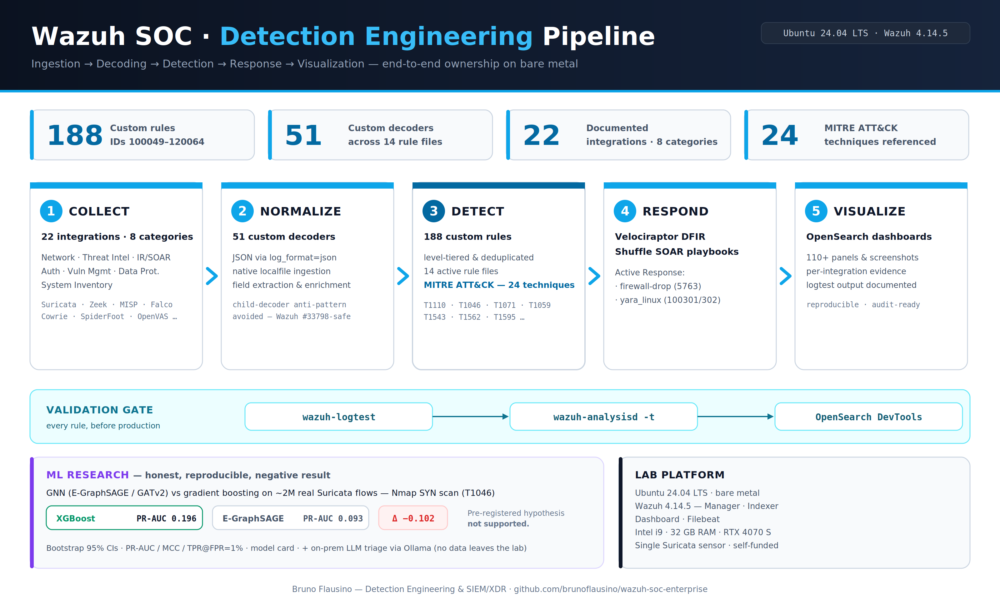

<p align="center">
  
</p>

# 🛡️ Wazuh SOC Enterprise — Detection Engineering Lab

[](https://wazuh.com)
[](https://ubuntu.com)
[](./METRICS.md)
[](./METRICS.md)
[](./integrations)
[](./detection-coverage/attack-coverage.md)
[](./METRICS.md)

**Hands-on detection engineering and SOC operations portfolio built on Wazuh SIEM/XDR** — log
source integration, custom rule development, MITRE ATT&CK mapping, alert triage, incident
investigation and response automation, on Ubuntu 24.04 bare metal.

Every integration here was built, validated end-to-end and documented with evidence captured at
the time. See [lab status](#lab-status) for what runs today.

Maintained by **[Bruno Flausino](https://www.linkedin.com/in/brflausino/)**.

---

## Start here — three case studies

If you read nothing else, read these. Each one is end-to-end: ingestion → parsing → rules →
ATT&CK mapping → validation → indexing → dashboard → response.

### 1. 🔥 Suricata inline IPS → Wazuh correlation
**Network detection with active blocking.**

Suricata 8.0.6 in inline IPS mode via NFQUEUE queue 3 with fail-open safety, 7 custom Suricata
rules (SID `2100498–2100504`), 6 Wazuh correlation rules (`113000–113005`) with ATT&CK mapping,
and frequency-based correlation firing on 10+ drops from one source in 60 seconds.

*Why it matters:* an inline IPS is a control, not just a sensor. Getting NFQUEUE persistence
right without breaking UFW is the kind of detail that separates a working deployment from a
tutorial.

📄 **[Read the integration →](integrations/network-security/suricata-integration.md)**

### 2. 🎯 OSINT CDB threat-intelligence correlation
**Native Wazuh threat intel with bidirectional matching.**

609 public IPv4 indicators from AlienVault via FireHOL, normalised and validated into a native
Wazuh CDB list. Rules `113100–113103` correlate on both `srcip` and `dstip`, 6-panel OpenSearch
dashboard, 58 indexed alerts with zero false positives against negative controls.

*Why it matters:* the architecture is native to Wazuh — no external HTTP call during analysis,
so enrichment cannot become a latency or availability dependency in the detection path. The
bidirectional matching is the operationally important part: outbound matches mean something
inside chose that destination.

📄 **[Read the integration →](integrations/threat-intelligence/osint-cdb-integration.md)**

### 3. 🚨 Incident response — from detection chain to client report
**What the alerts actually produce.**

A full SSH compromise chain — brute force → successful authentication → command execution →
payload retrieval — detected end-to-end by chained Cowrie rules (`100501–100508`), written up
as a P1 incident report in client-deliverable format with timeline, impact assessment, response
actions and findings.

*Why it matters:* rules are the input. This is the output.

📄 **[Read INC-0001 →](incident-reports/2026-07-16-INC-0001-ssh-honeypot-compromise.md)**

### Deep dives

Beyond the three above, these guides carry the most engineering detail:

- **[Velociraptor DFIR](integrations/incident-response/velociraptor-integration.md)** — endpoint forensics and live collection
- **[Shuffle SOAR](integrations/incident-response/shuffle-integration.md)** — response automation and playbook orchestration
- **[Auditd + MITRE rule pack](integrations/threat-intelligence/auditd-integration.md)** — 22 ATT&CK-mapped rules covering execution, persistence and privilege escalation
- **[MISP](integrations/threat-intelligence/misp-integration.md)** — threat-intel platform integration and indicator correlation
- **[Falco (eBPF)](integrations/threat-intelligence/falco-integration.md)** — kernel-level runtime detection
- **[Zeek NSM](integrations/network-security/zeek-integration.md)** — network metadata and protocol analysis
- **[Cowrie honeypot](integrations/threat-intelligence/cowrie-integration.md)** — the detection chain behind INC-0001
- **[OpenVAS / GVM](integrations/vulnerability-scan/openvas-integration.md)** — vulnerability management pipeline

All 24 integrations are listed [further down](#integrated-security-stack--22-documented) and in
the [full catalog](./integrations).

---

## Capability evidence

| Capability | Primary evidence |
| --- | --- |
| **SIEM engineering** | 212 custom rules (repo) / 216 (live manager), 49 / 51 decoders, 16 / 17 rule files — [`METRICS.md`](METRICS.md) |
| **Network detection** | [Suricata inline IPS](integrations/network-security/suricata-integration.md) + [Zeek NSM](integrations/network-security/zeek-integration.md) |
| **Threat intelligence** | [Native OSINT CDB](integrations/threat-intelligence/osint-cdb-integration.md) + [MISP](integrations/threat-intelligence/misp-integration.md) + [SpiderFoot](integrations/threat-intelligence/spiderfoot-integration.md) |
| **Alert triage & SOC process** | [L1 triage playbook](playbooks/L1-triage-playbook.md) + [escalation matrix](playbooks/escalation-matrix.md) |
| **Incident response** | [INC-0001 report](incident-reports/) · [Shuffle SOAR](integrations/incident-response/shuffle-integration.md) · Active Response |
| **DFIR** | [Velociraptor](integrations/incident-response/velociraptor-integration.md) |
| **Detection coverage analysis** | [ATT&CK matrix — coverage *and* gaps](detection-coverage/attack-coverage.md) |
| **Validation discipline** | `wazuh-logtest` → `wazuh-analysisd -t` → OpenSearch DevTools → dashboard |
| **Applied ML** | [Honest GNN vs XGBoost benchmark](integrations/ml-research/gnn-vs-tabular-scan-detection.md) — negative result, fully documented |

---

## Repository map

```
├── METRICS.md              Single source of truth for every number quoted anywhere
├── integrations/           24 documented tool integrations across 7 categories
├── playbooks/              L1 triage playbook, L1/L2/L3 escalation matrix
├── incident-reports/       Worked incidents in client-deliverable format
├── detection-coverage/     ATT&CK coverage assessment, including gaps
├── rules/                  Detection rule corpus (see rules/README.md)
└── scripts/                verify-metrics.sh, export-rules.sh, integration tooling
```

**On metrics.** Every figure in this repository is defined once in [`METRICS.md`](METRICS.md) and
checked by [`scripts/verify-metrics.sh`](scripts/verify-metrics.sh), which fails if any document
disagrees. Integration guides record the Wazuh version they were *validated against*, which
deliberately differs from the current lab version — a validation report that claims a version it
was not run against is worthless. The [version policy](METRICS.md#version-policy-for-integration-guides)
explains the convention.

**On honesty.** The [ATT&CK coverage matrix](detection-coverage/attack-coverage.md) documents
14 techniques with no coverage at all, and states that only 6 of 51 assessed techniques have
detection that would resist a competent operator. The [ML benchmark](integrations/ml-research/gnn-vs-tabular-scan-detection.md)
documents a hypothesis that failed. Both are there on purpose: a portfolio that only reports
successes tells a reviewer nothing about judgement.

---

## Integrated security stack — 23 documented

Each tool links to its guide with configuration, validated `wazuh-logtest` output, DevTools
queries and dashboard screenshots captured during validation.

| Category | Tools |
| --- | --- |
| **Core SIEM** | Wazuh Manager · Indexer · Dashboard · Filebeat |
| **Threat Intelligence & Detection** (8) | [OSINT CDB](integrations/threat-intelligence/osint-cdb-integration.md) · [MISP](integrations/threat-intelligence/misp-integration.md) · [SpiderFoot](integrations/threat-intelligence/spiderfoot-integration.md) · [CALDERA](integrations/threat-intelligence/caldera-integration.md) · [YARA](integrations/threat-intelligence/yara-integration.md) · [Falco (eBPF)](integrations/threat-intelligence/falco-integration.md) · [Cowrie](integrations/threat-intelligence/cowrie-integration.md) · [Auditd](integrations/threat-intelligence/auditd-integration.md) |
| **Network Security** (5) | [Suricata](integrations/network-security/suricata-integration.md) · [Zeek NSM](integrations/network-security/zeek-integration.md) · [WireGuard](integrations/network-security/wireguard-integration.md) · [UFW](integrations/network-security/ufw-integration.md) · [Fail2ban](integrations/network-security/fail2ban-integration.md) |
| **Data Protection** (4) | [ClamAV](integrations/data-protection/clamav-integration.md) · [VeraCrypt](integrations/data-protection/veracrypt-integration.md) · [NWIPE](integrations/data-protection/nwipe-integration.md) · [Restic](integrations/data-protection/restic-integration.md) |
| **Incident Response & SOAR** (2) | [Shuffle SOAR](integrations/incident-response/shuffle-integration.md) · [Velociraptor](integrations/incident-response/velociraptor-integration.md) |
| **Authentication** (2) | [FreeRADIUS](integrations/authentication/freeradius-integration.md) · [Radsecproxy](integrations/authentication/radsecproxy-integration.md) |
| **System Inventory** (1) | [OSQuery](integrations/system-inventory/osquery-integration.md) |
| **Vulnerability Management** (1) | [OpenVAS / GVM](integrations/vulnerability-scan/openvas-integration.md) |

📚 **[Browse the full catalog →](./integrations)** — including the roadmap of integrations
deployed at the Wazuh layer whose guides are still pending, listed separately so the count above
stays trustworthy.

---

## Applied ML research

### GNN vs Gradient Boosting on real Suricata flows (T1046)

**A pre-registered hypothesis that failed, documented in full.**

End-to-end edge-classification pipeline testing whether Graph Neural Networks beat gradient
boosting at detecting Nmap SYN scans, on **~2 million real Suricata flows** collected over 57
days in this lab.

| Best tabular (XGBoost) | Best GNN (E-GraphSAGE) | Δ PR-AUC |
| :---: | :---: | :---: |
| **PR-AUC 0.196** [0.15, 0.26] | PR-AUC 0.093 [0.07, 0.13] | **−0.102** |

The hypothesis — that GNNs should win because scan-vs-benign is a property of a source's
*neighbourhood* rather than of any individual flow — was not supported. Mean and attention
aggregation in E-GraphSAGE/GATv2 mathematically cannot encode node degree (the GIN argument;
Xu et al., 2019), and per-flow edge features already saturate the SYN-scan signature.

Method: Community ID v1 flow keying to deduplicate across rotated logs, temporal 70/15/15 split
with all scalers fit on TRAIN only, imbalance-aware metrics (PR-AUC, MCC, Balanced Accuracy,
TPR@FPR=1%) with 1,000-resample bootstrap CIs, five seeds, degree-stripping ablation, and a
model card for the winning model.

📄 **[Full report →](integrations/ml-research/gnn-vs-tabular-scan-detection.md)**

**Wazuh-side ingestion is deployed** — an 8-rule chain (`100630–100650`) validated with
`wazuh-analysisd -t`. **The detector is not productionised**: it runs as ad-hoc development code
outside this repository, paused until a model beats the tabular baseline.
📄 **[Rule chain →](integrations/ml-research/gnn-security-detector-integration.md)**

### Malware phylogenetics
Maximum Likelihood phylogeny of 18 Mirai variants via IQ-TREE, with cross-validation.
📄 **[Analysis →](integrations/ml-research/malware-phylogenetics/)**

### ML model supply-chain security (ModelScan)
Production FIM → Active Response → quarantine pipeline scanning serialized ML models
(Pickle, PyTorch, Keras, TF) for unsafe deserialization operators. 10 rules
(`121100–121111`), MITRE T1204.002 / T1059.006, validated against 24 operators across
9 modules, four-panel dashboard.
📄 **[Integration →](integrations/ml-research/modelscan-integration.md)**

### Local LLM runtime
Ollama via Docker (`wazuh-ollama`) for on-prem experimentation with LLM-assisted log triage. No
security data leaves the lab.

---

## Lab status

Single self-funded workstation: Ubuntu 24.04 LTS bare metal, Intel i9, 32 GB RAM,
RTX 4070 SUPER 12 GB, one Suricata sensor.

**Always on:** Wazuh manager, indexer and dashboard, with the full **212-rule / 49-decoder
detection corpus loaded and active**. Suricata, UFW and ClamAV run continuously.

**Brought up per project:** the remaining sensors — Zeek, Cowrie, Falco, Velociraptor, MISP,
CALDERA, OSQuery, FreeRADIUS, OpenVAS and the rest — are deployed when worked on, validated,
documented, then torn down. Running 23 tools concurrently needs a rack, not a desktop. Every
guide records the date and version it was validated against, and configurations plus the rule
corpus are retained so any integration can be restored.

The host was rebuilt from scratch in July 2026. The detection corpus survived the rebuild
intact — which is the point of the change-management discipline described throughout these
guides.

**What a single-workstation lab cannot demonstrate**, stated plainly: enterprise alert volume,
multi-client operations, commercial SIEM/EDR platforms, Windows/cloud/identity telemetry, and
24/7 shift operation under real SLA. The playbooks and coverage assessment are written to
production standards but have not been operated under production conditions.

Collaborations, dataset access and critical feedback are welcome.

---

## License

MIT — see [LICENSE](./LICENSE).

---

**Open to opportunities:** SOC Analyst • Cybersecurity Analyst • SIEM Analyst • Detection
Engineer • Threat Hunter — remote Spain/EU, and hybrid or on-site in Alicante, Valencia and
Murcia. Working languages: English, Spanish, Portuguese; German B1.

- LinkedIn: [linkedin.com/in/brflausino](https://www.linkedin.com/in/brflausino/)
- Kaggle: [kaggle.com/brunoflausino](https://www.kaggle.com/brunoflausino) — 18 competitions, 72 public notebooks
