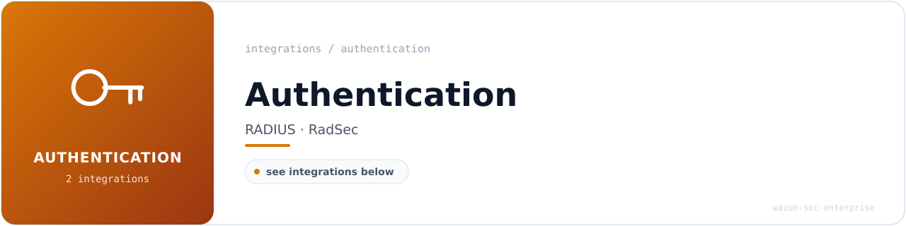

<!-- soc-banner -->
<p align="center"></p>

# Authentication — Integrations

This directory covers RADIUS-based authentication monitoring integrations for the Wazuh SOC enterprise stack running on Ubuntu 24.04 LTS bare metal (Wazuh v4.14.4).

---

## Integrations

| Integration                              | Version   | Status       | Rules             | Doc                                     |
| ---------------------------------------- | --------- | ------------ | ----------------- | --------------------------------------- |
| [FreeRADIUS](freeradius-integration.md)  | 3.2.5     | ✅ Complete   | 110010–110031, 110204 | [freeradius-integration.md](freeradius-integration.md) |
| [Radsecproxy](radsecproxy-integration.md)| 1.10.0    | ✅ Complete   | 110101–110106, 110306 | [radsecproxy-integration.md](radsecproxy-integration.md) |

---

## Architecture Overview

```
[NAS / radtest client]
        │
        ├── UDP 1812 ──────────────────────► FreeRADIUS 3.2.5
        │                                         │
        │                                    ┌────┴──────────────────┐
        │                                    │  syslog / journald     │ → rules 110010, 110011
        │                                    │  JSON (linelog module) │ → rules 110030, 110031
        │                                    └────────────────────────┘
        │
        └── UDP 11812 ─────────────────────► Radsecproxy 1.10.0
                                                  │ (proxies to FreeRADIUS 127.0.0.1:1812)
                                             ┌────┴──────────────────┐
                                             │  syslog / journald     │ → rules 110101–110106
                                             └────────────────────────┘
                                                  │
                                        [Wazuh Manager v4.14.4]
                                                  │
                                        [OpenSearch Indexer]
                                                  │
                                        [Wazuh Dashboard]
```

---

## Rule ID Reference

| Rule ID | Level | Service        | Description                                                      | MITRE     |
| ------- | ----- | -------------- | ---------------------------------------------------------------- | --------- |
| 110010  | 3     | FreeRADIUS     | RADIUS login OK (syslog)                                         | T1078     |
| 110011  | 8     | FreeRADIUS     | RADIUS login FAIL (syslog)                                       | T1110     |
| 110030  | 3     | FreeRADIUS     | RADIUS ACCEPT (JSON pipeline)                                    | T1078     |
| 110031  | 8     | FreeRADIUS     | RADIUS REJECT (JSON pipeline)                                    | T1110     |
| 110101  | 10    | Radsecproxy    | TLS handshake failed with peer                                   | T1557     |
| 110102  | 7     | Radsecproxy    | Connection timed out to backend                                  | T1499     |
| 110103  | 4     | Radsecproxy    | Healthcheck OK (StatusServer polling)                            | —         |
| 110104  | 3     | Radsecproxy    | General event (fallback)                                         | —         |
| 110105  | 3     | Radsecproxy    | Proxy: Access-Accept forwarded                                   | T1078     |
| 110106  | 8     | Radsecproxy    | Proxy: Access-Reject forwarded                                   | T1110     |
| 110204  | 10    | FreeRADIUS     | Brute force: 5+ login failures in 120s (correlation)             | T1110.001 |
| 110306  | 10    | Radsecproxy    | Multiple TLS failures: 3+ in 300s (correlation)                  | T1557     |

---

## Assets

Dashboard screenshots are stored in [`assets/freeradius-radsecproxy/`](assets/freeradius-radsecproxy/).

| File                                      | Visualization                              |
| ----------------------------------------- | ------------------------------------------ |
| `viz1_authentication_decisions_donut.png` | Donut — Accept vs. Reject ratio            |
| `viz2_radsecproxy_health_monitor.png`     | Metric panels — Radsecproxy health KPIs    |
| `viz3_events_over_time.png`               | Stacked area — temporal event distribution |
| `viz4_top_rejected_usernames.png`         | Horizontal bar — top rejected usernames    |
| `viz5_alert_severity_distribution.png`    | Bubble chart — severity vs. volume         |
| `viz6_radius_recent_events_table.png`     | Data table — recent FreeRADIUS events      |

---

## Key Technical Notes

- **`<decoded_as>json</decoded_as>` vs `<if_group>json</if_group>`:** Use `<decoded_as>` for JSON pipeline rules (110030/110031). `<if_group>` requires a prior rule in the same chain to assign the group — no such rule exists for RADIUS JSON logs, causing silent alert suppression.
- **Dual healthcheck decoders:** Radsecproxy healthcheck messages differ between journald (`"Received status server response from"`) and file log (`"replyh: got status server response from"`) formats. Two separate child decoders are required.
- **Rule ordering:** Radsecproxy rules 110105 and 110106 must appear before the fallback rule 110104 in `local_rules.xml`.
- **JSON log permissions:** `/var/log/freeradius/wazuh-radius.json` must be owned by `freerad:freerad` with permissions `640`.

---

*Last updated: 2026-04-04 | Ubuntu 24.04 LTS | Wazuh v4.14.4*
