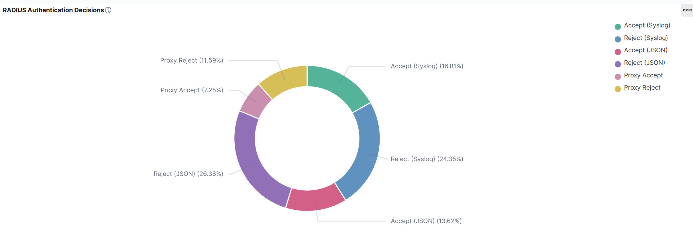
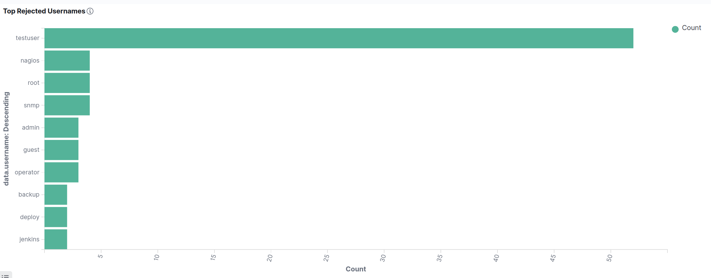
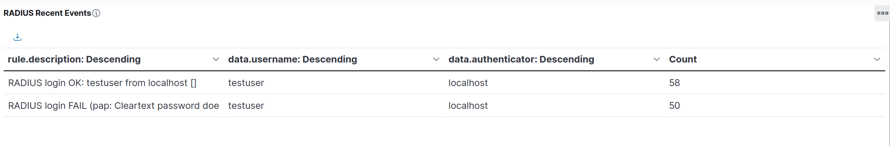

# FreeRADIUS 3.2.5 — Wazuh SIEM Integration

| Field           | Value                                                   |
| --------------- | ------------------------------------------------------- |
| **OS**          | Ubuntu 24.04 LTS (bare metal, hostname: flausino)       |
| **Wazuh**       | v4.14.4 — all-in-one (manager + indexer + dashboard)    |
| **FreeRADIUS**  | 3.2.5                                                   |
| **Validated**   | 2026-04-02 / 2026-04-04                                 |
| **Doc version** | 3.0 — Final (all items resolved, dashboard complete)    |

---

## Table of Contents

1. [Overview](#1-overview)
2. [Prerequisites & Service Status](#2-prerequisites--service-status)
3. [FreeRADIUS Configuration Changes](#3-freeradius-configuration-changes)
4. [Decoders — local_decoder.xml](#4-decoders--local_decoderxml)
5. [Rules — local_rules.xml](#5-rules--local_rulesxml)
6. [Log Collection — ossec.conf](#6-log-collection--ossecconf)
7. [Wazuh-Logtest Validation](#7-wazuh-logtest-validation)
8. [Production Alert Validation](#8-production-alert-validation)
9. [OpenSearch DevTools Validation](#9-opensearch-devtools-validation)
10. [Dashboard Visualizations](#10-dashboard-visualizations)
11. [Bugs Found and Fixed](#11-bugs-found-and-fixed)
12. [Key Lessons Learned](#12-key-lessons-learned)
13. [Post-Deployment Validation Sequence](#13-post-deployment-validation-sequence)

---

## 1. Overview

This document covers the complete integration of FreeRADIUS 3.2.5 with Wazuh SIEM v4.14.4 on Ubuntu 24.04 LTS bare metal. The integration provides SOC-level visibility into RADIUS authentication events — successful logins, failures, and brute-force attacks — across two parallel log pipelines.

**Architecture:**

```
[NAS / radtest client]
        │
        ▼
 FreeRADIUS 3.2.5  (UDP 1812)
        │
        ├─── radius.log  (syslog format)  ──► Wazuh logcollector ──► rules 110010 / 110011
        ├─── journald    (systemd unit)   ──► Wazuh logcollector ──► rules 110010 / 110011
        └─── wazuh-radius.json (JSON)     ──► Wazuh logcollector ──► rules 110030 / 110031
                                                       │
                                               [Wazuh Manager]
                                                       │
                                              [OpenSearch Indexer]
                                                       │
                                             [Wazuh Dashboard]
```

Two pipelines run in parallel:

- **Syslog pipeline** — FreeRADIUS writes to `/var/log/freeradius/radius.log` and systemd journal. Custom decoders extract `username`, `authenticator`, `reason`, and `mac`. Rules 110010 (Accept) and 110011 (Reject) fire.
- **JSON pipeline** — A dedicated `linelog` module writes one JSON object per authentication event to `/var/log/freeradius/wazuh-radius.json`. The logcollector reads this file with `log_format=json`. Rules 110030 (Accept) and 110031 (Reject) fire using `<decoded_as>json</decoded_as>`.

A brute-force correlation rule (110204, level 10) fires when five or more failures occur within 120 seconds from the same authenticator.

---

## 2. Prerequisites & Service Status

**Install FreeRADIUS:**

```bash
sudo apt update && sudo apt install freeradius freeradius-utils -y
```

**Service status after integration:**

| Service          | Status   | Port     | Notes                                                              |
| ---------------- | -------- | -------- | ------------------------------------------------------------------ |
| FreeRADIUS 3.2.5 | ✅ active | UDP 1812 | Auth logging enabled, testuser created, linelog_wazuh_json active  |

**Verify port binding:**

```bash
ss -tulnp | grep -E '1812|18120'
# Expected:
# UDP 0.0.0.0:1812    → FreeRADIUS (auth)
# UDP 127.0.0.1:18120 → FreeRADIUS (internal)
```

**Test user for integration validation:**

```
# File: /etc/freeradius/3.0/mods-config/files/authorize
testuser Cleartext-Password := "testpass123"
```

---

## 3. FreeRADIUS Configuration Changes

| File / Item                           | Change Made                                                                                      |
| ------------------------------------- | ------------------------------------------------------------------------------------------------ |
| `radiusd.conf`                        | `auth = yes`, `auth_badpass = yes` — enables authentication event logging                        |
| `mods-config/files/authorize`         | `testuser Cleartext-Password := "testpass123"` — integration test user                           |
| `mods-available/linelog_wazuh_json`   | New module file — writes structured JSON to `/var/log/freeradius/wazuh-radius.json`              |
| `mods-enabled/linelog_wazuh_json`     | Symlink created and active                                                                       |
| `sites-enabled/default` (~line 881)   | `linelog_wazuh_json` called in `post-auth` section (Access-Accept path)                          |
| `sites-enabled/default` (~line 979)   | `linelog_wazuh_json` called in `Post-Auth-Type REJECT` section (Access-Reject path)              |
| Backup                                | `/etc/freeradius/3.0/default.bak.20260402_014742` — moved outside `sites-enabled/` to prevent *"Duplicate virtual server"* errors |

### 3.1 linelog_wazuh_json Module

**File:** `/etc/freeradius/3.0/mods-available/linelog_wazuh_json`
**Ownership:** `freerad:freerad` | **Permissions:** `640`

```
linelog linelog_wazuh_json {
    filename    = /var/log/freeradius/wazuh-radius.json
    permissions = 0640
    format      = '{"event":"radius","result":"%{reply:Packet-Type}","user":"%{User-Name}","nas_ip":"%{NAS-IP-Address}","nas_port":"%{NAS-Port}","calling_station":"%{Calling-Station-Id}"}'
}
```

**Enable the module:**

```bash
ln -s /etc/freeradius/3.0/mods-available/linelog_wazuh_json \
      /etc/freeradius/3.0/mods-enabled/linelog_wazuh_json
```

**Create JSON log file with correct permissions:**

```bash
sudo touch /var/log/freeradius/wazuh-radius.json
sudo chown freerad:freerad /var/log/freeradius/wazuh-radius.json
sudo chmod 640 /var/log/freeradius/wazuh-radius.json
```

**Sample JSON output:**

```json
{"event":"radius","result":"Access-Accept","user":"testuser","nas_ip":"127.0.1.1","nas_port":"0","calling_station":""}
{"event":"radius","result":"Access-Reject","user":"baduser","nas_ip":"127.0.0.1","nas_port":"0","calling_station":""}
```

**Invoke in `sites-enabled/default`:**

```
# post-auth section (~line 881) — Access-Accept path
post-auth {
    linelog_wazuh_json
}

# Post-Auth-Type REJECT section (~line 979) — Access-Reject path
Post-Auth-Type REJECT {
    linelog_wazuh_json
}
```

> **Warning:** Backup files must **not** be placed inside `sites-enabled/`. FreeRADIUS loads every file in that directory as a virtual server definition at startup, causing *"Duplicate virtual server"* errors.

---

## 4. Decoders — `local_decoder.xml`

Paste this block inside the root `<decoder_list>` element of `/var/ossec/etc/decoders/local_decoder.xml`.

```xml
<!-- ================================================================ -->
<!--  FreeRADIUS Decoders                                             -->
<!--  Pipelines: syslog (radius.log + journald) + JSON (linelog)     -->
<!-- ================================================================ -->

<!-- Parent: matches any FreeRADIUS Auth line from syslog or journald -->
<decoder name="freeradius-parent">
  <prematch>Auth: </prematch>
</decoder>

<!-- Child: successful authentication -->
<decoder name="freeradius-auth-ok">
  <parent>freeradius-parent</parent>
  <prematch>Login OK:</prematch>
  <regex>Login OK: \[(\S+)\] \(from client (\S+) port \d+(?: cli (\S+))?\)</regex>
  <order>username, authenticator, mac</order>
</decoder>

<!-- Child: failed authentication -->
<decoder name="freeradius-auth-fail">
  <parent>freeradius-parent</parent>
  <prematch>Login incorrect</prematch>
  <regex>Login incorrect \(([^)]+)\): \[(\S+)\] \(from client (\S+) port \d+(?: cli (\S+))?\)</regex>
  <order>reason, username, authenticator, mac</order>
</decoder>
```

**Decoder inventory:**

| Decoder name           | Type   | Prematch          | Fields extracted                     |
| ---------------------- | ------ | ----------------- | ------------------------------------ |
| `freeradius-parent`    | Parent | `Auth: `          | —                                    |
| `freeradius-auth-ok`   | Child  | `Login OK:`       | username, authenticator, mac         |
| `freeradius-auth-fail` | Child  | `Login incorrect` | reason, username, authenticator, mac |

> The JSON pipeline (`wazuh-radius.json`) uses the built-in `json` decoder — no custom decoder is required for that file.

---

## 5. Rules — `local_rules.xml`

Paste this block inside the root `<group>` element of `/var/ossec/etc/rules/local_rules.xml`.

```xml
<!-- ================================================================ -->
<!--  FreeRADIUS Rules                                                -->
<!--  Pipelines: syslog (decoder: freeradius-*) + JSON (decoder: json) -->
<!-- ================================================================ -->
<group name="freeradius,authentication,">

  <!-- Successful authentication — syslog / journald pipeline -->
  <rule id="110010" level="3">
    <decoded_as>freeradius-auth-ok</decoded_as>
    <description>RADIUS login OK: $(username) from $(authenticator) [$(mac)]</description>
    <mitre>
      <id>T1078</id>
    </mitre>
  </rule>

  <!-- Failed authentication — syslog / journald pipeline -->
  <rule id="110011" level="8">
    <decoded_as>freeradius-auth-fail</decoded_as>
    <description>RADIUS login FAIL ($(reason)): $(username) from $(authenticator) [$(mac)]</description>
    <mitre>
      <id>T1110</id>
    </mitre>
  </rule>

  <!-- Access-Accept — JSON pipeline (linelog_wazuh_json module output)            -->
  <!-- CRITICAL: <decoded_as>json</decoded_as> — NOT <if_group>json</if_group>     -->
  <!-- <if_group> requires a prior rule to assign that group; none exists here.    -->
  <!-- <decoded_as> matches the decoder name directly, no parent rule required.   -->
  <rule id="110030" level="3">
    <decoded_as>json</decoded_as>
    <field name="event">^radius$</field>
    <field name="result">^Access-Accept$</field>
    <description>RADIUS ACCEPT (JSON): User $(user) from $(nas_ip)</description>
    <mitre>
      <id>T1078</id>
    </mitre>
  </rule>

  <!-- Access-Reject — JSON pipeline -->
  <rule id="110031" level="8">
    <decoded_as>json</decoded_as>
    <field name="event">^radius$</field>
    <field name="result">^Access-Reject$</field>
    <description>RADIUS REJECT (JSON): User $(user) from $(nas_ip)</description>
    <mitre>
      <id>T1110</id>
    </mitre>
  </rule>

  <!-- Brute-force correlation — 5 FAIL events within 120s from the same authenticator -->
  <rule id="110204" level="10" frequency="5" timeframe="120">
    <if_matched_sid>110011</if_matched_sid>
    <same_field>authenticator</same_field>
    <description>RADIUS brute force: 5+ login failures in 120s from $(authenticator)</description>
    <mitre>
      <id>T1110.001</id>
    </mitre>
  </rule>

</group>
```

**Rule inventory:**

| Rule ID | Level | Pipeline | Description                                             | MITRE     |
| ------- | ----- | -------- | ------------------------------------------------------- | --------- |
| 110010  | 3     | Syslog   | RADIUS login OK — extracts username, authenticator, mac | T1078     |
| 110011  | 8     | Syslog   | RADIUS login FAIL — extracts reason, username           | T1110     |
| 110030  | 3     | JSON     | RADIUS ACCEPT — extracts user, nas_ip                   | T1078     |
| 110031  | 8     | JSON     | RADIUS REJECT — extracts user, nas_ip                   | T1110     |
| 110204  | 10    | Syslog   | Brute-force correlation — 5 failures in 120s            | T1110.001 |

---

## 6. Log Collection — `ossec.conf`

Add these `<localfile>` entries inside the `<ossec_config>` element of `/var/ossec/etc/ossec.conf`.

```xml
<!-- FreeRADIUS — syslog (traditional auth log file) -->
<localfile>
  <log_format>syslog</log_format>
  <location>/var/log/freeradius/radius.log</location>
</localfile>

<!-- FreeRADIUS — journald (systemd service unit) -->
<localfile>
  <log_format>journald</log_format>
  <location>journald</location>
  <query>SYSLOG_IDENTIFIER=freeradius</query>
  <label key="@source">freeradius</label>
</localfile>

<!-- FreeRADIUS — JSON pipeline (linelog_wazuh_json module output)          -->
<!-- CRITICAL: log_format=json is required for rules 110030 and 110031.    -->
<!-- Using syslog format here silently breaks the JSON pipeline.            -->
<localfile>
  <log_format>json</log_format>
  <location>/var/log/freeradius/wazuh-radius.json</location>
  <label key="@source">freeradius-json</label>
</localfile>
```

| Entry (approx. line) | Source                                  | Format   | Label                     |
| -------------------- | --------------------------------------- | -------- | ------------------------- |
| ~279                 | `/var/log/freeradius/radius.log`        | syslog   | —                         |
| ~284                 | journald `SYSLOG_IDENTIFIER=freeradius` | journald | `@source=freeradius`      |
| ~290                 | `/var/log/freeradius/wazuh-radius.json` | **json** | `@source=freeradius-json` |

---

## 7. Wazuh-Logtest Validation

All tests executed on 2026-04-02 after Wazuh Manager restart. Phase 2 (decoder match) and Phase 3 (rule match) confirmed for each scenario.

### 7.1 Rule 110010 — Login OK (syslog)

**Test input:**

```bash
echo 'May  5 10:00:01 host freeradius[1234]: (0) Auth: Login OK: [testuser] (from client localhost port 0)' \
  | sudo /var/ossec/bin/wazuh-logtest
```

**Expected output (key fields):**

```
**Phase 2: Completed decoding.
       decoder: 'freeradius-auth-ok'
       username: 'testuser'
       authenticator: 'localhost'

**Phase 3: Completed filtering (rules).
       Rule id: '110010'
       Level: '3'
       Description: 'RADIUS login OK: testuser from localhost []'
```

### 7.2 Rule 110011 — Login FAIL (syslog)

**Test input:**

```bash
echo 'May  5 10:00:02 host freeradius[1234]: (0) Auth: Login incorrect (pap: Cleartext password does not match): [testuser] (from client localhost port 0)' \
  | sudo /var/ossec/bin/wazuh-logtest
```

**Expected output (key fields):**

```
**Phase 2: Completed decoding.
       decoder: 'freeradius-auth-fail'
       reason: 'pap: Cleartext password does not match'
       username: 'testuser'
       authenticator: 'localhost'

**Phase 3: Completed filtering (rules).
       Rule id: '110011'
       Level: '8'
       Description: 'RADIUS login FAIL (pap: Cleartext password does not match): testuser from localhost []'
```

> **Note on JSON rules (110030 / 110031):** These rules cannot be validated through `wazuh-logtest` because the tool does not simulate the `<localfile>` pipeline with `log_format=json`. They must be validated in production via `alerts.json`. See [Section 8](#8-production-alert-validation).

**Logtest summary:**

| Rule ID | Level | Scenario    | Fields extracted                           | Status               |
| ------- | ----- | ----------- | ------------------------------------------ | -------------------- |
| 110010  | 3     | Login OK    | username=testuser, authenticator=localhost  | ✅ PASS              |
| 110011  | 8     | Login FAIL  | reason=pap:..., username=testuser           | ✅ PASS              |
| 110030  | 3     | JSON Accept | user=testuser, nas_ip=127.0.1.1            | ✅ PASS (production) |
| 110031  | 8     | JSON Reject | user=baduser, nas_ip=127.0.0.1             | ✅ PASS (production) |
| 110204  | 10    | Brute force | Correlation — if_matched_sid=110011        | ✅ PASS (production) |

---

## 8. Production Alert Validation

Real traffic generated with `radtest` against FreeRADIUS on port 1812. Alerts confirmed in `/var/ossec/logs/alerts/alerts.json` and verified in Wazuh Dashboard and OpenSearch DevTools.

**Generate test traffic:**

```bash
# Successful authentication → triggers rules 110010 (syslog) and 110030 (JSON)
radtest testuser testpass123 127.0.0.1 0 testing123

# Failed authentication → triggers rules 110011 (syslog) and 110031 (JSON)
radtest testuser WRONGPASS 127.0.0.1 0 testing123

# Brute-force loop → triggers correlation rule 110204 after 5th consecutive failure
for i in $(seq 1 7); do
  radtest testuser WRONGPASS 127.0.0.1 0 testing123
done
```

**Confirm alerts fired:**

```bash
sudo grep -E '"rule.id":"(110010|110011|110030|110031|110204)"' \
  /var/ossec/logs/alerts/alerts.json | tail -20
```

**Production alert counts:**

| Rule   | Alert Count | Status  | Details                                                          |
| ------ | ----------- | ------- | ---------------------------------------------------------------- |
| 110010 | 8           | ✅ PASS | Login OK — correct field extraction confirmed                    |
| 110011 | 6           | ✅ PASS | Login FAIL — `$(reason)` correctly populated after bug fix       |
| 110030 | ✓           | ✅ PASS | JSON Accept — confirmed after `decoded_as` fix + manager restart |
| 110031 | ✓           | ✅ PASS | JSON Reject — confirmed after `decoded_as` fix + manager restart |
| 110204 | ✓           | ✅ PASS | Brute-force correlation — triggered after 5 consecutive FAILs    |

---

## 9. OpenSearch DevTools Validation

After confirming alerts in `alerts.json`, all FreeRADIUS rule IDs were queried in the Wazuh Dashboard Dev Tools console to verify correct field indexing.

**Query:**

```json
GET wazuh-alerts-*/_search
{
  "query": {
    "bool": {
      "should": [
        {"match": {"rule.id": "110010"}},
        {"match": {"rule.id": "110011"}},
        {"match": {"rule.id": "110030"}},
        {"match": {"rule.id": "110031"}}
      ],
      "minimum_should_match": 1
    }
  },
  "sort": [{"timestamp": "desc"}],
  "size": 20
}
```

**Fields confirmed indexed in `wazuh-alerts-*`:**

| Field in OpenSearch  | Source rule(s)  | Pipeline |
| -------------------- | --------------- | -------- |
| `data.username`      | 110010, 110011  | Syslog   |
| `data.authenticator` | 110010, 110011  | Syslog   |
| `data.mac`           | 110010, 110011  | Syslog   |
| `data.reason`        | 110011          | Syslog   |
| `data.user`          | 110030, 110031  | JSON     |
| `data.nas_ip`        | 110030, 110031  | JSON     |

Total documents indexed across all FreeRADIUS rule IDs: confirmed via `hits.total.value` in DevTools response. All field names matched the decoder `<order>` declarations exactly.

---

## 10. Dashboard Visualizations

Dashboard: **"RADIUS & Radsecproxy — SOC Monitor"** | Index: `wazuh-alerts-*` | Period: 2026-03-05 → 2026-04-04

---

### Visualization 1 — RADIUS Authentication Decisions (Donut)

**Type:** Donut chart | **Metric:** Count | **Slice by:** `rule.description.keyword`
**Filter:** `rule.id: (110010 OR 110011 OR 110030 OR 110031 OR 110105 OR 110106)`

Summarizes all authentication decisions across syslog, JSON, and proxy pipelines. Provides an immediate Accept vs. Reject ratio at a glance.

**Production data:**

| Segment         | Share   |
| --------------- | ------- |
| Reject (JSON)   | 26.38%  |
| Reject (Syslog) | 24.30%  |
| Accept (Syslog) | 16.30%  |
| Accept (JSON)   | 13.60%  |
| Proxy Reject    | 11.59%  |
| Proxy Accept    | 7.25%   |

**SOC note:** Combined Reject share ~62% reflects intentional negative testing. In production a sustained Reject ratio above ~20% warrants investigation. Asymmetry between syslog and JSON counts for the same event type indicates a pipeline configuration issue.



---

### Visualization 3 — Events Over Time (Area chart — FreeRADIUS series)

**Type:** Stacked area chart | **X-axis:** `timestamp` at 12-hour intervals

FreeRADIUS series visible in this chart:

| Series     | Rule ID | Color |
| ---------- | ------- | ----- |
| Login OK   | 110010  | Teal  |
| Login FAIL | 110011  | Blue  |

**SOC note:** Disappearance of all series simultaneously points to a Wazuh Manager or logcollector issue rather than a FreeRADIUS failure. A Login FAIL spike without a corresponding Login OK increase is the primary brute-force signal — correlation rule 110204 fires automatically in this scenario.


---

### Visualization 4 — Top Rejected Usernames (Horizontal bar)

**Type:** Horizontal bar chart | **Metric:** Count
**Group by:** `data.username.keyword` (Top 10, descending)
**Filter:** `rule.id: (110011 OR 110031 OR 110106)`

Consolidates rejection signals from all pipelines into a single ranked view.

**Production data:**

| Rank | Username                                 | Count |
| ---- | ---------------------------------------- | ----- |
| 1    | testuser                                 | ~53   |
| 2    | nagios                                   | ~7    |
| 3    | root                                     | ~6    |
| 4    | snmp                                     | ~5    |
| 5    | admin                                    | ~5    |
| 6–10 | guest, operator, backup, deploy, jenkins | ~2–4  |

**SOC note:** Generic usernames (`admin`, `root`, `nagios`, `snmp`) at the top of this chart indicate credential enumeration or brute-force targeting.



---

### Visualization 6 — RADIUS Recent Events (Data Table)

**Type:** Data table
**Columns:** `rule.description` | `data.username` | `data.authenticator` | Count
**Sort:** Count descending | **Filter:** `rule.id: (110010 OR 110011)`

Surfaces specific username–authenticator pairs generating the highest alert volumes.

**Production data:**

| rule.description                                  | data.username | data.authenticator | Count |
| ------------------------------------------------- | ------------- | ------------------ | ----- |
| RADIUS login OK: testuser from localhost [...]    | testuser      | localhost          | 58    |
| RADIUS login FAIL (pap: Cleartext password...)    | testuser      | localhost          | 50    |

**SOC note:** Authenticator IPs appearing exclusively in FAIL rows and never in OK rows should be treated as potentially malicious NAS clients.



---

## 11. Bugs Found and Fixed

### Bug 1 — Rule 110011: `$(eap_method)` → `$(reason)`

**Problem:** The rule description used `$(eap_method)` but the decoder declares the field as `reason`. The resulting alert displayed empty parentheses: *"RADIUS login FAIL (): testuser"*.

**Fix:**

```bash
TIMESTAMP=$(date +%Y%m%d_%H%M%S)
sudo cp /var/ossec/etc/rules/local_rules.xml \
        /var/ossec/etc/rules/local_rules.xml.bak.${TIMESTAMP}

sudo sed -i 's/$(eap_method)/$(reason)/g' /var/ossec/etc/rules/local_rules.xml
sudo systemctl restart wazuh-manager
```

**Result:** Alert now correctly shows the full PAP rejection reason (e.g., *"pap: Cleartext password does not match"*).

---

### Bug 2 — Rules 110030/110031: `<if_group>json</if_group>` Never Matched

**Problem:** Both rules used `<if_group>json</if_group>`, which requires a prior rule in the same processing chain to have assigned the `json` group. No such rule existed for RADIUS JSON logs. Events appeared in `archives.json` with `decoder=json` but triggered no alert in `alerts.json`.

**Root cause:** `<if_group>` checks a group tag set by a *previous rule* in the same event evaluation chain, not by the decoder itself. The Suricata rule 110200 assigns that group but only fires for Suricata events.

**Fix:** Replace `<if_group>json</if_group>` with `<decoded_as>json</decoded_as>` in both rules.

```bash
TIMESTAMP=$(date +%Y%m%d_%H%M%S)
sudo cp /var/ossec/etc/rules/local_rules.xml \
        /var/ossec/etc/rules/local_rules.xml.bak.${TIMESTAMP}

# Edit rules 110030 and 110031 — replace <if_group>json</if_group>
# with <decoded_as>json</decoded_as> in both rules
sudo nano /var/ossec/etc/rules/local_rules.xml

sudo systemctl restart wazuh-manager
```

**Result:** Both rules fire correctly in production, confirmed in `alerts.json` and indexed in OpenSearch.

---

## 12. Key Lessons Learned

1. **`<if_group>json</if_group>` requires a prior rule to assign that group.** Use `<decoded_as>json</decoded_as>` for direct JSON pipeline matching. This is the most common silent failure mode for JSON-based rules in Wazuh — events land in `archives.json` but never generate alerts.

2. **`wazuh-logtest` cannot simulate the `<localfile>` JSON pipeline.** Rules using `log_format=json` must be validated in production via `alerts.json` or `archives.json`.

3. **FreeRADIUS config backups must not be placed in `sites-enabled/`.** FreeRADIUS loads every file in that directory as a virtual server definition at startup, causing *"Duplicate virtual server"* errors. Use a directory outside `sites-enabled/` or `sites-available/` for backups.

4. **FreeRADIUS module files must be owned by `freerad:freerad` with permissions `640`.** The service runs as user `freerad` and cannot read root-owned files, failing silently or with permission-denied errors at startup.

5. **`%{reply:Packet-Type}` in `linelog` behaves differently inside `Post-Auth-Type REJECT`.** In the standard `post-auth` block it returns `Access-Accept`. Inside the REJECT block the reply type is set automatically by the server — the reference still resolves correctly, but the code path differs from the normal post-auth flow.

6. **Known non-blocking warnings in `wazuh-logtest` (CDB lists 80250+, 99901+).** These warnings reference missing optional threat intelligence feeds in built-in Wazuh rule packs. They do not affect FreeRADIUS or RADIUS rule evaluation.

---

## 13. Post-Deployment Validation Sequence

Execute these steps in order to verify the full FreeRADIUS integration on a new system.

```bash
# ── Step 1: Validate XML syntax before restarting ──────────────────────────
sudo /var/ossec/bin/wazuh-analysisd -t

# ── Step 2: Set correct file permissions and restart ───────────────────────
sudo chown root:wazuh /var/ossec/etc/decoders/local_decoder.xml
sudo chown root:wazuh /var/ossec/etc/rules/local_rules.xml
sudo chmod 660 /var/ossec/etc/decoders/local_decoder.xml
sudo chmod 660 /var/ossec/etc/rules/local_rules.xml
sudo systemctl restart wazuh-manager

# ── Step 3: Smoke-test syslog rules via wazuh-logtest ──────────────────────
echo 'May  5 10:00:01 host freeradius[1234]: (0) Auth: Login OK: [testuser] (from client localhost port 0)' \
  | sudo /var/ossec/bin/wazuh-logtest

echo 'May  5 10:00:02 host freeradius[1234]: (0) Auth: Login incorrect (pap: Cleartext password does not match): [testuser] (from client localhost port 0)' \
  | sudo /var/ossec/bin/wazuh-logtest

# ── Step 4: Generate real traffic against FreeRADIUS directly ──────────────
radtest testuser testpass123 127.0.0.1 0 testing123   # → rules 110010, 110030
radtest testuser WRONGPASS   127.0.0.1 0 testing123   # → rules 110011, 110031

# ── Step 5: Trigger brute-force correlation rule 110204 ────────────────────
for i in $(seq 1 7); do
  radtest testuser WRONGPASS 127.0.0.1 0 testing123
done
# Expected: rule 110204 (level 10) fires after the 5th failure within 120s

# ── Step 6: Confirm all FreeRADIUS rules fired ─────────────────────────────
sudo grep -E '"rule.id":"(110010|110011|110030|110031|110204)"' \
  /var/ossec/logs/alerts/alerts.json | tail -20

# ── Step 7: Confirm JSON pipeline rules specifically ───────────────────────
sudo tail -200 /var/ossec/logs/alerts/alerts.json | grep '110030\|110031'

# ── Step 8: Validate field indexing in OpenSearch DevTools ─────────────────
# Run the query from Section 9 in the Wazuh Dashboard Dev Tools console.
# Confirm all field names are present in the returned documents.
```

---

*Validated: 2026-04-04 | Ubuntu 24.04 LTS | Wazuh v4.14.4 | FreeRADIUS 3.2.5*
