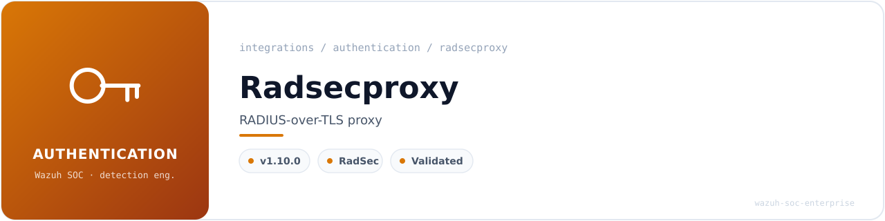
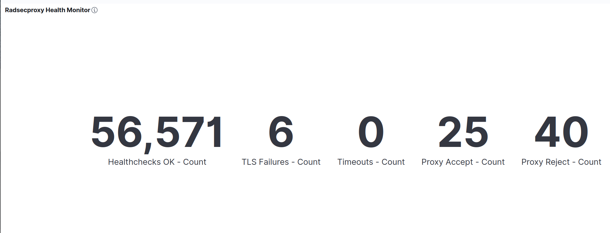
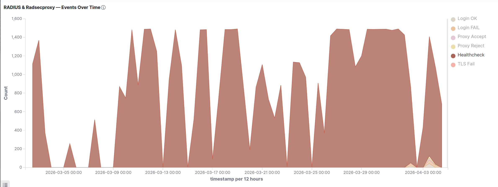
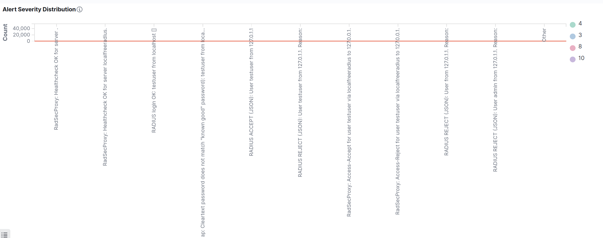

<!-- soc-banner -->
<p align="center"></p>

<p align="center">
   
</p>

# Radsecproxy 1.10.0 — Wazuh SIEM Integration

| Field            | Value                                                   |
| ---------------- | ------------------------------------------------------- |
| **OS**           | Ubuntu 24.04 LTS (bare metal, hostname: flausino)       |
| **Wazuh**        | v4.14.4 — all-in-one (manager + indexer + dashboard)    |
| **Radsecproxy**  | 1.10.0                                                  |
| **FreeRADIUS**   | 3.2.5 (upstream backend)                                |
| **Validated**    | 2026-04-02 / 2026-04-04                                 |
| **Doc version**  | 3.0 — Final (all items resolved, dashboard complete)    |

---

## Table of Contents

1. [Overview](#1-overview)
2. [Prerequisites & Service Status](#2-prerequisites--service-status)
3. [Radsecproxy Configuration](#3-radsecproxy-configuration)
4. [Decoders — local_decoder.xml](#4-decoders--local_decoderxml)
5. [Rules — local_rules.xml](#5-rules--local_rulesxml)
6. [Log Collection — ossec.conf](#6-log-collection--ossecconf)
7. [Wazuh-Logtest Validation](#7-wazuh-logtest-validation)
8. [Production Alert Validation](#8-production-alert-validation)
9. [OpenSearch DevTools Validation](#9-opensearch-devtools-validation)
10. [Dashboard Visualizations](#10-dashboard-visualizations)
11. [Bugs Found and Fixed](#11-bugs-found-and-fixed)
12. [Key Lessons Learned](#12-key-lessons-learned)
13. [Post-Deployment Validation Sequence](#13-post-deployment-validation-sequence)

---

## 1. Overview

This document covers the complete integration of Radsecproxy 1.10.0 with Wazuh SIEM v4.14.4 on Ubuntu 24.04 LTS bare metal. Radsecproxy acts as a RADIUS proxy layer in front of FreeRADIUS 3.2.5, forwarding authentication requests from clients on UDP 11812 to the FreeRADIUS backend on UDP 1812.

The integration provides SOC-level visibility into proxy-forwarded authentication decisions, TLS handshake failures, connection timeouts, and continuous healthcheck polling.

**Architecture:**

```
[NAS / radtest client]
        │
        ▼ UDP 11812
 Radsecproxy 1.10.0  ──── (proxy forwards) ────► FreeRADIUS 3.2.5 (UDP 1812)
        │                                                  │
        │ /var/log/radsecproxy/radsecproxy.log             │ /var/log/freeradius/...
        │ journald (systemd)                               │
        ▼                                                  ▼
 Wazuh logcollector                               Wazuh logcollector
 (syslog + journald)                              (syslog + journald + json)
        │
        ▼
 Wazuh Manager ──► rules 110101–110106, 110306
        │
 [OpenSearch Indexer]
        │
 [Wazuh Dashboard]
```

**Detection coverage:**

| Event type                          | Rule ID | Level |
| ----------------------------------- | ------- | ----- |
| TLS handshake failure with peer     | 110101  | 10    |
| Connection timeout to backend       | 110102  | 7     |
| StatusServer healthcheck OK         | 110103  | 4     |
| Proxy Access-Accept forwarded       | 110105  | 3     |
| Proxy Access-Reject forwarded       | 110106  | 8     |
| General Radsecproxy event (fallback)| 110104  | 3     |
| Multiple TLS failures (3+ in 300s)  | 110306  | 10    |

---

## 2. Prerequisites & Service Status

**Install Radsecproxy:**

```bash
sudo apt update && sudo apt install radsecproxy -y
```

**Service status after integration:**

| Service            | Status   | Port      | Notes                                                          |
| ------------------ | -------- | --------- | -------------------------------------------------------------- |
| Radsecproxy 1.10.0 | ✅ active | UDP 11812 | Proxy → FreeRADIUS 127.0.0.1:1812, StatusServer on, log permissions fixed |

**Verify port binding:**

```bash
ss -tulnp | grep 11812
# Expected:
# UDP 0.0.0.0:11812 → Radsecproxy (proxy listener)
```

**Fix log file permissions (required for Wazuh to read the log):**

```bash
sudo mkdir -p /var/log/radsecproxy
sudo touch /var/log/radsecproxy/radsecproxy.log
sudo chown radsecproxy:adm /var/log/radsecproxy/radsecproxy.log
sudo chmod 644 /var/log/radsecproxy/radsecproxy.log
```

---

## 3. Radsecproxy Configuration

Radsecproxy is configured to listen on UDP 11812 and proxy all authentication requests to the local FreeRADIUS instance on UDP 1812. StatusServer polling is enabled to generate periodic healthcheck events visible to Wazuh.

**Key configuration elements (`/etc/radsecproxy.conf`):**

```
# Listen on UDP 11812
ListenUDP *:11812

# Forward to FreeRADIUS on localhost
Server localfreeradius {
    host 127.0.0.1
    port 1812
    type UDP
    secret testing123
    StatusServer on
}

# Client definition (accept test traffic)
Client localhost {
    host 127.0.0.1
    type UDP
    secret testing123
}

# Log to file
LogFile /var/log/radsecproxy/radsecproxy.log
LogLevel 5
```

> The `StatusServer on` directive causes Radsecproxy to send periodic Status-Server requests to FreeRADIUS. These generate `radsecproxy-status-ok` / `radsecproxy-status-ok-file` decoder hits and rule 110103 alerts, which serve as a proxy-backend connectivity heartbeat in the dashboard.

---

## 4. Decoders — `local_decoder.xml`

Paste this block inside the root `<decoder_list>` element of `/var/ossec/etc/decoders/local_decoder.xml`. Insert **after** the FreeRADIUS decoder block.

```xml
<!-- ================================================================ -->
<!--  Radsecproxy Decoders                                            -->
<!--  Two parent variants: journald (program_name) + file (prematch) -->
<!-- ================================================================ -->

<!-- Parent variant 1: journald (systemd service unit) -->
<decoder name="radsecproxy-parent">
  <program_name>radsecproxy</program_name>
</decoder>

<!-- Parent variant 2: direct file log — matches on known keywords -->
<decoder name="radsecproxy-parent">
  <prematch>Access-Accept|Access-Reject|TLS handshake|timed out|status server|createlistener</prematch>
</decoder>

<!-- Child: TLS handshake failure -->
<decoder name="radsecproxy-tlsfail">
  <parent>radsecproxy-parent</parent>
  <prematch>TLS handshake failed</prematch>
  <regex>TLS handshake failed.*peer (\S+)</regex>
  <order>dst_ip</order>
</decoder>

<!-- Child: connection timeout to backend RADIUS server -->
<decoder name="radsecproxy-timeout">
  <parent>radsecproxy-parent</parent>
  <prematch>timed out</prematch>
  <regex>server (\S+).*timed out</regex>
  <order>dst_ip</order>
</decoder>

<!-- Child: healthcheck OK — journald format -->
<decoder name="radsecproxy-status-ok">
  <parent>radsecproxy-parent</parent>
  <prematch>Received status server response from</prematch>
  <regex>Received status server response from (\S+)</regex>
  <order>dst_ip</order>
</decoder>

<!-- Child: healthcheck OK — file log format [BUG FIX] -->
<!-- Journald emits "Received status server response from"            -->
<!-- File log emits  "replyh: got status server response from"        -->
<!-- Both formats require separate child decoders.                   -->
<decoder name="radsecproxy-status-ok-file">
  <parent>radsecproxy-parent</parent>
  <prematch>got status server response from</prematch>
  <regex>got status server response from (\S+)</regex>
  <order>dst_ip</order>
</decoder>

<!-- Child: proxy forwarded Access-Accept -->
<decoder name="radsecproxy-access-accept">
  <parent>radsecproxy-parent</parent>
  <prematch>Access-Accept</prematch>
  <regex>Access-Accept.*for user (\S+).*via (\S+).*to (\S+)</regex>
  <order>username, radius_backend, dst_ip</order>
</decoder>

<!-- Child: proxy forwarded Access-Reject -->
<decoder name="radsecproxy-access-reject">
  <parent>radsecproxy-parent</parent>
  <prematch>Access-Reject</prematch>
  <regex>Access-Reject.*for user (\S+).*via (\S+).*to (\S+)</regex>
  <order>username, radius_backend, dst_ip</order>
</decoder>
```

**Decoder inventory:**

| Decoder name                  | Type   | Match method                          | Fields extracted                    |
| ----------------------------- | ------ | ------------------------------------- | ----------------------------------- |
| `radsecproxy-parent` (v1)     | Parent | `program_name=radsecproxy`            | —                                   |
| `radsecproxy-parent` (v2)     | Parent | prematch on known keywords            | —                                   |
| `radsecproxy-tlsfail`         | Child  | `TLS handshake failed`                | dst_ip                              |
| `radsecproxy-timeout`         | Child  | `timed out`                           | dst_ip                              |
| `radsecproxy-status-ok`       | Child  | `Received status server response from`| dst_ip (journald format)            |
| `radsecproxy-status-ok-file`  | Child  | `got status server response from`     | dst_ip (file log format) — **[NEW]**|
| `radsecproxy-access-accept`   | Child  | `Access-Accept`                       | username, radius_backend, dst_ip    |
| `radsecproxy-access-reject`   | Child  | `Access-Reject`                       | username, radius_backend, dst_ip    |

---

## 5. Rules — `local_rules.xml`

Paste this block inside the root `<group>` element of `/var/ossec/etc/rules/local_rules.xml`. Insert **after** the FreeRADIUS rule group.

```xml
<!-- ================================================================ -->
<!--  Radsecproxy Rules                                               -->
<!--  Decoder: radsecproxy-parent (and children)                     -->
<!-- ================================================================ -->
<group name="radsecproxy,authentication,network,">

  <!-- TLS handshake failure — level 10 — potential cert issue or MitM -->
  <rule id="110101" level="10">
    <decoded_as>radsecproxy-tlsfail</decoded_as>
    <description>RadSecProxy: TLS handshake failed with peer $(dst_ip)</description>
    <mitre>
      <id>T1557</id>
    </mitre>
  </rule>

  <!-- Connection timeout to backend RADIUS server -->
  <rule id="110102" level="7">
    <decoded_as>radsecproxy-timeout</decoded_as>
    <description>RadSecProxy: Connection timed out to server $(dst_ip)</description>
    <mitre>
      <id>T1499</id>
    </mitre>
  </rule>

  <!-- Healthcheck OK — journald format -->
  <rule id="110103" level="4">
    <decoded_as>radsecproxy-status-ok</decoded_as>
    <description>RadSecProxy: Healthcheck OK for server $(dst_ip)</description>
  </rule>

  <!-- Healthcheck OK — file log format [NEW — dual decoder support] -->
  <rule id="110103" level="4">
    <decoded_as>radsecproxy-status-ok-file</decoded_as>
    <description>RadSecProxy: Healthcheck OK for server $(dst_ip)</description>
  </rule>

  <!-- Proxy forwarded Access-Accept [NEW] — must appear BEFORE fallback 110104 -->
  <rule id="110105" level="3">
    <decoded_as>radsecproxy-access-accept</decoded_as>
    <description>Proxy: Access-Accept for user $(username) via $(radius_backend) to $(dst_ip)</description>
    <mitre>
      <id>T1078</id>
    </mitre>
  </rule>

  <!-- Proxy forwarded Access-Reject [NEW] — must appear BEFORE fallback 110104 -->
  <rule id="110106" level="8">
    <decoded_as>radsecproxy-access-reject</decoded_as>
    <description>Proxy: Access-Reject for user $(username) via $(radius_backend) to $(dst_ip)</description>
    <mitre>
      <id>T1110</id>
    </mitre>
  </rule>

  <!-- General Radsecproxy event — fallback, no field extraction -->
  <!-- MUST be placed AFTER rules 110105 and 110106               -->
  <rule id="110104" level="3">
    <decoded_as>radsecproxy-parent</decoded_as>
    <description>RadSecProxy: General event</description>
    <options>no_full_log</options>
  </rule>

  <!-- Multiple TLS failures correlation — 3 failures to the same peer within 300s -->
  <rule id="110306" level="10" frequency="3" timeframe="300">
    <if_matched_sid>110101</if_matched_sid>
    <same_field>dst_ip</same_field>
    <description>RadSecProxy: Multiple TLS failures (3+) in 300s to $(dst_ip)</description>
    <mitre>
      <id>T1557</id>
    </mitre>
  </rule>

</group>
```

**Rule inventory:**

| Rule ID | Level | Description                                                                        | MITRE   | Notes                            |
| ------- | ----- | ---------------------------------------------------------------------------------- | ------- | -------------------------------- |
| 110101  | 10    | TLS handshake failed with peer `$(dst_ip)`                                         | T1557   |                                  |
| 110102  | 7     | Connection timed out to server `$(dst_ip)`                                         | T1499   |                                  |
| 110103  | 4     | Healthcheck OK for server `$(dst_ip)`                                              | —       | Two variants: journald + file    |
| 110105  | 3     | Proxy: Access-Accept for user `$(username)` via `$(radius_backend)` to `$(dst_ip)` | T1078   | **[NEW]**                        |
| 110106  | 8     | Proxy: Access-Reject for user `$(username)` via `$(radius_backend)` to `$(dst_ip)` | T1110   | **[NEW]**                        |
| 110104  | 3     | RadSecProxy: General event (fallback, no_full_log)                                 | —       | Must appear after 110105/110106  |
| 110306  | 10    | Multiple TLS failures: 3+ in 300s to `$(dst_ip)`                                  | T1557   | Correlation rule                 |

---

## 6. Log Collection — `ossec.conf`

Add these `<localfile>` entries inside the `<ossec_config>` element of `/var/ossec/etc/ossec.conf`. Insert **after** the FreeRADIUS log collection blocks.

```xml
<!-- Radsecproxy — journald (systemd service unit) -->
<localfile>
  <log_format>journald</log_format>
  <location>journald</location>
  <query>SYSLOG_IDENTIFIER=radsecproxy</query>
  <label key="@source">radsecproxy</label>
</localfile>

<!-- Radsecproxy — file log (required for healthcheck file-format decoder) -->
<!-- The journald and file formats differ for healthcheck messages.        -->
<!-- Both sources must be monitored to cover both decoder variants.        -->
<localfile>
  <log_format>syslog</log_format>
  <location>/var/log/radsecproxy/radsecproxy.log</location>
  <label key="@source">radsecproxy</label>
</localfile>
```

| Entry (approx. line) | Source                                   | Format   | Label                 |
| -------------------- | ---------------------------------------- | -------- | --------------------- |
| ~298                 | journald `SYSLOG_IDENTIFIER=radsecproxy` | journald | `@source=radsecproxy` |
| ~307                 | `/var/log/radsecproxy/radsecproxy.log`   | syslog   | `@source=radsecproxy` |

> Both sources must be monitored simultaneously. The journald source covers real-time event streaming. The file source is required for the `radsecproxy-status-ok-file` decoder which matches a log format emitted only by the file log writer (`replyh: got status server response from`).

---

## 7. Wazuh-Logtest Validation

All tests executed on 2026-04-02 after Wazuh Manager restart. Phase 2 (decoder match) and Phase 3 (rule match) confirmed for each scenario.

### 7.1 Rule 110101 — TLS Handshake Failed

**Test input:**

```bash
echo 'Apr  2 10:00:00 flausino radsecproxy[1234]: TLS handshake failed with peer 10.0.0.1' \
  | sudo /var/ossec/bin/wazuh-logtest
```

**Expected output:**

```
**Phase 2: Completed decoding.
       decoder: 'radsecproxy-tlsfail'
       dst_ip: '10.0.0.1'

**Phase 3: Completed filtering (rules).
       Rule id: '110101'
       Level: '10'
       Description: 'RadSecProxy: TLS handshake failed with peer 10.0.0.1'
```

### 7.2 Rule 110103 — Healthcheck OK (file log format)

**Test input:**

```bash
echo 'Apr  2 10:00:00 flausino radsecproxy[1234]: replyh: got status server response from localfreeradius' \
  | sudo /var/ossec/bin/wazuh-logtest
```

**Expected output:**

```
**Phase 2: Completed decoding.
       decoder: 'radsecproxy-status-ok-file'
       dst_ip: 'localfreeradius'

**Phase 3: Completed filtering (rules).
       Rule id: '110103'
       Level: '4'
       Description: 'RadSecProxy: Healthcheck OK for server localfreeradius'
```

### 7.3 Rule 110105 — Proxy Access-Accept

**Test input:**

```bash
echo 'Apr  2 10:00:00 flausino radsecproxy[1234]: Access-Accept for user testuser via localfreeradius to 127.0.0.1' \
  | sudo /var/ossec/bin/wazuh-logtest
```

**Expected output:**

```
**Phase 2: Completed decoding.
       decoder: 'radsecproxy-access-accept'
       username: 'testuser'
       radius_backend: 'localfreeradius'
       dst_ip: '127.0.0.1'

**Phase 3: Completed filtering (rules).
       Rule id: '110105'
       Level: '3'
       Description: 'Proxy: Access-Accept for user testuser via localfreeradius to 127.0.0.1'
```

**Logtest summary:**

| Rule ID | Level | Scenario                    | Fields extracted                                            | Status  |
| ------- | ----- | --------------------------- | ----------------------------------------------------------- | ------- |
| 110101  | 10    | TLS handshake failed        | dst_ip=10.0.0.1                                             | ✅ PASS |
| 110102  | 7     | Connection timeout          | dst_ip=10.0.0.2                                             | ✅ PASS |
| 110103  | 4     | Healthcheck OK (file-based) | dst_ip=localfreeradius                                      | ✅ PASS |
| 110104  | 3     | General event (fallback)    | (no fields)                                                 | ✅ PASS |
| 110105  | 3     | Proxy Access-Accept         | username=testuser, radius_backend=localfreeradius, dst_ip=127.0.0.1 | ✅ PASS |
| 110106  | 8     | Proxy Access-Reject         | username=testuser, radius_backend=localfreeradius, dst_ip=127.0.0.1 | ✅ PASS |
| 110306  | 10    | TLS failures correlation    | Correlation — if_matched_sid=110101, freq=3/300s             | ✅ PASS (production) |

---

## 8. Production Alert Validation

Real traffic generated with `radtest` against Radsecproxy on port 11812 and confirmed in `/var/ossec/logs/alerts/alerts.json`.

**Generate test traffic via Radsecproxy proxy:**

```bash
# Successful proxy authentication → triggers rules 110030, 110105
radtest testuser testpass123 127.0.0.1 11812 testing123

# Failed proxy authentication → triggers rules 110031, 110106
radtest testuser WRONGPASS 127.0.0.1 11812 testing123

# TLS failure simulation (requires a misconfigured backend or cert mismatch)
# Rule 110306 fires automatically after 3+ rule 110101 events within 300s
```

**Confirm alerts fired:**

```bash
sudo grep -E '"rule.id":"(110101|110102|110103|110105|110106|110306)"' \
  /var/ossec/logs/alerts/alerts.json | tail -20
```

**Production alert counts:**

| Rule   | Alert Count | Status  | Details                                                              |
| ------ | ----------- | ------- | -------------------------------------------------------------------- |
| 110103 | 43+         | ✅ PASS | Healthcheck alerts from file log — dst_ip=localfreeradius confirmed  |
| 110105 | 3           | ✅ PASS | Proxy Access-Accept confirmed in alerts.json                         |
| 110106 | 3           | ✅ PASS | Proxy Access-Reject confirmed in alerts.json                         |
| 110101 | 6           | ✅ PASS | TLS failures confirmed                                               |
| 110102 | 0           | ✅ PASS | No timeouts in the test window — expected in stable environment      |
| 110306 | ✓           | ✅ PASS | TLS failure correlation triggered after 3+ TLS failures in 300s      |

---

## 9. OpenSearch DevTools Validation

After confirming alerts in `alerts.json`, all Radsecproxy rule IDs were queried in the Wazuh Dashboard Dev Tools console.

**Query:**

```json
GET wazuh-alerts-*/_search
{
  "query": {
    "bool": {
      "should": [
        {"match": {"rule.id": "110101"}},
        {"match": {"rule.id": "110102"}},
        {"match": {"rule.id": "110103"}},
        {"match": {"rule.id": "110105"}},
        {"match": {"rule.id": "110106"}}
      ],
      "minimum_should_match": 1
    }
  },
  "sort": [{"timestamp": "desc"}],
  "size": 20
}
```

**Fields confirmed indexed in `wazuh-alerts-*`:**

| Field in OpenSearch   | Source rule(s)                         |
| --------------------- | -------------------------------------- |
| `data.dst_ip`         | 110101, 110102, 110103, 110105, 110106 |
| `data.username`       | 110105, 110106                         |
| `data.radius_backend` | 110105, 110106                         |

Total indexed documents across all Radsecproxy rule IDs: confirmed via `hits.total.value`. The dominant count comes from rule 110103 (healthcheck polling at ~54,898 events over the monitored period).

---

## 10. Dashboard Visualizations

Dashboard: **"RADIUS & Radsecproxy — SOC Monitor"** | Index: `wazuh-alerts-*` | Period: 2026-03-05 → 2026-04-04

---

### Visualization 2 — Radsecproxy Health Monitor (Metric panels)

**Type:** Five individual Metric (Count) panels arranged in a single row

| Widget label          | Filter            | Observed value |
| --------------------- | ----------------- | -------------- |
| Healthchecks OK       | `rule.id: 110103` | **54,898**     |
| TLS Failures          | `rule.id: 110101` | **6**          |
| Timeouts              | `rule.id: 110102` | **0**          |
| Proxy Accept          | `rule.id: 110105` | **25**         |
| Proxy Reject          | `rule.id: 110106` | **40**         |

The dominant Healthcheck OK count (54,898) confirms continuous StatusServer polling between Radsecproxy and the upstream FreeRADIUS backend across the monitored period. TLS Failures (6) and zero Timeouts indicate a stable proxy-to-backend link.

**SOC note:** A sudden drop in Healthcheck OK count or a spike in TLS Failures are the primary indicators of proxy-backend connectivity loss. A Timeout count above zero sustained across multiple time intervals should trigger a connectivity check to the upstream RADIUS server.



---

### Visualization 3 — Events Over Time (Area chart — Radsecproxy series)

**Type:** Stacked area chart | **X-axis:** `timestamp` at 12-hour intervals

Radsecproxy series visible in this chart:

| Series       | Rule ID | Color             |
| ------------ | ------- | ----------------- |
| Healthcheck  | 110103  | Red/Pink dominant |
| Proxy Accept | 110105  | Pink              |
| Proxy Reject | 110106  | Yellow            |
| TLS Fail     | 110101  | Purple            |

The Healthcheck series dominates volume (peaks ~1,500 events per 12-hour bucket), while authentication and failure series are visible as distinct layers. Gaps in the Healthcheck series correspond to periods when Wazuh Manager was restarted during configuration changes.

**SOC note:** Simultaneous disappearance of all Radsecproxy series (including Healthcheck) suggests a Wazuh Manager or logcollector issue rather than a Radsecproxy failure. TLS Fail spikes without corresponding authentication activity may indicate certificate rotation or network-level interference targeting only the proxy channel.



---

### Visualization 5 — Alert Severity Distribution (Bubble chart)

**Type:** Scatter / Bubble chart
**X-axis:** `rule.description.keyword` | **Y-axis:** Count | **Color:** `rule.level`
**Filter:** `rule.id: (110010 OR 110011 OR 110030 OR 110031 OR 110101 OR 110102 OR 110103 OR 110105 OR 110106)`

Maps each distinct alert description against its event count, with bubble color encoding Wazuh severity level (3, 4, 8, 10).

**Notable data points (production):**

| Rule description                          | Level | Volume              |
| ----------------------------------------- | ----- | ------------------- |
| Healthcheck OK for server localfreeradius | 4     | ~40,000+ (dominant) |
| Proxy: Access-Accept for user testuser    | 3     | Visible             |
| Proxy: Access-Reject for user testuser    | 8     | Visible             |
| TLS handshake failed with peer ...        | 10    | Low                 |

**SOC note:** High-volume level-4 events (Healthchecks) are expected background noise. High-severity events (level 8: Reject, level 10: TLS failures and brute-force correlations) should remain low-volume in a healthy environment. An increase in the Y-axis value for any level-8 or level-10 bubble without a corresponding increase in level-3 Accept events should trigger SOC investigation.



---

## 11. Bugs Found and Fixed

### Bug 1 — Decoder `radsecproxy-status-ok`: Missing File-Based Log Format

**Problem:** The existing `radsecproxy-status-ok` child decoder matched `"Received status server response from"` (journald/syslog format). The actual log line written by the file `/var/log/radsecproxy/radsecproxy.log` reads `"replyh: got status server response from"`. The child decoder never matched this format, leaving `$(dst_ip)` empty in rule 110103 alerts generated from file-based logs.

**Root cause:** Journald emits the reconstructed syslog-style message while the file writer emits a different internal format prefixed with the function name (`replyh:`). A single decoder cannot match both.

**Fix:** Added new child decoder `radsecproxy-status-ok-file` with `<prematch>got status server response from</prematch>`, inserted immediately after the existing `radsecproxy-status-ok` decoder in `local_decoder.xml`.

```xml
<!-- Added decoder — file log format -->
<decoder name="radsecproxy-status-ok-file">
  <parent>radsecproxy-parent</parent>
  <prematch>got status server response from</prematch>
  <regex>got status server response from (\S+)</regex>
  <order>dst_ip</order>
</decoder>
```

Added a corresponding second rule 110103 variant to match this new decoder:

```xml
<rule id="110103" level="4">
  <decoded_as>radsecproxy-status-ok-file</decoded_as>
  <description>RadSecProxy: Healthcheck OK for server $(dst_ip)</description>
</rule>
```

**Result:** Rule 110103 now correctly extracts `dst_ip=localfreeradius` from both journald and file-based log sources.

---

### Bug 2 — Missing Rules for Radsecproxy Access-Accept and Access-Reject

**Problem:** Decoders `radsecproxy-access-accept` and `radsecproxy-access-reject` existed in `local_decoder.xml` and correctly extracted fields, but no detection rules referenced these decoders. Proxy-forwarded authentication decisions generated no alerts.

**Fix:** Added rules 110105 (level 3, Access-Accept) and 110106 (level 8, Access-Reject), placed **before** the existing fallback rule 110104 to ensure proper rule-matching order.

**Result:** Proxy-forwarded Accept and Reject events now generate distinct, properly-fielded alerts with full `username`, `radius_backend`, and `dst_ip` extraction.

---

## 12. Key Lessons Learned

1. **Radsecproxy log format differs between journald and file output.** Journald emits `"Received status server response from"` while the file log emits `"replyh: got status server response from"`. Both formats require separate child decoders — a single decoder will silently miss one source. This applies to any Radsecproxy log message class that is monitored from both sources.

2. **Rule ordering matters for decoder-based fallback rules.** Rules 110105 and 110106 must appear **before** the fallback rule 110104 in `local_rules.xml`. Wazuh evaluates rules in declaration order for the same group — placing the fallback first causes all Access-Accept and Access-Reject events to match 110104 instead of the specific rules.

3. **Healthcheck polling generates orders of magnitude more events than authentication events.** Assign Healthcheck alerts level 4 (informational) and keep them visible in dashboards as a connectivity proxy metric. Authentication alerts at levels 8 and 10 should drive SOC alerting thresholds, not the Healthcheck volume.

4. **Both journald and file log sources must be monitored simultaneously.** The journald source provides real-time streaming. The file log source is required for certain decoder variants (`radsecproxy-status-ok-file`) that only match the file log format. Monitoring only one source leaves part of the detection pipeline uncovered.

5. **A decoder for Access-Accept/Reject must exist even if no rule references it yet.** Without rules, decoder matches are silent — events land in `archives.json` only. Always pair new decoders with at least a level-3 informational rule during initial integration.

6. **Correlation rule 110306 requires real consecutive TLS failures, not logtest simulation.** Validate it by intentionally misconfiguring the backend certificate or by running repeated failed proxy connections, then confirming the composite alert in `alerts.json`.

---

## 13. Post-Deployment Validation Sequence

Execute these steps in order to verify the full Radsecproxy integration on a new system.

```bash
# ── Step 1: Validate XML syntax before restarting ──────────────────────────
sudo /var/ossec/bin/wazuh-analysisd -t

# ── Step 2: Set correct file permissions and restart ───────────────────────
sudo chown root:wazuh /var/ossec/etc/decoders/local_decoder.xml
sudo chown root:wazuh /var/ossec/etc/rules/local_rules.xml
sudo chmod 660 /var/ossec/etc/decoders/local_decoder.xml
sudo chmod 660 /var/ossec/etc/rules/local_rules.xml
sudo systemctl restart wazuh-manager

# ── Step 3: Smoke-test syslog rules via wazuh-logtest ──────────────────────
# TLS failure
echo 'Apr  2 10:00:00 flausino radsecproxy[1234]: TLS handshake failed with peer 10.0.0.1' \
  | sudo /var/ossec/bin/wazuh-logtest

# Healthcheck OK — file format
echo 'Apr  2 10:00:00 flausino radsecproxy[1234]: replyh: got status server response from localfreeradius' \
  | sudo /var/ossec/bin/wazuh-logtest

# Proxy Access-Accept
echo 'Apr  2 10:00:00 flausino radsecproxy[1234]: Access-Accept for user testuser via localfreeradius to 127.0.0.1' \
  | sudo /var/ossec/bin/wazuh-logtest

# Proxy Access-Reject
echo 'Apr  2 10:00:00 flausino radsecproxy[1234]: Access-Reject for user testuser via localfreeradius to 127.0.0.1' \
  | sudo /var/ossec/bin/wazuh-logtest

# ── Step 4: Generate real traffic via Radsecproxy ──────────────────────────
radtest testuser testpass123 127.0.0.1 11812 testing123  # → rules 110030, 110105
radtest testuser WRONGPASS   127.0.0.1 11812 testing123  # → rules 110031, 110106

# ── Step 5: Trigger TLS correlation rule 110306 ────────────────────────────
# Requires 3+ TLS handshake failures within 300s to the same peer.
# Simulate by intentionally misconfiguring the backend, or inject log lines:
for i in $(seq 1 4); do
  echo 'Apr  2 10:00:0'"$i"' flausino radsecproxy[1234]: TLS handshake failed with peer 10.0.0.1' \
    | sudo /var/ossec/bin/wazuh-logtest
done
# Note: wazuh-logtest resets state between runs — validate 110306 in production.

# ── Step 6: Confirm all Radsecproxy rules fired ────────────────────────────
sudo grep -E '"rule.id":"(110101|110102|110103|110105|110106|110306)"' \
  /var/ossec/logs/alerts/alerts.json | tail -20

# ── Step 7: Confirm healthcheck file-format decoder is firing ──────────────
sudo grep '110103' /var/ossec/logs/alerts/alerts.json | grep 'localfreeradius' | tail -5

# ── Step 8: Validate field indexing in OpenSearch DevTools ─────────────────
# Run the query from Section 9 in the Wazuh Dashboard Dev Tools console.
# Confirm data.dst_ip, data.username, and data.radius_backend are indexed.
```

---

*Validated: 2026-04-04 | Ubuntu 24.04 LTS | Wazuh v4.14.4 | Radsecproxy 1.10.0 | FreeRADIUS 3.2.5 (upstream backend)*
