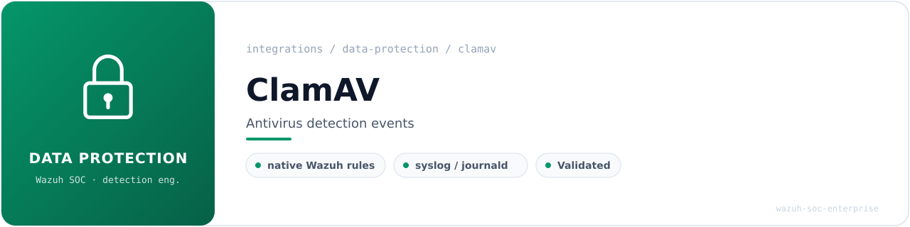
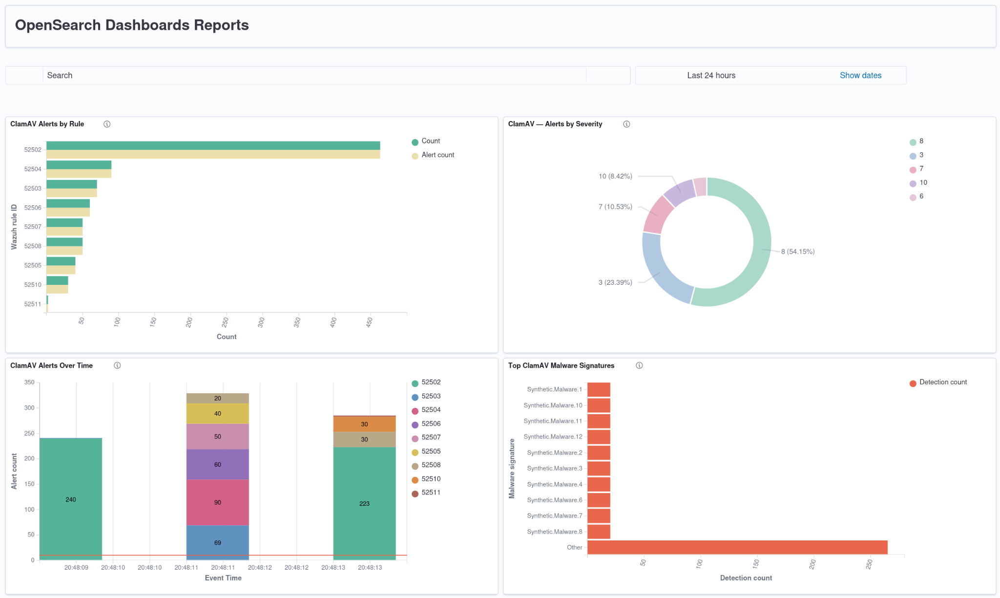
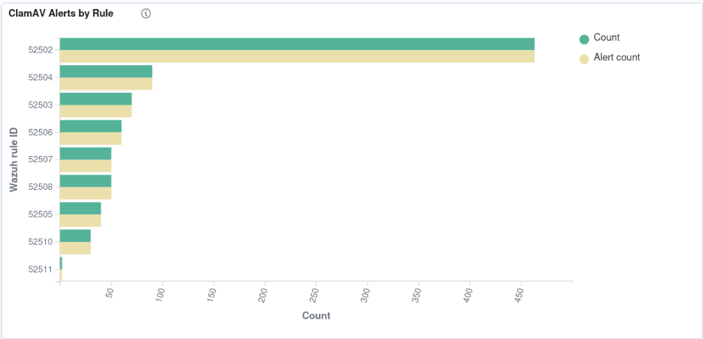
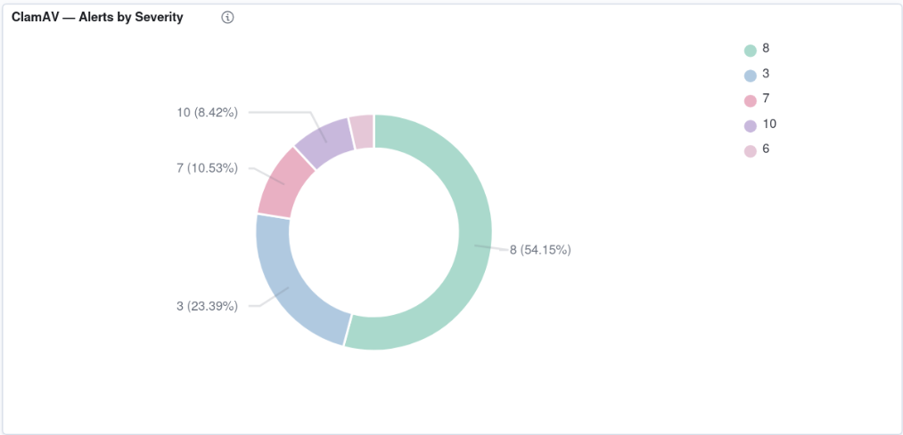
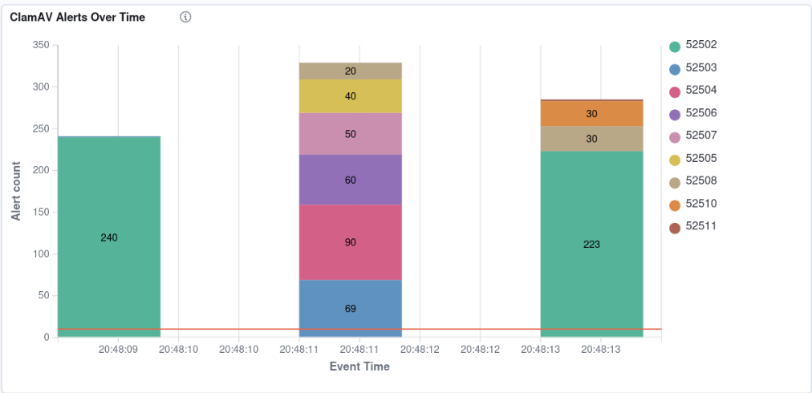
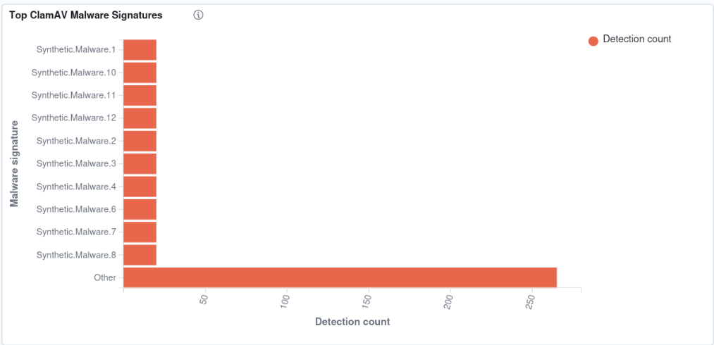

<!-- soc-banner -->
<p align="center"></p>

<p align="center">
   
</p>

# ClamAV Antivirus Monitoring — Wazuh Integration

| Field | Value |
|---|---|
| **Author** | Bruno Rubens Flausino Teixeira |
| **Version** | 2.0 — Validated native integration |
| **Validation date** | 2026-07-16 |
| **Environment** | Ubuntu 24.04 LTS — Bare metal — Wazuh all-in-one lab |
| **Wazuh version** | 4.14.6 |
| **ClamAV version** | 1.4.3 |
| **Integration type** | Native ClamAV decoders and native Wazuh rules |
| **Native rule file** | `/var/ossec/ruleset/rules/0320-clam_av_rules.xml` |
| **Alerting rules** | 52502–52508, 52510, 52511 |
| **Dashboard** | 4 panels — rule distribution, severity, timeline, malware signatures |
| **Status** | Complete — EICAR validated — 855 synthetic alerts indexed |

---

## Table of Contents

1. [Executive Summary](#1-executive-summary)
2. [Architecture and Data Flow](#2-architecture-and-data-flow)
3. [What Was Corrected from the Previous Method](#3-what-was-corrected-from-the-previous-method)
4. [Prerequisites and Safety Backup](#4-prerequisites-and-safety-backup)
5. [ClamAV Installation](#5-clamav-installation)
6. [ClamAV Log Routing](#6-clamav-log-routing)
7. [Wazuh Collection Configuration](#7-wazuh-collection-configuration)
8. [Native Decoder and Rule Chain](#8-native-decoder-and-rule-chain)
9. [Removal of Redundant Custom Configuration](#9-removal-of-redundant-custom-configuration)
10. [Configuration Validation](#10-configuration-validation)
11. [EICAR End-to-End Validation](#11-eicar-end-to-end-validation)
12. [Native Rule Validation with wazuh-logtest](#12-native-rule-validation-with-wazuh-logtest)
13. [Synthetic Alert Storm](#13-synthetic-alert-storm)
14. [OpenSearch DevTools Verification](#14-opensearch-devtools-verification)
15. [Dashboard Visualizations](#15-dashboard-visualizations)
16. [Troubleshooting](#16-troubleshooting)
17. [Operational and Security Notes](#17-operational-and-security-notes)
18. [File Reference Summary](#18-file-reference-summary)
19. [References](#19-references)

---

## 1. Executive Summary

This document describes the complete installation, validation, and visualization methodology used to integrate **ClamAV 1.4.3** with **Wazuh 4.14.6** on an Ubuntu 24.04 all-in-one SOC lab.

The final design deliberately uses the functionality already included in Wazuh:

- Native `clamd` and `freshclam` decoding
- Native rules in `0320-clam_av_rules.xml`
- Existing syslog/journald collection
- Native Wazuh alert generation
- Filebeat forwarding to the Wazuh Indexer
- OpenSearch Dashboard visualizations

No custom ClamAV decoder, custom ClamAV rule, external parser, or dedicated ClamAV JSON pipeline is required.

### Validated Results

| Validation item | Result |
|---|---:|
| Real EICAR detection | Rule 52502, level 8 |
| Native ClamAV rule family tested | 52500–52511 |
| Synthetic source events generated | 905 |
| Indexed alert documents | 855 |
| Alerting rule IDs represented | 9 |
| Severity levels represented | 3, 6, 7, 8, 10 |
| Dashboard panels | 4 |
| MITRE mapping verified | T1562.001 on rule 52510 |
| Wazuh configuration test | Passed |
| Filebeat and Indexer delivery | Confirmed |

The dashboard documented here is a **validation dashboard**. Its saved visualizations intentionally preserve the synthetic marker:

```text
WAZUH-SYNTH-CLAMAV-20260716_204807
```

Do not remove this marker from the validated visualizations. A future production dashboard must be created as a separate copy.

---

## 2. Architecture and Data Flow

### 2.1 Validated Architecture

```text
+-----------------------+
| ClamAV                |
| clamd + freshclam     |
+-----------+-----------+
            |
            | syslog-style service events
            v
+-----------------------+
| systemd journal /     |
| /var/log/syslog       |
+-----------+-----------+
            |
            | existing Wazuh collection
            v
+-----------------------+
| Wazuh local           |
| logcollector          |
+-----------+-----------+
            |
            v
+-----------------------+
| Native decoders       |
| clamd / freshclam     |
+-----------+-----------+
            |
            v
+-----------------------+
| Native rules          |
| 52500–52511           |
+-----------+-----------+
            |
            v
+-----------------------+
| alerts.json           |
| Filebeat              |
+-----------+-----------+
            |
            v
+-----------------------+
| Wazuh Indexer         |
| wazuh-alerts-*        |
+-----------+-----------+
            |
            v
+-----------------------+
| Wazuh Dashboard       |
| 4 ClamAV panels       |
+-----------------------+
```

### 2.2 Component Responsibilities

| Component | Responsibility |
|---|---|
| `clamd` | Persistent ClamAV scanning daemon |
| `clamdscan` | Client that submits files to `clamd` |
| `freshclam` | Updates malware signature databases |
| systemd journal / syslog | Preserves daemon events with the `clamd` or `freshclam` program name |
| Wazuh logcollector | Reads the existing operating-system log source |
| Native decoders | Extract ClamAV fields from syslog-style events |
| Native rules | Classify detections, errors, warnings, updates, stops, and repeated detections |
| Filebeat | Sends Wazuh alerts to the Indexer |
| Wazuh Indexer | Stores alert documents in `wazuh-alerts-*` |
| Wazuh Dashboard | Displays the four validated visualizations |

### 2.3 All-in-One Lab Detail

The monitored Ubuntu host is also the Wazuh manager host. Local events are processed by the manager's local collection pipeline. A separate `wazuh-agent` systemd service is not required for this local all-in-one path.

On a remote endpoint, the Wazuh agent performs the same collection role and forwards the event to the manager.

---

## 3. What Was Corrected from the Previous Method

The original ClamAV document required revision because several instructions were too absolute or did not match the validated lab.

### 3.1 Installation Package Correction

The previous command installed only:

```bash
sudo apt-get install clamav clamav-freshclam
```

The validated installation explicitly includes the daemon and daemon client:

```bash
sudo apt install -y clamav clamav-daemon clamav-freshclam clamdscan
```

### 3.2 Service Persistence Correction

Starting services is not enough for persistence. The validated method enables and starts both services:

```bash
sudo systemctl enable --now clamav-daemon clamav-freshclam
```

### 3.3 LogSyslog Correction

The previous document stated that `LogSyslog true` was always mandatory and that it forced ClamAV to stop using its own log file. That statement was too broad.

The correct decision is evidence-based:

- If `clamd` events already appear in the system journal or `/var/log/syslog` with a parseable `clamd` program name, preserve the working route.
- If they do not appear, enable the official Wazuh Linux collection method with `LogSyslog true`.
- Do not add a direct `/var/log/clamav/clamav.log` collector and assume the native syslog decoder will parse it.

In this validated lab, `LogSyslog` remained `false`, but the daemon events were already visible through the operating-system logging path and were decoded correctly by Wazuh.

### 3.4 Wazuh Service Correction

The previous method restarted `wazuh-agent` unconditionally. In the all-in-one lab, the local event path is handled by the Wazuh manager. Restart only the component whose configuration was actually changed.

### 3.5 Direct ClamAV File Collection Correction

The previous document described direct ClamAV file collection as a conflict in all situations. The more precise conclusion is:

- Direct file collection is not required for this native integration.
- The stock decoder expects a syslog-style event with the correct program name.
- A direct raw-file source may require a custom decoder and can create duplicate ingestion if syslog/journald is already collected.
- Therefore, the validated design removes the redundant direct ClamAV `<localfile>` block.

### 3.6 Validation Command Correction

The final EICAR test uses:

```bash
sudo clamdscan --fdpass /tmp/eicar.com
```

`--fdpass` avoids file-permission problems between the invoking user and the `clamav` service account.

---

## 4. Prerequisites and Safety Backup

### 4.1 Verify the Environment

```bash
cat /etc/os-release | grep -E '^PRETTY_NAME='

sudo /var/ossec/bin/wazuh-control info

systemctl is-active wazuh-manager
systemctl is-active filebeat
systemctl is-active wazuh-indexer
systemctl is-active wazuh-dashboard
```

Expected state:

```text
active
```

### 4.2 Confirm the Native Rule File

```bash
sudo ls -l /var/ossec/ruleset/rules/0320-clam_av_rules.xml
```

Do not edit this file. Files under `/var/ossec/ruleset/` are managed by Wazuh and may be replaced during upgrades.

### 4.3 Create a Timestamped Backup Before Cleanup

```bash
TS="$(date +%Y%m%d_%H%M%S)"
BACKUP_DIR="/var/ossec/etc/clamav-backup-${TS}"

sudo install -d -m 0700 "$BACKUP_DIR"

sudo cp -a /var/ossec/etc/ossec.conf "$BACKUP_DIR/"
sudo cp -a /var/ossec/etc/decoders/local_decoder.xml "$BACKUP_DIR/" 2>/dev/null || true
sudo cp -a /var/ossec/etc/rules/local_rules.xml "$BACKUP_DIR/" 2>/dev/null || true
sudo cp -a /var/ossec/etc/rules/clamav_enriched_rules.xml "$BACKUP_DIR/" 2>/dev/null || true
sudo cp -a /etc/clamav/clamd.conf "$BACKUP_DIR/"
sudo cp -a /etc/clamav/freshclam.conf "$BACKUP_DIR/"

sudo bash -c '
  cd "$1" || exit 1
  find . -type f ! -name SHA256SUMS -print0 \
    | sort -z \
    | xargs -0 sha256sum > SHA256SUMS
' _ "$BACKUP_DIR"
```

Verify the backup:

```bash
sudo bash -c 'cd "$1" && sha256sum -c SHA256SUMS' _ "$BACKUP_DIR"
```

The lab cleanup backup created during validation was independently checksum-verified before any redundant configuration was removed.

---

## 5. ClamAV Installation

### 5.1 Install Required Packages

```bash
sudo apt update
sudo apt install -y clamav clamav-daemon clamav-freshclam clamdscan
```

### 5.2 Enable and Start Services

```bash
sudo systemctl enable --now clamav-daemon
sudo systemctl enable --now clamav-freshclam
```

### 5.3 Verify Service State

```bash
systemctl is-enabled clamav-daemon clamav-freshclam
systemctl is-active clamav-daemon clamav-freshclam
```

Expected output:

```text
enabled
enabled
active
active
```

### 5.4 Verify Installed Tools

```bash
clamscan --version
clamdscan --version
freshclam --version
command -v clamscan clamdscan freshclam
```

### 5.5 Verify the Local Socket

```bash
sudo grep -E '^LocalSocket ' /etc/clamav/clamd.conf
sudo ls -l /var/run/clamav/clamd.ctl
```

Typical Ubuntu path:

```text
/var/run/clamav/clamd.ctl
```

### 5.6 Signature Database Updates

The `clamav-freshclam` service updates signatures automatically. Do not run `freshclam` manually while the service owns its lock.

Check recent updates:

```bash
sudo journalctl -u clamav-freshclam -n 50 --no-pager
```

For a deliberate manual update:

```bash
sudo systemctl stop clamav-freshclam
sudo freshclam
sudo systemctl start clamav-freshclam
```

---

## 6. ClamAV Log Routing

### 6.1 Inspect the Existing ClamAV Configuration

```bash
sudo grep -nE '^(LogSyslog|LogFile|LogTime|LogVerbose)' /etc/clamav/clamd.conf
```

### 6.2 Verify the Real Event Route Before Editing

```bash
sudo journalctl -u clamav-daemon -n 50 --no-pager

sudo grep -Ei 'clamd|freshclam' /var/log/syslog | tail -n 50
```

The important requirement is a syslog-style event that preserves:

```text
program_name: clamd
```

or:

```text
program_name: freshclam
```

### 6.3 Validated Lab Route

The validated lab retained:

```ini
LogSyslog false
```

No change was required because the operating-system logging path already exposed parseable `clamd` and `freshclam` events to Wazuh.

### 6.4 Official Syslog Fallback

When the checks above show that ClamAV events are not reaching the system log, use the official Wazuh Linux method.

Edit:

```bash
sudoedit /etc/clamav/clamd.conf
```

Set:

```ini
LogSyslog true
```

Restart the daemon:

```bash
sudo systemctl restart clamav-daemon
```

Re-check:

```bash
sudo grep -Ei 'clamd' /var/log/syslog | tail -n 20
```

Do not enable `LogSyslog true` blindly when a working route already exists. Validate the actual event path first.

---

## 7. Wazuh Collection Configuration

### 7.1 Existing Generic Collection

The integration uses the operating-system log source already collected by Wazuh. Typical blocks are:

```xml
<localfile>
  <log_format>journald</log_format>
  <location>journald</location>
</localfile>
```

and/or:

```xml
<localfile>
  <log_format>syslog</log_format>
  <location>/var/log/syslog</location>
</localfile>
```

Inspect the current configuration:

```bash
sudo grep -nA4 -B2 -E '<log_format>(journald|syslog)</log_format>' \
  /var/ossec/etc/ossec.conf
```

### 7.2 Configuration That Is Not Required

The validated design does not require:

```xml
<localfile>
  <log_format>syslog</log_format>
  <location>/var/log/clamav/clamav.log</location>
</localfile>
```

It also does not require:

- A ClamAV JSON converter
- A custom ClamAV decoder
- Custom ClamAV rules
- A dedicated ClamAV integration script

### 7.3 Restart Logic

When no Wazuh configuration was changed, do not restart Wazuh merely to perform the ClamAV test.

When `ossec.conf`, a custom rule, or a decoder was changed and validated:

```bash
sudo systemctl restart wazuh-manager
```

For a remote endpoint whose agent configuration changed:

```bash
sudo systemctl restart wazuh-agent
```

---

## 8. Native Decoder and Rule Chain

### 8.1 Native Rules

File:

```text
/var/ossec/ruleset/rules/0320-clam_av_rules.xml
```

### 8.2 Rule Matrix

| Rule ID | Level | Alert behavior | Purpose |
|---:|---:|---|---|
| 52500 | 0 | `noalert=1` | Base rule for `clamd` messages |
| 52501 | 0 | `noalert=1` | Base rule for `freshclam` messages |
| 52502 | 8 | Alert | Virus or malware signature detected (`FOUND`) |
| 52503 | 10 | Alert | `clamd` error |
| 52504 | 7 | Alert | `clamd` warning |
| 52505 | 3 | Alert | `clamd` daemon restart |
| 52506 | 3 | Alert | `clamd` database modification/reload |
| 52507 | 3 | Alert | ClamAV update process started |
| 52508 | 3 | Alert | Signature database updated |
| 52509 | 0 | Not indexed as a normal alert | Incremental update failed |
| 52510 | 6 | Alert | `clamd` stopped — MITRE T1562.001 |
| 52511 | 10 | Correlation alert | Same virus detected repeatedly; frequency 8 |

### 8.3 Rule Chaining

```text
clamd decoder
    └── 52500 base rule
          ├── 52502 virus detected
          ├── 52503 error
          ├── 52504 warning
          ├── 52505 restarted
          ├── 52506 database modified
          └── 52510 stopped

freshclam decoder
    └── 52501 base rule
          ├── 52507 update started
          ├── 52508 database updated
          └── 52509 update failed

52502 virus detected
    └── 52511 repeated detection correlation
```

### 8.4 MITRE ATT&CK Mapping

Rule 52510 maps to:

| Field | Value |
|---|---|
| Technique ID | T1562.001 |
| Technique | Impair Defenses: Disable or Modify Tools |
| Tactic | Defense Evasion |

A stopped antivirus daemon can create a protection gap and may represent intentional defense impairment.

---

## 9. Removal of Redundant Custom Configuration

The lab contained older custom ClamAV components that duplicated native Wazuh functionality.

### 9.1 Redundant Items Identified

| Location | Redundant item |
|---|---|
| `/var/ossec/etc/decoders/local_decoder.xml` | `clamav-syslog` decoder |
| `/var/ossec/etc/decoders/local_decoder.xml` | `clamav-child` decoder |
| `/var/ossec/etc/rules/local_rules.xml` | Rule 111101 |
| `/var/ossec/etc/rules/local_rules.xml` | Rule 110050 |
| `/var/ossec/etc/rules/clamav_enriched_rules.xml` | Additional custom ClamAV rules |
| `/var/ossec/etc/ossec.conf` | Direct `/var/log/clamav/clamav.log` collection |

### 9.2 Inspection Before Removal

```bash
sudo grep -RInE \
  'clamav-syslog|clamav-child|111101|110050|clamav_enriched|/var/log/clamav/clamav.log' \
  /var/ossec/etc
```

### 9.3 Cleanup Decision

The custom components were removed from active configuration only after:

1. Timestamped backup creation
2. SHA-256 backup verification
3. Confirmation that native rules were present
4. Successful native `wazuh-logtest` results
5. Successful real EICAR alert generation

The backup copy of the removed configuration was preserved.

### 9.4 Why Cleanup Was Necessary

Keeping both native and custom paths can cause:

- Duplicate ingestion
- Duplicate alerts
- Conflicting decoders
- Incorrect field extraction
- Unnecessary maintenance
- Rule-ID confusion during dashboard construction

---

## 10. Configuration Validation

### 10.1 Test the Wazuh Analysis Configuration

```bash
sudo /var/ossec/bin/wazuh-analysisd -t
```

Expected result:

```text
Configuration test completed successfully
```

The lab test passed. Unrelated warnings about a missing OSINT CDB list were not caused by ClamAV and did not invalidate the ClamAV integration.

### 10.2 Verify Service State

```bash
for service in \
  clamav-daemon \
  clamav-freshclam \
  wazuh-manager \
  filebeat \
  wazuh-indexer \
  wazuh-dashboard

do
  printf '%-22s %s\n' "$service" "$(systemctl is-active "$service")"
done
```

### 10.3 Verify Filebeat

```bash
sudo filebeat test config
sudo filebeat test output
sudo journalctl -u filebeat -n 50 --no-pager
```

The validation showed no Filebeat delivery errors.

---

## 11. EICAR End-to-End Validation

EICAR is a benign antivirus test string. It is used to validate detection without introducing real malware.

### 11.1 Download the Test File

```bash
curl -fsSL https://secure.eicar.org/eicar.com.txt -o /tmp/eicar.com
```

### 11.2 Submit the File to the Daemon

```bash
sudo clamdscan --fdpass /tmp/eicar.com
```

Expected terminal result:

```text
/tmp/eicar.com: Eicar-Test-Signature FOUND
```

The exact signature text can vary slightly by ClamAV database version.

### 11.3 Verify the ClamAV Event

```bash
sudo journalctl -u clamav-daemon --since '5 minutes ago' --no-pager \
  | grep -i 'eicar\|found'
```

Also verify syslog when present:

```bash
sudo grep -Ei 'eicar|found' /var/log/syslog | tail -n 20
```

### 11.4 Verify the Wazuh Alert

```bash
sudo jq -c \
  'select(.rule.id == "52502" and (.full_log | ascii_downcase | contains("eicar")))' \
  /var/ossec/logs/alerts/alerts.json \
  | tail -n 1
```

Expected fields:

```json
{
  "rule": {
    "id": "52502",
    "level": 8,
    "description": "ClamAV: Virus detected"
  },
  "decoder": {
    "name": "clamd"
  }
}
```

### 11.5 Cleanup

```bash
sudo rm -f /tmp/eicar.com
```

### 11.6 Validated Result

The real EICAR test generated:

```text
Rule ID:      52502
Rule level:   8
Decoder:      clamd
Description:  ClamAV: Virus detected
```

---

## 12. Native Rule Validation with wazuh-logtest

### 12.1 Start the Tool

```bash
sudo /var/ossec/bin/wazuh-logtest
```

### 12.2 Representative Detection Event

```text
Jul 16 20:30:00 flausino clamd[1234]: /tmp/eicar.com: Eicar-Test-Signature FOUND
```

Expected result:

```text
Phase 2:
  name: clamd

Phase 3:
  id: 52502
  level: 8
  description: ClamAV: Virus detected
```

### 12.3 Complete Validation Coverage

The following native rule behavior was validated:

| Rule | Validation result |
|---:|---|
| 52500 | Base `clamd` event matched; no alert generated |
| 52501 | Base `freshclam` event matched; no alert generated |
| 52502 | Virus detection matched |
| 52503 | `ERROR:` message matched |
| 52504 | `WARNING:` message matched |
| 52505 | Daemon restart message matched |
| 52506 | Database modification message matched |
| 52507 | Update process start matched |
| 52508 | Database updated message matched |
| 52509 | Update failure matched at level 0 |
| 52510 | Daemon stop matched with MITRE T1562.001 |
| 52511 | Repeated detection correlation matched in the same session |

Rule 52511 requires repeated matching detections and must be tested in the same `wazuh-logtest` session so the frequency state is retained.

---

## 13. Synthetic Alert Storm

### 13.1 Purpose

A temporary lab script generated a controlled set of ClamAV-style events to validate:

- Every native rule branch
- Rule severity distribution
- Correlation behavior
- Filebeat delivery
- Indexer aggregation
- Dashboard panel configuration

Temporary script path:

```text
/tmp/generate_clamav_wazuh_storm.sh
```

Synthetic marker:

```text
WAZUH-SYNTH-CLAMAV-20260716_204807
```

### 13.2 Generated Source Events

| Event class | Generated events |
|---|---:|
| Base `clamd` | 15 |
| Base `freshclam` | 15 |
| Individual virus detections | 240 |
| `clamd` errors | 70 |
| `clamd` warnings | 90 |
| Daemon restarts | 40 |
| Database modifications | 60 |
| Update process starts | 50 |
| Database updates | 50 |
| Update failures | 20 |
| Daemon stops | 30 |
| Repeated virus detections | 225 |
| **Total source events** | **905** |

### 13.3 Indexed Alert Results

Base rules and level-0 rules are not indexed as normal alerts. The final indexed dataset contained:

| Rule ID | Description | Indexed alerts |
|---:|---|---:|
| 52502 | Virus detected | 463 |
| 52503 | Clamd error | 70 |
| 52504 | Clamd warning | 90 |
| 52505 | Clamd restarted | 40 |
| 52506 | Clamd database updated | 60 |
| 52507 | Database update process | 50 |
| 52508 | Database updated | 50 |
| 52510 | Clamd stopped | 30 |
| 52511 | Virus detected multiple times | 2 |
| **Total** |  | **855** |

### 13.4 Severity Distribution

| Wazuh level | Alerts | Percentage |
|---:|---:|---:|
| 3 | 200 | 23.39% |
| 6 | 30 | 3.51% |
| 7 | 90 | 10.53% |
| 8 | 463 | 54.15% |
| 10 | 72 | 8.42% |
| **Total** | **855** | **100%** |

### 13.5 Counting Caveat

A simple search for the marker alone once returned 856 documents because a separate `sudo` alert contained the marker in the command line used for verification.

The correct validation query must filter by both:

- The ClamAV native rule IDs
- The synthetic marker

This produced the authoritative count of 855.

---

## 14. OpenSearch DevTools Verification

### 14.1 Count and Aggregate by Native Rule

```json
GET wazuh-alerts-*/_search
{
  "size": 0,
  "query": {
    "bool": {
      "filter": [
        {
          "terms": {
            "rule.id": [
              "52502", "52503", "52504", "52505", "52506",
              "52507", "52508", "52510", "52511"
            ]
          }
        },
        {
          "match_phrase": {
            "full_log": "WAZUH-SYNTH-CLAMAV-20260716_204807"
          }
        }
      ]
    }
  },
  "aggs": {
    "alerts_by_rule": {
      "terms": {
        "field": "rule.id",
        "size": 20,
        "order": { "_count": "desc" }
      }
    }
  }
}
```

Expected total:

```text
855
```

### 14.2 Aggregate by Severity

```json
GET wazuh-alerts-*/_search
{
  "size": 0,
  "query": {
    "bool": {
      "filter": [
        {
          "terms": {
            "rule.id": [
              "52502", "52503", "52504", "52505", "52506",
              "52507", "52508", "52510", "52511"
            ]
          }
        },
        {
          "match_phrase": {
            "full_log": "WAZUH-SYNTH-CLAMAV-20260716_204807"
          }
        }
      ]
    }
  },
  "aggs": {
    "alerts_by_level": {
      "terms": {
        "field": "rule.level",
        "size": 10,
        "order": { "_key": "asc" }
      }
    }
  }
}
```

### 14.3 Verify MITRE Fields for Rule 52510

```json
GET wazuh-alerts-*/_search
{
  "size": 1,
  "_source": [
    "rule.id",
    "rule.description",
    "rule.mitre.id",
    "rule.mitre.tactic",
    "rule.mitre.technique",
    "full_log"
  ],
  "query": {
    "bool": {
      "filter": [
        { "term": { "rule.id": "52510" } },
        {
          "match_phrase": {
            "full_log": "WAZUH-SYNTH-CLAMAV-20260716_204807"
          }
        }
      ]
    }
  }
}
```

Expected values:

```text
rule.mitre.id:        T1562.001
rule.mitre.tactic:    Defense Evasion
rule.mitre.technique: Disable or Modify Tools
```

---

## 15. Dashboard Visualizations

### 15.1 Dashboard Scope

**Dashboard name:** `ClamAV Security Monitoring — Wazuh SOC`<br>
**Index pattern:** `wazuh-alerts-*`<br>
**Time range used for the report:** Last 24 hours<br>
**Panels:** 4

This dashboard is the validated synthetic evidence dashboard. The marker must remain in the saved panel queries.

### 15.2 Dashboard Overview



### 15.3 Panel Layout

```text
+--------------------------------------+--------------------------------------+
| ClamAV Alerts by Rule                | ClamAV — Alerts by Severity          |
| Horizontal bar                       | Donut                                |
+--------------------------------------+--------------------------------------+
| ClamAV Alerts Over Time              | Top ClamAV Malware Signatures        |
| Stacked vertical bar                 | Horizontal bar                       |
+--------------------------------------+--------------------------------------+
```

---

### 15.4 Visualization 1 — ClamAV Alerts by Rule

**Type:** Horizontal Bar<br>
**Title:** `ClamAV Alerts by Rule`

**DQL query:**

```text
rule.id: ("52502" or "52503" or "52504" or "52505" or "52506" or "52507" or "52508" or "52510" or "52511") and full_log: "WAZUH-SYNTH-CLAMAV-20260716_204807"
```

| Section | Setting | Value |
|---|---|---|
| Metric | Aggregation | Count |
| Metric | Custom label | Alert count |
| X-axis bucket | Aggregation | Terms |
| X-axis bucket | Field | `rule.id` |
| X-axis bucket | Order | Descending by Count |
| X-axis bucket | Size | 10 |
| X-axis bucket | Custom label | Wazuh rule ID |



#### Important Cosmetic Correction

The captured report shows two identical legend entries: `Count` and `Alert count`. This indicates that the default Count metric and a second Count metric with a custom label were both present.

The final saved visualization should contain **one Count metric only**, with the custom label `Alert count`. Removing the duplicate metric does not change the alert totals.

---

### 15.5 Visualization 2 — ClamAV Alerts by Severity

**Type:** Pie / Donut<br>
**Title:** `ClamAV — Alerts by Severity`

**DQL query:**

```text
rule.id: ("52502" or "52503" or "52504" or "52505" or "52506" or "52507" or "52508" or "52510" or "52511") and full_log: "WAZUH-SYNTH-CLAMAV-20260716_204807"
```

| Section | Setting | Value |
|---|---|---|
| Slice size | Aggregation | Count |
| Slice size | Custom label | Alert count |
| Split slices | Aggregation | Terms |
| Split slices | Field | `rule.level` |
| Split slices | Order | Descending by Count |
| Split slices | Size | 10 |
| Split slices | Custom label | Severity level |



Validated distribution:

| Level | Count | Percentage |
|---:|---:|---:|
| 8 | 463 | 54.15% |
| 3 | 200 | 23.39% |
| 7 | 90 | 10.53% |
| 10 | 72 | 8.42% |
| 6 | 30 | 3.51% |

---

### 15.6 Visualization 3 — ClamAV Alerts Over Time

**Type:** Vertical Bar<br>
**Title:** `ClamAV Alerts Over Time`

**DQL query:**

```text
rule.id: ("52502" or "52503" or "52504" or "52505" or "52506" or "52507" or "52508" or "52510" or "52511") and full_log: "WAZUH-SYNTH-CLAMAV-20260716_204807"
```

| Section | Setting | Value |
|---|---|---|
| Y-axis | Aggregation | Count |
| Y-axis | Custom label | Alert count |
| X-axis | Aggregation | Date Histogram |
| X-axis | Field | `@timestamp` |
| X-axis | Minimum interval | Second |
| X-axis | Custom label | Event Time |
| Split series | Aggregation | Terms |
| Split series | Field | `rule.id` |
| Split series | Size | 10 |
| Bar mode | Mode | Stacked |



The chart shows the synthetic storm concentrated in three short time buckets around 20:48. This confirms temporal indexing and rule-series separation.

---

### 15.7 Visualization 4 — Top ClamAV Malware Signatures

**Type:** Horizontal Bar<br>
**Title:** `Top ClamAV Malware Signatures`

**DQL query:**

```text
rule.id: ("52502" or "52511") and full_log: "WAZUH-SYNTH-CLAMAV-20260716_204807"
```

| Section | Setting | Value |
|---|---|---|
| Metric | Aggregation | Count |
| Metric | Custom label | Detection count |
| X-axis bucket | Aggregation | Terms |
| X-axis bucket | Field | `data.extra_data` |
| X-axis bucket | Order | Descending by Count |
| X-axis bucket | Size | 10 in captured report |
| X-axis bucket | Custom label | Malware signature |



The `Other` bar is not an error. It groups signatures outside the displayed top-N terms. Increase the Terms size or disable the Other bucket only in a copied visualization when individual signature visibility is required.

### 15.8 Dashboard Query Rules

The dashboard-level DQL query remains empty because each panel already contains its validated query.

```text
Dashboard DQL query: empty
Dashboard filters:   none
```

### 15.9 Preserve the Validation Dashboard

Do not edit the four validated panels to remove the synthetic marker.

For future live monitoring:

1. Duplicate each visualization.
2. Give the copies production-specific names.
3. Remove the synthetic marker only from the copies.
4. Build a separate production dashboard.

This preserves reproducible evidence while allowing live ClamAV monitoring.

---

## 16. Troubleshooting

### 16.1 `clamscan` Detects EICAR but Wazuh Shows No Alert

**Cause:** `clamscan` is a standalone scanner. It does not submit the file to the persistent `clamd` daemon.

**Use:**

```bash
sudo clamdscan --fdpass /tmp/eicar.com
```

### 16.2 `clamdscan` Reports Permission Denied

Use `--fdpass`:

```bash
sudo clamdscan --fdpass /path/to/file
```

Also verify the daemon socket:

```bash
sudo ls -l /var/run/clamav/clamd.ctl
```

### 16.3 No `clamd` Event in the System Log

```bash
sudo journalctl -u clamav-daemon -n 100 --no-pager
sudo grep -Ei 'clamd' /var/log/syslog | tail -n 50
```

When the event is absent, enable:

```ini
LogSyslog true
```

Then restart `clamav-daemon`.

### 16.4 Event Exists but Native Rule Does Not Fire

Check that the event is pre-decoded with:

```text
program_name: clamd
```

Test the exact line:

```bash
sudo /var/ossec/bin/wazuh-logtest
```

Verify the native rule file:

```bash
sudo grep -n 'rule id="52502"' \
  /var/ossec/ruleset/rules/0320-clam_av_rules.xml
```

### 16.5 Duplicate Alerts

Search for redundant ClamAV sources and custom rules:

```bash
sudo grep -RInE \
  'clamav|clamd|freshclam|5250[0-9]|5251[01]|111101|110050' \
  /var/ossec/etc
```

Remove only confirmed redundant entries after creating and verifying a backup.

### 16.6 Rule 52509 Is Missing from the Dashboard

Rule 52509 has level 0. It can match during testing but is not written as a normal indexed alert. Its absence from the `wazuh-alerts-*` dashboard is expected.

### 16.7 Rule 52511 Appears Only a Few Times

Rule 52511 is a correlation rule with:

```text
frequency = 8
if_matched_sid = 52502
same_id
```

It requires repeated detections of the same identifier within the maintained correlation state. The synthetic storm produced two rule-52511 alerts.

### 16.8 Dashboard Shows No Data After 24 Hours

The validation panels retain a fixed synthetic marker and are controlled by the selected time range.

Use an absolute time range covering:

```text
2026-07-16 20:48
```

Do not remove the marker from the validated panels merely to make old data reappear.

### 16.9 Filebeat or Indexer Delivery Problem

```bash
sudo filebeat test output
sudo journalctl -u filebeat -n 100 --no-pager
sudo systemctl status wazuh-indexer --no-pager
```

Also confirm the daily index:

```text
wazuh-alerts-4.x-2026.07.16
```

---

## 17. Operational and Security Notes

- Use EICAR only for benign antivirus validation.
- Never introduce real malware into the monitoring host.
- Keep `clamav-freshclam` enabled so signature databases remain current.
- Do not run manual `freshclam` concurrently with the service.
- Do not edit Wazuh files under `/var/ossec/ruleset/`.
- Keep custom Wazuh changes under `/var/ossec/etc/`.
- Validate Wazuh configuration before every restart.
- Preserve timestamped backups and checksum manifests.
- Avoid scanning Timeshift snapshots or large backup trees unless explicitly required; they can create excessive I/O and duplicate detections.
- Treat synthetic alert generators as temporary lab tools, not production services.
- Preserve the validation dashboard as immutable evidence and build production copies separately.

---

## 18. File Reference Summary

| Purpose | Path |
|---|---|
| ClamAV daemon configuration | `/etc/clamav/clamd.conf` |
| FreshClam configuration | `/etc/clamav/freshclam.conf` |
| ClamAV local socket | `/var/run/clamav/clamd.ctl` |
| ClamAV daemon log | `/var/log/clamav/clamav.log` |
| FreshClam log | `/var/log/clamav/freshclam.log` |
| System log | `/var/log/syslog` |
| Wazuh configuration | `/var/ossec/etc/ossec.conf` |
| Wazuh local decoders | `/var/ossec/etc/decoders/local_decoder.xml` |
| Wazuh local rules | `/var/ossec/etc/rules/local_rules.xml` |
| Native ClamAV rules | `/var/ossec/ruleset/rules/0320-clam_av_rules.xml` |
| Wazuh alerts | `/var/ossec/logs/alerts/alerts.json` |
| Synthetic generator | `/tmp/generate_clamav_wazuh_storm.sh` |
| Validation marker | `WAZUH-SYNTH-CLAMAV-20260716_204807` |
| Dashboard image directory | `integrations/data-protection/assets/clamav/` |

Repository assets added by this documentation update:

```text
integrations/data-protection/assets/clamav/
├── 00-clamav-dashboard-overview.png
├── 01-clamav-alerts-by-rule.png
├── 02-clamav-alerts-by-severity.png
├── 03-clamav-alerts-over-time.png
└── 04-top-clamav-malware-signatures.png
```

---

## 19. References

- [Wazuh — ClamAV logs collection](https://documentation.wazuh.com/current/user-manual/capabilities/malware-detection/clam-av-logs-collection.html)
- [Wazuh — Native ClamAV rules, version 4.14.6](https://github.com/wazuh/wazuh/blob/v4.14.6/ruleset/rules/0320-clam_av_rules.xml)
- [Wazuh — Ruleset and custom-rule guidance](https://documentation.wazuh.com/current/user-manual/ruleset/index.html)
- [ClamAV — Package installation guidance](https://docs.clamav.net/manual/Installing/Packages.html)
- [ClamAV — Usage and daemon/client architecture](https://docs.clamav.net/manual/Usage.html)
- [EICAR — Anti-malware test file](https://www.eicar.org/download-anti-malware-testfile/)

---

### Author

**Bruno Rubens Flausino Teixeira**<br>
*Wazuh SOC Enterprise Lab — Data Protection & Malware Detection*
