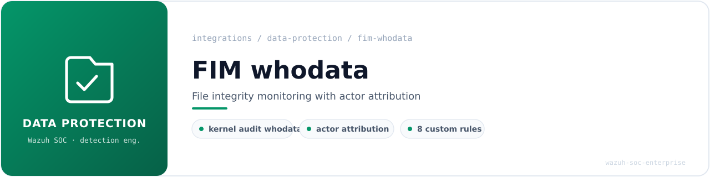
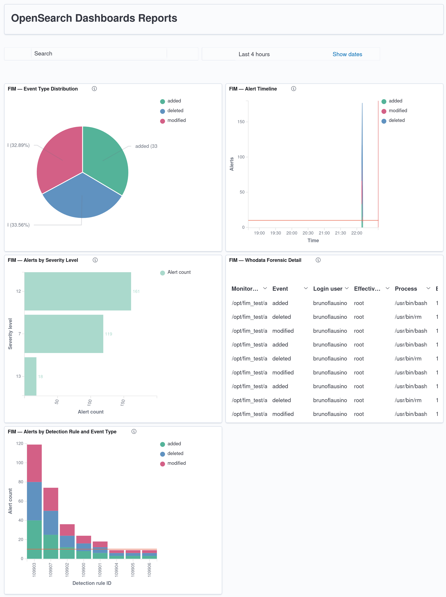

<!-- soc-banner -->
<p align="center"></p>

<p align="center">
   
</p>

# File Integrity Monitoring (whodata) — Wazuh Integration

| Field | Value |
|---|---|
| **Author** | Bruno Rubens Flausino Teixeira |
| **Version** | 1.0 — Validated whodata integration |
| **Validation date** | 2026-08-02 |
| **Environment** | Ubuntu 24.04.4 LTS — Bare metal — Wazuh all-in-one lab |
| **Wazuh version** | 4.14.7 |
| **Audit backend** | auditd 1:3.1.2-2.1build1.1 (whodata via kernel audit) |
| **Integration type** | Native Syscheck whodata with custom SOC rules |
| **Production rule file** | `/var/ossec/etc/rules/0912-fim_soc_rules.xml` |
| **Production rules** | 100900–100907 (8 rules) |
| **Validation rule file** | `0999-fim_test_rules.xml` (mirror rules, lab-only) |
| **Dashboard** | 5 panels — rule/event, event distribution, forensic table, timeline, severity |
| **Status** | Complete — whodata attribution confirmed — 298 validation alerts indexed |

---

## Table of Contents

1. [Executive Summary](#1-executive-summary)
2. [Architecture and Data Flow](#2-architecture-and-data-flow)
3. [Monitoring Tiers and Path Scope](#3-monitoring-tiers-and-path-scope)
4. [Prerequisites and Safety Backup](#4-prerequisites-and-safety-backup)
5. [Syscheck whodata Configuration](#5-syscheck-whodata-configuration)
6. [Custom Detection Rule Chain](#6-custom-detection-rule-chain)
7. [Tuning Decisions](#7-tuning-decisions)
8. [Configuration Validation](#8-configuration-validation)
9. [Why `wazuh-logtest` Does Not Apply to FIM](#9-why-wazuh-logtest-does-not-apply-to-fim)
10. [Detection Validation Exercise](#10-detection-validation-exercise)
11. [OpenSearch DevTools Verification](#11-opensearch-devtools-verification)
12. [Dashboard Visualizations](#12-dashboard-visualizations)
13. [Troubleshooting](#13-troubleshooting)
14. [Operational and Security Notes](#14-operational-and-security-notes)
15. [File Reference Summary](#15-file-reference-summary)
16. [References](#16-references)

---

## 1. Executive Summary

This document describes the installation, validation, and visualization methodology used to
integrate **Wazuh File Integrity Monitoring in whodata mode** on an Ubuntu 24.04 all-in-one SOC
lab running **Wazuh 4.14.7**.

The design uses native Wazuh functionality throughout:

- Native Syscheck in `whodata` mode, backed by the Linux kernel audit subsystem
- Custom SOC rules layered on the native `syscheck` rule group
- Content diffing (`report_changes`) on the highest-value paths
- Native Wazuh alert generation and Filebeat forwarding to the indexer
- OpenSearch Dashboard visualizations

No external parser or custom decoder is required. FIM events are produced internally by the
Syscheck engine; the integration adds **custom rules only**, matching on the native
`syscheck.*` fields the engine emits.

### What whodata adds over realtime

Standard realtime FIM answers *what changed and when*. Whodata additionally answers *who changed
it and with which process*, by correlating each filesystem event with the kernel audit record
that produced it. The result is that a change to a sensitive file arrives already attributed:

```
login_user: brunoflausino  →  effective_user: root  →  process: /usr/bin/tee
```

This login-to-effective user chain is the core forensic value of the integration. It converts a
bare "file X was modified" alert into "user *brunoflausino* modified file X as *root* using
*process Y*", which is the difference between an alert an analyst must investigate from scratch
and one that already contains the attribution.

### Validated Results

| Validation item | Result |
|---|---:|
| Production rule family deployed | 100900–100907 (8 rules) |
| Monitoring tiers configured | 4 (baseline, tier 2, tier 1 whodata, staging) |
| whodata attribution confirmed | `login_user` → `effective_user` → `process` |
| Detection validation exercise | mirror rules 109900–109907 |
| Validation source files | 100 (create → modify → delete each) |
| Indexed validation alerts | 298 |
| Event types represented | added / modified / deleted |
| Severity levels represented | 7, 12, 13 |
| Dashboard panels | 5 |

---

## 2. Architecture and Data Flow

### 2.1 Validated Architecture

```
┌─────────────────────────────────────────────────────────────────────┐
│ Monitored filesystem paths (tier 1 = whodata, others = realtime)     │
│   /etc/sudoers · /etc/ssh · /root/.ssh · cron · systemd · /etc/audit │
└───────────────┬─────────────────────────────────────────────────────┘
                │ inotify (realtime) + kernel audit records (whodata)
                ▼
┌─────────────────────────────────────────────────────────────────────┐
│ Linux kernel audit subsystem (auditd)                                │
│   Supplies syscall context: login uid, effective uid, process        │
└───────────────┬─────────────────────────────────────────────────────┘
                │ audit event correlated to the file change
                ▼
┌─────────────────────────────────────────────────────────────────────┐
│ wazuh-syscheckd — computes change, attaches syscheck.audit.* fields  │
└───────────────┬─────────────────────────────────────────────────────┘
                │ FIM event (engine-internal, JSON)
                ▼
┌─────────────────────────────────────────────────────────────────────┐
│ wazuh-analysisd — matches native syscheck group + custom SOC rules   │
│   0912-fim_soc_rules.xml → rules 100900–100907                       │
└───────────────┬─────────────────────────────────────────────────────┘
                │ alert
                ▼
┌─────────────────────────────────────────────────────────────────────┐
│ Filebeat → Wazuh Indexer (OpenSearch) → Dashboards                   │
└─────────────────────────────────────────────────────────────────────┘
```

### 2.2 Component Responsibilities

| Component | Responsibility |
|---|---|
| auditd / kernel audit | Supplies the syscall-level actor context (login uid, euid, process) |
| `wazuh-syscheckd` | Watches paths, computes the change, attaches `syscheck.audit.*` |
| `wazuh-analysisd` | Applies native `syscheck` rules and the custom SOC rules on top |
| Filebeat / Indexer | Forwards and stores alerts |
| Dashboards | Presents alert volume, distribution, timeline, and forensic detail |

### 2.3 Why whodata Depends on auditd

Whodata is not a Wazuh-only feature. Syscheck registers audit rules with the kernel and reads
the resulting records to attribute each change. If auditd is absent, misconfigured, or its rules
are flushed, whodata silently degrades to realtime and the `syscheck.audit.*` fields are absent.
The presence of those fields on an alert is therefore also a health signal for the audit path
itself.

---

## 3. Monitoring Tiers and Path Scope

Paths are grouped by value, and the monitoring mode is chosen per tier. Only the highest-value
paths carry the cost of whodata and content diffing.

| Tier | Paths | Mode | Diff |
|---|---|---|---|
| Baseline | `/etc` | realtime | no |
| Tier 2 | `/usr/bin`, `/usr/sbin`, `/bin`, `/sbin`, `/boot` | realtime | no |
| Tier 1 | `sudoers`, `sudoers.d`, `pam.d`, `ssh`, `root/.ssh`, cron (all), `systemd/system`, `/etc/audit`, `/var/ossec/etc` | **whodata** | **yes** |
| Staging | `/tmp/malware_samples` | realtime | yes |

The rationale is cost control. Whodata carries kernel-audit overhead and content diffing carries
storage and CPU overhead; both are reserved for the paths where *who* and *what exactly changed*
justify the cost — the files an attacker touches to establish persistence, escalate privilege,
or disable defenses.

---

## 4. Prerequisites and Safety Backup

### 4.1 Verify the Environment

```bash
grep VERSION= /etc/os-release
/var/ossec/bin/wazuh-control info | head -3
systemctl is-active auditd
auditctl -s | grep -E 'enabled|pid'
```

Expected: Ubuntu 24.04.x, Wazuh 4.14.7, auditd active with a live PID.

### 4.2 Confirm auditd Is Present and Running

Whodata requires a running audit backend. Confirm before configuring Syscheck:

```bash
dpkg -l | grep auditd
systemctl status auditd --no-pager | head -5
```

### 4.3 Create a Timestamped Backup Before Any Edit

Per lab convention, every configuration file is backed up with a timestamp before modification.

```bash
TS=$(date +%Y%m%d_%H%M%S)
sudo cp /var/ossec/etc/ossec.conf /var/ossec/backup/ossec.conf.bak.${TS}
sudo cp /var/ossec/etc/rules/0912-fim_soc_rules.xml \
        /var/ossec/backup/rules-bak/0912-fim_soc_rules.xml.bak.${TS} 2>/dev/null
echo "Backups written with suffix .bak.${TS}"
```

---

## 5. Syscheck whodata Configuration

The tier 1 directories are declared with `whodata="yes"` and `report_changes="yes"` inside the
`<syscheck>` block of `ossec.conf`. Realtime tiers omit `whodata`.

```xml
<!-- Tier 1 — whodata + content diffing -->
<directories check_all="yes" whodata="yes" report_changes="yes" realtime="yes">/etc/sudoers,/etc/sudoers.d,/etc/pam.d</directories>
<directories check_all="yes" whodata="yes" report_changes="yes" realtime="yes">/etc/ssh,/root/.ssh</directories>
<directories check_all="yes" whodata="yes" report_changes="yes" realtime="yes">/etc/cron.d,/etc/cron.daily,/etc/cron.hourly,/etc/cron.weekly,/etc/cron.monthly,/etc/crontab,/etc/systemd/system</directories>
<directories check_all="yes" whodata="yes" report_changes="yes" realtime="yes">/etc/audit,/var/ossec/etc</directories>
```

### 5.1 Ignore Rules

Package management and Wazuh's own runtime writes generate benign churn in monitored paths.
These are suppressed at the Syscheck layer:

```xml
<ignore type="sregex">\.dpkg-new$|\.dpkg-old$|\.dpkg-dist$|\.dpkg-tmp$|\.ucf-new$|\.ucf-old$</ignore>
<ignore>/var/ossec/etc/shared/ar.conf</ignore>
<ignore type="sregex">^/var/ossec/etc/.*\.bak\.</ignore>
```

The `.dpkg-*` and `.ucf-*` patterns cover the temporary files `apt`/`dpkg` create during package
installation. The `ar.conf` and `.bak.` ignores suppress churn generated by Wazuh's own active
response configuration and by the timestamped backups this lab writes into `/var/ossec/etc`.

### 5.2 VirusTotal Scoping

The VirusTotal integration block is scoped to level 12 so that only high-severity FIM alerts
consume the free-tier hash-lookup quota:

```xml
<level>12</level>
```

Without this scope, every low-severity binary-path change (see §7) would trigger a VirusTotal
lookup and exhaust the daily quota on noise.

---

## 6. Custom Detection Rule Chain

The custom rules live in `/var/ossec/etc/rules/0912-fim_soc_rules.xml` and match on the native
`syscheck` group. Each rule is scoped to a path tier and carries the relevant ATT&CK technique.

### 6.1 Rule Matrix

| ID | Level | Scope | ATT&CK |
|---|:---:|---|---|
| 100900 | 12 | `/etc/sudoers`, `/etc/sudoers.d/`, `/etc/pam.d/` | T1548.003, T1098 |
| 100901 | 12 | `/etc/ssh/`, `/root/.ssh/` | T1098.004, T1563.001 |
| 100902 | 12 | cron paths, `/etc/systemd/system/` | T1053.003, T1543.002 |
| 100903 | **7** | `/bin`, `/sbin`, `/usr/bin`, `/usr/sbin` | T1554 |
| 100904 | 12 | `/boot/` | T1542 |
| 100905 | 13 | `/var/ossec/etc/` | T1562.001 |
| 100906 | 13 | `/etc/audit/` | T1562.001 |
| 100907 | 12 | `/tmp/malware_samples/` | T1204.002 |

### 6.2 MITRE ATT&CK Mapping

The rule family covers ten techniques across four tactics:

| Tactic | Techniques |
|---|---|
| Privilege Escalation | T1548.003 (sudo/sudoers) |
| Persistence | T1098, T1098.004, T1563.001, T1053.003, T1543.002 |
| Defense Evasion | T1554, T1542, T1562.001 |
| Execution | T1204.002 |

Two techniques (T1098 and T1562.001) also appear in other integrations in this repository; the
coverage matrix counts each technique once to avoid double-counting.

---

## 7. Tuning Decisions

Two decisions in the rule matrix above are deliberate and worth recording, because both come
from a real event on the live host rather than from theory.

### 7.1 Rule 100903 Lowered to Level 7

On 2026-08-02 a single `apt install` generated **438 level-12 alerts** against `/usr/bin`. The
cause is structural: **FIM cannot distinguish package management from an attacker** — both write
to `/usr/bin` as root, and the whodata attribution for an `apt`-driven change is legitimately
`root` via `dpkg`. There is no field that cleanly separates the two at the FIM layer.

Rather than accept a permanent flood of high-severity alerts on every system update, rule 100903
(the binary-path tier) was lowered from level 12 to **level 7**. Binary-path changes remain
recorded and searchable, but they no longer escalate on routine maintenance. This is a
documented acceptance of reduced sensitivity on one tier in exchange for a usable alert stream.

### 7.2 Rule 100907 Added to Preserve VirusTotal Scanning

Lowering 100903 to level 7 had a side effect: because the VirusTotal integration is scoped to
level 12 (§5.2), hash scanning of files staged for analysis in `/tmp/malware_samples` would no
longer trigger. Rule **100907** (level 12) was therefore added specifically for the staging
path, restoring VirusTotal coverage on samples under examination without reintroducing the
binary-path noise.

The pair of decisions illustrates the general FIM tuning problem: severity is a shared budget,
and lowering one noisy source can silently disable a downstream enrichment scoped to that
severity. The fix is to re-express the intent (scan staged samples) as its own narrowly scoped
rule rather than to widen the noisy one.

---

## 8. Configuration Validation

### 8.1 Test the Analysis Configuration

```bash
sudo /var/ossec/bin/wazuh-analysisd -t
```

Expected: clean load. Three pre-existing warnings (OSINT CDB list missing → rules 113101/113103
ignored) are unrelated to FIM and are tracked separately.

### 8.2 Restart and Verify Service State

```bash
sudo systemctl restart wazuh-manager
sleep 15
sudo /var/ossec/bin/wazuh-control status | grep -E 'analysisd|syscheck'
```

Expected: both `wazuh-analysisd` and `wazuh-syscheckd` running.

### 8.3 Confirm whodata Attribution on a Real Change

The definitive test is that a real change to a monitored file arrives with populated
`syscheck.audit.*` fields:

```bash
sudo grep '"path":"/etc/sudoers.d/' /var/ossec/logs/alerts/alerts.json | tail -1 \
  | python3 -c "import json,sys; a=json.loads(sys.stdin.read()); au=a['syscheck']['audit']; \
print('login:', au['login_user']['name'], '| euid:', au['effective_user']['name'], \
'| proc:', au['process']['name'])"
```

Expected output shape: `login: brunoflausino | euid: root | proc: /usr/bin/...`

---

## 9. Why `wazuh-logtest` Does Not Apply to FIM

Every other integration guide in this portfolio validates its rules with `wazuh-logtest`. FIM is
the exception, and the reason is technical rather than a gap.

`wazuh-logtest` feeds a **log line** through the decode-then-match pipeline. FIM events are not
log lines: they are **engine-internal events** produced by `wazuh-syscheckd` after it computes a
change, already structured, never passing through the text decoders that `logtest` exercises.

When a synthetic FIM-shaped JSON string is pasted into `wazuh-logtest`, the tool decodes it with
the **generic `json` decoder** and stops. It reaches **Phase 2 (decoding)** but never **Phase 3
(rule matching)** against the syscheck rules, because those rules match on `if_group>syscheck`,
a group the generic `json` decoder never assigns. The result looks like a decode success with no
rule hit, which is misleading.

**The correct validation for FIM is a real filesystem change**, observed end-to-end in
`alerts.json` and the indexer — which is exactly what §8.3 and §10 do. This is recorded here as a
methodological finding so that a reviewer does not mistake the absence of a `logtest` transcript
for missing validation.

---

## 10. Detection Validation Exercise

### 10.1 Purpose and Honesty Statement

> **Nature of this exercise.** The dashboard in §12 is populated by a **detection validation
> exercise**, not by production incident traffic. To exercise all eight FIM rules and produce a
> statistically meaningful dashboard without writing to real system files, a set of **mirror
> rules (109900–109907)** was created against a dedicated, isolated test tree at `/opt/fim_test/`.
> The mirror rules inherit the level and ATT&CK mapping of the production rules (100900–100907)
> they shadow, but match only on the test paths. This keeps the production rule corpus and the
> real system configuration completely untouched while still generating genuine whodata-attributed
> FIM events. The telemetry is real; the *target* is a test fixture. No production file was
> modified to produce this data.

### 10.2 Mirror Configuration

A dedicated `<directories>` block monitors `/opt/fim_test/` in whodata mode, and a separate rule
file (`0999-fim_test_rules.xml`) holds the eight mirror rules. Both are lab-only artifacts and
are **not** part of the production rule corpus counted in `METRICS.md`.

Mirror rule fields use `type="pcre2"` so that grouped alternation on the test paths parses
correctly — plain OS-regex rejects the capture-group syntax:

```xml
<rule id="109900" level="12">
  <if_group>syscheck</if_group>
  <field name="file" type="pcre2">^/opt/fim_test/(sudoers\.d|pam\.d)</field>
  <description>[FIMTEST] Sudoers/PAM mirror change (mirrors 100900)</description>
  <mitre><id>T1548.003</id><id>T1098</id></mitre>
</rule>
```

### 10.3 Telemetry Generation

A benign generator wrote 100 files across the eleven test directories, each through a full
create → modify → delete lifecycle, running as root so whodata captures the escalation chain:

```bash
for i in $(seq 1 "$n"); do
  f="$BASE/$dir/fimtest_${dir}_${i}.conf"
  echo "# fimtest artifact $i" > "$f"   # CREATE
  echo "modified=$RANDOM"     >> "$f"   # MODIFY
  rm -f "$f"                            # DELETE
done
```

### 10.4 Results

| Dimension | Result |
|---|---|
| Source files | 100 |
| Indexed alerts | 298 |
| By event | added 100 · modified 98 · deleted 100 |
| By severity | level 12 → 161 · level 7 → 119 · level 13 → 18 |
| Effective user | `root` (100%) |
| Login user | `brunoflausino` (100%) |
| Process | `/usr/bin/bash` (writes) · `/usr/bin/rm` (deletes) |

The two "missing" `modified` events (98 rather than 100) are benign engine coalescing — a
create and modify inside the same scan cycle are occasionally reported as one change.

### 10.5 Cleanup

The exercise is fully reversible. The mirror rule file, the `/opt/fim_test/` tree, and the test
`<directories>` block are removed and the manager restarted, returning the host to its
production configuration.

---

## 11. OpenSearch DevTools Verification

Before building visualizations, each aggregation was validated directly against the index. The
common filter isolates the exercise rules:

```
GET wazuh-alerts-*/_search
{
  "size": 0,
  "query": { "range": { "rule.id": { "gte": 109900, "lte": 109907 } } },
  "aggs": { "por_regra": { "terms": { "field": "rule.id", "size": 8 } } }
}
```

### 11.1 Confirmed Keyword Field Mapping

All fields used by the dashboard aggregate as `keyword` without a `.keyword` suffix, confirmed
across the daily indices:

| Field | Type |
|---|---|
| `rule.id` | keyword |
| `syscheck.event` | keyword |
| `syscheck.path` | keyword |
| `syscheck.audit.login_user.name` | keyword |
| `syscheck.audit.effective_user.name` | keyword |
| `syscheck.audit.process.name` | keyword |

### 11.2 Verified Counts

The DevTools aggregations returned exactly the values later shown on the dashboard: 298 total,
the eight-rule distribution (109903 → 119, 109907 → 74, 109902 → 36, 109900 → 24, 109901 → 18,
109904/109905/109906 → 9 each), and the three-way event split (added 100, deleted 100,
modified 98).

---

## 12. Dashboard Visualizations

### 12.1 Dashboard Scope

The dashboard, **"FIM Whodata — File Integrity Monitoring Detection Overview"**, presents the
validation telemetry across five panels. Every panel carries the filter
`rule.groups: "fim_test"` (equivalently `rule.id >= 109900 and rule.id <= 109907`) so it shows
only the exercise data.

### 12.2 Dashboard Overview



### 12.3 Panel Inventory

| Panel | Type | Aggregation |
|---|---|---|
| Alerts by Detection Rule and Event Type | Vertical bar (stacked) | X: `rule.id` · split: `syscheck.event` |
| Event Type Distribution | Pie | slices: `syscheck.event` |
| Whodata Forensic Detail | Data table | `syscheck.path` → `event` → `login_user` → `effective_user` → `process` |
| Alert Timeline | Area (date histogram) | X: `timestamp` · split: `syscheck.event` |
| Alerts by Severity Level | Horizontal bar | Y: `rule.level` |

### 12.4 Panel Notes

**Alerts by Detection Rule** confirms the intended volume profile: the binary-path and staging
tiers (109903, 109907) dominate, while the critical security-tool tiers (109905, 109906) are the
smallest bars — the realistic shape for a healthy environment.

**Whodata Forensic Detail** is the panel that demonstrates the integration's core value: every
row shows the `brunoflausino → root` escalation with the responsible process, `/usr/bin/bash` on
writes and `/usr/bin/rm` on deletions. The `syscheck.path` bucket is sized to 100 so all unique
files are represented rather than truncated.

**Alert Timeline** shows the generation run as a short, tall burst. For a cleaner presentation,
narrow the time picker to the run window and set the histogram interval to 30 seconds.

### 12.5 Dashboard Query Rule

Because each panel is saved with its own `rule.groups: "fim_test"` query, no dashboard-level
filter is required. If production FIM panels are later added to the same dashboard, apply the
filter at dashboard level instead of per panel.

---

## 13. Troubleshooting

### 13.1 `syscheck.audit.*` Fields Are Absent

The change was recorded but carries no actor attribution. Causes, in order of likelihood: the
directory is monitored in realtime rather than whodata; auditd is not running; or the audit
rules were flushed. Confirm the tier in `ossec.conf`, then `auditctl -s` and `systemctl status
auditd`. A change that predates whodata-watch installation (a catch-up event from the deployment
window) will also lack these fields and is benign — check the event timestamp against the
whodata engine start time in `ossec.log` before treating it as a gap.

### 13.2 Rule Fails to Load with "Syntax error on tag 'file'"

The `<field name="file">` regex uses grouped alternation `(a|b)` under the default OS-regex
engine, which does not support capture groups. Add `type="pcre2"` to the field, as in §10.2. A
malformed rule file causes `wazuh-analysisd -t` to fail and the manager not to start; remove or
fix the offending file and restart.

### 13.3 A Single `apt install` Floods FIM with Level-12 Alerts

Expected on the binary-path tier before tuning. This is the exact condition that led to lowering
rule 100903 to level 7 (§7.1). FIM cannot distinguish package management from an attacker at the
event level; the mitigation is the severity decision, not a filter.

### 13.4 VirusTotal Lookups Stop After Lowering a Rule

If a noisy rule scoped to level 12 is lowered, any VirusTotal scanning scoped to level 12 for
those paths stops with it. Re-express the scanning intent as its own level-12 rule for the
specific path, as done with rule 100907 for the staging directory (§7.2).

### 13.5 `wazuh-logtest` Shows a Decode but No Rule Hit for FIM

Not a fault. FIM events do not pass through the text decoders `logtest` exercises; see §9.
Validate with a real filesystem change instead.

### 13.6 Noise from `/var/ossec/etc/shared/ar.conf` on Rule 100905

Wazuh rewrites `ar.conf` as part of active-response bookkeeping, which the `/var/ossec/etc`
watch would otherwise flag. Suppressed by the `<ignore>` in §5.1; monitor the next window to
confirm the noise is gone.

---

## 14. Operational and Security Notes

- **Whodata health is observable.** The presence of `syscheck.audit.*` on alerts is both the
  forensic payload and a liveness signal for the audit path. Their sudden absence across all FIM
  alerts indicates an auditd or audit-rule problem, not quiet files.

- **Severity is a shared budget.** Downstream enrichments (VirusTotal here) are scoped by
  severity. Lowering a rule's level can silently disable enrichment scoped to the old level.
  Re-scope the enrichment explicitly rather than widening the rule.

- **FIM cannot attribute intent.** Whodata attributes *identity and process*, not *purpose*. A
  root-owned change via `dpkg` and a root-owned change via an attacker are indistinguishable at
  the FIM layer. Correlation with package-manager logs, change windows, or ticketing is what
  supplies intent.

- **The validation exercise is not production data.** The dashboard is labelled and scoped to the
  `fim_test` group precisely so that exercise telemetry is never mistaken for production alerts.

---

## 15. File Reference Summary

| Path | Role |
|---|---|
| `/var/ossec/etc/ossec.conf` | Syscheck tier definitions, ignores, VirusTotal scope |
| `/var/ossec/etc/rules/0912-fim_soc_rules.xml` | Production FIM rules 100900–100907 |
| `0999-fim_test_rules.xml` | Lab-only mirror rules 109900–109907 (validation) |
| `/opt/fim_test/` | Lab-only isolated test tree (validation, removed after) |
| `/var/ossec/logs/alerts/alerts.json` | End-to-end verification source |
| `/var/ossec/backup/` | Timestamped configuration backups |

---

## 16. References

- [Wazuh — File Integrity Monitoring](https://documentation.wazuh.com/current/user-manual/capabilities/file-integrity/index.html)
- [Wazuh — Who-data monitoring (auditd backend)](https://documentation.wazuh.com/current/user-manual/capabilities/file-integrity/who-data-monitoring.html)
- [Wazuh — Syscheck configuration reference](https://documentation.wazuh.com/current/user-manual/reference/ossec-conf/syscheck.html)
- [Wazuh — Custom rules and the `syscheck` group](https://documentation.wazuh.com/current/user-manual/ruleset/index.html)
- [Linux Audit — auditd and audit rules](https://man7.org/linux/man-pages/man8/auditd.8.html)
- [MITRE ATT&CK — Techniques index](https://attack.mitre.org/techniques/enterprise/)

---

### Author

**Bruno Rubens Flausino Teixeira**<br>
*Wazuh SOC Enterprise Lab — Data Protection & File Integrity Monitoring*

---

<sub>
<b>Navigation</b> &nbsp;
<a href="../../README.md">Portfolio home</a> &nbsp;&middot;&nbsp;
<a href="README.md">Data Protection</a> &nbsp;&middot;&nbsp;
<a href="../README.md">All integrations</a> &nbsp;&middot;&nbsp;
<a href="../../detection-coverage/attack-coverage.md">Detection coverage</a> &nbsp;&middot;&nbsp;
<a href="../../playbooks/README.md">SOC playbooks</a> &nbsp;&middot;&nbsp;
<a href="../../METRICS.md">Metrics</a>
<br><br>
Validated in a single-workstation lab. Each guide records the versions it was validated
against; see <a href="../../README.md#lab-status">lab status</a>.
</sub>
