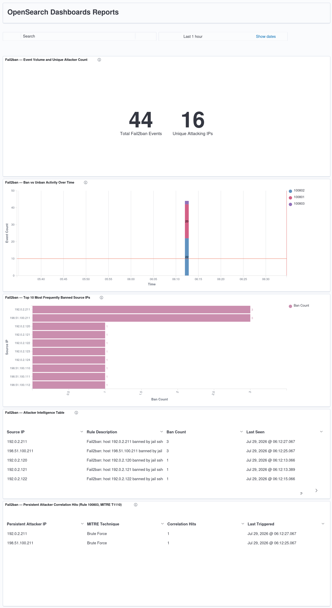

# Fail2ban Integration with Wazuh SIEM

Complete integration of Fail2ban intrusion prevention into a Wazuh 4.14.6 SOC platform: custom decoders, custom detection rules with MITRE ATT&CK mapping, brute-force correlation, synthetic event validation, and a dedicated OpenSearch dashboard.

**Platform:** Ubuntu 24.04 LTS · Wazuh 4.14.6 (single-node, bare metal) · Fail2ban 1.0.2
**Log source:** `/var/log/fail2ban.log`
**MITRE ATT&CK:** T1110 (Brute Force) — Credential Access tactic
**Rule IDs:** 100800–100803 (custom, no collision with existing ruleset)

---

## Table of Contents

1. [Architecture](#architecture)
2. [Installation](#installation)
3. [Fail2ban Configuration](#fail2ban-configuration)
4. [Wazuh Log Collection](#wazuh-log-collection)
5. [Custom Decoder](#custom-decoder)
6. [Custom Detection Rules](#custom-detection-rules)
7. [Validation with wazuh-logtest](#validation-with-wazuh-logtest)
8. [Configuration Validation with wazuh-analysisd](#configuration-validation-with-wazuh-analysisd)
9. [Synthetic Event Generation](#synthetic-event-generation)
10. [Indexing Verification via DevTools](#indexing-verification-via-devtools)
11. [Dashboard](#dashboard)
12. [Engineering Notes and Lessons Learned](#engineering-notes-and-lessons-learned)

---

## Architecture

The integration follows the standard Wazuh log-analysis pipeline:

```
Fail2ban (sshd jail)
   │  writes NOTICE events
   ▼
/var/log/fail2ban.log
   │  read by
   ▼
wazuh-logcollector  ──►  wazuh-analysisd
                              │  Phase 1: pre-decoding
                              │  Phase 2: custom decoder (fail2ban, fail2ban-action)
                              │  Phase 3: custom rules (100800–100803)
                              ▼
                        /var/ossec/logs/alerts/alerts.json
                              │  shipped by
                              ▼
                         Filebeat 7.10.2
                              │
                              ▼
                    OpenSearch Indexer (wazuh-alerts-4.x-*)
                              │
                              ▼
                    OpenSearch Dashboards (Visualize + Dashboard)
```

Fail2ban is not a first-party Wazuh integration — there is no built-in decoder or ruleset shipped with Wazuh for it. The following confirms the absence of any pre-existing Fail2ban ruleset on the manager:

```console
$ sudo grep -rl 'fail2ban' /var/ossec/ruleset/decoders/ /var/ossec/ruleset/rules/ 2>/dev/null
$ 
```

Both the decoder and the rules in this document are therefore custom and self-authored.

---

## Installation

Fail2ban was installed from the Ubuntu Noble repositories:

```bash
sudo apt update && sudo apt install -y fail2ban
```

Installed version:

```console
$ fail2ban-client --version
Fail2Ban v1.0.2
```

Enable and start the service:

```bash
sudo systemctl enable --now fail2ban
```

Service status after start:

```console
$ sudo systemctl status fail2ban
● fail2ban.service - Fail2Ban Service
     Loaded: loaded (/usr/lib/systemd/system/fail2ban.service; enabled; preset: enabled)
     Active: active (running)
       Docs: man:fail2ban(1)
   Main PID: 13942 (fail2ban-server)
      Tasks: 5 (limit: 34756)
     Memory: 32.1M (peak: 33.1M)
     CGroup: /system.slice/fail2ban.service
             └─13942 /usr/bin/python3 /usr/bin/fail2ban-server -xf start

fail2ban-server[13942]: Server ready
```

---

## Fail2ban Configuration

Configuration uses a local override file so that package upgrades never clobber custom settings. The main `jail.conf` is never edited directly.

**File:** `/etc/fail2ban/jail.local`

```ini
[DEFAULT]
bantime  = 3600
findtime = 600
maxretry = 5
backend  = systemd
banaction = iptables-multiport

[sshd]
enabled  = true
port     = ssh
filter   = sshd
logpath  = /var/log/auth.log
maxretry = 3
bantime  = 7200
```

Configuration notes:

- `backend = systemd` reads authentication events from the systemd journal.
- `banaction = iptables-multiport` applies bans via iptables.
- The `[sshd]` jail is tuned more strictly than the default (`maxretry = 3`, `bantime = 7200`) because SSH is the primary attack surface.

Apply the configuration:

```bash
sudo systemctl restart fail2ban
```

Verify the jail is active:

```console
$ sudo fail2ban-client status sshd
Status for the jail: sshd
|- Filter
|  |- Currently failed: 0
|  |- Total failed:     0
|  `- Journal matches:  _SYSTEMD_UNIT=sshd.service + _COMM=sshd
`- Actions
   |- Currently banned: 0
   |- Total banned:     0
   `- Banned IP list:
```

---

## Wazuh Log Collection

Fail2ban writes its own log file at `/var/log/fail2ban.log`. Wazuh must be told to monitor it. A dedicated `<localfile>` block was added to the manager configuration.

**File:** `/var/ossec/etc/ossec.conf` (appended block)

```xml
<ossec_config>
  <localfile>
    <log_format>syslog</log_format>
    <location>/var/log/fail2ban.log</location>
  </localfile>
</ossec_config>
```

Restart the manager to load the new log source:

```bash
sudo systemctl restart wazuh-manager
```

Confirm the log collector is monitoring the file:

```console
$ sudo grep -i 'fail2ban.log' /var/ossec/logs/ossec.log | tail -1
wazuh-logcollector: INFO: (1950): Analyzing file: '/var/log/fail2ban.log'.
```

> **Important operational detail:** the Wazuh log collector begins reading a monitored file from its **end** (tail) when the service starts. Any events written to the file before the manager finished starting are never processed. When generating synthetic test events, always ensure `wazuh-manager` is fully started first.

---

## Custom Decoder

Fail2ban's native log format is:

```
2026-07-29 06:12:22,236 fail2ban.actions        [1761]: NOTICE  [sshd] Ban 198.51.100.211
```

The Wazuh pre-decoder consumes the leading `<timestamp> fail2ban.<module>` portion as if it were a syslog header, leaving the decoder to operate on the tail beginning at `[pid]: NOTICE ...`. For this reason the decoder patterns anchor on `NOTICE` and the bracketed jail, **not** on the word `fail2ban`.

**File:** `/var/ossec/etc/decoders/local_fail2ban_decoders.xml`

```xml
<!-- Fail2ban native logfile decoder (/var/log/fail2ban.log) -->

<decoder name="fail2ban">
  <prematch>NOTICE</prematch>
</decoder>

<decoder name="fail2ban-action">
  <parent>fail2ban</parent>
  <regex type="pcre2">\[(\S+)\]\s+(Ban|Unban)\s+(\d+\.\d+\.\d+\.\d+)</regex>
  <order>jail, f2b_action, srcip</order>
</decoder>
```

Extracted fields:

| Field | Meaning | Example |
|---|---|---|
| `jail` | Fail2ban jail that fired | `sshd` |
| `f2b_action` | Action taken | `Ban` / `Unban` |
| `srcip` | Banned source IP | `198.51.100.211` |

Apply correct ownership and permissions:

```bash
sudo chown wazuh:wazuh /var/ossec/etc/decoders/local_fail2ban_decoders.xml
sudo chmod 660 /var/ossec/etc/decoders/local_fail2ban_decoders.xml
```

---

## Custom Detection Rules

Four rules implement a layered detection: a silent grouping rule, a Ban rule, an Unban rule, and a frequency-based correlation rule that fires on repeated bans of the same IP.

**File:** `/var/ossec/etc/rules/local_fail2ban_rules.xml`

```xml
<group name="fail2ban,">

  <!-- Base: any decoded Fail2ban event (silent, level 0) -->
  <rule id="100800" level="0">
    <decoded_as>fail2ban</decoded_as>
    <description>Fail2ban messages grouped.</description>
  </rule>

  <!-- Ban -->
  <rule id="100801" level="6">
    <if_sid>100800</if_sid>
    <field name="f2b_action">^Ban$</field>
    <description>Fail2ban: host $(srcip) banned by jail $(jail)</description>
    <mitre>
      <id>T1110</id>
    </mitre>
    <group>authentication_failures,brute_force,</group>
  </rule>

  <!-- Unban -->
  <rule id="100802" level="3">
    <if_sid>100800</if_sid>
    <field name="f2b_action">^Unban$</field>
    <description>Fail2ban: host $(srcip) unbanned from jail $(jail)</description>
    <group>fail2ban,</group>
  </rule>

  <!-- Correlation: same IP banned 3 times in 10 minutes -->
  <rule id="100803" level="10" frequency="3" timeframe="600">
    <if_matched_sid>100801</if_matched_sid>
    <same_source_ip />
    <description>Fail2ban: repeated bans on $(srcip) - persistent attacker</description>
    <mitre>
      <id>T1110</id>
    </mitre>
    <group>brute_force,attack,</group>
  </rule>

</group>
```

Rule summary:

| Rule ID | Level | Trigger | MITRE | Purpose |
|---|---|---|---|---|
| 100800 | 0 | Any decoded Fail2ban event | — | Silent parent for grouping |
| 100801 | 6 | `f2b_action = Ban` | T1110 | Individual ban event |
| 100802 | 3 | `f2b_action = Unban` | — | Ban lifted / expired |
| 100803 | 10 | Same IP banned 3× in 600s | T1110 | Persistent brute-force attacker |

Apply correct ownership and permissions:

```bash
sudo chown wazuh:wazuh /var/ossec/etc/rules/local_fail2ban_rules.xml
sudo chmod 660 /var/ossec/etc/rules/local_fail2ban_rules.xml
```

---

## Validation with wazuh-logtest

Each rule was validated individually using `wazuh-logtest` before generating any live events. This confirms the decoder extracts the correct fields and the rules fire as designed.

### Ban event (rule 100801)

**Input:**

```
2026-07-26 15:09:21,427 fail2ban.actions        [13942]: NOTICE  [sshd] Ban 192.168.1.100
```

**Output:**

```
**Phase 1: Completed pre-decoding.
	full event: '2026-07-26 15:09:21,427 fail2ban.actions        [13942]: NOTICE  [sshd] Ban 192.168.1.100'
	timestamp: '2026-07-26 15:09:21,427'

**Phase 2: Completed decoding.
	name: 'fail2ban'
	f2b_action: 'Ban'
	jail: 'sshd'
	srcip: '192.168.1.100'

**Phase 3: Completed filtering (rules).
	id: '100801'
	level: '6'
	description: 'Fail2ban: host 192.168.1.100 banned by jail sshd'
	groups: '['fail2ban', 'authentication_failures', 'brute_force']'
	firedtimes: '1'
	mail: 'False'
	mitre.id: '['T1110']'
	mitre.tactic: '['Credential Access']'
	mitre.technique: '['Brute Force']'
**Alert to be generated.
```

### Unban event (rule 100802)

**Input:**

```
2026-07-26 15:22:49,234 fail2ban.actions        [13942]: NOTICE  [sshd] Unban 192.168.1.100
```

**Output:**

```
**Phase 2: Completed decoding.
	name: 'fail2ban'
	f2b_action: 'Unban'
	jail: 'sshd'
	srcip: '192.168.1.100'

**Phase 3: Completed filtering (rules).
	id: '100802'
	level: '3'
	description: 'Fail2ban: host 192.168.1.100 unbanned from jail sshd'
	groups: '['fail2ban', 'fail2ban']'
	firedtimes: '1'
	mail: 'False'
**Alert to be generated.
```

### Correlation (rule 100803)

Pasting the same Ban event three times within one logtest session triggers the frequency-based correlation on the third occurrence:

**Output on the third Ban:**

```
**Phase 3: Completed filtering (rules).
	id: '100803'
	level: '10'
	description: 'Fail2ban: repeated bans on 192.168.1.100 - persistent attacker'
	groups: '['fail2ban', 'brute_force', 'attack']'
	firedtimes: '1'
	frequency: '3'
	mail: 'False'
	mitre.id: '['T1110']'
	mitre.tactic: '['Credential Access']'
	mitre.technique: '['Brute Force']'
**Alert to be generated.
```

All four rules validated: 100800 (silent grouping), 100801 (Ban, level 6), 100802 (Unban, level 3), 100803 (correlation, level 10).

---

## Configuration Validation with wazuh-analysisd

Before every manager restart, the ruleset was validated with the analysis daemon test mode:

```bash
sudo /var/ossec/bin/wazuh-analysisd -t
```

A clean result shows no errors referencing the Fail2ban files. The only warnings present are unrelated to this integration (a pre-existing missing OSINT CDB list):

```console
$ sudo /var/ossec/bin/wazuh-analysisd -t
wazuh-analysisd: WARNING: (1103): Could not open file 'etc/lists/osint/osint_ipv4_reputation' due to [(2)-(No such file or directory)].
wazuh-analysisd: WARNING: (7616): List 'etc/lists/osint/osint_ipv4_reputation' could not be loaded. Rule '113101' will be ignored.
wazuh-analysisd: WARNING: (7616): List 'etc/lists/osint/osint_ipv4_reputation' could not be loaded. Rule '113103' will be ignored.
```

> The `osint_ipv4_reputation` warnings are from a separate OSINT CDB integration and are unrelated to Fail2ban. They do not affect this pipeline.

Manager status after a successful restart:

```console
$ sudo systemctl status wazuh-manager
● wazuh-manager.service - Wazuh manager
     Loaded: loaded (/usr/lib/systemd/system/wazuh-manager.service; enabled; preset: enabled)
     Active: active (running)
    Process: ExecStart=/usr/bin/env /var/ossec/bin/wazuh-control start (code=exited, status=0/SUCCESS)
      Tasks: 443
     CGroup: /system.slice/wazuh-manager.service
             ├─ wazuh-analysisd
             ├─ wazuh-logcollector
             ├─ wazuh-remoted
             ├─ wazuh-syscheckd
             └─ ... (all daemons running)
```

---

## Synthetic Event Generation

To populate the dashboard and validate the full pipeline end-to-end, synthetic ban/unban events were generated using `fail2ban-client`. All IP addresses are from reserved documentation ranges (RFC 5737: `192.0.2.0/24`, `198.51.100.0/24`, `203.0.113.0/24`) and are therefore harmless.

**Script:** `scripts/fail2ban_event_storm.sh`

```bash
#!/bin/bash
# Fail2ban synthetic event generator for dashboard population and pipeline validation.
# All IPs are RFC 5737 documentation addresses (harmless).
JAIL="sshd"
IPS=(
  203.0.113.100 203.0.113.101 203.0.113.102 203.0.113.103 203.0.113.104
  198.51.100.110 198.51.100.111 198.51.100.112 198.51.100.113
  192.0.2.120 192.0.2.121 192.0.2.122 192.0.2.123 192.0.2.124
)

echo "=== Phase 1: Distributed bans (rule 100801) ==="
for ip in "${IPS[@]}"; do
  sudo fail2ban-client set "$JAIL" banip "$ip" >/dev/null 2>&1
  echo "  Ban $ip"; sleep 0.4
done
sleep 2

echo "=== Phase 2: Partial unbans (rule 100802) ==="
for ip in "${IPS[@]:0:7}"; do
  sudo fail2ban-client set "$JAIL" unbanip "$ip" >/dev/null 2>&1
  echo "  Unban $ip"; sleep 0.4
done
sleep 2

echo "=== Phase 3: Persistent attacker 1 (rule 100803) ==="
for i in 1 2 3 4; do
  sudo fail2ban-client set "$JAIL" banip 198.51.100.211 >/dev/null 2>&1
  echo "  Ban #$i 198.51.100.211"
  sudo fail2ban-client set "$JAIL" unbanip 198.51.100.211 >/dev/null 2>&1
  sleep 0.5
done

echo "=== Phase 4: Persistent attacker 2 (rule 100803) ==="
for i in 1 2 3 4; do
  sudo fail2ban-client set "$JAIL" banip 192.0.2.211 >/dev/null 2>&1
  echo "  Ban #$i 192.0.2.211"
  sudo fail2ban-client set "$JAIL" unbanip 192.0.2.211 >/dev/null 2>&1
  sleep 0.5
done
sleep 2

echo "=== Cleanup ==="
for ip in "${IPS[@]:7}"; do
  sudo fail2ban-client set "$JAIL" unbanip "$ip" >/dev/null 2>&1
done
```

Local alert verification immediately after the run:

```console
$ echo "100801: $(sudo grep -c '"id":"100801"' /var/ossec/logs/alerts/alerts.json)"
$ echo "100802: $(sudo grep -c '"id":"100802"' /var/ossec/logs/alerts/alerts.json)"
$ echo "100803: $(sudo grep -c '"id":"100803"' /var/ossec/logs/alerts/alerts.json)"
100801: 20
100802: 22
100803: 2
```

> **Fail2ban state caveat:** `fail2ban-client banip` only emits a `NOTICE Ban` event if the IP is not already in the ban list. Re-banning an already-banned IP produces an `already banned` INFO message (not decoded). When re-running the generator, use fresh IP addresses to guarantee new NOTICE events.

---

## Indexing Verification via DevTools

After the synthetic events were generated and Filebeat drained (~15–20s), the alerts were confirmed in the OpenSearch index using the Dev Tools console.

**Query — aggregate Fail2ban alerts by rule ID and source IP:**

```json
GET wazuh-alerts-*/_search
{
  "size": 0,
  "query": {
    "bool": {
      "filter": [
        { "term": { "rule.groups": "fail2ban" } },
        { "range": { "timestamp": { "gte": "now-30m" } } }
      ]
    }
  },
  "aggs": {
    "por_regra": { "terms": { "field": "rule.id" } },
    "por_ip":    { "terms": { "field": "data.srcip", "size": 20 } }
  }
}
```

**Response (abridged):**

```json
{
  "hits": { "total": { "value": 44, "relation": "eq" } },
  "aggregations": {
    "por_regra": {
      "buckets": [
        { "key": "100802", "doc_count": 22 },
        { "key": "100801", "doc_count": 20 },
        { "key": "100803", "doc_count": 2 }
      ]
    },
    "por_ip": {
      "buckets": [
        { "key": "192.0.2.211",    "doc_count": 8 },
        { "key": "198.51.100.211", "doc_count": 8 },
        { "key": "192.0.2.120",    "doc_count": 2 },
        { "key": "192.0.2.121",    "doc_count": 2 },
        { "key": "192.0.2.122",    "doc_count": 2 },
        { "key": "192.0.2.123",    "doc_count": 2 },
        { "key": "192.0.2.124",    "doc_count": 2 },
        { "key": "198.51.100.110", "doc_count": 2 },
        { "key": "198.51.100.111", "doc_count": 2 },
        { "key": "198.51.100.112", "doc_count": 2 },
        { "key": "198.51.100.113", "doc_count": 2 },
        { "key": "203.0.113.100",  "doc_count": 2 },
        { "key": "203.0.113.101",  "doc_count": 2 },
        { "key": "203.0.113.102",  "doc_count": 2 },
        { "key": "203.0.113.103",  "doc_count": 2 },
        { "key": "203.0.113.104",  "doc_count": 2 }
      ]
    }
  }
}
```

Results confirm the complete pipeline:

- **44 total alerts** indexed (20 bans + 22 unbans + 2 correlations).
- The two persistent attackers (`192.0.2.211`, `198.51.100.211`) each account for **8 documents** (4 bans + 4 unbans) and correctly triggered the level-10 correlation rule.
- The remaining 14 IPs each produced 2 documents (1 ban + 1 unban).

This end-to-end chain is proven: **Fail2ban → log file → logcollector → decoder → rules → analysisd → alerts.json → Filebeat → indexer → DevTools**.

---

## Dashboard

A dedicated OpenSearch dashboard was built to visualize the Fail2ban detection data. It comprises five panels.



### Panel inventory

| # | Panel | Chart type | Primary field(s) | Aggregation(s) |
|---|---|---|---|---|
| 1 | Event Volume and Unique Attacker Count | Metric | `data.srcip` | Count, Unique Count |
| 2 | Ban vs Unban Activity Over Time | Vertical Bar (stacked) | `timestamp`, `rule.id` | Count, Date Histogram, Terms |
| 3 | Top 10 Most Frequently Banned Source IPs | Horizontal Bar | `data.srcip` | Count, Terms |
| 4 | Attacker Intelligence Table | Data Table | `data.srcip`, `rule.description`, `timestamp` | Count, Terms, Top Hit |
| 5 | Persistent Attacker Correlation Hits | Data Table | `data.srcip`, `rule.mitre.technique`, `timestamp` | Count, Terms, Top Hit |

### Panel details

**Panel 1 — Event Volume and Unique Attacker Count (Metric)**
DQL: `rule.groups: "fail2ban"`
Metrics: Count (`Total Fail2ban Events`) and Unique Count of `data.srcip` (`Unique Attacking IPs`).
Result: 44 total events, 16 unique attacking IPs.

**Panel 2 — Ban vs Unban Activity Over Time (Vertical Bar, stacked)**
DQL: `rule.groups: "fail2ban"`
X-axis: Date Histogram on `timestamp`. Split series: Terms on `rule.id`.
The legend shows rule IDs — 100801 (Ban), 100802 (Unban), 100803 (correlation). The storm appears as a single stacked spike (22 unbans, 20 bans, 2 correlations).

**Panel 3 — Top 10 Most Frequently Banned Source IPs (Horizontal Bar)**
DQL: `rule.groups: "fail2ban" and rule.id: "100801"`
Y-axis: Terms on `data.srcip`, size 10. The two persistent attackers show a ban count of 3 each; the rest show 1.

**Panel 4 — Attacker Intelligence Table (Data Table)**
DQL: `rule.groups: "fail2ban" and rule.id: "100801"`
Columns: `Source IP`, `Rule Description`, `Ban Count`, `Last Seen` (Top Hit on `timestamp`). Provides per-IP drill-down with the jail name embedded in the rule description.

**Panel 5 — Persistent Attacker Correlation Hits (Data Table)**
DQL: `rule.id: "100803"`
Columns: `Persistent Attacker IP`, `MITRE Technique`, `Correlation Hits`, `Last Triggered`. Two rows — `192.0.2.211` and `198.51.100.211` — both mapped to `Brute Force` (T1110). This is the detection-engineering centerpiece: it surfaces correlated attack campaigns rather than isolated log events.

---

## Engineering Notes and Lessons Learned

**Decoder anchoring.** The Wazuh pre-decoder treats the leading `<timestamp> fail2ban.<module>` of each log line as a syslog header and strips it before the custom decoder runs. Decoders for Fail2ban's native format must therefore anchor on the tail of the line (after `[pid]:`), not on the literal string `fail2ban`. A prematch of `fail2ban` alone never matches.

**Log collector tail behavior.** `wazuh-logcollector` reads a monitored file from its end when the manager (re)starts. Synthetic events written before the manager finishes starting are silently skipped. Always confirm the manager is fully up before generating test events, and verify the `Analyzing file` timestamp in `ossec.log` precedes the event generation.

**Fail2ban internal state.** `fail2ban-client banip` is idempotent — it emits a `NOTICE Ban` only when the IP is not already banned. Repeated bans of the same IP produce an `already banned` INFO line that the decoder ignores. Synthetic test runs must use fresh IP addresses to guarantee new decodable events.

**Field naming vs. the dashboard.** The custom decoder emits `f2b_action` and `jail`. These are correctly decoded, alerted, and indexed, and are fully queryable in Dev Tools. However, the OpenSearch Dashboards Visualize field dropdown only lists fields defined in `wazuh-template.json`; custom field names are not selectable there. The dashboard panels therefore use the built-in `rule.id` field to distinguish Ban (100801) from Unban (100802) rather than `data.f2b_action`. This is a known Wazuh Visualize limitation and does not affect the underlying detection.

**No first-party ruleset.** Wazuh ships no built-in Fail2ban decoder or rules. The four rules and two decoders here are fully custom and were validated end-to-end.

---

## Files in This Integration

```
fail2ban/
├── README.md                              # this document
├── assets/
│   └── fail2ban-dashboard.png             # dashboard screenshot
├── decoders/
│   └── local_fail2ban_decoders.xml        # custom decoder
├── rules/
│   └── local_fail2ban_rules.xml           # custom rules 100800–100803
├── config/
│   ├── jail.local                         # Fail2ban jail configuration
│   └── ossec-localfile.xml                # Wazuh log collection block
└── scripts/
    └── fail2ban_event_storm.sh            # synthetic event generator
```
