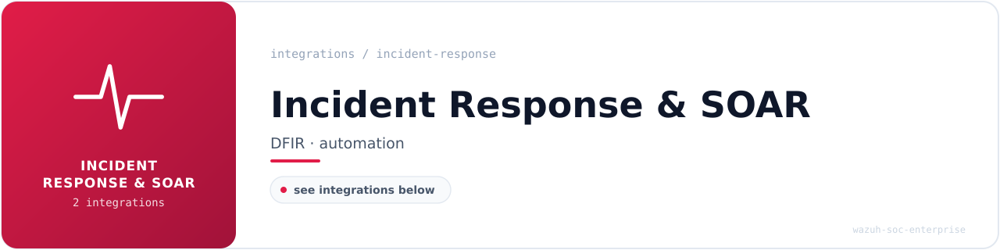

<!-- soc-banner -->

# Incident Response & Forensics Integrations

SIEM-integrated DFIR tooling for the Wazuh SOC Enterprise project. Each integration pipelines endpoint and forensic tool logs into Wazuh for real-time alerting, MITRE ATT&CK-mapped detection, and dashboard visualization.

## Tools Integrated

### Velociraptor DFIR

- **Status**: ✅ Integrated
- **Documentation**: [velociraptor-integration.md](velociraptor-integration.md)
- **Version**: v0.75.5 (standalone binary, self-signed SSL)
- **Purpose**: Endpoint visibility, artifact collection, and hunt orchestration via VQL
- **Wazuh Rules**: 100400–100419 (17 rules)
- **MITRE ATT&CK**: T1078, T1046, T1119, T1059, T1110, T1562
- **Dashboard**: 6 visualizations covering alert volume, rule distribution, MITRE coverage, severity, and principal activity

## Planned

The following tools are planned for future integration. Documentation and Wazuh rules will be added once each tool is deployed and validated on the host.

- **DFIR-IRIS** — incident case management platform
- **GRR Rapid Response** — remote live forensics
- **Shuffle SOAR** — security orchestration, automation, and response

---

*Part of the [Wazuh SOC Enterprise](https://github.com/brunoflausino/wazuh-soc-enterprise) portfolio project.*
