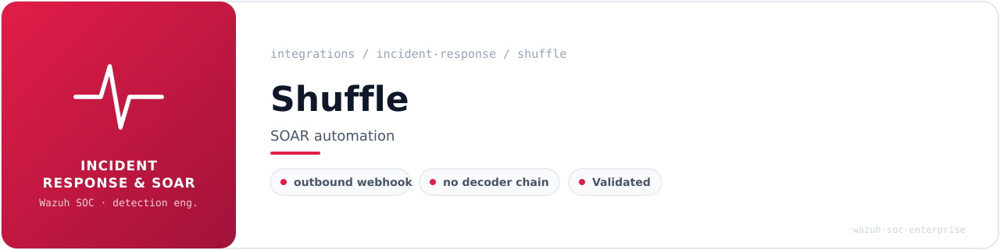

<!-- soc-banner -->
<p align="center"></p>

<p align="center">
   
</p>

# Shuffle SOAR Integration with Wazuh

**Tool:** Shuffle SOAR (Docker Compose stack, `/opt/shuffle`)
**Host:** flausino — Ubuntu 24.04 LTS (bare-metal Wazuh + Docker Shuffle)
**Wazuh:** v4.14.x all-in-one (manager + indexer + dashboard)
**Integration type:** Outbound — `wazuh-integratord` → Shuffle webhook (no custom decoder/rule chain)
**Category:** incident-response / SOAR
**Status:** Recovered, validated end-to-end, and stabilised (lab / portfolio)

---

## Table of Contents

1. [Overview](#overview)
2. [Architecture](#architecture)
3. [Environment](#environment)
4. [Discovery Phase (non-destructive)](#discovery-phase-non-destructive)
5. [Shuffle Startup](#shuffle-startup)
6. [Backend Datastore Fix](#backend-datastore-fix)
7. [Manual Webhook Validation](#manual-webhook-validation)
8. [Wazuh Integration Activation](#wazuh-integration-activation)
9. [End-to-End Validation](#end-to-end-validation)
10. [Flood Control & Volume Tuning](#flood-control--volume-tuning)
11. [Backlog Investigation](#backlog-investigation)
12. [Final Stable State](#final-stable-state)
13. [Rollback Strategy](#rollback-strategy)
14. [Recommended Production Filter](#recommended-production-filter)
15. [Security Notes](#security-notes)

---

## Overview

[Shuffle](https://shuffler.io/) is an open-source SOAR (Security Orchestration, Automation and Response) platform. This integration sends Wazuh alerts to a Shuffle workflow over an HTTP webhook, so detections can trigger automated playbooks.

Unlike the log-ingestion integrations in this repository (Suricata, Zeek, Cowrie, etc.), Shuffle is an **outbound** integration: Wazuh's `wazuh-integratord` posts alert JSON to a Shuffle webhook. There is **no custom decoder or rule chain** — alert selection is controlled entirely by the `<integration>` block in `ossec.conf` (by alert level and, optionally, group/rule).

This document records the full methodology used to **recover, validate and stabilise** an existing Shuffle deployment that was installed but not running, including the data-consistency fix, manual webhook validation, Wazuh activation, and the alert-flood containment that followed.

---

## Architecture

```
Wazuh Manager (bare metal)
        │  alert level >= threshold
        ▼
wazuh-integratord  ──►  Shuffle integration  ──►  POST /api/v1/hooks/webhook_<redacted>
                                                            │
                                                            ▼
                                          Shuffle backend (Docker, :5001)
                                                            │
                                                            ▼
                                       Workflow "Wazuh Alert Webhook Shuffle"
                                       (ID 3463a2cd-…-317baec9bf2d) → playbook
```

Supporting Shuffle services (Docker Compose under `/opt/shuffle`):

- `shuffle-frontend` — UI, HTTP `3001`, HTTPS `3443`
- `shuffle-backend` — API + webhook receiver, `5001`
- `shuffle-opensearch` — Shuffle's **internal** OpenSearch, `9202` (kept off `9200` so it never collides with the Wazuh Indexer)
- `shuffle-orborus` — execution worker

---

## Environment

| Component | Where | Port(s) |
| --- | --- | --- |
| Wazuh Manager / Indexer / Dashboard | bare metal (host) | Indexer `9200` |
| Shuffle frontend | Docker | `3001` (HTTP), `3443` (HTTPS) |
| Shuffle backend / webhook | Docker | `5001` (UI hook proxied via `3001`) |
| Shuffle internal OpenSearch | Docker | `9202` |

Wazuh config touched: `/var/ossec/etc/ossec.conf`
Logs reviewed: `/var/ossec/logs/ossec.log`, `/var/ossec/logs/integrations.log`, `/var/ossec/logs/alerts/alerts.json`, and `docker logs shuffle-backend`.

---

## Discovery Phase (non-destructive)

The Shuffle deployment was inspected **without changing anything** first, following the lab's standing rule: never modify Wazuh before the downstream system is validated independently.

```bash
cd /opt/shuffle
docker compose config --services     # backend, opensearch, frontend, orborus
docker compose ps -a                 # no containers running yet
docker images | grep -Ei 'shuffle|orborus|opensearch'
ss -lntup | grep -E '(:3001|:3443|:5001|:9202)\b'   # no listeners → safe to start
```

Pre-start safety checklist (all passed): no port conflicts on `3001/3443/5001/9202`, `vm.max_map_count=262144`, Docker daemon active, `docker compose config --quiet` valid, and the old Wazuh→Shuffle block in `ossec.conf` still commented out.

---

## Shuffle Startup

A full backup was taken **before** starting the stack:

```bash
sudo tar -czf /opt/shuffle.backup.pre-start.$(date +%Y%m%d_%H%M%S).tar.gz -C /opt shuffle
```

```bash
cd /opt/shuffle
docker compose pull
docker compose up -d
docker compose ps -a
```

`shuffle-backend`, `shuffle-frontend`, `shuffle-opensearch` and `shuffle-orborus` came up, listeners appeared on `3001/3443/5001/9202`, and the UI returned `HTTP/1.1 200 OK`. Shuffle's internal OpenSearch reported **yellow** cluster health — expected and acceptable on a single node (primary shards active; replicas unassignable without a second node).

---

## Backend Datastore Fix

After startup the backend logged a repeating warning for a missing "protected" datastore category document:

```
datastore_category_<org_id>_protected
missing id: 53482773-ec8f-c7fa-390b-94a6a5c4e393
queried index: datastore_category-000001  → "found": false
```

A valid category document for the same org already existed, confirming the index/org were fine and only one document was missing. Instead of resetting Shuffle, a **surgical fix** was applied (after backing up the index): the missing document was created with the expected ID and a minimal structure (`category: "protected"`, `automations: null`, `settings: {timeout: 0, public: false}`). After restarting **only** the backend, a new-log-only check showed **0** new datastore warnings — loop resolved.

> Access recovery note: the existing admin user (`brunoflausino@hotmail.com`) had an unknown password. A temporary recovery user (`brunoflausino.recovery@local`) was created to regain access; the temporary password was intentionally **not** recorded and was changed immediately from the UI.

---

## Manual Webhook Validation

The webhook was proven with `curl` **before** enabling Wazuh — so only one system was ever under test at a time.

```bash
curl -sS -i -X POST "http://127.0.0.1:3001/api/v1/hooks/webhook_<REDACTED-ID>" \
  -H 'Content-Type: application/json' \
  -d '{
    "integration_test": true,
    "source": "manual-curl-before-wazuh",
    "rule": { "id": "999999", "level": 7,
              "description": "Manual Wazuh-style alert sent to Shuffle webhook",
              "groups": ["test","shuffle","wazuh"] },
    "agent": { "id": "000", "name": "flausino" },
    "data": { "integration": "shuffle", "test_type": "manual_webhook_validation" }
  }'
```

Response:

```
HTTP/1.1 200 OK
{"success": true, "execution_id": "<execution-id>"}
```

Backend confirmed `HOOKS: webhook callback … Running webhook for workflow 3463a2cd-…-317baec9bf2d`. Proven chain: **curl → Shuffle webhook → workflow execution.**

---

## Wazuh Integration Activation

Backup first, always:

```bash
sudo cp -a /var/ossec/etc/ossec.conf \
  /var/ossec/etc/ossec.conf.bak.$(date +%Y%m%d_%H%M%S).pre-shuffle-reactivation
```

Integration block added under `<ossec_config>`:

```xml
<integration>
  <name>shuffle</name>
  <hook_url>http://127.0.0.1:3001/api/v1/hooks/webhook_<REDACTED-ID></hook_url>
  <level>15</level>
  <alert_format>json</alert_format>
</integration>
```

Validate, then (and only then) restart:

```bash
sudo /var/ossec/bin/wazuh-analysisd -t      # must pass
sudo systemctl restart wazuh-manager
sudo systemctl is-active wazuh-manager       # active
sudo grep -Ei 'Enabling integration for|shuffle' /var/ossec/logs/ossec.log | tail
# → wazuh-integratord: INFO: Enabling integration for: 'shuffle'
```

---

## End-to-End Validation

After activation, the Shuffle backend showed webhook callbacks originating from Wazuh, confirming the full path:

```
Wazuh alert → wazuh-integratord → Shuffle integration → Shuffle webhook → workflow execution
```

```bash
docker logs --since 5m shuffle-backend 2>&1 \
  | grep -Ei 'webhook|hook|workflow|execution|error|warning|failed'
```

---

## Flood Control & Volume Tuning

The first block used `<level>3</level>`, which flooded Shuffle because several **custom** Wazuh rules fire at level ≥ 3 during normal admin work. The threshold was raised stepwise, with a timestamped `ossec.conf` backup before each change:

| Threshold | Result | Noisy rule observed |
| --- | --- | --- |
| `level 3` | Flood | many |
| `level 10` | Still too many | `110706` — T1548.001 chmod SUID/SGID on `/usr/bin/rsync` |
| `level 12` | Still firing | `110705` — T1548.001 setuid/setgid by `/usr/bin/sudo` (normal `sudo`/`pkexec`) |
| `level 15` | **Contained** — no new callbacks, no backlog reruns | — |

Quiet-window test at level 15:

```bash
START="$(date -u +%Y-%m-%dT%H:%M:%SZ)"; sleep 60
docker logs --since "$START" shuffle-backend 2>&1 \
  | grep -Ei 'webhook|workflow|execution|error|warning|failed' || true
# → no new webhook callbacks, no "Breaking because more than 100 executions"
```

---

## Backlog Investigation

Earlier flood testing produced `Breaking because more than 100 executions are executing`. The execution index `workflowexecution-000001` held **854** documents (**832** for the Wazuh workflow). A query for stuck statuses (`EXECUTING/RUNNING/WAITING/QUEUED`) returned **0**; a status aggregation showed **ABORTED: 832**. The backlog was already inactive, so **no destructive cleanup, abort script, or index deletion was performed**. Old executions remain in history but are inert.

---

## Final Stable State

| Component | State |
| --- | --- |
| Wazuh Manager | active |
| Shuffle frontend / backend / OpenSearch / orborus | running |
| Shuffle webhook | validated (curl + Wazuh) |
| Wazuh→Shuffle integration | enabled, `level 15` |
| Backend datastore warning loop | resolved |
| Old flood executions | ABORTED (inert) |
| New flood | contained |

---

## Rollback Strategy

```bash
# 1) Roll back Wazuh config
sudo cp -a /var/ossec/etc/ossec.conf.bak.<timestamp> /var/ossec/etc/ossec.conf
sudo /var/ossec/bin/wazuh-analysisd -t && sudo systemctl restart wazuh-manager

# 2) Disable the integration without deleting it — comment the <integration> block, then validate + restart

# 3) Stop Shuffle
cd /opt/shuffle && docker compose down

# 4) Restore Shuffle data only if the internal DB becomes unrecoverable
#    (from /opt/shuffle.backup.pre-start.<timestamp>.tar.gz)
```

---

## Recommended Production Filter

`level 15` is a safe but blunt **containment** filter, not a final design. The next iteration should select by **group/rule**, not by level alone, so meaningful detections reach the playbook without admin noise:

```xml
<integration>
  <name>shuffle</name>
  <hook_url>http://127.0.0.1:3001/api/v1/hooks/webhook_<REDACTED-ID></hook_url>
  <level>10</level>
  <group>authentication_failed,sshd,pam,ids,suricata,cowrie,misp,</group>
  <alert_format>json</alert_format>
</integration>
```

Good automation candidates: `authentication_failed`, `sshd`, `pam`, `suricata`, `ids`, `cowrie`, `misp`, `syscheck`, `malware`, `active_response`. Rules that fire during routine admin activity (frequent `sudo`/`pkexec`) should be excluded unless specifically required.

---

## Security Notes

Treat the Shuffle **webhook URL as a secret** — an unauthenticated POST can trigger a workflow. Never commit to this repository: webhook URLs, API keys, passwords, OpenSearch credentials, or MISP/VirusTotal/IRIS keys. Any secret exposed in terminal/chat during recovery (Shuffle recovery password, MISP/VirusTotal/IRIS keys, Shuffle/OpenSearch credentials) should be rotated. The webhook ID is redacted as `webhook_<REDACTED-ID>` throughout this document.
