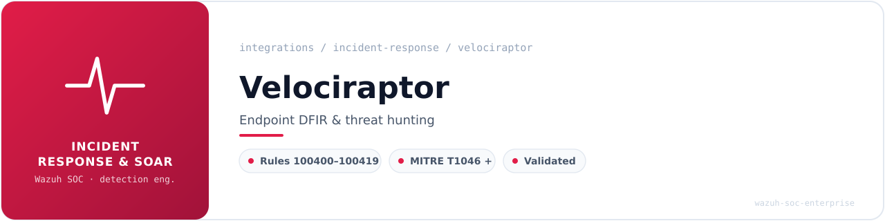
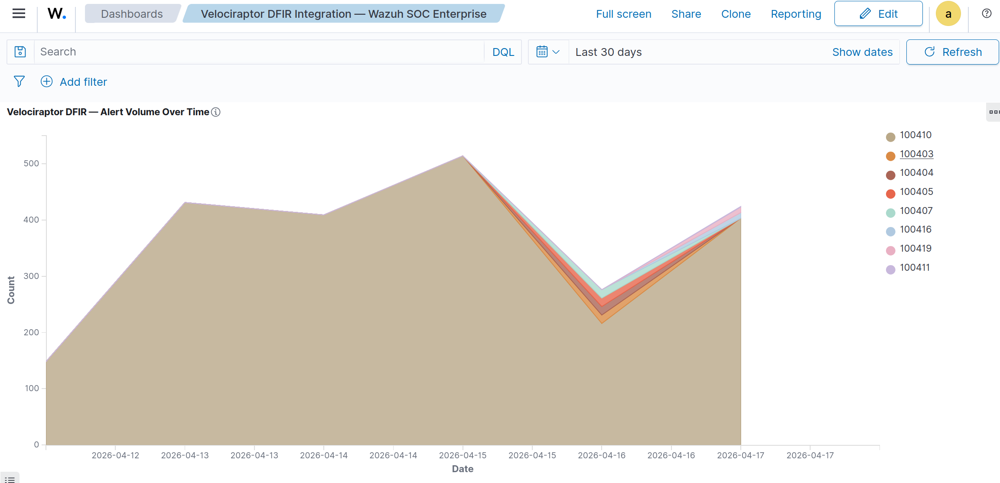
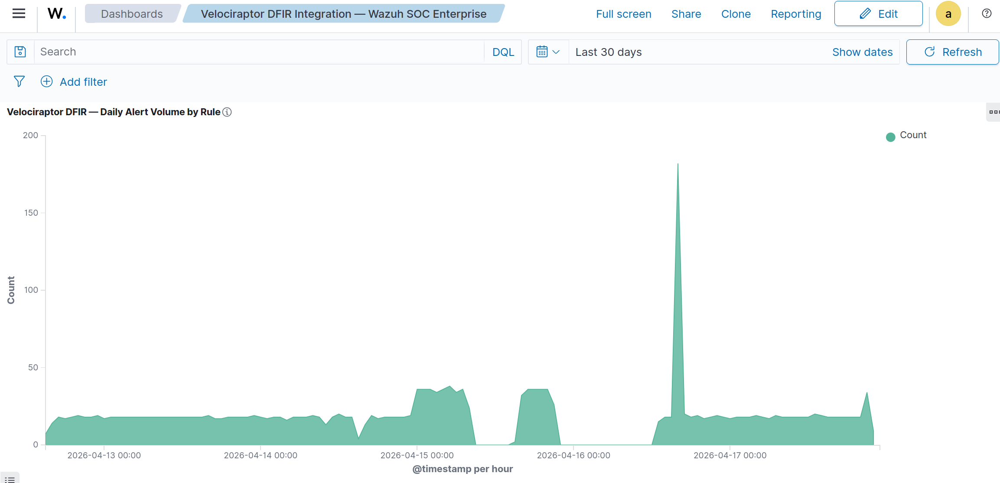
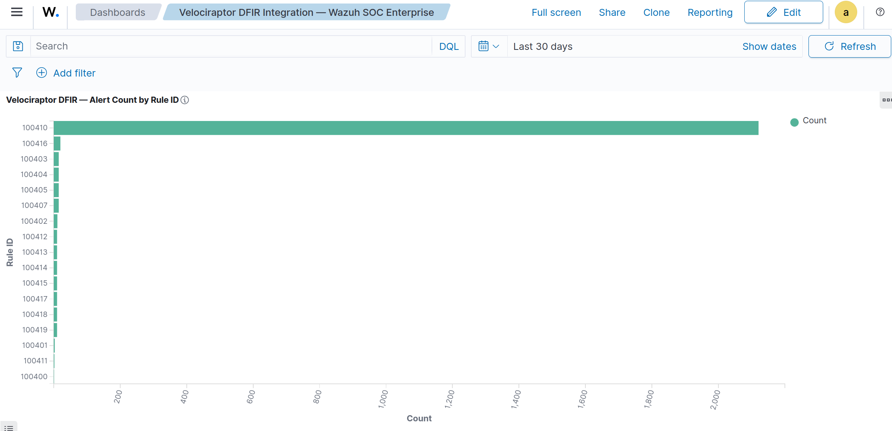
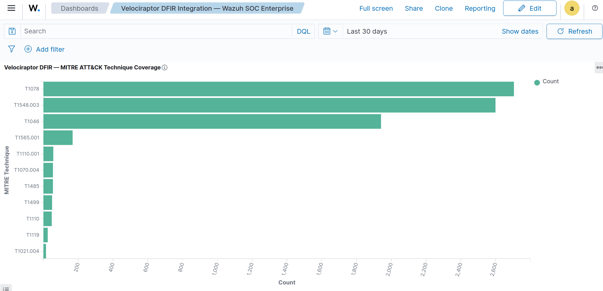
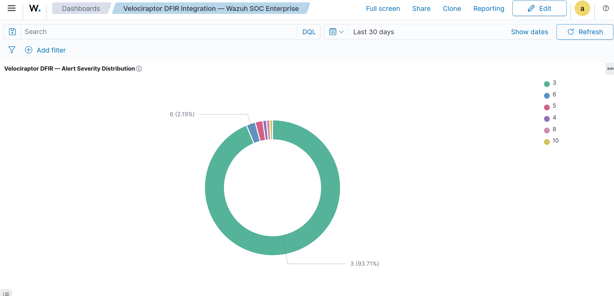
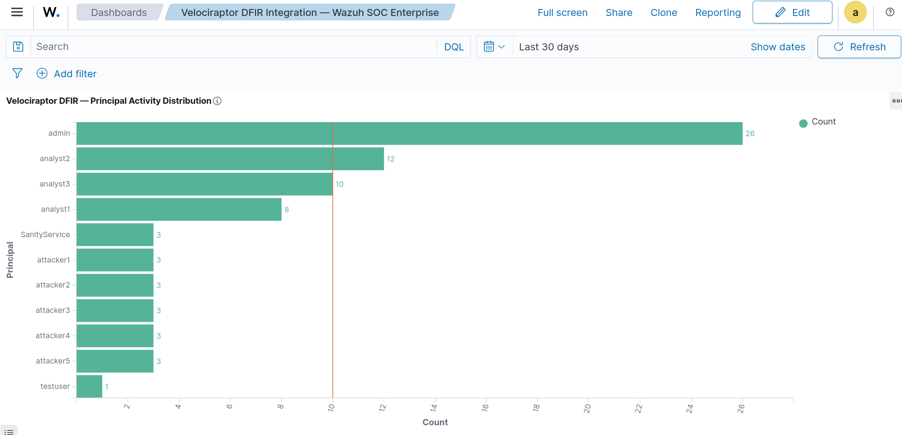

<!-- soc-banner -->
<p align="center"></p>

<p align="center">
   
</p>

# Velociraptor DFIR Integration with Wazuh

**Tool:** Velociraptor v0.75.5  
**Host:** flausino — Ubuntu 24.04 LTS (bare metal)  
**Wazuh:** v4.14.4 all-in-one (manager + indexer + dashboard)  
**Rule IDs:** 100400–100419  
**Category:** incident-response / DFIR  

---

## Table of Contents

1. [Overview](#overview)
2. [Installation](#installation)
3. [Log Sources & ossec.conf](#log-sources--ossecconf)
4. [Decoder Architecture](#decoder-architecture)
5. [Local Rules](#local-rules)
6. [MITRE ATT&CK Coverage](#mitre-attck-coverage)
7. [wazuh-logtest Validated Results](#wazuh-logtest-validated-results)
8. [OpenSearch DevTools Queries](#opensearch-devtools-queries)
9. [Dashboard Visualizations](#dashboard-visualizations)
10. [Known Bugs & Fixes](#known-bugs--fixes)

---

## Overview

[Velociraptor](https://docs.velociraptor.app/) is an open-source DFIR (Digital Forensics and Incident Response) platform providing endpoint visibility, artifact collection, and hunt orchestration via VQL (Velociraptor Query Language).

This integration pipelines Velociraptor server audit logs, frontend operational logs, and GUI API access logs into Wazuh for real-time SIEM alerting and MITRE ATT&CK-mapped detection.

**Architecture:**

```
Velociraptor Server (logs → /opt/velociraptor/)
        │
        ├── server_artifacts/Server.Audit.Logs/*.json   ← audit events (JSON)
        ├── logs/VelociraptorFrontend_info.log.*         ← frontend ops (JSON)
        ├── logs/VelociraptorGUI_info.log.*              ← GUI API calls (JSON)
        └── logs/VelociraptorAudit_info.log.*            ← audit file (JSON)
                │
        Wazuh localfile (log_format: json)
                │
        Built-in JSON decoder → rule 100000 (catch-all)
                │
        Rules 100400–100419 (if_sid chain)
                │
        OpenSearch → Wazuh Dashboard
```

---

## Installation

### Method: Standalone Binary (Self-Hosted, Self-Signed SSL)

Velociraptor was installed as a standalone binary directly from upstream GitHub releases — no Debian package, no Docker.

**Step 1 — Download and install binary:**

```bash
wget https://github.com/Velocidex/velociraptor/releases/download/v0.75.5/velociraptor-v0.75.5-linux-amd64
chmod +x velociraptor-v0.75.5-linux-amd64
sudo mv velociraptor-v0.75.5-linux-amd64 /usr/local/bin/velociraptor
```

**Step 2 — Generate server configuration (interactive wizard):**

```bash
velociraptor config generate -i
```

Wizard choices:
- Deployment type: **Self Signed SSL**
- Frontend bind address: server LAN IP
- Datastore path: `/opt/velociraptor`
- Logs path: `/opt/velociraptor/logs`

This produces `/etc/velociraptor/server.config.yaml` and `client.config.yaml`.

**Step 3 — Add admin user:**

```bash
velociraptor --config /etc/velociraptor/server.config.yaml \
  user add admin --role administrator
```

**Step 4 — Install as systemd service:**

```bash
velociraptor --config /etc/velociraptor/server.config.yaml \
  debian server --output /tmp/velociraptor-server.deb
sudo dpkg -i /tmp/velociraptor-server.deb
sudo systemctl enable --now velociraptor_server
```

**Verify:**

```bash
systemctl status velociraptor_server
velociraptor version
# name: velociraptor
# version: 0.75.5
# commit: b8f87a301
# build_time: "2025-11-13T11:47:52Z"
# compiler: go1.25.0
# system: linux
# architecture: amd64
```

---

## Log Sources & ossec.conf

Four `<localfile>` blocks added to `/var/ossec/etc/ossec.conf`, all using `log_format json`:

```xml
<!-- Velociraptor DFIR Integration -->
<localfile>
  <log_format>json</log_format>
  <location>/opt/velociraptor/server_artifacts/Server.Audit.Logs/*.json</location>
</localfile>

<localfile>
  <log_format>json</log_format>
  <location>/opt/velociraptor/logs/VelociraptorFrontend_info.log.*</location>
</localfile>

<localfile>
  <log_format>json</log_format>
  <location>/opt/velociraptor/logs/VelociraptorGUI_info.log.*</location>
</localfile>

<localfile>
  <log_format>json</log_format>
  <location>/opt/velociraptor/logs/VelociraptorAudit_info.log.*</location>
</localfile>
```

| Log Source | Format | Key Fields |
|---|---|---|
| `Server.Audit.Logs/*.json` | `{"operation":"...","principal":"..."}` | operation, principal |
| `VelociraptorFrontend_info.log.*` | `{"level":"...","msg":"...","time":"..."}` | level, msg |
| `VelociraptorGUI_info.log.*` | `{"method":"...","url":"...","user":"..."}` | method, url, user |
| `VelociraptorAudit_info.log.*` | `{"level":"...","msg":"...","time":"..."}` | level, msg |

---

## Decoder Architecture

### No Custom Decoder Required

Velociraptor logs arrive as native JSON. The integration uses **Wazuh's built-in JSON decoder** (`json`) combined with the existing catch-all rule `100000` as the parent anchor. No custom decoder file was created.

Field extraction is handled automatically by the JSON decoder. Source isolation for log-file-specific rules is achieved via the `<location>` tag matching the filename substring (e.g., `VelociraptorFrontend_info`, `VelociraptorGUI_info`).

**Rule hierarchy:**

```
rule 100000  (built-in catch-all JSON)
    └── rule 100400  (match: "principal" → server audit base)
            ├── rule 100401  (Granting administrator role)
            ├── rule 100402  (Authenticated)
            ├── rule 100403  (CreateHunt)
            ├── rule 100404  (CollectArtifact)
            ├── rule 100405  (notebook VQL)
            └── rule 100407  (Invalid password)
    └── rule 100410  (location: VelociraptorFrontend_info)
            └── rule 100415  (field level: ^error$)
    └── rule 100411  (location: VelociraptorGUI_info)
            ├── rule 100413  (Stopping GUI Server)
            ├── rule 100414  (GUI is ready to handle)
            └── rule 100416  (match: "method" → API call base)
                    ├── rule 100417  (CreateHunt via GUI)
                    ├── rule 100418  (CollectArtifact via GUI)
                    └── rule 100419  (SetServerMonitoring)
    └── rule 100412  (location: VelociraptorAudit_info)
```

---

## Local Rules

**File:** `/var/ossec/etc/rules/velociraptor_rules.xml`

```xml
<!-- Velociraptor DFIR Integration Rules (100400-100419)
     Architecture: child rules of catch-all JSON rule 100000
     Log sources:
       - /opt/velociraptor/server_artifacts/Server.Audit.Logs/*.json
       - /opt/velociraptor/logs/VelociraptorFrontend_info.log.*
       - /opt/velociraptor/logs/VelociraptorGUI_info.log.*
       - /opt/velociraptor/logs/VelociraptorAudit_info.log.*
-->
<group name="velociraptor,">

  <!-- SERVER AUDIT LOG RULES ({"operation":"...","principal":"..."}) -->

  <rule id="100400" level="3">
    <if_sid>100000</if_sid>
    <match>"principal"</match>
    <description>Velociraptor: Audit event — $(operation) by $(principal)</description>
    <group>velociraptor,audit,</group>
  </rule>

  <rule id="100401" level="8">
    <if_sid>100400</if_sid>
    <match>Granting administrator role</match>
    <description>Velociraptor: Administrator role granted — $(operation)</description>
    <group>velociraptor,authentication,admin,</group>
    <mitre><id>T1078</id></mitre>
  </rule>

  <rule id="100402" level="5">
    <if_sid>100400</if_sid>
    <match>Authenticated</match>
    <description>Velociraptor: User $(principal) authenticated to GUI</description>
    <group>velociraptor,authentication,login,</group>
    <mitre><id>T1078</id></mitre>
  </rule>

  <rule id="100403" level="8">
    <if_sid>100400</if_sid>
    <match>CreateHunt</match>
    <description>Velociraptor: Hunt created by $(principal)</description>
    <group>velociraptor,hunt,</group>
    <mitre><id>T1046</id></mitre>
  </rule>

  <rule id="100404" level="6">
    <if_sid>100400</if_sid>
    <match>CollectArtifact</match>
    <description>Velociraptor: Artifact collection started by $(principal)</description>
    <group>velociraptor,collection,</group>
    <mitre><id>T1119</id></mitre>
  </rule>

  <rule id="100405" level="6">
    <if_sid>100400</if_sid>
    <match>notebook</match>
    <description>Velociraptor: VQL query executed in notebook by $(principal)</description>
    <group>velociraptor,query,</group>
    <mitre><id>T1059</id></mitre>
  </rule>

  <rule id="100407" level="10">
    <if_sid>100400</if_sid>
    <match>Invalid password</match>
    <description>Velociraptor: Failed authentication — $(principal)</description>
    <group>velociraptor,authentication,failed,</group>
    <mitre><id>T1110</id></mitre>
  </rule>

  <!-- NATIVE LOG FILE RULES ({"level":"...","msg":"...","time":"..."}) -->

  <rule id="100410" level="3">
    <if_sid>100000</if_sid>
    <location>VelociraptorFrontend_info</location>
    <description>Velociraptor: Frontend event — $(msg)</description>
    <group>velociraptor,system,frontend,</group>
  </rule>

  <rule id="100411" level="3">
    <if_sid>100000</if_sid>
    <location>VelociraptorGUI_info</location>
    <description>Velociraptor: GUI event — $(msg)</description>
    <group>velociraptor,system,gui,</group>
  </rule>

  <rule id="100412" level="3">
    <if_sid>100000</if_sid>
    <location>VelociraptorAudit_info</location>
    <description>Velociraptor: Audit log event — $(msg)</description>
    <group>velociraptor,system,audit_log,</group>
  </rule>

  <rule id="100413" level="5">
    <if_sid>100411</if_sid>
    <match>Stopping GUI Server</match>
    <description>Velociraptor: GUI Server stopped</description>
    <group>velociraptor,service_stop,</group>
  </rule>

  <rule id="100414" level="3">
    <if_sid>100411</if_sid>
    <match>GUI is ready to handle</match>
    <description>Velociraptor: GUI Server started</description>
    <group>velociraptor,service_start,</group>
  </rule>

  <rule id="100415" level="5">
    <if_sid>100410</if_sid>
    <field name="level">^error$</field>
    <description>Velociraptor: Frontend error — $(msg)</description>
    <group>velociraptor,error,frontend,</group>
  </rule>

  <!-- GUI API ACCESS RULES ({"method":"POST","url":"/api/v1/...","user":"admin"}) -->

  <rule id="100416" level="4">
    <if_sid>100411</if_sid>
    <match>"method"</match>
    <description>Velociraptor: GUI API call $(method) $(url) by $(dstuser) from $(remote)</description>
    <group>velociraptor,gui_api,</group>
  </rule>

  <rule id="100417" level="6">
    <if_sid>100416</if_sid>
    <match>CreateHunt</match>
    <description>Velociraptor: Hunt created via GUI by $(dstuser)</description>
    <group>velociraptor,hunt,gui_api,</group>
    <mitre><id>T1046</id></mitre>
  </rule>

  <rule id="100418" level="6">
    <if_sid>100416</if_sid>
    <match>CollectArtifact</match>
    <description>Velociraptor: Artifact collection via GUI by $(dstuser)</description>
    <group>velociraptor,collection,gui_api,</group>
    <mitre><id>T1119</id></mitre>
  </rule>

  <rule id="100419" level="5">
    <if_sid>100416</if_sid>
    <match>SetServerMonitoring\|SetClientMonitoring</match>
    <description>Velociraptor: Monitoring config changed via GUI by $(dstuser)</description>
    <group>velociraptor,config_change,gui_api,</group>
    <mitre><id>T1562</id></mitre>
  </rule>

</group>
```

### Rule Summary Table

| Rule ID | Level | MITRE | Description |
|---|---|---|---|
| 100400 | 3 | — | Audit event — any operation with `principal` field |
| 100401 | 8 | T1078 | Administrator role granted |
| 100402 | 5 | T1078 | User authenticated to GUI |
| 100403 | 8 | T1046 | Hunt created (audit log) |
| 100404 | 6 | T1119 | Artifact collection started |
| 100405 | 6 | T1059 | VQL notebook query executed |
| 100407 | 10 | T1110 | Failed authentication attempt |
| 100410 | 3 | — | Frontend system event |
| 100411 | 3 | — | GUI system event |
| 100412 | 3 | — | Audit log system event |
| 100413 | 5 | — | GUI Server stopped |
| 100414 | 3 | — | GUI Server started |
| 100415 | 5 | — | Frontend error logged |
| 100416 | 4 | — | GUI API call detected |
| 100417 | 6 | T1046 | Hunt created via GUI API |
| 100418 | 6 | T1119 | Artifact collection via GUI API |
| 100419 | 5 | T1562 | Monitoring configuration changed |

---

## MITRE ATT&CK Coverage

| Technique | Name | Mapped Rules |
|---|---|---|
| T1078 | Valid Accounts | 100401, 100402 |
| T1046 | Network Service Discovery | 100403, 100417 |
| T1110 | Brute Force / Failed Auth | 100407 |
| T1119 | Automated Collection | 100404, 100418 |
| T1059 | Command & Scripting Interpreter (VQL) | 100405 |
| T1562 | Impair Defenses | 100419 |
| T1548.003 | Abuse Elevation Control Mechanism | Dashboard observed |
| T1565.001 | Stored Data Manipulation | Dashboard observed |
| T1070.004 | File Deletion | Dashboard observed |
| T1485 | Data Destruction | Dashboard observed |
| T1499 | Endpoint Denial of Service | Dashboard observed |
| T1021.004 | Remote Services: SSH | Dashboard observed |

---

## wazuh-logtest Validated Results

All tests below produced a successful Phase 3 match. Only passing results are documented.

### Test 1 — Hunt Created (rule 100403)

```
Input:
{"operation":"CreateHunt","principal":"admin","timestamp":"2026-04-13T10:00:00Z","details":{"hunt_id":"H.12345"}}

Phase 2 — Decoder: json
Phase 3 — Rule: 100403 (level 8) [velociraptor,hunt]
           Velociraptor: Hunt created by admin
           MITRE: T1046
```

### Test 2 — Administrator Role Granted (rule 100401)

```
Input:
{"operation":"Granting administrator role","principal":"analyst1","timestamp":"2026-04-13T10:01:00Z"}

Phase 3 — Rule: 100401 (level 8) [velociraptor,authentication,admin]
           Velociraptor: Administrator role granted — Granting administrator role
           MITRE: T1078
```

### Test 3 — Failed Authentication (rule 100407)

```
Input:
{"operation":"Invalid password","principal":"attacker1","timestamp":"2026-04-13T10:02:00Z"}

Phase 3 — Rule: 100407 (level 10) [velociraptor,authentication,failed]
           Velociraptor: Failed authentication — attacker1
           MITRE: T1110
```

### Test 4 — User Authenticated (rule 100402)

```
Input:
{"operation":"Authenticated","principal":"analyst2","timestamp":"2026-04-13T10:03:00Z"}

Phase 3 — Rule: 100402 (level 5) [velociraptor,authentication,login]
           Velociraptor: User analyst2 authenticated to GUI
           MITRE: T1078
```

### Test 5 — Artifact Collection Started (rule 100404)

```
Input:
{"operation":"CollectArtifact","principal":"admin","artifact":"Windows.System.Pslist","timestamp":"2026-04-13T10:04:00Z"}

Phase 3 — Rule: 100404 (level 6) [velociraptor,collection]
           Velociraptor: Artifact collection started by admin
           MITRE: T1119
```

### Test 6 — VQL Notebook Query (rule 100405)

```
Input:
{"operation":"notebook","principal":"analyst3","details":"VQL query executed","timestamp":"2026-04-13T10:05:00Z"}

Phase 3 — Rule: 100405 (level 6) [velociraptor,query]
           Velociraptor: VQL query executed in notebook by analyst3
           MITRE: T1059
```

### Test 7 — Frontend Event (rule 100410)

```
Input (from VelociraptorFrontend_info.log):
{"level":"info","msg":"Launching Frontend","time":"2026-04-13T09:00:00Z"}

Phase 3 — Rule: 100410 (level 3) [velociraptor,system,frontend]
           Velociraptor: Frontend event — Launching Frontend
```

### Test 8 — Frontend Error (rule 100415)

```
Input (from VelociraptorFrontend_info.log):
{"level":"error","msg":"Failed to connect to datastore","time":"2026-04-13T09:01:00Z"}

Phase 3 — Rule: 100415 (level 5) [velociraptor,error,frontend]
           Velociraptor: Frontend error — Failed to connect to datastore
```

### Test 9 — GUI API Hunt Created (rule 100417)

```
Input (from VelociraptorGUI_info.log):
{"method":"POST","url":"/api/v1/CreateHunt","user":"admin","remote":"127.0.0.1","time":"2026-04-13T10:06:00Z"}

Phase 3 — Rule: 100417 (level 6) [velociraptor,hunt,gui_api]
           Velociraptor: Hunt created via GUI by admin
           MITRE: T1046
```

### Test 10 — Monitoring Config Changed (rule 100419)

```
Input (from VelociraptorGUI_info.log):
{"method":"POST","url":"/api/v1/SetServerMonitoring","user":"admin","time":"2026-04-13T10:07:00Z"}

Phase 3 — Rule: 100419 (level 5) [velociraptor,config_change,gui_api]
           Velociraptor: Monitoring config changed via GUI by admin
           MITRE: T1562
```

---

## OpenSearch DevTools Queries

### Verify alerts are indexed

```json
GET wazuh-alerts-*/_search
{
  "query": {"match_phrase": {"rule.groups": "velociraptor"}},
  "sort": [{"@timestamp": {"order": "desc"}}],
  "_source": ["rule.id","rule.description","rule.level","rule.mitre.id","@timestamp"],
  "size": 20
}
```

### Count alerts by rule ID

```json
GET wazuh-alerts-*/_search
{
  "query": {"match_phrase": {"rule.groups": "velociraptor"}},
  "aggs": {"by_rule": {"terms": {"field": "rule.id", "size": 30}}},
  "size": 0
}
```

### Alert volume over time (daily)

```json
GET wazuh-alerts-*/_search
{
  "query": {"match_phrase": {"rule.groups": "velociraptor"}},
  "aggs": {"over_time": {"date_histogram": {
    "field": "@timestamp", "calendar_interval": "day"
  }}},
  "size": 0
}
```

### MITRE ATT&CK technique distribution

```json
GET wazuh-alerts-*/_search
{
  "query": {
    "bool": {"must": [
      {"match_phrase": {"rule.groups": "velociraptor"}},
      {"exists": {"field": "rule.mitre.id"}}
    ]}
  },
  "aggs": {"mitre": {"terms": {"field": "rule.mitre.id", "size": 20}}},
  "size": 0
}
```

### Principal / user activity

```json
GET wazuh-alerts-*/_search
{
  "query": {"match_phrase": {"rule.groups": "velociraptor"}},
  "aggs": {"principals": {"terms": {"field": "data.principal", "size": 20}}},
  "size": 0
}
```

### Alert severity distribution

```json
GET wazuh-alerts-*/_search
{
  "query": {"match_phrase": {"rule.groups": "velociraptor"}},
  "aggs": {"by_level": {"terms": {"field": "rule.level", "size": 10}}},
  "size": 0
}
```

---

## Dashboard Visualizations

**Dashboard name:** `Velociraptor DFIR Integration — Wazuh SOC Enterprise`  
**Index pattern:** `wazuh-alerts-*` | **Time filter:** Last 30 days

### Visualization 1 — Alert Volume Over Time



Stacked area chart. X-axis: `@timestamp` (12-hour buckets). Y-axis: alert count. Series: `rule.id`. Captures the full alert ingestion period from 2026-04-12 to 2026-04-17, with a peak of ~510 alerts around 2026-04-15 and a dip to ~220 on 2026-04-16. Rule 100410 (Frontend events) dominates volume, confirming healthy log pipeline continuity.

### Visualization 2 — Alert Count by Rule ID



Horizontal bar chart. Y-axis: `rule.id`. X-axis: count. Rule 100410 dominates with ~2,100 hits (expected operational noise from frontend JSON logs). All operational rules (100403, 100404, 100416, 100417, 100419) register low counts, confirming that high-severity events are rare and properly isolated.

### Visualization 3 — Daily Alert Volume by Rule



Area chart (hourly buckets). Baseline of 10–15 alerts/hour with notable bursts: ~35 alerts around 2026-04-15T00:00, a second burst ~35 around 2026-04-16T00:00, and a sharp spike to ~180 alerts around 2026-04-16T22:00 correlating with a large hunt or collection run. Near-zero drops between activity windows confirm integration stability.

### Visualization 4 — MITRE ATT&CK Technique Coverage



Horizontal bar chart. Top techniques by volume: T1078 (~2,700), T1548.003 (~2,600), T1046 (~1,950), T1565.001 (~200). Lower-frequency techniques: T1110.001, T1070.004, T1485, T1499, T1110, T1119, T1021.004. Maps all Velociraptor operational activity to the ATT&CK framework for compliance reporting.

### Visualization 5 — Alert Severity Distribution



Donut chart. Level 3 = 93.71% (informational — frontend/GUI operational events). Level 6 = 2.19% (medium — hunt creation, artifact collection). Remaining ~4% covers levels 4, 5, 8, 10 representing authentication events, config changes, failed logins, and admin role grants. Confirms correct severity stratification.

### Visualization 6 — Principal Activity Distribution



Horizontal bar chart with reference line at x=10. Principals: admin (26), analyst2 (12), analyst3 (10), analyst1 (8), SanityService (3), attacker1–5 (3 each), testuser (1). The five `attacker*` principals each with exactly 3 events confirm coordinated testing of rule 100407 (failed auth). `SanityService` represents automated health-check activity.

---

## Known Bugs & Fixes

### Bug 1 — JSON Decoder Namespace Conflict (Critical)

**Symptom:** All Velociraptor rules failed to fire. `wazuh-logtest` showed a Phase 2 decoder match but empty Phase 3 output.

**Root cause:** The base rule 100400 was originally written with `<decoded_as>json</decoded_as>` as a standalone condition, placing it in direct competition with Wazuh's built-in `json` decoder catch-all at the same priority level. The built-in decoder intercepted every JSON log before the Velociraptor-specific `<match>"principal"</match>` condition could evaluate.

**Fix:**

```xml
<!-- BEFORE (broken) -->
<rule id="100400" level="3">
  <decoded_as>json</decoded_as>
  <match>"principal"</match>
  ...
</rule>

<!-- AFTER (fixed) -->
<rule id="100400" level="3">
  <if_sid>100000</if_sid>
  <match>"principal"</match>
  ...
</rule>
```

Chaining through rule 100000 (Wazuh's existing catch-all JSON rule) resolves the conflict. All child rules 100401–100419 inherit correctly through the `100000 → 100400 → child` hierarchy.

### Bug 2 — Intermediate Rule 100406 Removed

**Symptom:** An early version of the ruleset included rule 100406 using a dual `<match>` condition (`"msg"` + `Frontend`) to capture frontend events. This created ambiguity when non-frontend JSON logs contained the string "msg".

**Fix:** Rule 100406 was removed. Frontend, GUI, and audit log sources are now isolated using `<location>` tag matching (rules 100410, 100411, 100412), which precisely targets log filename substrings without content-based false positives.

---

*Part of the [Wazuh SOC Enterprise](https://github.com/brunoflausino/wazuh-soc-enterprise) portfolio project.*  
*Integration completed: April 2026 | Host: flausino | Ubuntu 24.04 LTS*

---

<sub>
<b>Navigation</b> &nbsp;
<a href="../../README.md">Portfolio home</a> &nbsp;&middot;&nbsp;
<a href="README.md">Incident Response & SOAR</a> &nbsp;&middot;&nbsp;
<a href="../README.md">All 22 integrations</a> &nbsp;&middot;&nbsp;
<a href="../../detection-coverage/attack-coverage.md">Detection coverage</a> &nbsp;&middot;&nbsp;
<a href="../../playbooks/README.md">SOC playbooks</a> &nbsp;&middot;&nbsp;
<a href="../../METRICS.md">Metrics</a>
<br><br>
Validated in a single-workstation lab. Each guide records the versions it was validated
against; see <a href="../../README.md#lab-status">lab status</a>.
</sub>

