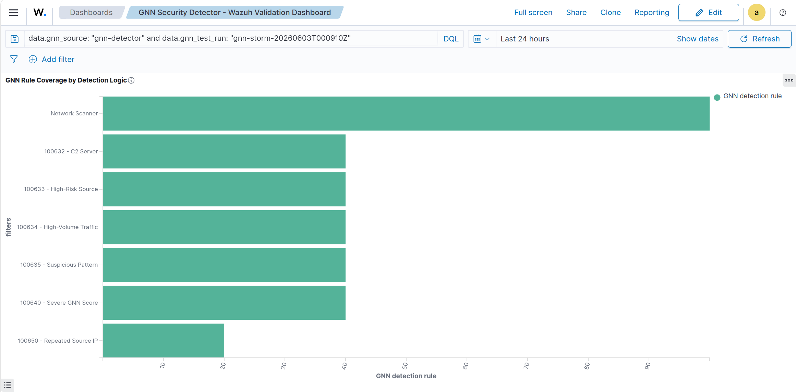
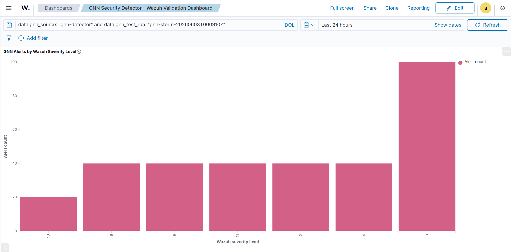
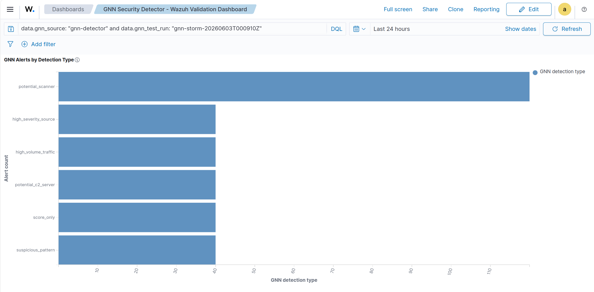
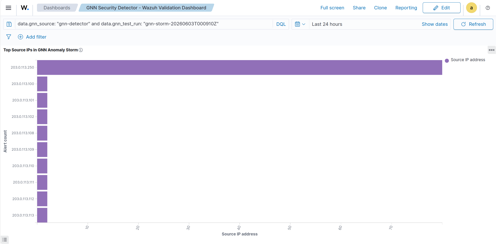
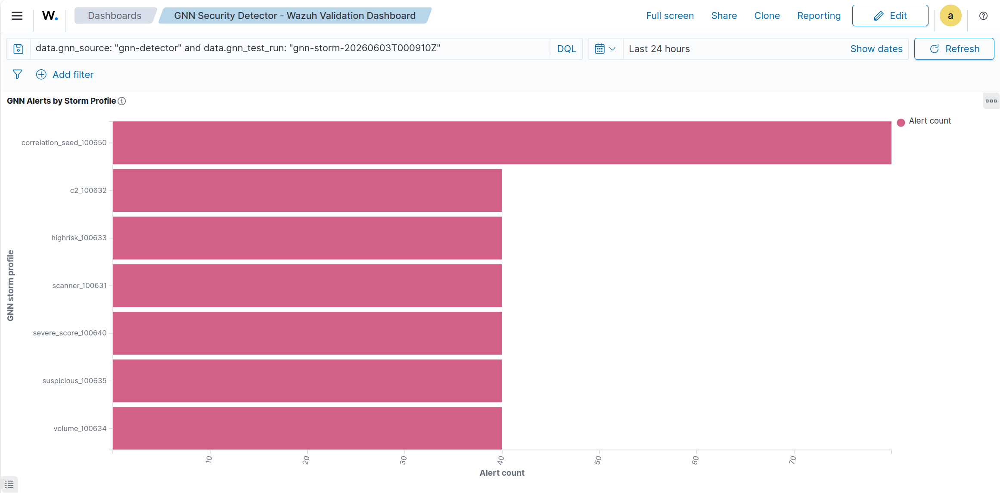

# GNN Security Detector — Wazuh Integration

**Integration #19 — ML-based Anomaly Detection**  
**Status:** Validated and publication-ready (Lab / Portfolio)  
**Rule IDs:** 100630–100640, 100650  
**Wazuh Version:** 4.14.x  
**Host:** Ubuntu 24.04 LTS (bare-metal)  
**Validated:** 2026-06-03  

---

## Overview

This integration connects a Graph Neural Network (GNN)-based security detector to the Wazuh SIEM pipeline. The GNN detector produces structured JSON anomaly events that Wazuh ingests, processes through a custom rule chain, and indexes into OpenSearch for visualization and alerting.

The integration demonstrates detection engineering methodology: from controlled synthetic event generation through rule-chain validation, OpenSearch aggregation, and dashboard evidence — without requiring any external data source or third-party feed.

This is classified as a **validated lab integration and detection engineering prototype**, not a production ML security product.

---

## Architecture

```
GNN Detector (Python)
        │
        ▼ JSON lines
/var/log/gnn-security/alerts.json
        │
        ▼ localfile JSON ingestion
Wazuh Manager (wazuh-analysisd)
        │
        ├──► Rule 100630 (parent/base, level 0)
        │         │
        │         ├──► Rule 100631 — Network Scanner          (level 10)
        │         ├──► Rule 100632 — C2 Server                (level 12)
        │         ├──► Rule 100633 — High-Risk Source         (level 11)
        │         ├──► Rule 100634 — High-Volume Traffic      (level  9)
        │         ├──► Rule 100635 — Suspicious Pattern       (level  8)
        │         ├──► Rule 100640 — Severe GNN Score         (level 14)
        │         └──► Rule 100650 — Repeated Source IP       (level 13)
        │
        ▼ Wazuh local alerts
/var/ossec/logs/alerts/alerts.json
        │
        ▼ Filebeat
OpenSearch / Wazuh Indexer (wazuh-alerts-*)
        │
        ▼
Wazuh Dashboard
```

---

## GNN Event Structure

The GNN detector writes newline-delimited JSON to `/var/log/gnn-security/alerts.json`. Each event contains:

```json
{
  "timestamp": "2026-06-03T00:09:10.000Z",
  "gnn_source": "gnn-detector",
  "gnn_test_run": "gnn-storm-20260603T000910Z",
  "detection_type": "potential_scanner",
  "src_ip": "203.0.113.250",
  "gnn_score": "0.92",
  "confidence": "high",
  "storm_profile": "scanner_100631"
}
```

Fields indexed under `data.*` in OpenSearch:

| Field | Description |
|---|---|
| `data.gnn_source` | Always `gnn-detector` — used as ingestion anchor |
| `data.gnn_test_run` | Unique run ID for scoping validation datasets |
| `data.detection_type` | GNN model classification category |
| `data.src_ip` | Source IP address in the anomaly event |
| `data.gnn_score` | Anomaly score (string; numeric mapping TBD) |
| `data.confidence` | Model confidence level |
| `data.storm_profile` | Synthetic scenario tag for controlled validation |

---

## Wazuh Configuration

### ossec.conf — localfile block

```xml
<localfile>
  <log_format>json</log_format>
  <location>/var/log/gnn-security/alerts.json</location>
</localfile>
```

No custom XML decoder was required. Wazuh's native JSON decoder exposes all GNN fields under `data.*`.

### Decoder strategy

Native JSON decoding via Wazuh's built-in JSON decoder. This avoids the known child-decoder bug ([Wazuh #33798](https://github.com/wazuh/wazuh/issues/33798)) and keeps the rule chain clean.

---

## Rule Set

File: `rules/local_rules.xml` (or dedicated `gnn_rules.xml`)

### Rule 100630 — Parent/Base Rule (level 0)

```xml
<rule id="100630" level="0">
  <decoded_as>json</decoded_as>
  <field name="gnn_source">gnn-detector</field>
  <description>GNN Security Detector event</description>
  <options>no_full_log</options>
</rule>
```

> Level 0 — acts as the parent anchor. Not expected in final dashboard alerts.

---

### Rule 100631 — Network Scanner (level 10)

```xml
<rule id="100631" level="10">
  <if_sid>100630</if_sid>
  <field name="detection_type">potential_scanner</field>
  <description>GNN: Potential network scanner detected - $(data.src_ip)</description>
  <mitre>
    <id>T1046</id>
  </mitre>
</rule>
```

---

### Rule 100632 — C2 Server (level 12)

```xml
<rule id="100632" level="12">
  <if_sid>100630</if_sid>
  <field name="detection_type">potential_c2_server</field>
  <description>GNN: Potential C2 server communication - $(data.src_ip)</description>
  <mitre>
    <id>T1071</id>
  </mitre>
</rule>
```

---

### Rule 100633 — High-Risk Source (level 11)

```xml
<rule id="100633" level="11">
  <if_sid>100630</if_sid>
  <field name="detection_type">high_severity_source</field>
  <description>GNN: High-risk source detected - $(data.src_ip)</description>
  <mitre>
    <id>T1078</id>
  </mitre>
</rule>
```

---

### Rule 100634 — High-Volume Traffic (level 9)

```xml
<rule id="100634" level="9">
  <if_sid>100630</if_sid>
  <field name="detection_type">high_volume_traffic</field>
  <description>GNN: High-volume traffic anomaly - $(data.src_ip)</description>
  <mitre>
    <id>T1499</id>
  </mitre>
</rule>
```

---

### Rule 100635 — Suspicious Pattern (level 8)

```xml
<rule id="100635" level="8">
  <if_sid>100630</if_sid>
  <field name="detection_type">suspicious_pattern</field>
  <description>GNN: Suspicious communication pattern - $(data.src_ip)</description>
  <mitre>
    <id>T1205</id>
  </mitre>
</rule>
```

---

### Rule 100640 — Severe GNN Score (level 14)

```xml
<rule id="100640" level="14">
  <if_sid>100630</if_sid>
  <field name="detection_type">score_only</field>
  <description>GNN: Severe anomaly score detected - $(data.src_ip)</description>
  <mitre>
    <id>T1190</id>
  </mitre>
</rule>
```

---

### Rule 100650 — Repeated Anomalies from Same Source IP (level 13)

```xml
<rule id="100650" level="13" frequency="5" timeframe="120">
  <if_matched_sid>100631</if_matched_sid>
  <same_field>data.src_ip</same_field>
  <description>GNN: Repeated anomalies from same source IP - $(data.src_ip)</description>
  <mitre>
    <id>T1046</id>
    <id>T1571</id>
  </mitre>
</rule>
```

> Correlation rule. Fires when 5 or more scanner-type alerts arrive from the same source IP within 120 seconds.

---

## Validation Methodology

Validation followed a staged SOC engineering workflow:

| Stage | Action |
|---|---|
| 1 | Accept handoff baseline — understand existing paths, rule IDs, ingestion model |
| 2 | Verify GNN alert file at `/var/log/gnn-security/alerts.json` |
| 3 | Test all rules with `wazuh-logtest` (parent + child + correlation) |
| 4 | Validate Wazuh configuration with `wazuh-analysisd -t` |
| 5 | Inject controlled synthetic anomaly storm |
| 6 | Confirm local Wazuh alert generation |
| 7 | Confirm OpenSearch indexing via DevTools |
| 8 | Build dashboard visual evidence |

### wazuh-logtest validation

Rule 100630 was validated as the parent/base rule. Child rules 100631–100640 were validated for each `detection_type`. Rule 100650 was validated for repeated source-IP correlation behavior.

### wazuh-analysisd -t

Configuration test returned clean state (no blocking warnings or errors).

---

## Controlled Anomaly Storm

**Run ID:** `gnn-storm-20260603T000910Z`  
**Total indexed alerts:** **320**

### Alert distribution by rule

| Rule ID | Detection Logic | Indexed Count |
|---|---|---|
| 100631 | Network Scanner | 100 |
| 100632 | C2 Server | 40 |
| 100633 | High-Risk Source | 40 |
| 100634 | High-Volume Traffic | 40 |
| 100635 | Suspicious Pattern | 40 |
| 100640 | Severe GNN Score | 40 |
| 100650 | Repeated Source IP | 20 |
| **Total** | | **320** |

### Alert distribution by severity

| Wazuh Level | Rule | Count |
|---|---|---|
| 8 | Suspicious Pattern | 40 |
| 9 | High-Volume Traffic | 40 |
| 10 | Network Scanner | 100 |
| 11 | High-Risk Source | 40 |
| 12 | C2 Server | 40 |
| 13 | Repeated Source IP | 20 |
| 14 | Severe GNN Score | 40 |

### Top source IP

`203.0.113.250` — 80 alerts (intentionally reused as correlation seed for rule 100650 validation)

### Storm profiles

| Profile | Purpose | Count |
|---|---|---|
| `correlation_seed_100650` | Repeated source-IP events for correlation | 80 |
| `scanner_100631` | Network scanner validation | 40 |
| `c2_100632` | C2 server validation | 40 |
| `highrisk_100633` | High-risk source validation | 40 |
| `volume_100634` | High-volume traffic validation | 40 |
| `suspicious_100635` | Suspicious pattern validation | 40 |
| `severe_score_100640` | Severe score validation | 40 |

---

## OpenSearch DevTools Verification

Index pattern: `wazuh-alerts-*`

DQL scope used for clean dataset:

```
data.gnn_source: "gnn-detector" AND data.gnn_test_run: "gnn-storm-20260603T000910Z"
```

Final clean query result: **`hits.total.value: 320`**

A broader query (without run scoping) returned 660 GNN alerts — including earlier test runs. The clean 320-alert dataset was used for all dashboard evidence.

---

## Dashboard Evidence

**Dashboard name:** `GNN Security Detector - Wazuh Validation Dashboard`

Five panels were created to cover all operational aspects of the GNN detection pipeline.

---

### Panel 1 — GNN Rule Coverage by Detection Logic

> Validates that each operational GNN rule produced indexed alerts. The most important validation panel.



**Aggregation:** Filters by `rule.id` for each of the 7 operational rules.

---

### Panel 2 — GNN Alerts by Wazuh Severity Level

> Confirms that GNN detections map into the full Wazuh severity range — from suspicious patterns (level 8) to severe anomaly scores (level 14).



**Aggregation:** Terms on `rule.level`.

---

### Panel 3 — GNN Alerts by Detection Type

> Validates that GNN model semantic categories are preserved as structured fields after JSON ingestion, rule processing, and OpenSearch indexing.



**Aggregation:** Terms on `data.detection_type`.

---

### Panel 4 — Top Source IPs in GNN Anomaly Storm

> Identifies anomalous source concentration. IP `203.0.113.250` dominates as expected — it was the intentional correlation seed.



**Aggregation:** Terms on `data.src_ip`.

---

### Panel 5 — GNN Alerts by Storm Profile

> Links alert groups to their synthetic validation scenario. Confirms each scenario produced the expected indexed data.



**Aggregation:** Terms on `data.storm_profile`.

---

## MITRE ATT&CK Coverage

| Technique | ID | Rule |
|---|---|---|
| Network Service Discovery | T1046 | 100631, 100650 |
| Application Layer Protocol | T1071 | 100632 |
| Valid Accounts | T1078 | 100633 |
| Endpoint Denial of Service | T1499 | 100634 |
| Traffic Signaling | T1205 | 100635 |
| Exploit Public-Facing Application | T1190 | 100640 |
| Non-Standard Port | T1571 | 100650 |

---

## GitHub Publication State

At the end of the validation handoff, the five dashboard screenshots had already been committed and pushed in the repository under `integrations/ml-research/assets/gnn-security-detector/`. The remaining publication task is to add this Markdown document to `integrations/ml-research/gnn-security-detector-integration.md` and commit it.

---

## Known Limitations

- `data.gnn_score` is indexed as a string type. Suitable for display; not usable for numeric aggregations without a runtime field mapping correction.
- Rule 100650 `frequency` and `timeframe` values should be verified against the actual production `local_rules.xml` before publishing as authoritative.
- The GNN model itself is a prototype. Detection accuracy against real malicious traffic has not been evaluated.
- Dashboard screenshots were committed to the repository under `integrations/ml-research/assets/gnn-security-detector/`. Local backup copies remain preserved at `/home/brunoflausino/wazuh-backup-complete/GNN-dashboard/`.
- This is a controlled synthetic test, not a production model evaluation.

---

## Optional Future Evidence Files

The current GitHub publication can be completed with the Markdown document and the five dashboard screenshots. For stronger future auditability, the following evidence files can also be captured later:

```
integrations/ml-research/
├── gnn-security-detector-integration.md          ← this file
├── gnn-devtools-clean-run-aggregation.json
├── gnn-devtools-sample-documents.json
├── gnn-local-alerts-rule-counts.txt
├── gnn-wazuh-logtest-output.txt
├── gnn-localfile-ossec-conf-snippet.xml
├── gnn-custom-rules-snippet.xml
└── assets/
    └── gnn-security-detector/
        ├── 01-gnn-rule-coverage-by-detection-logic.png
        ├── 02-gnn-alerts-by-wazuh-severity-level.png
        ├── 03-gnn-alerts-by-detection-type.png
        ├── 04-top-source-ips-in-gnn-anomaly-storm.png
        └── 05-gnn-alerts-by-storm-profile.png
```

---

## Integration Summary

| Item | Value |
|---|---|
| Integration number | #19 |
| Rule ID range | 100630–100640, 100650 |
| Total rules | 8 (1 parent + 6 child + 1 correlation) |
| Decoder | Native Wazuh JSON (no custom decoder) |
| MITRE techniques covered | 7 |
| Validated alerts (clean run) | 320 |
| Dashboard panels | 5 |
| Index pattern | `wazuh-alerts-*` |
| GitHub status | Publication-ready — Markdown plus dashboard screenshots under `integrations/ml-research/` |

---

*This integration was developed and validated as part of the `wazuh-soc-enterprise` portfolio lab — a production-grade bare-metal SOC environment running Wazuh 4.14.x on Ubuntu 24.04 LTS.*
