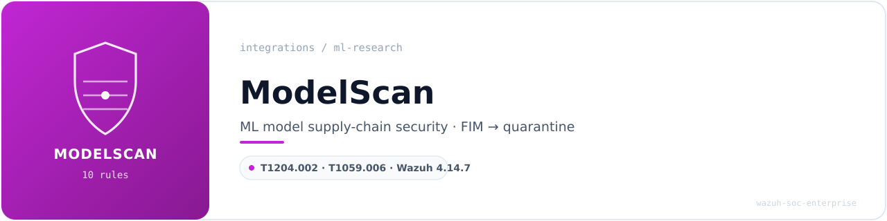
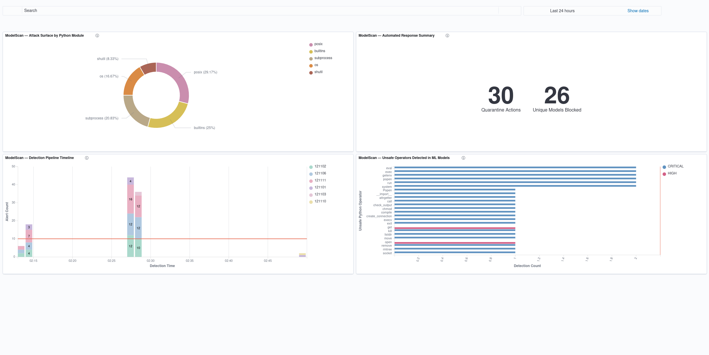
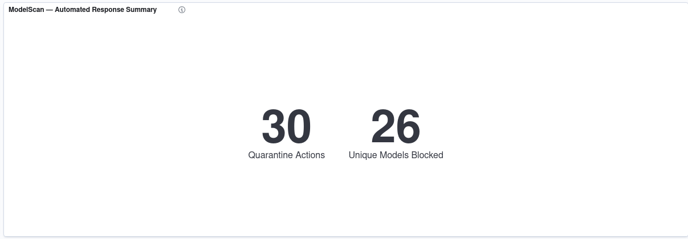
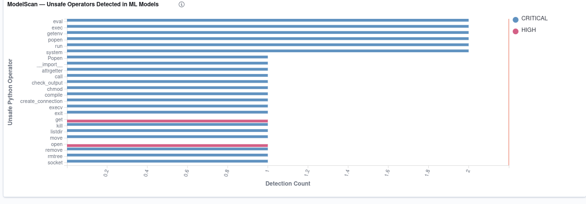
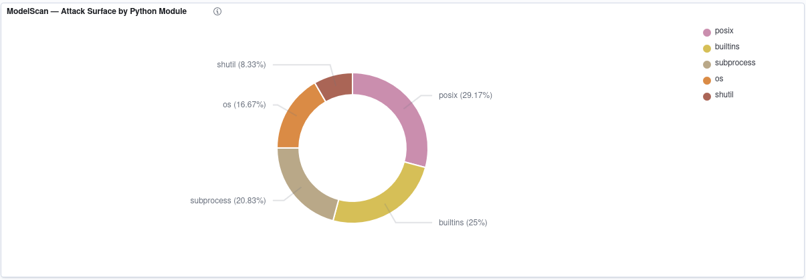
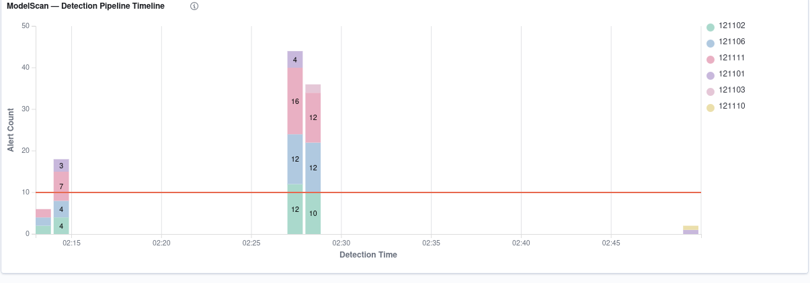

<!-- soc-banner -->
<p align="center"></p>

<p align="center">
   
</p>

# ModelScan — ML Model Supply-Chain Security — Wazuh Integration

| Field | Value |
|---|---|
| **Author** | Bruno Flausino |
| **Version** | 1.0 (Production) |
| **Date** | 2026-08-07 |
| **Environment** | Ubuntu 24.04 LTS — Bare Metal |
| **Wazuh Version** | 4.14.7 |
| **ModelScan Version** | 0.8.8 |
| **Integration Category** | ML Research |
| **Rules** | 121100–121111 |
| **MITRE ATT&CK** | T1204.002, T1059.006 |

---

## Table of Contents

1. [Executive Summary](#1-executive-summary)
2. [Threat Model — Why Model Scanning](#2-threat-model--why-model-scanning)
3. [Architecture Overview](#3-architecture-overview)
4. [Prerequisites](#4-prerequisites)
5. [Directory Structure](#5-directory-structure)
6. [Installation](#6-installation)
7. [Active Response Script](#7-active-response-script)
8. [Detection Rules](#8-detection-rules)
9. [Wazuh ossec.conf Integration](#9-wazuh-ossecconf-integration)
10. [Testing and Validation](#10-testing-and-validation)
11. [OpenSearch DevTools Queries](#11-opensearch-devtools-queries)
12. [Dashboard Visualizations](#12-dashboard-visualizations)
13. [Severity Model Reference](#13-severity-model-reference)
14. [Troubleshooting](#14-troubleshooting)
15. [File Reference Summary](#15-file-reference-summary)

---

## 1. Executive Summary

This document describes the production integration of **ModelScan 0.8.8** with **Wazuh 4.14.7** on Ubuntu 24.04 LTS. The integration delivers automated, real-time security scanning of machine learning model files by chaining Wazuh's File Integrity Monitoring (FIM), Active Response, and log collection pipeline into a unified detection-and-quarantine workflow.

Serialized ML model files can carry arbitrary code that executes the instant the model is loaded. A downloaded model is therefore an execution vector that signature-based antivirus cannot inspect — to a traditional scanner a Pickle file is an opaque binary blob. This integration closes that gap: every model entering a monitored directory is statically inspected before any process can deserialize it, and models containing unsafe operators are quarantined automatically.

### Key Capabilities

- **Real-time scanning** of model files added or modified in a monitored directory via Wazuh Syscheck whodata
- **Automatic trigger** of the ModelScan scan script through Wazuh Active Response (no manual intervention)
- **Automatic quarantine** of CRITICAL/HIGH models — moved out of the ingestion path and stripped of all permissions (`chmod 000`) before they can be loaded
- **Centralized alerting** with 10 custom rules (121100–121111) mapping to MITRE ATT&CK T1204.002 and T1059.006
- **Full OpenSearch indexing** of `data.*` fields for visualization and historical analysis
- **Four-panel dashboard** covering automated response counters, unsafe-operator inventory, attack surface by module, and detection timeline

### Validation Results

| Metric | Result |
|---|---|
| Rules validated | 10 (121100–121111) — 8 in production, 2 synthetically |
| Detection rate | 100% against 24 distinct unsafe operators across 9 modules |
| Quarantine actions | 30+ confirmed, all files `chmod 000` |
| End-to-end pipeline latency | < 10 seconds (FIM whodata → scan → quarantine → alert) |
| Malformed NDJSON lines | 0 of 71 |
| OpenSearch field mapping | `data.operator`, `data.module`, `data.severity`, `data.file_hash`, `data.quarantined` |

---

## 2. Threat Model — Why Model Scanning

The Python Pickle format is not a data format — it is a serialization protocol that can embed executable operations. When `pickle.load()` runs, an object's `__reduce__` method can invoke arbitrary callables. This is the classic Pickle deserialization attack:

```python
class Payload:
    def __reduce__(self):
        return (os.system, ("<attacker command>",))
```

The most common ML serialization formats are affected: `.pkl` / `.pickle` (scikit-learn, and PyTorch when using the legacy path), `.pt` / `.pth` (PyTorch), `.h5` / `.hdf5` (Keras/TensorFlow), `.joblib`, and `.dill`. A model downloaded from a public hub, a teammate, or a CI artifact store can carry a payload that executes on load — stealing credentials, installing a backdoor, or mining cryptocurrency. This class of attack has been observed on public model hubs.

**ModelScan** (Protect AI, Apache 2.0) inspects the serialized structure *without loading it*, flagging unsafe operators by module and severity. This integration wires that inspection into Wazuh so that detection produces both an alert and an automated containment action.

---

## 3. Architecture Overview

```
+---------------------+     +-------------------------+     +------------------+
|   File System       |     |     Wazuh Manager       |     |   OpenSearch     |
|  /opt/model-scan-   | --> |  Syscheck FIM (whodata) | --> |  Indexer         |
|  lab/incoming/      |     |  Active Response        |     |  Dashboard       |
+---------------------+     |  Analysisd              |     +------------------+
                             +-------------------------+
                                        |
                                        v
                             +-------------------------+
                             |    ModelScan 0.8.8       |
                             |  venv: /opt/modelscan    |
                             |  PickleUnsafeOpScan       |
                             +-------------------------+
                                        |
                                        v
                             +-------------------------+
                             |  Quarantine (chmod 000)  |
                             |  /opt/model-scan-lab/    |
                             |  quarantine/             |
                             +-------------------------+
```

### Data Flow (9 Steps)

| Step | Component | Action |
|---|---|---|
| 1 | Syscheck | Model added/modified in `/opt/model-scan-lab/incoming` detected via whodata |
| 2 | Analysisd | Rule 121111 (added) or 121110 (modified) fires (level 10) |
| 3 | Active Response | `modelscan_scan.sh` triggered automatically |
| 4 | ModelScan | File scanned by `PickleUnsafeOpScan` without deserializing |
| 5 | modelscan_scan.sh | Findings written as NDJSON to `/opt/model-scan-lab/logs/modelscan-events.json` |
| 6 | modelscan_scan.sh | On CRITICAL/HIGH, file moved to quarantine and set `chmod 000` |
| 7 | Logcollector | NDJSON log read line by line |
| 8 | Analysisd | Native JSON decoder + rules 121101–121107 classify the event |
| 9 | Indexer/Dashboard | Alert indexed under `wazuh-alerts-*`, visualized |

### Why FIM → Active Response

This is the same architectural pattern as the [YARA integration](../threat-intelligence/yara-integration.md): FIM detects, Active Response invokes a scanner, the scanner emits structured output, and Wazuh classifies it. Reusing the pattern means the debugging done for one scanner (whodata behavior, AR stdin format, NDJSON emission) transfers directly to the other.

---

## 4. Prerequisites

| Requirement | Version / State |
|---|---|
| Wazuh Manager | 4.14.7, running |
| Python | 3.12.3 (system) |
| `python3.12-venv` | installed |
| auditd | active (required for FIM whodata) |
| FIM whodata | enabled (`<syscheck>` non-immutable, no `-e 2`) |
| Disk | ~200 MB for the venv and dependencies |

---

## 5. Directory Structure

```
/opt/modelscan/
└── venv/                          isolated Python environment
    └── bin/modelscan              ModelScan 0.8.8 entry point

/opt/model-scan-lab/
├── incoming/                      monitored by FIM whodata
├── quarantine/                    CRITICAL/HIGH models, chmod 000
└── logs/
    └── modelscan-events.json      NDJSON, read by logcollector

/var/ossec/
├── active-response/bin/
│   └── modelscan_scan.sh          root:wazuh 750
└── etc/rules/
    └── modelscan_rules.xml        wazuh:wazuh 660
```

The scanner lives in an isolated virtualenv, not in the system site-packages. This keeps ModelScan's dependencies (`numpy`, `rich`, `click`) from mixing with apt-managed packages, and makes the Active Response invocation deterministic via an absolute path.

---

## 6. Installation

```bash
# Isolated venv (avoids PEP 668 / system package conflicts)
sudo mkdir -p /opt/modelscan
sudo python3 -m venv /opt/modelscan/venv
sudo /opt/modelscan/venv/bin/pip install --upgrade pip
sudo /opt/modelscan/venv/bin/pip install modelscan

# Verify
sudo /opt/modelscan/venv/bin/modelscan --version
# -> modelscan, version 0.8.8

# Lab directories
sudo mkdir -p /opt/model-scan-lab/{incoming,quarantine,logs}
sudo chown -R root:root /opt/model-scan-lab
sudo chmod 755 /opt/model-scan-lab /opt/model-scan-lab/incoming
sudo chmod 750 /opt/model-scan-lab/quarantine /opt/model-scan-lab/logs
```

---

## 7. Active Response Script

The Active Response script reads the FIM event from stdin, extracts the triggering file path, runs ModelScan, emits one NDJSON line per finding plus a summary line, and quarantines the file when a CRITICAL or HIGH operator is found.

Deploy to `/var/ossec/active-response/bin/modelscan_scan.sh` with ownership `root:wazuh` and permissions `750`. Full script: [`scripts/modelscan/modelscan_scan.sh`](../../scripts/modelscan/modelscan_scan.sh).

Design decisions:

- **Extension filter** — only `.pkl`, `.pickle`, `.pt`, `.pth`, `.h5`, `.hdf5`, `.bin`, `.joblib`, `.dill` are scanned; anything else exits immediately.
- **Quarantine only on CRITICAL/HIGH** — MEDIUM and LOW alert but do not move the file, avoiding destruction of a legitimate model on a low-confidence finding.
- **`chmod 000` on quarantine** — prevents accidental execution or deserialization of the isolated artifact.
- **NDJSON, one object per line** — required by the native Wazuh JSON decoder, which decodes one JSON object per line.

---

## 8. Detection Rules

Ten rules, IDs 121100–121111. Full ruleset: [`rules/modelscan_rules.xml`](../../rules/modelscan_rules.xml).

| Rule | Level | Trigger | MITRE |
|---|---|---|---|
| 121100 | 0 | Parent — any `integration: modelscan` event (zero eval cost) | — |
| 121101 | 3 | `scan_summary` with `total_issues: 0` — clean model | — |
| 121102 | 14 | `issue` with `severity: CRITICAL` | T1204.002, T1059.006 |
| 121103 | 12 | `issue` with `severity: HIGH` | T1204.002 |
| 121104 | 8 | `issue` with `severity: MEDIUM` (see §13) | — |
| 121105 | 5 | `issue` with `severity: LOW` (see §13) | — |
| 121106 | 12 | `scan_summary` with `quarantined: true` | T1204.002 |
| 121107 | 7 | `scan_error` — scan or report failure | — |
| 121110 | 10 | FIM 550 — model file modified in `incoming/` | — |
| 121111 | 10 | FIM 554 — new model file in `incoming/` | — |

### The Suricata 86600 collision (and its fix)

The event discriminator field is named `modelscan_event`, **not** `event_type`. Wazuh's built-in Suricata rule 86600 matches any JSON document containing both a `timestamp` and an `event_type` field. Because the ModelScan NDJSON carries a `timestamp`, using `event_type` caused every ModelScan event to be consumed by rule 86600 before rules 121101–121107 could evaluate — the trigger rules fired, but no verdict rule ever did. Renaming the field at the producer eliminated the collision without coupling this ruleset to Suricata's. This is the same class of field-namespace collision documented in other integrations in this repository.

---

## 9. Wazuh ossec.conf Integration

Three additions to `ossec.conf`, each made with a timestamped backup and validated with `wazuh-analysisd -t`.

**FIM directory (inside `<syscheck>`):**
```xml
<directories check_all="yes" whodata="yes" report_changes="no" tags="ml,models">/opt/model-scan-lab/incoming</directories>
```
Whodata captures *who* dropped the model; `report_changes="no"` because binary diffs are useless and expensive.

**Command + Active Response:**
```xml
<command>
  <name>modelscan_ar</name>
  <executable>modelscan_scan.sh</executable>
  <timeout_allowed>no</timeout_allowed>
</command>

<active-response>
  <disabled>no</disabled>
  <command>modelscan_ar</command>
  <location>local</location>
  <rules_id>121110,121111</rules_id>
</active-response>
```

**Log collection (NDJSON):**
```xml
<localfile>
  <log_format>json</log_format>
  <location>/opt/model-scan-lab/logs/modelscan-events.json</location>
  <label key="@source">modelscan</label>
  <only-future-events>no</only-future-events>
</localfile>
```

---

## 10. Testing and Validation

The integration was validated across every layer with the repository's standard discipline: `wazuh-logtest` → `wazuh-analysisd -t` → OpenSearch DevTools → dashboard.

### 10.1 Ruleset loads cleanly

```bash
sudo /var/ossec/bin/wazuh-analysisd -t
# exit 0 — only pre-existing OSINT CDB warnings, none modelscan
```

### 10.2 Rule-by-rule logtest

Each rule was exercised individually with `wazuh-logtest` and matched on both rule ID and level:

| Rule | Expected | Result |
|---|---|---|
| 121100 parent | 121100 / 0 | PASS |
| 121101 clean | 121101 / 3 | PASS |
| 121102 CRITICAL | 121102 / 14 | PASS |
| 121103 HIGH | 121103 / 12 | PASS |
| 121104 MEDIUM (synthetic) | 121104 / 8 | PASS |
| 121105 LOW (synthetic) | 121105 / 5 | PASS |
| 121106 quarantined | 121106 / 12 | PASS |
| 121107 scan_error | 121107 / 7 | PASS |

A negative test confirmed a JSON event with `integration: other` does not match any 1211xx rule.

### 10.3 End-to-end pipeline

Dropping a malicious model into `incoming/` produced the full chain automatically:

```
rule 121111 (level 10): new model file in incoming/     <- FIM whodata
data.modelscan_event: issue, severity: CRITICAL         <- ModelScan
rule 121102 (level 14): CRITICAL unsafe operator 'system'
rule 121106 (level 12): model QUARANTINED
file moved to quarantine/ with chmod 000                <- Active Response
```

The clean models dropped in the same batch were left untouched in `incoming/`.

### 10.4 FIM trigger rules

Rules 121110/121111 chain off syscheck events 550/554 and cannot be driven through `wazuh-logtest` (syscheck events originate from the daemon, not a log line). They were validated from production alert evidence: 121111 fired 37 times on new-file drops; 121110 fired on a controlled modification of an existing model.

---

## 11. OpenSearch DevTools Queries

Each query backs one dashboard panel and was run against the live index.

**Automated Response Summary (Chart 1):**
```json
GET wazuh-alerts-*/_search
{
  "size": 0,
  "query": { "term": { "rule.id": "121106" } },
  "aggs": {
    "quarantine_actions": { "value_count": { "field": "rule.id" } },
    "unique_models_blocked": { "cardinality": { "field": "data.file_hash" } }
  }
}
```
Returned: `quarantine_actions: 31`, `unique_models_blocked: 27`.

**Unsafe Operators + severity split (Chart 2):**
```json
GET wazuh-alerts-*/_search
{
  "size": 0,
  "query": { "bool": { "filter": [
    { "term": { "data.integration": "modelscan" } },
    { "term": { "data.modelscan_event": "issue" } }
  ]}},
  "aggs": {
    "unsafe_operators": {
      "terms": { "field": "data.operator", "size": 25, "order": { "_count": "desc" } },
      "aggs": { "by_severity": { "terms": { "field": "data.severity", "size": 4 } } }
    }
  }
}
```
Returned: 24 operator buckets; only `open` and `get` (module `webbrowser`) under HIGH, all others CRITICAL.

**Attack Surface by Module (Chart 3):**
```json
GET wazuh-alerts-*/_search
{
  "size": 0,
  "query": { "bool": { "filter": [
    { "term": { "data.integration": "modelscan" } },
    { "term": { "data.modelscan_event": "issue" } }
  ]}},
  "aggs": {
    "attack_surface": {
      "terms": { "field": "data.module", "size": 15, "order": { "_count": "desc" } }
    }
  }
}
```
Returned 9 modules: `posix` 8, `builtins` 6, `subprocess` 5, `os` 4, `shutil` 2, `socket` 2, `webbrowser` 2, `operator` 1, `sys` 1.

**Detection Pipeline Timeline (Chart 4):**
```json
GET wazuh-alerts-*/_search
{
  "size": 0,
  "query": { "prefix": { "rule.id": "1211" } },
  "aggs": {
    "over_time": {
      "date_histogram": { "field": "@timestamp", "fixed_interval": "1m", "min_doc_count": 1 },
      "aggs": { "by_rule": { "terms": { "field": "rule.id", "size": 10 } } }
    }
  }
}
```
Returned 7 populated minute buckets, each split by rule.

**MITRE coverage (verification):**
```json
GET wazuh-alerts-*/_search
{
  "size": 0,
  "query": { "prefix": { "rule.id": "1211" } },
  "aggs": {
    "techniques": { "terms": { "field": "rule.mitre.id", "size": 10 } },
    "tactics":    { "terms": { "field": "rule.mitre.tactic", "size": 10 } }
  }
}
```
Returned `T1204.002` (62) and `T1059.006` (29), tactic `Execution` (62).

---

## 12. Dashboard Visualizations

Index pattern `wazuh-alerts-*`, time range Last 24 hours. Full dashboard:



---

### Visualization 1: Automated Response Summary

**Type:** Metric
**Title:** `ModelScan — Automated Response Summary`

| Metric | Aggregation | Field | Label |
|---|---|---|---|
| 1 | Count | — | `Quarantine Actions` |
| 2 | Unique Count | `data.file_hash` | `Unique Models Blocked` |

**DQL:** `rule.id: "121106"`



---

### Visualization 2: Unsafe Operators Detected in ML Models

**Type:** Horizontal Bar
**Title:** `ModelScan — Unsafe Operators Detected in ML Models`

| Setting | Value |
|---|---|
| Y-Axis (Metric) | Count — label `Detection Count` |
| X-Axis (Bucket) | Terms — `data.operator`, size 25, label `Unsafe Python Operator` |
| Split series (sub-bucket) | Terms — `data.severity`, size 4, label `Severity` |
| Mode | stacked |

**DQL:** `data.integration: "modelscan" and data.modelscan_event: "issue"`



---

### Visualization 3: Attack Surface by Python Module

**Type:** Pie (donut)
**Title:** `ModelScan — Attack Surface by Python Module`

| Setting | Value |
|---|---|
| Slice size (Metric) | Count — label `Findings` |
| Split slices (Bucket) | Terms — `data.module`, size 15, label `Python Module` |
| Donut | enabled |

**DQL:** `data.integration: "modelscan" and data.modelscan_event: "issue"`



---

### Visualization 4: Detection Pipeline Timeline

**Type:** Vertical Bar (stacked)
**Title:** `ModelScan — Detection Pipeline Timeline`

| Setting | Value |
|---|---|
| Y-Axis (Metric) | Count — label `Alert Count` |
| X-Axis (Bucket) | Date Histogram — `@timestamp`, interval Minute, label `Detection Time` |
| Split series (sub-bucket) | Terms — `rule.id`, size 10, label `Detection Rule` |
| Mode | stacked |

**DQL:** `rule.id: 1211*`



---

## 13. Severity Model Reference

ModelScan 0.8.8 populates only two severity tiers by default. Confirmed from `modelscan.settings.DEFAULT_SETTINGS` and by scanning 28 purpose-built artifacts:

| Severity | Modules / functions |
|---|---|
| **CRITICAL** | `os`, `nt`, `posix`, `socket`, `subprocess`, `sys`, `runpy`, `pty`, `pickle`, `_pickle`, `bdb`, `pdb`, `shutil`, `asyncio` (all functions); `builtins`/`__builtin__` (`eval`, `compile`, `getattr`, `apply`, `exec`, `open`, `breakpoint`, `__import__`); `operator` (`attrgetter`) |
| **HIGH** | `webbrowser`, `httplib`, `requests.api`, `aiohttp.client` (all functions) |
| **MEDIUM** | *empty by default* |
| **LOW** | *empty by default* |

Rules 121104 (MEDIUM) and 121105 (LOW) are therefore validated synthetically and will only fire in production if a custom `modelscan-settings.toml` populates those tiers. This is documented rather than hidden: the rules exist so the ruleset is complete, but the tool does not emit those severities out of the box.

---

## 14. Troubleshooting

### Rules 121101–121107 never fire, only 121110/121111
Field collision with Suricata rule 86600. Confirm the producer emits `modelscan_event`, not `event_type`:
```bash
grep -c '"event_type"' /var/ossec/active-response/bin/modelscan_scan.sh   # must be 0
grep -c '<field name="event_type">' /var/ossec/etc/rules/modelscan_rules.xml  # must be 0
```

### Active Response not executing
```bash
# Permissions must be root:wazuh 750
ls -la /var/ossec/active-response/bin/modelscan_scan.sh
# ModelScan binary must be reachable at the absolute path
/opt/modelscan/venv/bin/modelscan --version
```

### Dashboard field missing from the editor dropdown
Refresh the index pattern: Stack Management → Index Patterns → `wazuh-alerts-*` → Refresh field list. The `data.*` fields are `keyword` and need no `.keyword` suffix.

### Chart 4 renders as one bar
All drops share a minute bucket. Set the Date Histogram minimum interval to `Second`.

### Alerts in `alerts.json` but absent from the index
```bash
sudo filebeat test output
sudo systemctl restart filebeat
```

---

## 15. File Reference Summary

| File | Location | Purpose |
|---|---|---|
| `modelscan_scan.sh` | `/var/ossec/active-response/bin/` | Active Response scanner + quarantine |
| `modelscan_rules.xml` | `/var/ossec/etc/rules/` | 10 detection rules (121100–121111) |
| `modelscan-events.json` | `/opt/model-scan-lab/logs/` | NDJSON event log (logcollector source) |
| ModelScan venv | `/opt/modelscan/venv/` | Isolated ModelScan 0.8.8 install |
| `incoming/` | `/opt/model-scan-lab/` | FIM-monitored staging directory |
| `quarantine/` | `/opt/model-scan-lab/` | Isolated malicious models (`chmod 000`) |

Repository copies: [`scripts/modelscan/modelscan_scan.sh`](../../scripts/modelscan/modelscan_scan.sh), [`rules/modelscan_rules.xml`](../../rules/modelscan_rules.xml).

---

## Related Links

- **ML Research directory**: [README.md](./README.md)
- **YARA integration** (same FIM → Active Response pattern): [../threat-intelligence/yara-integration.md](../threat-intelligence/yara-integration.md)
- **Main portfolio README**: [../../README.md](../../README.md)
- **LinkedIn**: [linkedin.com/in/brflausino](https://www.linkedin.com/in/brflausino/)
