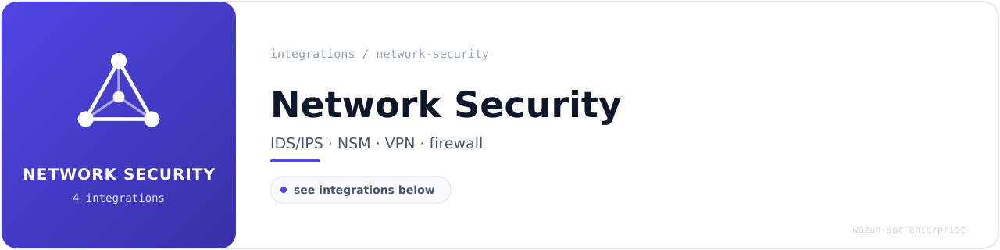

<!-- soc-banner -->

# Network Security

Perimeter and network-layer detection: inline prevention, protocol metadata, encrypted
tunnelling and host firewall telemetry.

**5 documented integrations** in this category.
Each guide includes configuration, validated `wazuh-logtest` output, OpenSearch DevTools
queries and dashboard screenshots captured during validation.

---

## Integrations

| Integration | What it detects | Rules | ID range | MITRE ATT&CK |
| --- | --- | :---: | --- | --- |
| **[Suricata IDS/IPS](suricata-integration.md)** | Inline IPS via NFQUEUE queue 3; 7 custom SIDs plus Wazuh correlation with frequency logic | 6 | `113000-113005` | T1046, T1071.001, T1021 |
| **[Zeek NSM](zeek-integration.md)** | Protocol metadata across 7 log streams: CONN, DNS, HTTP, SSL, FILES, NOTICE, WEIRD | -- | `native` | T1021, T1018, T1573 |
| **[WireGuard](wireguard-integration.md)** | VPN tunnel establishment, peer handshakes and session anomalies | 12 | `100200-100222` | -- |
| **[UFW](ufw-integration.md)** | Host firewall drops, blocked ports and source-IP patterns | 9 | `100100-100108` | T1046, T1110, T1499 |
| **[Fail2ban](fail2ban-integration.md)** | SSH intrusion prevention: ban/unban events and persistent-attacker correlation | 4 | `100800-100803` | T1110 |

`--` indicates the integration relies on native Wazuh decoders or operates outside the custom
rule ID space. Rule counts reflect what each guide documents; the authoritative corpus totals
live in [`METRICS.md`](../../METRICS.md) and are verified by
[`verify-metrics.sh`](../../scripts/verify-metrics.sh).

---

## Navigation

[**Portfolio home**](../../README.md) ·
[All integrations](../README.md) ·
[Detection coverage](../../detection-coverage/attack-coverage.md) ·
[SOC playbooks](../../playbooks/README.md) ·
[Incident reports](../../incident-reports/README.md)
