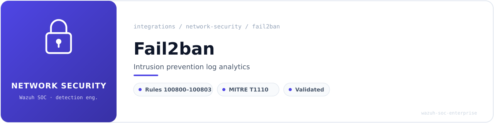

<!-- soc-banner -->
<p align="center"></p>

<p align="center">
   
</p>

# Fail2ban — Wazuh Integration

> **Current lab version:** Wazuh 4.14.6
> **Validated against:** Wazuh 4.14.6 · Fail2ban 1.0.2
> **Last revalidated:** 2026-07-29

| Field | Value |
|---|---|
| **Author** | Bruno Flausino |
| **Version** | 1.0 (Production) |
| **Date** | 2026-07-29 |
| **Environment** | Ubuntu 24.04 LTS — Bare Metal |
| **Wazuh Version** | 4.14.6 |
| **Fail2ban Version** | 1.0.2 |
| **Integration Category** | Network Security |
| **Log Source** | `/var/log/fail2ban.log` |
| **Custom Decoders** | `fail2ban`, `fail2ban-action` |
| **Wazuh Rules** | 100800–100803 |
| **MITRE ATT&CK** | T1110 (Brute Force) — Credential Access |

---

## Table of Contents

1. [Executive Summary](#1-executive-summary)
2. [Architecture Overview](#2-architecture-overview)
3. [Installation](#3-installation)
4. [Fail2ban Configuration](#4-fail2ban-configuration)
5. [Wazuh Log Collection](#5-wazuh-log-collection)
6. [Custom Decoder](#6-custom-decoder)
7. [Custom Detection Rules](#7-custom-detection-rules)
8. [Testing and Validation](#8-testing-and-validation)
9. [Synthetic Event Generation](#9-synthetic-event-generation)
10. [OpenSearch DevTools Queries](#10-opensearch-devtools-queries)
11. [Dashboard Visualizations](#11-dashboard-visualizations)
12. [Troubleshooting](#12-troubleshooting)
13. [File Reference Summary](#13-file-reference-summary)

---

## 1. Executive Summary

This document describes the production integration of **Fail2ban 1.0.2** with **Wazuh 4.14.6** on Ubuntu 24.04 LTS. The integration ingests Fail2ban's intrusion-prevention events into the Wazuh SIEM, decodes them with custom decoders, and applies custom detection rules with MITRE ATT&CK mapping and frequency-based brute-force correlation.

### Key Capabilities

- **Custom decoder pair** (`fail2ban`, `fail2ban-action`) extracting `jail`, `f2b_action`, and `srcip` from Fail2ban's native log format
- **4 Wazuh rules** (100800–100803) covering ban events, unban events, and persistent-attacker correlation
- **Frequency-based correlation** — rule 100803 triggers at level 10 when the same IP is banned 3+ times within a 10-minute window
- **MITRE ATT&CK mapping** — T1110 (Brute Force) under the Credential Access tactic
- **Full OpenSearch indexing** of `data.srcip`, `data.jail`, `data.f2b_action` fields
- **Dashboard** with 5 panels covering event volume, ban/unban timeline, top attacking IPs, attacker detail, and persistent-attacker correlation

### Validation Results

| Metric | Result |
|---|---|
| Wazuh rules validated | 4 (100800–100803) |
| Custom decoders validated | 2 (`fail2ban`, `fail2ban-action`) |
| Synthetic events generated | 44 alerts (20 bans, 22 unbans, 2 correlations) |
| Unique source IPs indexed | 16 |
| End-to-end pipeline | Confirmed via DevTools aggregation |

> **Note on Fail2ban and Wazuh.** Wazuh ships no first-party decoder or ruleset for Fail2ban. The following confirms the absence of any pre-existing Fail2ban ruleset on the manager, so the decoder and rules in this guide are entirely custom and self-authored:
>
> ```console
> $ sudo grep -rl 'fail2ban' /var/ossec/ruleset/decoders/ /var/ossec/ruleset/rules/ 2>/dev/null
> $
> ```

---

## 2. Architecture Overview

The integration follows the standard Wazuh log-analysis pipeline:

```
Fail2ban (sshd jail)
   │  writes NOTICE events
   ▼
/var/log/fail2ban.log
   │  read by
   ▼
wazuh-logcollector  ──►  wazuh-analysisd
                              │  Phase 1: pre-decoding
                              │  Phase 2: custom decoder (fail2ban, fail2ban-action)
                              │  Phase 3: custom rules (100800–100803)
                              ▼
                        /var/ossec/logs/alerts/alerts.json
                              │  shipped by
                              ▼
                         Filebeat 7.10.2
                              │
                              ▼
                    OpenSearch Indexer (wazuh-alerts-4.x-*)
                              │
                              ▼
                    OpenSearch Dashboards (Visualize + Dashboard)
```

---

## 3. Installation

Fail2ban was installed from the Ubuntu Noble repositories:

```bash
sudo apt update && sudo apt install -y fail2ban
```

Installed version:

```console
$ fail2ban-client --version
Fail2Ban v1.0.2
```

Enable and start the service:

```bash
sudo systemctl enable --now fail2ban
```

Service status after start:

```console
$ sudo systemctl status fail2ban
● fail2ban.service - Fail2Ban Service
     Loaded: loaded (/usr/lib/systemd/system/fail2ban.service; enabled; preset: enabled)
     Active: active (running)
       Docs: man:fail2ban(1)
   Main PID: 13942 (fail2ban-server)
     CGroup: /system.slice/fail2ban.service
             └─13942 /usr/bin/python3 /usr/bin/fail2ban-server -xf start

fail2ban-server[13942]: Server ready
```

---

## 4. Fail2ban Configuration

Configuration uses a local override file so that package upgrades never overwrite custom settings. The main `jail.conf` is never edited directly.

**File:** `/etc/fail2ban/jail.local`

```ini
[DEFAULT]
bantime  = 3600
findtime = 600
maxretry = 5
backend  = systemd
banaction = iptables-multiport

[sshd]
enabled  = true
port     = ssh
filter   = sshd
logpath  = /var/log/auth.log
maxretry = 3
bantime  = 7200
```

Configuration notes:

- `backend = systemd` reads authentication events from the systemd journal.
- `banaction = iptables-multiport` applies bans via iptables.
- The `[sshd]` jail is tuned more strictly than the default (`maxretry = 3`, `bantime = 7200`) because SSH is the primary attack surface.

Apply and verify:

```bash
sudo systemctl restart fail2ban
```

```console
$ sudo fail2ban-client status sshd
Status for the jail: sshd
|- Filter
|  |- Currently failed: 0
|  |- Total failed:     0
|  `- Journal matches:  _SYSTEMD_UNIT=sshd.service + _COMM=sshd
`- Actions
   |- Currently banned: 0
   |- Total banned:     0
   `- Banned IP list:
```

---

## 5. Wazuh Log Collection

Fail2ban writes its own log file at `/var/log/fail2ban.log`. A dedicated `<localfile>` block was added to the manager configuration to monitor it.

**File:** `/var/ossec/etc/ossec.conf` (appended block)

```xml
<ossec_config>
  <localfile>
    <log_format>syslog</log_format>
    <location>/var/log/fail2ban.log</location>
  </localfile>
</ossec_config>
```

Restart the manager and confirm the log collector is monitoring the file:

```bash
sudo systemctl restart wazuh-manager
```

```console
$ sudo grep -i 'fail2ban.log' /var/ossec/logs/ossec.log | tail -1
wazuh-logcollector: INFO: (1950): Analyzing file: '/var/log/fail2ban.log'.
```

> **Operational detail.** The Wazuh log collector begins reading a monitored file from its **end** (tail) when the service starts. Events written before the manager finished starting are never processed. When generating synthetic events, always confirm `wazuh-manager` is fully started first.

---

## 6. Custom Decoder

Fail2ban's native log format is:

```
2026-07-29 06:12:22,236 fail2ban.actions        [1761]: NOTICE  [sshd] Ban 198.51.100.211
```

The Wazuh pre-decoder consumes the leading `<timestamp> fail2ban.<module>` portion as a syslog header, leaving the custom decoder to operate on the tail beginning at `[pid]: NOTICE ...`. The decoder patterns therefore anchor on `NOTICE` and the bracketed jail, **not** on the literal string `fail2ban`.

**File:** `/var/ossec/etc/decoders/local_fail2ban_decoders.xml`

```xml
<!-- Fail2ban native logfile decoder (/var/log/fail2ban.log) -->

<decoder name="fail2ban">
  <prematch>NOTICE</prematch>
</decoder>

<decoder name="fail2ban-action">
  <parent>fail2ban</parent>
  <regex type="pcre2">\[(\S+)\]\s+(Ban|Unban)\s+(\d+\.\d+\.\d+\.\d+)</regex>
  <order>jail, f2b_action, srcip</order>
</decoder>
```

Extracted fields:

| Field | Meaning | Example |
|---|---|---|
| `jail` | Fail2ban jail that fired | `sshd` |
| `f2b_action` | Action taken | `Ban` / `Unban` |
| `srcip` | Banned source IP | `198.51.100.211` |

Ownership and permissions:

```bash
sudo chown wazuh:wazuh /var/ossec/etc/decoders/local_fail2ban_decoders.xml
sudo chmod 660 /var/ossec/etc/decoders/local_fail2ban_decoders.xml
```

---

## 7. Custom Detection Rules

Four rules implement layered detection: a silent grouping parent, a Ban rule, an Unban rule, and a frequency-based correlation rule.

**File:** `/var/ossec/etc/rules/local_fail2ban_rules.xml`

```xml
<group name="fail2ban,">

  <!-- Base: any decoded Fail2ban event (silent, level 0) -->
  <rule id="100800" level="0">
    <decoded_as>fail2ban</decoded_as>
    <description>Fail2ban messages grouped.</description>
  </rule>

  <!-- Ban -->
  <rule id="100801" level="6">
    <if_sid>100800</if_sid>
    <field name="f2b_action">^Ban$</field>
    <description>Fail2ban: host $(srcip) banned by jail $(jail)</description>
    <mitre>
      <id>T1110</id>
    </mitre>
    <group>authentication_failures,brute_force,</group>
  </rule>

  <!-- Unban -->
  <rule id="100802" level="3">
    <if_sid>100800</if_sid>
    <field name="f2b_action">^Unban$</field>
    <description>Fail2ban: host $(srcip) unbanned from jail $(jail)</description>
    <group>fail2ban,</group>
  </rule>

  <!-- Correlation: same IP banned 3 times in 10 minutes -->
  <rule id="100803" level="10" frequency="3" timeframe="600">
    <if_matched_sid>100801</if_matched_sid>
    <same_source_ip />
    <description>Fail2ban: repeated bans on $(srcip) - persistent attacker</description>
    <mitre>
      <id>T1110</id>
    </mitre>
    <group>brute_force,attack,</group>
  </rule>

</group>
```

Rule summary:

| Rule ID | Level | Trigger | MITRE | Purpose |
|---|:---:|---|:---:|---|
| 100800 | 0 | Any decoded Fail2ban event | — | Silent parent for grouping |
| 100801 | 6 | `f2b_action = Ban` | T1110 | Individual ban event |
| 100802 | 3 | `f2b_action = Unban` | — | Ban lifted / expired |
| 100803 | 10 | Same IP banned 3× in 600s | T1110 | Persistent brute-force attacker |

Ownership and permissions:

```bash
sudo chown wazuh:wazuh /var/ossec/etc/rules/local_fail2ban_rules.xml
sudo chmod 660 /var/ossec/etc/rules/local_fail2ban_rules.xml
```

---

## 8. Testing and Validation

### 8.1 Configuration validation with `wazuh-analysisd`

Before every manager restart, the ruleset was validated with the analysis daemon test mode:

```console
$ sudo /var/ossec/bin/wazuh-analysisd -t
wazuh-analysisd: WARNING: (1103): Could not open file 'etc/lists/osint/osint_ipv4_reputation' due to [(2)-(No such file or directory)].
wazuh-analysisd: WARNING: (7616): List 'etc/lists/osint/osint_ipv4_reputation' could not be loaded. Rule '113101' will be ignored.
wazuh-analysisd: WARNING: (7616): List 'etc/lists/osint/osint_ipv4_reputation' could not be loaded. Rule '113103' will be ignored.
```

> The `osint_ipv4_reputation` warnings belong to a separate OSINT CDB integration and are unrelated to Fail2ban. No error references the Fail2ban decoder or rules — the configuration is valid.

### 8.2 Rule validation with `wazuh-logtest`

Each rule was validated individually before generating any live events.

**Ban event (rule 100801):**

Input:

```
2026-07-26 15:09:21,427 fail2ban.actions        [13942]: NOTICE  [sshd] Ban 192.168.1.100
```

Output:

```
**Phase 2: Completed decoding.
	name: 'fail2ban'
	f2b_action: 'Ban'
	jail: 'sshd'
	srcip: '192.168.1.100'

**Phase 3: Completed filtering (rules).
	id: '100801'
	level: '6'
	description: 'Fail2ban: host 192.168.1.100 banned by jail sshd'
	groups: '['fail2ban', 'authentication_failures', 'brute_force']'
	mitre.id: '['T1110']'
	mitre.tactic: '['Credential Access']'
	mitre.technique: '['Brute Force']'
**Alert to be generated.
```

**Unban event (rule 100802):**

Input:

```
2026-07-26 15:22:49,234 fail2ban.actions        [13942]: NOTICE  [sshd] Unban 192.168.1.100
```

Output:

```
**Phase 2: Completed decoding.
	name: 'fail2ban'
	f2b_action: 'Unban'
	jail: 'sshd'
	srcip: '192.168.1.100'

**Phase 3: Completed filtering (rules).
	id: '100802'
	level: '3'
	description: 'Fail2ban: host 192.168.1.100 unbanned from jail sshd'
**Alert to be generated.
```

**Correlation (rule 100803):** pasting the same Ban event three times within one logtest session triggers the correlation on the third occurrence:

```
**Phase 3: Completed filtering (rules).
	id: '100803'
	level: '10'
	description: 'Fail2ban: repeated bans on 192.168.1.100 - persistent attacker'
	groups: '['fail2ban', 'brute_force', 'attack']'
	frequency: '3'
	mitre.id: '['T1110']'
	mitre.tactic: '['Credential Access']'
	mitre.technique: '['Brute Force']'
**Alert to be generated.
```

All four rules validated: 100800 (silent grouping), 100801 (Ban, level 6), 100802 (Unban, level 3), 100803 (correlation, level 10).

---

## 9. Synthetic Event Generation

To populate the dashboard and validate the full pipeline, synthetic ban/unban events were generated using `fail2ban-client`. All IPs are from reserved documentation ranges (RFC 5737: `192.0.2.0/24`, `198.51.100.0/24`, `203.0.113.0/24`) and are harmless.

**Script** (also reproduced in full below):

```bash
#!/bin/bash
JAIL="sshd"
IPS=(
  203.0.113.100 203.0.113.101 203.0.113.102 203.0.113.103 203.0.113.104
  198.51.100.110 198.51.100.111 198.51.100.112 198.51.100.113
  192.0.2.120 192.0.2.121 192.0.2.122 192.0.2.123 192.0.2.124
)
PERSIST1="198.51.100.211"
PERSIST2="192.0.2.211"

echo "=== Phase 1: Distributed bans (rule 100801) ==="
for ip in "${IPS[@]}"; do
  sudo fail2ban-client set "$JAIL" banip "$ip" >/dev/null 2>&1
  echo "  Ban $ip"; sleep 0.4
done
sleep 2

echo "=== Phase 2: Partial unbans (rule 100802) ==="
for ip in "${IPS[@]:0:7}"; do
  sudo fail2ban-client set "$JAIL" unbanip "$ip" >/dev/null 2>&1
  echo "  Unban $ip"; sleep 0.4
done
sleep 2

echo "=== Phase 3: Persistent attacker 1 (rule 100803) ==="
for i in 1 2 3 4; do
  sudo fail2ban-client set "$JAIL" banip "$PERSIST1" >/dev/null 2>&1
  sudo fail2ban-client set "$JAIL" unbanip "$PERSIST1" >/dev/null 2>&1
  sleep 0.5
done

echo "=== Phase 4: Persistent attacker 2 (rule 100803) ==="
for i in 1 2 3 4; do
  sudo fail2ban-client set "$JAIL" banip "$PERSIST2" >/dev/null 2>&1
  sudo fail2ban-client set "$JAIL" unbanip "$PERSIST2" >/dev/null 2>&1
  sleep 0.5
done
sleep 2

echo "=== Cleanup ==="
for ip in "${IPS[@]:7}"; do
  sudo fail2ban-client set "$JAIL" unbanip "$ip" >/dev/null 2>&1
done
```

Local alert verification immediately after the run:

```console
$ echo "100801: $(sudo grep -c '"id":"100801"' /var/ossec/logs/alerts/alerts.json)"
$ echo "100802: $(sudo grep -c '"id":"100802"' /var/ossec/logs/alerts/alerts.json)"
$ echo "100803: $(sudo grep -c '"id":"100803"' /var/ossec/logs/alerts/alerts.json)"
100801: 20
100802: 22
100803: 2
```

> **Fail2ban state caveat.** `fail2ban-client banip` emits a `NOTICE Ban` only when the IP is not already banned. Re-banning an already-banned IP produces an `already banned` INFO line that the decoder ignores. Re-running the generator requires fresh IP addresses to guarantee new decodable events.

---

## 10. OpenSearch DevTools Queries

After the synthetic events were generated and Filebeat drained (~15–20s), the alerts were confirmed in the OpenSearch index.

**Query — aggregate Fail2ban alerts by rule ID and source IP:**

```json
GET wazuh-alerts-*/_search
{
  "size": 0,
  "query": {
    "bool": {
      "filter": [
        { "term": { "rule.groups": "fail2ban" } },
        { "range": { "timestamp": { "gte": "now-30m" } } }
      ]
    }
  },
  "aggs": {
    "por_regra": { "terms": { "field": "rule.id" } },
    "por_ip":    { "terms": { "field": "data.srcip", "size": 20 } }
  }
}
```

**Response (abridged):**

```json
{
  "hits": { "total": { "value": 44, "relation": "eq" } },
  "aggregations": {
    "por_regra": {
      "buckets": [
        { "key": "100802", "doc_count": 22 },
        { "key": "100801", "doc_count": 20 },
        { "key": "100803", "doc_count": 2 }
      ]
    },
    "por_ip": {
      "buckets": [
        { "key": "192.0.2.211",    "doc_count": 8 },
        { "key": "198.51.100.211", "doc_count": 8 },
        { "key": "192.0.2.120",    "doc_count": 2 },
        { "key": "198.51.100.110", "doc_count": 2 },
        { "key": "203.0.113.100",  "doc_count": 2 }
      ]
    }
  }
}
```

Results confirm the complete pipeline:

- **44 total alerts** indexed (20 bans + 22 unbans + 2 correlations).
- The two persistent attackers (`192.0.2.211`, `198.51.100.211`) each account for **8 documents** (4 bans + 4 unbans) and correctly triggered the level-10 correlation rule.
- The remaining IPs each produced 2 documents (1 ban + 1 unban).

End-to-end chain proven: **Fail2ban → log file → logcollector → decoder → rules → analysisd → alerts.json → Filebeat → indexer → DevTools**.

---

## 11. Dashboard Visualizations

A dedicated OpenSearch dashboard visualizes the Fail2ban detection data across five panels.


### Panel inventory

| # | Panel | Chart type | Field(s) | Aggregation(s) | DQL |
|---|---|---|---|---|---|
| 1 | Event Volume and Unique Attacker Count | Metric | `data.srcip` | Count, Unique Count | `rule.groups: "fail2ban"` |
| 2 | Ban vs Unban Activity Over Time | Vertical Bar (stacked) | `timestamp`, `rule.id` | Count, Date Histogram, Terms | `rule.groups: "fail2ban"` |
| 3 | Top 10 Most Frequently Banned Source IPs | Horizontal Bar | `data.srcip` | Count, Terms | `rule.groups: "fail2ban" and rule.id: "100801"` |
| 4 | Attacker Intelligence Table | Data Table | `data.srcip`, `rule.description`, `timestamp` | Count, Terms, Top Hit | `rule.groups: "fail2ban" and rule.id: "100801"` |
| 5 | Persistent Attacker Correlation Hits | Data Table | `data.srcip`, `rule.mitre.technique`, `timestamp` | Count, Terms, Top Hit | `rule.id: "100803"` |

### Observed results

- **Panel 1:** 44 total events, 16 unique attacking IPs.
- **Panel 2:** single stacked spike — 22 unbans (100802), 20 bans (100801), 2 correlations (100803). Legend keyed by rule ID.
- **Panel 3:** two persistent attackers at ban count 3, all other IPs at 1.
- **Panel 4:** per-IP detail with jail name (from the rule description) and last-seen timestamp.
- **Panel 5:** two rows — `192.0.2.211` and `198.51.100.211` — both mapped to `Brute Force` (T1110). This is the detection-engineering centerpiece: it surfaces correlated attack campaigns rather than isolated log events.

> **Dashboard field-naming note.** The custom decoder emits `f2b_action` and `jail`. These are correctly decoded, alerted, and indexed, and are queryable in Dev Tools. However, the OpenSearch Dashboards Visualize field dropdown only lists fields defined in `wazuh-template.json`; custom field names are not selectable there. Panels 2 therefore uses the built-in `rule.id` field to distinguish Ban (100801) from Unban (100802) rather than `data.f2b_action`. This is a known Wazuh Visualize limitation and does not affect the underlying detection.

---

## 12. Troubleshooting

| Symptom | Root cause | Fix |
|---|---|---|
| No decoder matched in `wazuh-logtest` | Decoder anchored on the word `fail2ban`, which the pre-decoder strips as a syslog header | Anchor the decoder on the tail (`NOTICE`, bracketed jail), as shown in section 6 |
| Panels show zero data, storm was recent | Log collector reads a monitored file from its end on restart; events written before startup are skipped | Confirm `wazuh-manager` is fully started, then generate events; check the `Analyzing file` timestamp in `ossec.log` |
| Re-running the storm produces no new alerts | `fail2ban-client banip` is idempotent — already-banned IPs emit `already banned` (INFO), not `NOTICE Ban` | Use fresh IP addresses on each re-run |
| Field not selectable in Visualize dropdown | Custom field names (`f2b_action`, `jail`) are absent from `wazuh-template.json` (Wazuh issue #19007) | Use built-in fields (`rule.id`, `data.srcip`) for visualization splits |
| Alerts in `alerts.json` but not in the index | Filebeat not delivering to the indexer | Run `sudo filebeat test output` and confirm `talk to server... OK` |

---

## 13. File Reference Summary

All configuration artifacts are reproduced inline in the sections above.

| Artifact | Section | Live manager path |
|---|---|---|
| Custom decoders `fail2ban`, `fail2ban-action` | [§6 Custom Decoder](#6-custom-decoder) | `/var/ossec/etc/decoders/local_fail2ban_decoders.xml` |
| Custom rules 100800–100803 | [§7 Custom Detection Rules](#7-custom-detection-rules) | `/var/ossec/etc/rules/local_fail2ban_rules.xml` |
| Fail2ban jail configuration | [§4 Fail2ban Configuration](#4-fail2ban-configuration) | `/etc/fail2ban/jail.local` |
| Wazuh `<localfile>` block | [§5 Wazuh Log Collection](#5-wazuh-log-collection) | `/var/ossec/etc/ossec.conf` |
| Synthetic event generator | [§9 Synthetic Event Generation](#9-synthetic-event-generation) | run from any shell with `sudo` |

### Live manager paths

```
/var/ossec/
├── etc/
│   ├── ossec.conf                              # <localfile> for /var/log/fail2ban.log
│   ├── decoders/
│   │   └── local_fail2ban_decoders.xml         # fail2ban, fail2ban-action
│   └── rules/
│       └── local_fail2ban_rules.xml            # rules 100800–100803
└── logs/
    └── alerts/
        └── alerts.json                         # generated alerts

/etc/fail2ban/
└── jail.local                                  # sshd jail configuration
```

---

## Navigation

[**Portfolio home**](../../README.md) ·
[All integrations](../README.md) ·
[Network Security](README.md) ·
[Detection coverage](../../detection-coverage/attack-coverage.md) ·
[SOC playbooks](../../playbooks/README.md)
