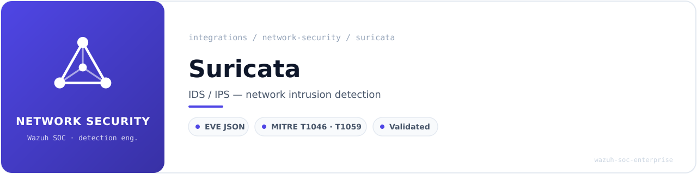
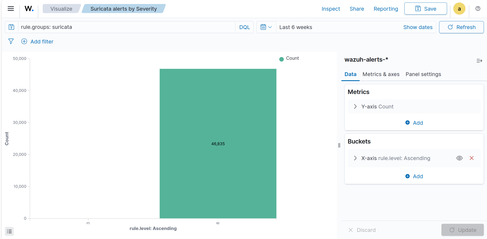
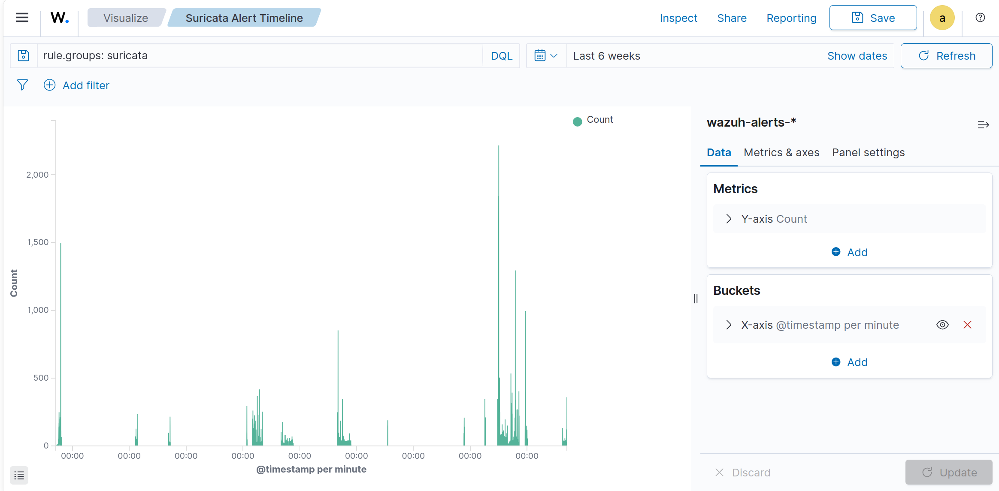
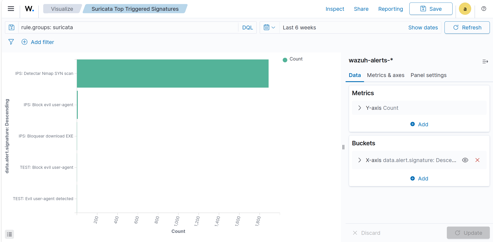
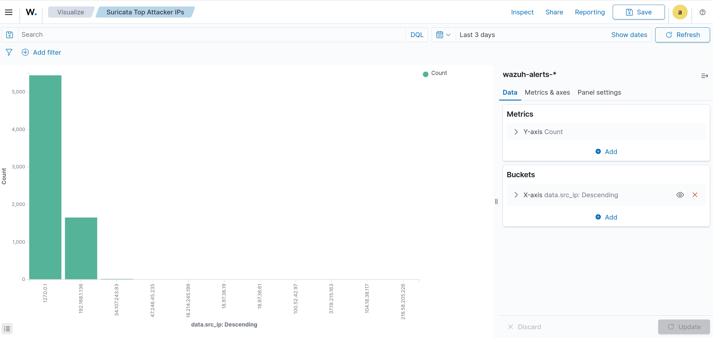
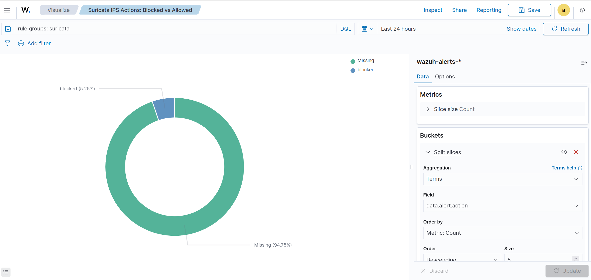

<!-- soc-banner -->
<p align="center"></p>

<p align="center">
   
</p>

# Suricata IDS/IPS — Wazuh Integration

| Field | Value |
|---|---|
| **Author** | Bruno Flausino |
| **Version** | 3.0 (Production) |
| **Date** | 2026-04-19 |
| **Environment** | Ubuntu 24.04 LTS — Bare Metal |
| **Wazuh Version** | 4.14.4 |
| **Suricata Version** | 8.0.4 |
| **Integration Category** | Network Security |
| **Suricata Rules (local.rules)** | SID 2100498–2100504 |
| **Wazuh Rules** | 113000–113005 |

---

## Table of Contents

1. [Executive Summary](#1-executive-summary)
2. [Architecture Overview](#2-architecture-overview)
3. [Prerequisites](#3-prerequisites)
4. [Directory Structure](#4-directory-structure)
5. [Installation](#5-installation)
6. [Suricata Configuration](#6-suricata-configuration)
7. [Suricata Custom Rules (local.rules)](#7-suricata-custom-rules-localrules)
8. [Wazuh Integration](#8-wazuh-integration)
9. [Testing and Validation](#9-testing-and-validation)
10. [OpenSearch DevTools Queries](#10-opensearch-devtools-queries)
11. [Dashboard Visualizations](#11-dashboard-visualizations)
12. [Performance Notes](#12-performance-notes)
13. [Troubleshooting](#13-troubleshooting)
14. [File Reference Summary](#14-file-reference-summary)

---

## 1. Executive Summary

This document describes the production integration of **Suricata 8.0.4** with **Wazuh 4.14.4** on Ubuntu 24.04 LTS. The integration delivers real-time network intrusion detection and prevention (IDS/IPS) with full event correlation, centralized alerting, and dashboard visualization.

### Key Capabilities

- **IPS inline mode** via NFQUEUE (queue 3) — active packet blocking with fail-open safety
- **7 custom Suricata rules** (SID 2100498–2100504) covering evil user-agents, EXE downloads, Nmap scans, SSH brute force, Telnet cleartext, and SMBv1 exploits
- **6 Wazuh correlation rules** (113000–113005) with MITRE ATT&CK mappings (T1071.001, T1046)
- **Frequency-based correlation** — rule 113005 triggers on 10+ drops from the same source IP within 60 seconds
- **Full OpenSearch indexing** of `data.src_ip`, `data.dest_ip`, `data.alert.signature`, `data.alert.action` fields
- **Dashboard** with 5 panels covering severity distribution, alert timeline, top signatures, top attacker IPs, and IPS action breakdown

### Validation Results

| Metric | Result |
|---|---|
| Wazuh rules validated | 6 (113000–113005) |
| Suricata custom rules | 7 (SID 2100498–2100504) |
| Total alerts indexed | 46,835+ |
| IPS block rate | 4.06% of total traffic |
| Top attacker IPs identified | 10 (127.0.0.1, 192.168.1.136, 192.168.1.51, 34.107.243.93, ...) |
| MITRE ATT&CK coverage | T1071.001 (Application Layer Protocol), T1046 (Network Service Scanning) |
| OpenSearch field mapping | Confirmed for all `data.alert.*` and `data.src_ip`/`data.dest_ip` fields |

---

## 2. Architecture Overview

```
+---------------------+     +-------------------------+     +------------------+
|   Network Traffic   |     |     Wazuh Manager       |     |   OpenSearch     |
|  (all interfaces)   | --> |  Logcollector (eve.json) | --> |  Indexer         |
|                     |     |  Analysisd (rules)      |     |  Dashboard       |
+---------------------+     +-------------------------+     +------------------+
         |
         v
+---------------------+
|   Suricata 8.0.4    |
|  NFQUEUE (queue 3)  |
|  IPS inline mode    |
|  eve.json output    |
+---------------------+
```

### Data Flow (7 Steps)

| Step | Component | Action |
|---|---|---|
| 1 | iptables | INPUT/OUTPUT/FORWARD traffic sent to NFQUEUE queue 3 |
| 2 | Suricata | Inspects packets against `local.rules` + Emerging Threats |
| 3 | Suricata | Matching traffic: `drop` (blocked) or `alert` (logged) |
| 4 | Suricata | Event written to `/var/log/suricata/eve.json` |
| 5 | Logcollector | Reads eve.json (JSON format with `@program_name: suricata` label) |
| 6 | Analysisd | Decoder `suricata-eve` parses JSON → rules 113000–113005 fire |
| 7 | OpenSearch | Alert indexed in `wazuh-alerts-*` with all `data.*` fields |

---

## 3. Prerequisites

### System Requirements

```bash
# Verify OS
cat /etc/os-release | grep -E "^NAME|^VERSION"
# NAME="Ubuntu"
# VERSION="24.04 LTS (Noble Numbat)"

# Verify Wazuh Manager
systemctl status wazuh-manager --no-pager
# Active: active (running)
```

### Required Packages

```bash
# Add Suricata repository
sudo add-apt-repository ppa:oisf/suricata-stable
sudo apt update

# Install Suricata
sudo apt install -y suricata suricata-update

# Verify
suricata --version
# Suricata 8.0.4

# Install iptables-persistent for NFQUEUE rules
sudo apt install -y iptables-persistent
```

---

## 4. Directory Structure

```
/etc/suricata/
├── suricata.yaml               # Main configuration (IPS inline, NFQUEUE)
├── rules/
│   └── local.rules             # Custom IPS/IDS rules (SID 2100498–2100504)
├── classification.config
├── reference.config
└── threshold.config

/var/log/suricata/
├── suricata.log                # Main Suricata log
├── eve.json                    # Structured JSON events (read by Wazuh)
├── fast.log                    # Legacy fast alerts
└── stats.log                   # Performance statistics

/var/ossec/
├── etc/
│   ├── decoders/
│   │   └── local_decoders.xml  # suricata-eve decoder
│   └── rules/
│       └── suricata_local.xml  # Wazuh rules 113000–113005
└── logs/
    └── alerts/
        └── alerts.json         # All Wazuh alerts
```

---

## 5. Installation

### Step 1 — Install and Enable Suricata

```bash
sudo add-apt-repository ppa:oisf/suricata-stable
sudo apt update
sudo apt install -y suricata suricata-update

# Enable service
sudo systemctl enable suricata

# Verify
suricata --version
```

### Step 2 — Systemd Service Override

**File:** `/etc/systemd/system/suricata.service.d/override.conf`

```ini
[Service]
Type=simple
ExecStart=
ExecStart=/usr/bin/suricata -q 3 -c /etc/suricata/suricata.yaml
User=root
Group=root
Restart=on-failure
RestartSec=5s
```

```bash
sudo systemctl daemon-reload
sudo systemctl restart suricata
```

**Critical:** The `-q 3` flag must match `nfq.queue: 3` in `suricata.yaml`.

### Step 3 — Configure NFQUEUE Persistence via UFW

**Important:** Do NOT install `iptables-persistent` — it conflicts with and removes UFW. Use `/etc/ufw/before.rules` instead.

**File:** `/etc/ufw/before.rules` (add before `COMMIT` in `*filter` table)

```
# Suricata IPS - NFQUEUE rules
-I ufw-before-input -j NFQUEUE --queue-num 3 --queue-bypass
-I ufw-before-output -j NFQUEUE --queue-num 3 --queue-bypass

# don't delete the 'COMMIT' line or these rules won't be processed
COMMIT
```

```bash
# Apply
sudo ufw reload

# Verify NFQUEUE is active
sudo iptables -L ufw-before-input -n | grep NFQUEUE
sudo cat /proc/net/netfilter/nfnetlink_queue
```

### Step 3 — Update Rule Sources

```bash
# Enable Emerging Threats open ruleset
sudo suricata-update enable-source et/open

# Download rules
sudo suricata-update

# Verify
suricata -T -c /etc/suricata/suricata.yaml
```

---

## 6. Suricata Configuration

### 6.1 Key Settings (suricata.yaml)

```yaml
vars:
  address-groups:
    HOME_NET: "[192.168.1.0/24]"
    EXTERNAL_NET: "!$HOME_NET"

# IPS inline via NFQUEUE
nfq:
  mode: accept
  queue: 3
  fail-open: yes
  batch-size: 20

# Stream engine for inline inspection
stream:
  inline: yes
  reassembly:
    memcap: 256mb
    depth: 1mb

# EVE JSON structured output
outputs:
  - eve-log:
      enabled: yes
      filetype: regular
      filename: /var/log/suricata/eve.json
      types:
        - alert:
            payload: yes
            payload-printable: yes
            metadata: yes
        - drop:
            alerts: yes
            flows: all
        - http:
            extended: yes
        - dns:
            query: yes
            answer: yes
        - tls:
            extended: yes

# Threading (adjust to your CPU count)
threading:
  set-cpu-affinity: yes
  cpu-affinity:
    - management-cpu-set:
        cpu: [ 0 ]
    - worker-cpu-set:
        cpu: [ 1,2,3,4,5,6,7 ]
        mode: exclusive

# Rule path
default-rule-path: /etc/suricata/rules
rule-files:
  - local.rules
```

### 6.2 Validate Configuration

```bash
sudo suricata -T -c /etc/suricata/suricata.yaml
# Configuration provided was successfully loaded. Exiting.
```

---

## 7. Suricata Custom Rules (local.rules)

**File:** `/etc/suricata/rules/local.rules`

```suricata
# === Suricata 8.0.4 IPS Rules ===
# Author: Bruno Flausino
# Action: DROP (active blocking)

# SID 2100500: Evil user-agent detection
drop http any any -> any any (msg:"IPS: Block evil user-agent"; http.user_agent; content:"evil"; sid:2100500; rev:3;)

# SID 2100499: Suspicious EXE download blocking
drop http any any -> any any (msg:"IPS: Bloquear download EXE"; http.uri; content:".exe"; nocase; sid:2100499; rev:1;)

# SID 2100498: uid=0 in HTTP response (command injection indicator)
drop http any any -> any any (msg:"IPS: Block uid=0 in response"; file.data; content:"uid=0"; sid:2100498; rev:1;)

# SID 2100501: Nmap SYN scan detection
drop tcp any any -> any any (msg:"IPS: Detectar Nmap SYN scan"; flags:S,12; threshold:type both, track by_src, count 10, seconds 10; sid:2100501; rev:1;)

# SID 2100502: SSH brute force protection
drop tcp any any -> $HOME_NET 22 (msg:"IPS: SSH brute force"; flags:S; threshold:type both, track by_src, count 5, seconds 60; sid:2100502; rev:1;)

# SID 2100503: Telnet cleartext blocking
drop tcp any any -> $HOME_NET 23 (msg:"IPS: Telnet cleartext detected"; sid:2100503; rev:1;)

# SID 2100504: SMBv1 exploitation attempt
drop tcp any any -> $HOME_NET 445 (msg:"IPS: SMBv1 exploit attempt"; flow:to_server,established; content:"|FF|SMB|73 00 00 00 00 18 07 C0|"; sid:2100504; rev:1;)
```

### Rule Summary

| SID | Action | Description | MITRE |
|---|---|---|---|
| 2100498 | drop | Block uid=0 in HTTP response | T1059 |
| 2100499 | drop | Block EXE downloads | T1204 |
| 2100500 | drop | Block evil user-agent | T1071.001 |
| 2100501 | drop | Detect Nmap SYN scan | T1046 |
| 2100502 | drop | SSH brute force protection | T1110 |
| 2100503 | drop | Telnet cleartext blocking | T1021 |
| 2100504 | drop | SMBv1 exploit attempt | T1210 |

### Reload Rules Without Restart

```bash
sudo kill -USR2 $(pidof suricata)
```

---

## 8. Wazuh Integration

### 8.1 ossec.conf — Logcollector

Add inside the existing `<ossec_config>` element:

```xml
<!-- Suricata: Collect EVE JSON events -->
<localfile>
  <log_format>json</log_format>
  <location>/var/log/suricata/eve.json</location>
  <label key="@program_name">suricata</label>
  <only-future-events>yes</only-future-events>
</localfile>
```

### 8.2 Permissions

```bash
# Grant Wazuh read access to eve.json
sudo usermod -a -G suricata wazuh
sudo chmod 644 /var/log/suricata/eve.json

# Verify
sudo -u wazuh test -r /var/log/suricata/eve.json && echo "OK"
```

### 8.3 Custom Decoder

**File:** `/var/ossec/etc/decoders/local_decoders.xml`

```xml
<!-- Decoder for Suricata EVE JSON -->
<decoder name="suricata-eve">
  <program_name>suricata</program_name>
  <type>json</type>
  <prematch>^{"timestamp":</prematch>
</decoder>

<decoder name="suricata-eve-fields">
  <parent>suricata-eve</parent>
  <type>json</type>
  <plugin_decoder>JSON_Decoder</plugin_decoder>
</decoder>
```

**Key design note:** The `<prematch>^{"timestamp":</prematch>` ensures only valid Suricata EVE JSON lines are decoded. The child decoder uses `JSON_Decoder` to automatically extract all nested fields (`alert.signature`, `alert.action`, `src_ip`, `dest_ip`, etc.) into the `data.*` namespace.

### 8.4 Custom Rules

**File:** `/var/ossec/etc/rules/suricata_local.xml`

```xml
<group name="suricata,ids,ips">

  <!-- Rule 113000: Base event — any Suricata EVE JSON event -->
  <rule id="113000" level="3">
    <decoded_as>suricata-eve</decoded_as>
    <description>Suricata event detected</description>
  </rule>

  <!-- Rule 113001: IPS DROP by rules (active blocking) -->
  <rule id="113001" level="6">
    <if_sid>113000</if_sid>
    <field name="event_type">drop</field>
    <field name="drop.reason">rules</field>
    <description>Suricata DROP: Packet blocked by rules - $(src_ip) -> $(dest_ip):$(dest_port)</description>
    <group>suricata,ips,drop,attack</group>
  </rule>

  <!-- Rule 113002: DROP by application layer error -->
  <rule id="113002" level="4">
    <if_sid>113000</if_sid>
    <field name="event_type">drop</field>
    <field name="drop.reason">applayer error</field>
    <description>Suricata DROP: Application layer error - $(src_ip)</description>
    <group>suricata,ips,drop,error</group>
  </rule>

  <!-- Rule 113003: Evil user-agent detected (SID 2100500) -->
  <rule id="113003" level="8">
    <if_sid>113000</if_sid>
    <field name="event_type">alert</field>
    <field name="alert.signature_id">2100500</field>
    <description>Suricata ALERT: Evil user-agent detected - $(src_ip)</description>
    <group>suricata,ids,malware,attack</group>
    <mitre>
      <id>T1071.001</id>
    </mitre>
  </rule>

  <!-- Rule 113004: Port scan detected (SID 2100501) -->
  <rule id="113004" level="7">
    <if_sid>113000</if_sid>
    <field name="event_type">alert</field>
    <field name="alert.signature_id">2100501</field>
    <description>Suricata ALERT: Port scan detected - $(src_ip)</description>
    <group>suricata,ids,recon,scan</group>
    <mitre>
      <id>T1046</id>
    </mitre>
  </rule>

  <!-- Rule 113005: Correlation — 10+ drops from same IP in 60s -->
  <rule id="113005" level="10" frequency="10" timeframe="60">
    <if_matched_sid>113001</if_matched_sid>
    <same_src_ip />
    <description>Suricata: Multiple blocked packets from $(src_ip) - Possible attack</description>
    <group>suricata,ips,attack,recon</group>
    <mitre>
      <id>T1046</id>
    </mitre>
  </rule>

</group>
```

### 8.5 Apply Changes

```bash
# Validate configuration
sudo /var/ossec/bin/wazuh-analysisd -t
sudo xmllint --noout /var/ossec/etc/ossec.conf && echo "ossec.conf: OK"
sudo xmllint --noout /var/ossec/etc/decoders/local_decoders.xml && echo "decoder: OK"
sudo xmllint --noout /var/ossec/etc/rules/suricata_local.xml && echo "rules: OK"

# Restart
sudo systemctl restart wazuh-manager
sudo systemctl status wazuh-manager --no-pager
```

---

## 9. Testing and Validation

### 9.1 Test — Evil User-Agent (SID 2100500)

```bash
# Trigger Suricata rule with "evil" user-agent
timeout 3 wget -U "evil-bot" -q -O- http://httpbin.org/user-agent

# Check eve.json for the alert
sudo tail -20 /var/log/suricata/eve.json | jq 'select(.event_type=="alert")'

# Check Wazuh alerts for rule 113003
sudo grep '"id":"113003"' /var/ossec/logs/alerts/alerts.json | tail -3 | python3 -m json.tool
```

### 9.2 Test — Nmap SYN Scan (SID 2100501)

```bash
# Trigger scan detection
sudo nmap -sS -p 1-1000 192.168.1.1

# Check Wazuh alerts for rule 113004
sudo grep '"id":"113004"' /var/ossec/logs/alerts/alerts.json | tail -3 | python3 -m json.tool
```

### 9.3 Validate with wazuh-logtest

```bash
# Test a sample Suricata EVE JSON alert through the decoder/rules pipeline
echo '{"timestamp":"2026-04-10T18:22:08.133364+0200","flow_id":123456789,"in_iface":"enp3s0","event_type":"alert","src_ip":"192.168.1.136","src_port":54321,"dest_ip":"93.184.216.34","dest_port":80,"proto":"TCP","alert":{"action":"blocked","gid":1,"signature_id":2100500,"rev":3,"signature":"IPS: Block evil user-agent","category":"","severity":1},"http":{"hostname":"httpbin.org","url":"/user-agent","http_user_agent":"evil-bot","http_method":"GET","protocol":"HTTP/1.1","status":200}}' \
  | sudo /var/ossec/bin/wazuh-logtest

# Expected output:
# **Phase 1: Completed pre-decoding.
# **Phase 2: Completed decoding.
#   decoder: 'suricata-eve'
# **Phase 3: Completed filtering (rules).
#   Rule id: '113003'
#   Level: '8'
#   Description: 'Suricata ALERT: Evil user-agent detected - 192.168.1.136'
```

### 9.4 Validate with wazuh-logtest — DROP Event

```bash
echo '{"timestamp":"2026-04-10T18:25:00.000000+0200","flow_id":987654321,"event_type":"drop","src_ip":"192.168.1.136","dest_ip":"93.184.216.34","dest_port":80,"proto":"TCP","drop":{"reason":"rules"}}' \
  | sudo /var/ossec/bin/wazuh-logtest

# Expected output:
# **Phase 2: Completed decoding.
#   decoder: 'suricata-eve'
# **Phase 3: Completed filtering (rules).
#   Rule id: '113001'
#   Level: '6'
#   Description: 'Suricata DROP: Packet blocked by rules - 192.168.1.136 -> 93.184.216.34:80'
```

### 9.5 Verify in OpenSearch

Navigate to **Wazuh Dashboard → Security Events** and filter:

```
rule.groups: suricata
```

Expected fields in each alert:

| Field | Example Value |
|---|---|
| `rule.id` | `113001` |
| `rule.level` | `6` |
| `data.src_ip` | `192.168.1.136` |
| `data.dest_ip` | `93.184.216.34` |
| `data.alert.signature` | `IPS: Block evil user-agent` |
| `data.alert.action` | `blocked` |
| `data.event_type` | `alert` or `drop` |

---

## 10. OpenSearch DevTools Queries

Access via **Wazuh Dashboard → Dev Tools**.

### 10.1 Count total Suricata alerts

```json
GET wazuh-alerts-*/_count
{
  "query": {
    "match": { "rule.groups": "suricata" }
  }
}
```

### 10.2 Top attacker IPs

```json
GET wazuh-alerts-*/_search
{
  "size": 0,
  "query": { "match": { "rule.groups": "suricata" } },
  "aggs": {
    "top_attackers": {
      "terms": { "field": "data.src_ip", "size": 20 }
    }
  }
}
```

### 10.3 Top triggered signatures

```json
GET wazuh-alerts-*/_search
{
  "size": 0,
  "query": { "match": { "rule.groups": "suricata" } },
  "aggs": {
    "top_signatures": {
      "terms": { "field": "data.alert.signature.keyword", "size": 10 }
    }
  }
}
```

### 10.4 Alert timeline (per hour)

```json
GET wazuh-alerts-*/_search
{
  "size": 0,
  "query": { "match": { "rule.groups": "suricata" } },
  "aggs": {
    "alerts_over_time": {
      "date_histogram": {
        "field": "@timestamp",
        "calendar_interval": "hour"
      }
    }
  }
}
```

### 10.5 IPS actions breakdown (blocked vs allowed)

```json
GET wazuh-alerts-*/_search
{
  "size": 0,
  "query": { "match": { "rule.groups": "suricata" } },
  "aggs": {
    "by_action": {
      "terms": { "field": "data.alert.action.keyword", "size": 10 }
    }
  }
}
```

### 10.6 Alerts by severity level

```json
GET wazuh-alerts-*/_search
{
  "size": 0,
  "query": { "match": { "rule.groups": "suricata" } },
  "aggs": {
    "by_level": {
      "terms": { "field": "rule.level", "size": 20, "order": { "_key": "asc" } }
    }
  }
}
```

### 10.7 Check field mapping

```json
GET wazuh-alerts-*/_mapping/field/data.src_ip,data.dest_ip,data.alert.signature,data.alert.action
```

---

## 11. Dashboard Visualizations

### Dashboard Summary

**Name:** `Suricata IDS/IPS Dashboard`
**Description:** Real-time monitoring of Suricata network intrusion detection and prevention events integrated with Wazuh SIEM
**Index Pattern:** `wazuh-alerts-*`
**Base Filter:** `rule.groups: suricata`

### Panel Layout

```
+-----------------------------------+-----------------------------------+
|   Suricata alerts by Severity     |   Suricata Alert Timeline         |
|   (Vertical Bar)                  |   (Area Chart)                    |
+-----------------------------------+-----------------------------------+
|   Suricata Top Triggered          |   Suricata Top Attacker IPs       |
|   Signatures (Horizontal Bar)     |   (Vertical Bar)                  |
+-----------------------------------+-----------------------------------+
|   Suricata IPS Actions: Blocked vs Allowed                            |
|   (Pie/Donut Chart — Full Width)                                      |
+-----------------------------------------------------------------------+
```

---

### Visualization 1: Alerts by Severity

**Type:** Vertical Bar
**Title:** `Suricata alerts by Severity`

| Setting | Value |
|---|---|
| Y-Axis | Count |
| X-Axis (Bucket) | Terms — `rule.level` |
| Order | Ascending |

**KQL Filter:** `rule.groups: suricata`



---

### Visualization 2: Alert Timeline

**Type:** Area Chart
**Title:** `Suricata Alert Timeline`

| Setting | Value |
|---|---|
| Y-Axis | Count |
| X-Axis | Date Histogram — `@timestamp` |
| Interval | per minute |

**KQL Filter:** `rule.groups: suricata`



---

### Visualization 3: Top Triggered Signatures

**Type:** Horizontal Bar
**Title:** `Suricata Top Triggered Signatures`

| Setting | Value |
|---|---|
| Y-Axis | Count |
| X-Axis (Bucket) | Terms — `data.alert.signature` |
| Order | Descending |
| Size | 10 |

**KQL Filter:** `rule.groups: suricata`



---

### Visualization 4: Top Attacker IPs

**Type:** Vertical Bar
**Title:** `Suricata Top Attacker IPs`

| Setting | Value |
|---|---|
| Y-Axis | Count |
| X-Axis (Bucket) | Terms — `data.src_ip` |
| Order | Descending |
| Size | 10 |

**Filter:** (no additional filter — shows all sources)



---

### Visualization 5: IPS Actions — Blocked vs Allowed

**Type:** Pie (Donut)
**Title:** `Suricata IPS Actions: Blocked vs Allowed`

| Setting | Value |
|---|---|
| Slice Size | Count |
| Split Slices | Terms — `data.alert.action` |
| Order | Descending |

**KQL Filter:** `rule.groups: suricata`



---

## 12. Performance Notes

### NFQUEUE IPS Impact

Running Suricata in **IPS inline mode** (NFQUEUE) routes all INPUT/OUTPUT/FORWARD traffic through Suricata before delivery. On an all-in-one deployment (Suricata + Wazuh Manager + Indexer + Dashboard on the same bare metal host), this creates a measurable performance impact on network throughput and latency.

**Observed behavior:**

| Condition | Network Performance |
|---|---|
| Suricata running (IPS mode) | Noticeable latency on all connections |
| Suricata stopped | Normal performance restored |

**Recommendation for this deployment:** Keep Suricata stopped during normal operations (`sudo systemctl stop suricata`). Start it for scheduled security assessments, penetration tests, or when actively investigating suspicious traffic. The dashboard and all historical data remain available in OpenSearch regardless of Suricata's runtime status.

**Alternative for passive monitoring:** Switch to `af-packet` mode (IDS only) which mirrors traffic without inline inspection. This eliminates the performance penalty but removes the active blocking capability.

```bash
# Stop Suricata (restore normal network performance)
sudo systemctl stop suricata

# Start for security assessment
sudo systemctl start suricata

# Check status
sudo systemctl status suricata --no-pager
```

---

## 13. Troubleshooting

### Suricata not starting

```bash
# Validate configuration
sudo suricata -T -c /etc/suricata/suricata.yaml

# Check NFQUEUE
sudo cat /proc/net/netfilter/nfnetlink_queue

# Check logs
sudo tail -50 /var/log/suricata/suricata.log
```

### No alerts in Wazuh

```bash
# Verify eve.json is being written
sudo tail -5 /var/log/suricata/eve.json | jq .

# Verify Wazuh can read the file
sudo -u wazuh test -r /var/log/suricata/eve.json && echo "OK"

# Test decoder
echo '{"timestamp":"2026-04-10T18:22:08.000000+0200","event_type":"alert","src_ip":"10.0.0.1","alert":{"signature_id":2100500,"signature":"IPS: Block evil user-agent","action":"blocked"}}' \
  | sudo /var/ossec/bin/wazuh-logtest
```

### Network slowdown when Suricata is running

This is expected in NFQUEUE (IPS inline) mode on an all-in-one deployment. See [Performance Notes](#12-performance-notes) for mitigation strategies.

### NFQUEUE module not found after kernel update

```bash
# Reinstall kernel modules
sudo apt install --reinstall linux-modules-extra-$(uname -r)
sudo depmod -a
sudo systemctl restart suricata
```

### `iptables-persistent` conflicts with UFW

Do NOT install `iptables-persistent` — it removes UFW. Use `/etc/ufw/before.rules` for NFQUEUE persistence instead. See [Step 3 in Installation](#step-3--configure-nfqueue-persistence-via-ufw).

### XML validation errors

```bash
sudo xmllint --noout /var/ossec/etc/ossec.conf && echo "ossec.conf OK"
sudo xmllint --noout /var/ossec/etc/decoders/local_decoders.xml && echo "decoder OK"
sudo xmllint --noout /var/ossec/etc/rules/suricata_local.xml && echo "rules OK"
```

### Field not found in OpenSearch aggregations

Use `.keyword` suffix for text fields in aggregations:

| Incorrect | Correct |
|---|---|
| `data.alert.signature` | `data.alert.signature.keyword` |
| `data.alert.action` | `data.alert.action.keyword` |

---

## 14. File Reference Summary

| File | Purpose |
|---|---|
| `/etc/suricata/suricata.yaml` | Suricata main configuration (NFQUEUE, EVE JSON) |
| `/etc/suricata/rules/local.rules` | Custom IPS rules (SID 2100498–2100504) |
| `/var/log/suricata/eve.json` | Structured JSON events (Logcollector source) |
| `/var/log/suricata/suricata.log` | Suricata main log |
| `/var/ossec/etc/decoders/local_decoders.xml` | Decoder — `suricata-eve` + `JSON_Decoder` |
| `/var/ossec/etc/rules/suricata_local.xml` | Wazuh rules 113000–113005 |
| `/var/ossec/logs/alerts/alerts.json` | All Wazuh alerts (JSON format) |

### Wazuh Rule Summary

| Rule ID | Level | Description | Trigger |
|---|---|---|---|
| 113000 | 3 | Base Suricata event | Decoder `suricata-eve` |
| 113001 | 6 | IPS DROP — packet blocked by rules | `event_type: drop` + `drop.reason: rules` |
| 113002 | 4 | DROP — application layer error | `event_type: drop` + `drop.reason: applayer error` |
| 113003 | 8 | Evil user-agent detected (SID 2100500) | `event_type: alert` + `signature_id: 2100500` |
| 113004 | 7 | Port scan detected (SID 2100501) | `event_type: alert` + `signature_id: 2100501` |
| 113005 | 10 | Correlation — 10+ drops from same IP in 60s | Frequency on rule 113001 |

### Suricata Rule Summary

| SID | Action | Target | Description |
|---|---|---|---|
| 2100498 | drop | HTTP response | uid=0 in response body |
| 2100499 | drop | HTTP URI | .exe download blocking |
| 2100500 | drop | HTTP user-agent | Evil user-agent blocking |
| 2100501 | drop | TCP flags | Nmap SYN scan detection |
| 2100502 | drop | SSH (port 22) | Brute force protection |
| 2100503 | drop | Telnet (port 23) | Cleartext protocol blocking |
| 2100504 | drop | SMB (port 445) | SMBv1 exploit attempt |

---

**Document Version:** 3.0 — Production
**Wazuh:** 4.14.4 | **Suricata:** 8.0.4 | **Ubuntu:** 24.04 LTS
**Author:** Bruno Flausino
**Repository:** [brunoflausino/wazuh-soc-enterprise](https://github.com/brunoflausino/wazuh-soc-enterprise)
