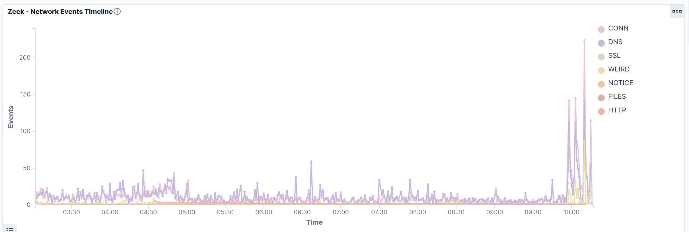
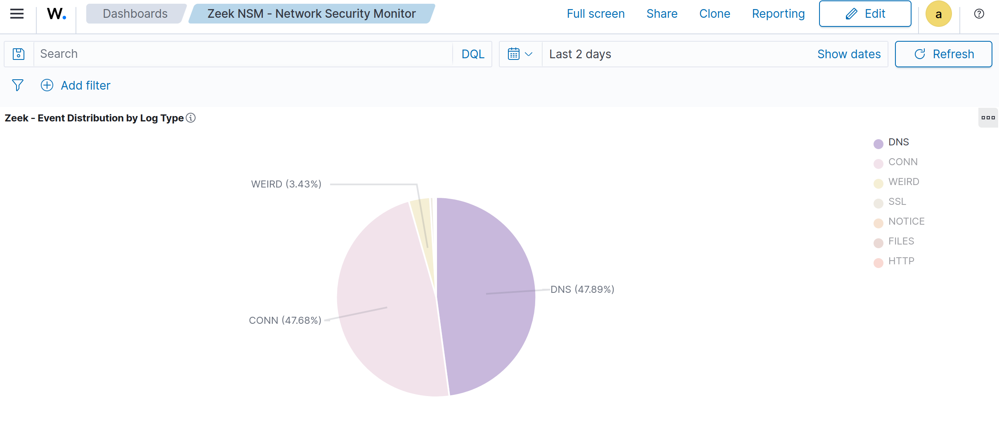
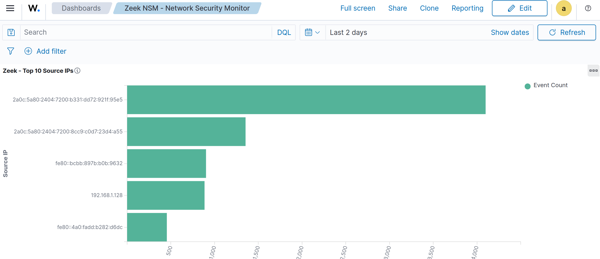
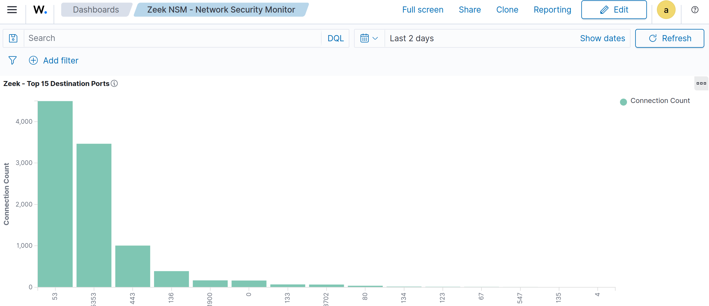
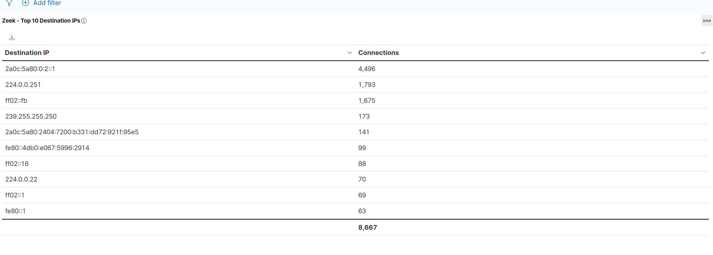

<!-- soc-banner -->
<p align="center"></p>

<p align="center">
  
</p>

### Complete Installation Guide for Zeek v8.1.2 on Ubuntu 24.04 LTS

## Objective

Installation and configuration of Zeek (Network Security Monitoring) on bare-metal Ubuntu 24.04 LTS for general use.

---

## Prerequisites

### Operating System

- Ubuntu 24.04 LTS (Noble Numbat)  
- Root/sudo access  
- Active network interface (e.g., eno1, eth0)

### Minimum Resources

- **RAM**: 4GB (8GB+ recommended)  
- **Disk**: 10GB free for logs  
- **CPU**: Minimum 2 cores  
- **Network**: Interface with traffic to monitor

---

## Tested Installation Methodology

### 1. System Preparation

```bash
# Update system
sudo apt update && sudo apt upgrade -y

# Check available network interfaces
ip addr show
# Note the interface name (e.g., eno1, eth0, enp0s3)
```

---

### 2. Installation via Official Repository

⚠️ Validated Method — Worked 100%

```bash
# Add Zeek official repository
echo 'deb http://download.opensuse.org/repositories/security:/zeek/xUbuntu_22.04/ /' | sudo tee /etc/apt/sources.list.d/security:zeek.list

# Add repository GPG key
curl -fsSL https://download.opensuse.org/repositories/security:zeek/xUbuntu_22.04/Release.key | gpg --dearmor | sudo tee /etc/apt/trusted.gpg.d/security_zeek.gpg > /dev/null

# Update package list
sudo apt update

# Install full Zeek package
sudo apt install -y zeek

# Verify installation
/opt/zeek/bin/zeek --version
```

Expected result:

```
/opt/zeek/bin/zeek version 8.1.2
```

---

### 3. Installed Files Location (Post-Installation)

```bash
# Inspect installed structure
ls -la /opt/zeek/
```

Expected structure:

```
/opt/zeek/
├── bin/          # Executables (zeek, zeekctl)
├── etc/          # Configuration files
├── logs/         # Symbolic link to /opt/zeek/spool/zeek
├── share/        # Scripts and libraries
└── spool/        # Zeek logs and state
```

---

### 4. Network Configuration

#### 4.1 Configure Local Networks

```bash
# Edit local networks file
sudo nano /opt/zeek/etc/networks.cfg
```

File content example:

```bash
# List of local networks in CIDR notation, optionally followed by a descriptive
# tag. Private address space defined by Zeek's Site::private_address_space set
# (see scripts/base/utils/site.zeek) is automatically considered local. You can
# disable this auto-inclusion by setting zeekctl's PrivateAddressSpaceIsLocal
# option to 0.
#
# Examples of valid prefixes:
#
# 1.2.3.0/24        Admin network
# 2607:f140::/32    Student network

# ADD YOUR LOCAL NETWORK HERE:
192.168.1.0/24    Private Home Network
```

⚠️ Adjust to your network:

- For 10.x.x.x networks: `10.0.0.0/8`  
- For 172.16.x.x networks: `172.16.0.0/12`  
- For 192.168.x.x networks: `192.168.0.0/16` or a specific subnet

#### 4.2 Configure Monitoring Interface

```bash
# Edit node configuration
sudo nano /opt/zeek/etc/node.cfg
```

Find and change the line:

```bash
# BEFORE:
interface=eth0

# AFTER (replace with your interface):
interface=eno1
```

Expected complete file:

```bash
# Example ZeekControl node configuration.
#
# This example has a standalone node ready to go except for possibly changing
# the sniffing interface.

# This is a complete standalone configuration.  Most likely you will
# only need to change the interface.
[zeek]
type=standalone
host=localhost
interface=eno1
```

---

### 5. Permission Configuration

```bash
# Check permissions of directories
ls -la /opt/zeek/etc/
ls -la /opt/zeek/logs/

# Adjust permissions if necessary
sudo chown -R root:zeek /opt/zeek/etc/
sudo chmod 755 /opt/zeek/etc/
sudo chmod 644 /opt/zeek/etc/*.cfg
```

---

### 6. Starting Zeek

#### 6.1 Add to PATH (Optional)

```bash
# Temporary (current session only)
export PATH="/opt/zeek/bin:$PATH"

# Permanent (add to .bashrc)
echo 'export PATH="/opt/zeek/bin:$PATH"' >> ~/.bashrc
source ~/.bashrc
```

#### 6.2 Use ZeekControl

```bash
# Enter the control console (MUST use sudo)
sudo /opt/zeek/bin/zeekctl
```

Commands inside zeekctl:

```bash
# Install configuration
install

# Check configuration
check

# Start Zeek
start

# Check status
status

# Exit
exit
```

Expected `status` output:

```
Name         Type       Host          Status    Pid    Started
zeek         standalone localhost     running   XXXXX  DD MMM HH:MM:SS
```

---

### 7. Installation Verification

#### 7.1 Check Process

```bash
# Check if Zeek is running
sudo /opt/zeek/bin/zeekctl status

# Check system processes
ps aux | grep zeek
```

#### 7.2 Check Logs

```bash
# Wait a few minutes to generate logs
sleep 120

# List log files
sudo ls -la /opt/zeek/logs/current/

# Check main logs line counts
sudo wc -l /opt/zeek/logs/current/conn.log
sudo wc -l /opt/zeek/logs/current/dns.log

# View real data (skip headers)
sudo tail -n +10 /opt/zeek/logs/current/conn.log | head -3
```

#### 7.3 Generate Test Traffic

```bash
# Generate traffic for capture
ping -c 5 google.com
curl -s http://google.com > /dev/null

# Wait and check new logs
sleep 30
sudo tail -5 /opt/zeek/logs/current/conn.log
sudo tail -5 /opt/zeek/logs/current/dns.log
```

---

## Zeek Management Commands

### Basic Operations

```bash
# Start Zeek
sudo /opt/zeek/bin/zeekctl start

# Stop Zeek
sudo /opt/zeek/bin/zeekctl stop

# Restart Zeek
sudo /opt/zeek/bin/zeekctl restart

# Check status
sudo /opt/zeek/bin/zeekctl status

# Check configuration
sudo /opt/zeek/bin/zeekctl check
```

### Logs and Diagnostics

```bash
# View error logs
sudo cat /opt/zeek/logs/current/stderr.log
sudo cat /opt/zeek/logs/current/reporter.log

# View statistics
sudo cat /opt/zeek/logs/current/stats.log

# Monitor logs in real time
sudo tail -f /opt/zeek/logs/current/conn.log
```

---

## Structure of Generated Logs

### Main Files

- **conn.log**: Network connections (TCP/UDP)  
- **dns.log**: DNS queries  
- **ssl.log**: TLS/SSL connections  
- **http.log**: HTTP traffic  
- **weird.log**: Anomalous activities  
- **notice.log**: Alerts and notifications

### Log Format

- **Format**: TSV (Tab-Separated Values)  
- **Headers**: Begin with `#`  
- **Separator**: Tab (`\t`)

Example structure:

```
#separator \x09
#set_separator    ,
#empty_field    (empty)
#unset_field    -
#path    conn
#open    2025-08-03-15-34-22
#fields    ts    uid    id.orig_h    id.orig_p    id.resp_h    id.resp_p    proto...
```

---

## Known Issues and Solutions

### 1. ZeekControl Permission Error

```
Error: unable to open database file: /opt/zeek/spool/state.db
```

Solution:

```bash
# ALWAYS use sudo with zeekctl
sudo /opt/zeek/bin/zeekctl
```

### 2. Checksum Offloading Warning

```
WARNING: Your interface is likely receiving invalid TCP checksums
```

Not critical, but to resolve:

```bash
# Option 1: Ignore invalid checksums (add to zeekctl)
echo "ZeekArgs=-C" | sudo tee -a /opt/zeek/etc/zeekctl.cfg

# Option 2: Disable offloading on the interface
sudo ethtool -K eno1 tx off rx off
```

### 3. Empty or No Log Data

Check:

1. Interface configured correctly  
2. Network traffic present  
3. Log file permissions

---

## Automated Installation Script

```bash
#!/bin/bash
# zeek-install.sh - Automated Zeek installation

set -e

echo "=== Installing Zeek v8.1.2 ==="

# Check Ubuntu version
if ! grep -q "Ubuntu 24.04" /etc/os-release; then
    echo "WARNING: Tested only on Ubuntu 24.04"
fi

# Prompt for network interface
read -p "Enter the network interface name (e.g., eno1, eth0): " INTERFACE
read -p "Enter your local network (e.g., 192.168.1.0/24): " NETWORK

# Add repository
echo "Adding Zeek repository..."
echo 'deb http://download.opensuse.org/repositories/security:/zeek/xUbuntu_22.04/ /' | sudo tee /etc/apt/sources.list.d/security:zeek.list
curl -fsSL https://download.opensuse.org/repositories/security:zeek/xUbuntu_22.04/Release.key | gpg --dearmor | sudo tee /etc/apt/trusted.gpg.d/security_zeek.gpg > /dev/null

# Install
echo "Installing Zeek..."
sudo apt update
sudo apt install -y zeek

# Configure network
echo "Configuring local network..."
echo "$NETWORK    Private Network" | sudo tee -a /opt/zeek/etc/networks.cfg

# Configure interface
echo "Configuring interface..."
sudo sed -i "s/interface=eth0/interface=$INTERFACE/" /opt/zeek/etc/node.cfg

# Initialize
echo "Initializing Zeek..."
sudo /opt/zeek/bin/zeekctl install
sudo /opt/zeek/bin/zeekctl start

# Verify
echo "Verifying installation..."
sudo /opt/zeek/bin/zeekctl status

echo "=== Installation complete ==="
echo "Logs at: /opt/zeek/logs/current/"
echo "Control: sudo /opt/zeek/bin/zeekctl"
```

Usage:

```bash
chmod +x zeek-install.sh
./zeek-install.sh
```

---

## Validation Checklist

- [ ] Ubuntu 24.04 system updated  
- [ ] Zeek repository added  
- [ ] Zeek v8.1.2 installed  
- [ ] `/opt/zeek/etc/networks.cfg` configured  
- [ ] `/opt/zeek/etc/node.cfg` configured  
- [ ] ZeekControl executed with sudo  
- [ ] Status shows "running"  
- [ ] Logs being generated in `/opt/zeek/logs/current/`  
- [ ] Traffic being captured (conn.log, dns.log)  
- [ ] Permissions adjusted as required

---

## Dashboard Screenshots

The following visualizations are part of the **Zeek NSM - Network Security Monitor** dashboard in Wazuh SIEM, built using the `wazuh-alerts-*` index pattern with a global filter on `rule.groups: zeek`. All five panels were validated with 1,219 indexed alerts across 7 Zeek log streams (CONN, DNS, HTTP, SSL, FILES, NOTICE, WEIRD).

### Network Events Timeline



*Multi-line time-series chart showing event volume per log type over time. CONN and DNS dominate baseline activity; spikes indicate traffic bursts or scan events.*

### Event Distribution by Log Type



*Pie chart showing the proportional breakdown of Zeek events by log type. DNS (47.89%) and CONN (47.68%) account for the vast majority of observed network activity, with WEIRD events (3.43%) flagging anomalous traffic.*

### Top 10 Source IPs



*Horizontal bar chart of the most active source IP addresses observed by Zeek. Internal IPv6 and LAN addresses dominate, consistent with a monitored local network segment.*

### Top 15 Destination Ports



*Vertical bar chart of the most targeted destination ports. Port 53 (DNS) and 5353 (mDNS) lead, followed by 443 (HTTPS) — reflecting normal LAN and internet traffic patterns.*

### Top 10 Destination IPs



*Data table ranking the most contacted destination IPs by connection count. Multicast and DNS resolver addresses dominate, with 8,667 total connections tracked across the top 10 destinations.*

---

## Conclusion

This methodology has been tested and validated on Ubuntu 24.04 LTS. Installation via the official repository is stable and reproducible. Zeek will be ready for general security monitoring and integration with other analysis tools.

**Estimated installation time**: 15–30 minutes  
**Resources consumed**: ~300MB RAM, ~100MB disk space initially

---

<sub>
<b>Navigation</b> &nbsp;
<a href="../../README.md">Portfolio home</a> &nbsp;&middot;&nbsp;
<a href="README.md">Network Security</a> &nbsp;&middot;&nbsp;
<a href="../README.md">All 22 integrations</a> &nbsp;&middot;&nbsp;
<a href="../../detection-coverage/attack-coverage.md">Detection coverage</a> &nbsp;&middot;&nbsp;
<a href="../../playbooks/README.md">SOC playbooks</a> &nbsp;&middot;&nbsp;
<a href="../../METRICS.md">Metrics</a>
<br><br>
Validated in a single-workstation lab. Each guide records the versions it was validated
against; see <a href="../../README.md#lab-status">lab status</a>.
</sub>

