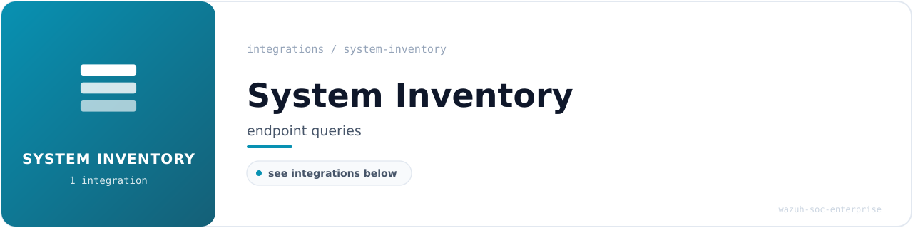

<!-- soc-banner -->

# System Inventory Integrations

Endpoint visibility and host posture monitoring tools integrated with Wazuh.
These integrations focus on continuous inventory, configuration drift detection,
and surface enumeration rather than threat detection or vulnerability scanning.

## Integrations

| Tool                                         | Purpose                                              | Status     |
|----------------------------------------------|------------------------------------------------------|------------|
| [OSQuery](osquery-integration.md)            | SQL-based host inventory: users, ports, containers, kernel modules, SUID binaries | Production |

## Conventions

- Scheduled queries use the `industrial_*` naming prefix to align with the
  SOC's ICS/SCADA monitoring context.
- Events are decoded by Wazuh's built-in `json` decoder and grouped under
  rule `24010` (`osquery data grouped`, severity 3).
- Higher-fidelity detection rules can be layered on top of this inventory
  foundation as the SOC matures.
