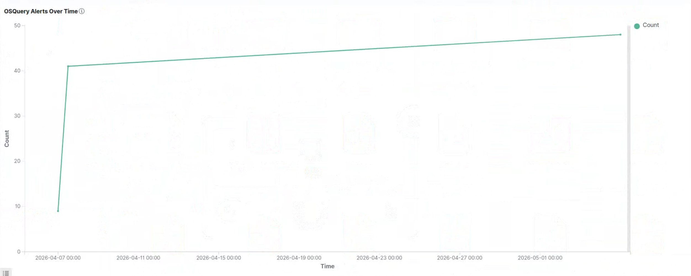
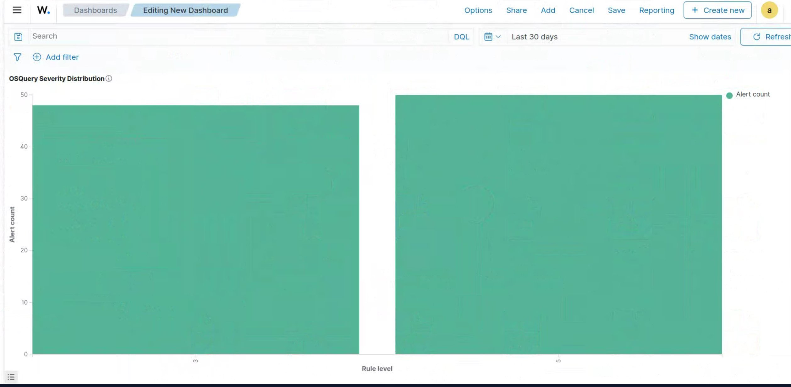
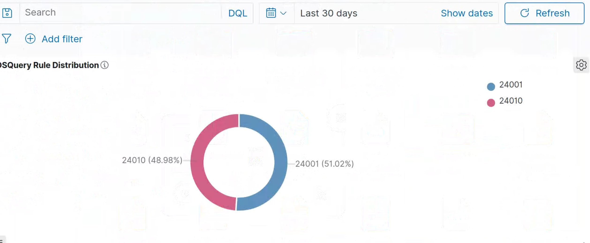
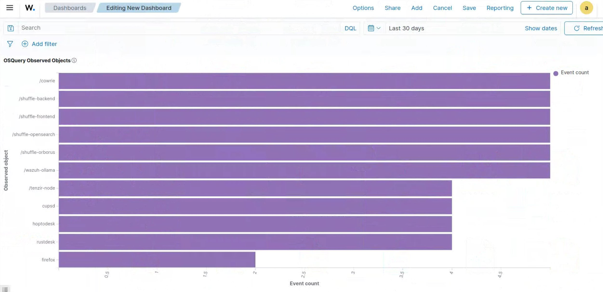
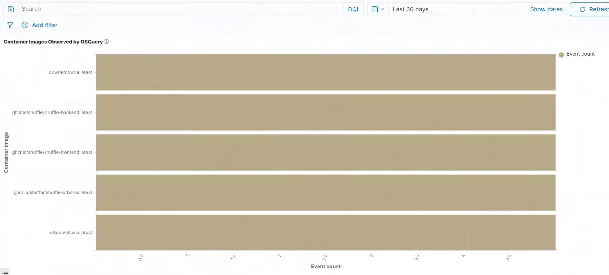

# OSQuery System Inventory Integration with Wazuh

**Category:** System Inventory
**Status:** Production
**Wazuh Version:** 4.14.x (all-in-one bare-metal deployment)
**OSQuery Version:** 5.22.1
**Operating System:** Ubuntu 24.04.4 LTS (kernel 6.17.x)
**Last Verified:** May 2026

---

## 1. Overview

OSQuery exposes the operating system as a high-performance relational database, allowing endpoint state — running processes, listening ports, kernel modules, users, scheduled tasks, container metadata — to be queried with SQL. Integrating OSQuery with Wazuh turns the SOC into an active inventory and posture-monitoring platform on top of its existing detection capabilities.

This integration uses the native Wazuh `osquery` wodle, which tails the OSQuery results file (`osqueryd.results.log`) and forwards each JSON record into the Wazuh analysis pipeline. Events are decoded by the built-in `json` decoder and grouped under rule **24010 — `osquery data grouped`** (severity 3).

Use cases covered by this deployment:

- Continuous host inventory (hardware, OS, users, listening services).
- Visibility into Docker containers running on the SOC host.
- Detection of changes to authorized SSH keys, SUID binaries, kernel modules, and crontabs.
- Industrial monitoring context (ICS/SCADA) — query naming uses the `industrial_*` prefix to align with the lab's use case.

---

## 2. Architecture

```
┌──────────────────────────────────────────────────────────────────┐
│  Ubuntu 24.04 (host: flausino)                                   │
│                                                                  │
│  ┌──────────────────┐   results.log    ┌──────────────────────┐ │
│  │  osqueryd        │ ───────────────► │  wazuh-modulesd      │ │
│  │  (5.22.1)        │   JSON, 0640     │  (osquery wodle)     │ │
│  │  systemd-managed │   root:wazuh     │                      │ │
│  └──────────────────┘                  └──────────┬───────────┘ │
│                                                   │              │
│                                                   ▼              │
│                                        ┌──────────────────────┐ │
│                                        │  wazuh-analysisd     │ │
│                                        │  decoder: json       │ │
│                                        │  rule:    24010      │ │
│                                        └──────────┬───────────┘ │
│                                                   ▼              │
│                                        ┌──────────────────────┐ │
│                                        │  alerts.json         │ │
│                                        │  + filebeat ingest   │ │
│                                        └──────────┬───────────┘ │
│                                                   ▼              │
│                                        ┌──────────────────────┐ │
│                                        │  wazuh-indexer +     │ │
│                                        │  wazuh-dashboard     │ │
│                                        └──────────────────────┘ │
└──────────────────────────────────────────────────────────────────┘
```

Key design choice: `<run_daemon>no</run_daemon>`. OSQuery is managed independently by `systemd` (`osqueryd.service`), and the Wazuh wodle only consumes the existing results file. This separation simplifies lifecycle management and keeps OSQuery available even when the Wazuh manager restarts.

---

## 3. Installation

### 3.1 OSQuery Repository and Package

The official OSQuery APT repository is configured with a modern keyring under `/etc/apt/keyrings/`. The legacy `apt-key` mechanism is deprecated on Ubuntu 24.04 and must not be used.

```bash
sudo apt update
sudo apt install -y curl ca-certificates gnupg

sudo install -d -m 0755 /etc/apt/keyrings
curl -fsSL https://pkg.osquery.io/deb/pubkey.gpg \
  | sudo tee /etc/apt/keyrings/osquery.asc > /dev/null
sudo chmod 0644 /etc/apt/keyrings/osquery.asc

echo "deb [arch=amd64 signed-by=/etc/apt/keyrings/osquery.asc] https://pkg.osquery.io/deb deb main" \
  | sudo tee /etc/apt/sources.list.d/osquery.list > /dev/null

sudo apt update
sudo apt install -y osquery
```

Verification:

```bash
osqueryi --version           # osqueryi version 5.22.1
readlink -f $(command -v osqueryd)   # /opt/osquery/bin/osqueryd
```

### 3.2 Directory Layout

```bash
sudo mkdir -p /etc/osquery /var/log/osquery /var/osquery
sudo chown -R root:root /etc/osquery /var/osquery
sudo chmod 0755 /etc/osquery /var/log/osquery /var/osquery
```

The `/var/log/osquery` directory will later be re-grouped to `wazuh` so the Wazuh wodle can read the results file.

---

## 4. OSQuery Configuration

### 4.1 `/etc/osquery/osquery.flags`

```ini
--config_path=/etc/osquery/osquery.conf
--logger_plugin=filesystem
--logger_path=/var/log/osquery
--pidfile=/var/osquery/osquery.pid
--database_path=/var/osquery/osquery.db
--host_identifier=hostname
--utc=true
--disable_events=true
--disable_audit=true
```

Rationale:

- `--disable_events=true` and `--disable_audit=true` deliberately disable the Linux audit subsystem inside OSQuery. The SOC consumes auditd through a dedicated Wazuh integration (`auditd → wazuh-logcollector`); having OSQuery also consume auditd would duplicate the event stream and contributed to a previously diagnosed Filebeat backlog.
- `--utc=true` keeps timestamps consistent with the indexer.
- `--host_identifier=hostname` makes correlation with other Wazuh modules straightforward.

### 4.2 `/etc/osquery/osquery.conf`

The schedule defines nine production queries with intervals tuned for the SOC's data-volume budget. Fast-changing surface (listening ports) is sampled every 60 seconds; slow-changing surface (SUID binaries, kernel modules) every 30 minutes.

```json
{
  "options": {
    "host_identifier": "hostname",
    "disable_logging": "false",
    "schedule_splay_percent": "10",
    "utc": "true",
    "events_expiry": "3600"
  },

  "decorators": {
    "load": [
      "SELECT uuid AS host_uuid FROM system_info;",
      "SELECT hostname AS osquery_host FROM system_info;"
    ]
  },

  "schedule": {
    "industrial_system_info": {
      "query": "SELECT hostname, uuid, cpu_brand, physical_memory, hardware_vendor, hardware_model FROM system_info;",
      "interval": 300
    },
    "industrial_os_version": {
      "query": "SELECT name, version, major, minor, codename, platform FROM os_version;",
      "interval": 300
    },
    "industrial_local_users": {
      "query": "SELECT username, uid, gid, shell, directory FROM users WHERE uid = 0 OR uid >= 1000;",
      "interval": 300
    },
    "industrial_listening_ports": {
      "query": "SELECT lp.protocol, lp.address, lp.port, lp.pid, p.name, p.path, p.cmdline FROM listening_ports lp LEFT JOIN processes p ON lp.pid = p.pid WHERE lp.port > 0;",
      "interval": 60
    },
    "industrial_crontab": {
      "query": "SELECT * FROM crontab;",
      "interval": 900
    },
    "industrial_authorized_keys": {
      "query": "SELECT uid, key_file FROM authorized_keys;",
      "interval": 900
    },
    "industrial_suid_bins": {
      "query": "SELECT path, username, groupname, permissions FROM suid_bin;",
      "interval": 1800
    },
    "industrial_kernel_modules": {
      "query": "SELECT name, size, used_by, status FROM kernel_modules;",
      "interval": 1800
    },
    "industrial_docker_containers": {
      "query": "SELECT id, name, image, state, status FROM docker_containers;",
      "interval": 300
    }
  }
}
```

The `decorators.load` block injects `host_uuid` and `osquery_host` into every event, which is useful when the data is later joined with other inventory sources in the indexer.

### 4.3 Configuration Validation

Before enabling the service, the configuration was validated:

```bash
sudo /opt/osquery/bin/osqueryd \
  --flagfile=/etc/osquery/osquery.flags \
  --config_check
```

A handful of scheduled queries were also exercised interactively to confirm that the referenced tables resolve on this kernel:

```bash
sudo osqueryi "SELECT hostname, uuid FROM system_info;"
sudo osqueryi "SELECT name, version, platform FROM os_version;"
sudo osqueryi "SELECT id, name, image, state FROM docker_containers LIMIT 5;"
```

---

## 5. Service Activation

```bash
sudo systemctl enable --now osqueryd
systemctl status osqueryd --no-pager
```

Expected state in production:

```
● osqueryd.service - osquery daemon
     Loaded: loaded (/usr/lib/systemd/system/osqueryd.service; enabled)
     Active: active (running)
   Main PID: 152340 (osqueryd)
      Tasks: 13
     Memory: ~27 MB
     CGroup: /system.slice/osqueryd.service
             ├─152340 /opt/osquery/bin/osqueryd --flagfile=/etc/osquery/osquery.flags --config_path=/etc/osquery/osquery.conf
             └─152343 /opt/osquery/bin/osqueryd
```

OSQuery uses a watcher/worker process model: PID `152340` is the watchdog, `152343` is the worker. Both belong to the `osqueryd.service` cgroup.

---

## 6. Wazuh Manager Integration

### 6.1 The OSQuery Wodle

Add the following block to `/var/ossec/etc/ossec.conf`. Always create a timestamped backup first and validate the XML before restarting the manager.

```bash
sudo cp /var/ossec/etc/ossec.conf \
        /var/ossec/etc/ossec.conf.bak.$(date +%Y%m%d_%H%M%S).pre-osquery
```

```xml
<wodle name="osquery">
  <disabled>no</disabled>
  <run_daemon>no</run_daemon>
  <bin_path>/opt/osquery/bin</bin_path>
  <log_path>/var/log/osquery/osqueryd.results.log</log_path>
  <config_path>/etc/osquery/osquery.conf</config_path>
  <add_labels>yes</add_labels>
</wodle>
```

Validate and restart:

```bash
sudo xmllint --noout /var/ossec/etc/ossec.conf
sudo /var/ossec/bin/wazuh-analysisd -t
sudo systemctl restart wazuh-manager
```

The manager log should show:

```
wazuh-modulesd:osquery: INFO: Module started.
wazuh-modulesd:osquery: INFO: run_daemon disabled, finding detached osquery process results.
wazuh-modulesd:osquery: INFO: Following osquery results file '/var/log/osquery/osqueryd.results.log'.
```

### 6.2 Results-File Permissions

This is the single most important detail of the integration. By default, `osqueryd` writes the results file as `root:root` with mode `0600`, which the Wazuh wodle cannot read. The fix is to set group ownership to `wazuh` and mode `0640`:

```bash
sudo chown root:wazuh /var/log/osquery/osqueryd.results.log
sudo chmod 0640 /var/log/osquery/osqueryd.results.log
```

Verify:

```bash
sudo -u wazuh test -r /var/log/osquery/osqueryd.results.log && echo "OK: wazuh can read"
sudo stat /var/log/osquery/osqueryd.results.log
# Access: (0640/-rw-r-----)  Uid: (    0/    root)   Gid: (  125/   wazuh)
```

OSQuery does not preserve ownership across log rotations. To make the fix durable, drop a `tmpfiles.d` rule:

```bash
sudo tee /etc/tmpfiles.d/osquery-wazuh.conf > /dev/null <<'EOF'
# Keep osqueryd results log readable by the wazuh group
z /var/log/osquery/osqueryd.results.log 0640 root wazuh - -
EOF
```

This `tmpfiles.d` entry is re-applied at boot and on `systemd-tmpfiles --create`, restoring the correct ACL whenever OSQuery rotates or recreates the file.

---

## 7. Decoder and Rule Configuration

### 7.1 No Custom Decoder Required

OSQuery emits one JSON object per line. The Wazuh built-in `json` decoder parses these directly, exposing every column under `data.columns.*` and the query name under `data.name`. No custom decoder file is needed.

### 7.2 No Custom Rule Required

The Wazuh built-in ruleset already ships rule **24010** in `/var/ossec/ruleset/rules/0930-osquery_rules.xml`:

```xml
<rule id="24010" level="3">
  <decoded_as>json</decoded_as>
  <field name="name">\.</field>
  <field name="hostIdentifier">\.</field>
  <field name="calendarTime">\.</field>
  <description>osquery data grouped</description>
  <group>osquery,</group>
</rule>
```

Every scheduled OSQuery event matches this rule and is forwarded to the indexer. In the live deployment, **`alerts.json` contains 370 events with `rule.id = 24010`** at the time of writing.

### 7.3 Conflict with Custom Zeek Rules

A subtle but critical conflict was found during integration: the SOC's first custom Zeek rule (`/var/ossec/etc/rules/11000-zeek_rules.xml`, rule `100000`) originally used only `<decoded_as>json</decoded_as>`, which caused **every** JSON event in the pipeline — including OSQuery — to match it before reaching `24010`.

The fix is to constrain rule `100000` with a `zeek` field discriminator and silence it with `noalert`:

```xml
<!-- Base rule: any Zeek log (the zeek decoder pre-matches on {"_path":"...") -->
<rule id="100000" level="0" noalert="1">
  <decoded_as>json</decoded_as>
  <field name="zeek">^true$</field>
  <description>Zeek log detected</description>
</rule>
```

The `<field name="zeek">^true$</field>` predicate ensures the rule only fires for events that the Zeek decoder has explicitly tagged. After this change, OSQuery events flow cleanly to rule 24010 without false matches.

This pattern — discriminating JSON-decoded events with a source-specific field rather than relying on `<decoded_as>json</decoded_as>` alone — applies to **every** JSON-based integration on the same Wazuh manager. It is a general invariant of the SOC, not an OSQuery-specific workaround.

---

## 8. Validation

### 8.1 Pipeline Test with `wazuh-logtest`

```bash
sudo grep -m1 '"name":"industrial_system_info"' \
     /var/log/osquery/osqueryd.results.log > /tmp/osquery_sample.json

sudo /var/ossec/bin/wazuh-logtest < /tmp/osquery_sample.json
```

Expected output:

```
**Phase 1: Completed pre-decoding.
**Phase 2: Completed decoding.
       name: 'json'
**Phase 3: Completed filtering (rules).
       Rule id: '24010'
       Level: 3
       Description: 'osquery data grouped'
```

### 8.2 Live Alert Count

```bash
sudo grep -c '"id":"24010"' /var/ossec/logs/alerts/alerts.json
# 370
```

### 8.3 Indexer Verification (DQL on the Dashboard)

```
rule.id : 24010 AND rule.groups : "osquery"
```

Time range: last 30 days. The query returns the same set of events visible in the dashboards below.

---

## 9. Dashboards

A custom dashboard was built on top of the `wazuh-alerts-*` index pattern, scoped to `rule.groups: osquery`.

### 9.1 OSQuery Alerts Over Time



Cumulative alert count over the last 30 days. The step from ~9 to ~41 on April 7 corresponds to the day the wodle was first enabled and the schedule began producing events; the slow growth afterward reflects steady-state operation.

### 9.2 OSQuery Severity Distribution



Alert count broken down by `rule.level`. Level 3 corresponds to rule `24010` (data grouped); level 5 corresponds to higher-severity rules in the same group when triggered by anomalous content (for example, an `industrial_listening_ports` event flagged as suspicious by an upstream enrichment rule).

### 9.3 OSQuery Rule Distribution



Donut chart of `rule.id` values within the OSQuery group, useful for spotting unexpected rule firings.

### 9.4 OSQuery Observed Objects



Top-N visualization aggregating `data.columns.name` (process names from `industrial_listening_ports` and `industrial_docker_containers`). Visible objects include `cowrie`, `shuffle-backend`, `shuffle-frontend`, `shuffle-opensearch`, `shuffle-orborus`, `wazuh-ollama`, `tenzir-node`, `cupsd`, `hoptodesk`, `rustdesk`, and `firefox` — a faithful reflection of the SOC host's running surface.

### 9.5 Container Images Observed by OSQuery



Aggregation on `data.columns.image` from the `industrial_docker_containers` query. Images surfaced: `cowrie/cowrie:latest`, `ghcr.io/shuffle/shuffle-backend:latest`, `ghcr.io/shuffle/shuffle-frontend:latest`, `ghcr.io/shuffle/shuffle-orborus:latest`, `ollama/ollama:latest`. This panel is the SOC's authoritative inventory of running container images.

---

## 10. Operational Notes

### 10.1 Log Volume and Rotation

Each scheduled query produces one event per changed row per interval. With nine queries on a typical SOC host, the results log grows by roughly **300–500 KB per day** in steady state. OSQuery rotates internally; periodic external truncation is not required. Ensure the `tmpfiles.d` rule from §6.2 is in place so the post-rotation file remains readable by `wazuh`.

### 10.2 Avoiding Backlog

A previous incident in this SOC produced a 124 MB results file due to auditd overlap. Two safeguards prevent recurrence:

- `--disable_events=true` and `--disable_audit=true` in `osquery.flags` (§4.1).
- A standalone `auditd → wazuh-logcollector` integration handles the audit stream, with tuned rules to keep volume in check.

### 10.3 Watchdog Warnings

The OSQuery worker periodically emits warnings such as:

```
W virtual_table.cpp:1005] The authorized_keys table returns data based on the current user by default,
   consider JOINing against the users table
```

These are informational and do not affect data quality. If desired, the `industrial_authorized_keys` query can be rewritten to JOIN against `users` to silence the warning:

```sql
SELECT u.username, ak.key_file
FROM users u
JOIN authorized_keys ak USING (uid)
WHERE u.uid = 0 OR u.uid >= 1000;
```

### 10.4 Backup Discipline

Every change to OSQuery configuration or to Wazuh ruleset/decoders is captured in a timestamped backup before modification. Examples present in the live system:

```
/etc/osquery/osquery.conf.bak.2026-05-04_20-45-58
/etc/osquery/osquery.flags.bak.2026-05-04_20-45-58
/var/ossec/etc/rules/11000-zeek_rules.xml.bak.osquery-falsematch.2026-05-04_22-00-39
```

The backup naming convention — `<file>.bak.<timestamp>.pre-<change-description>` — makes the rollback path obvious during incident response.

---

## 11. MITRE ATT&CK Mapping

The OSQuery scheduled queries provide visibility relevant to the following techniques:

| Query                          | ATT&CK Technique                                    |
|--------------------------------|-----------------------------------------------------|
| `industrial_local_users`       | T1136 — Create Account                              |
| `industrial_authorized_keys`   | T1098.004 — Account Manipulation: SSH Authorized Keys |
| `industrial_listening_ports`   | T1571 — Non-Standard Port (discovery surface)       |
| `industrial_crontab`           | T1053.003 — Scheduled Task/Job: Cron               |
| `industrial_suid_bins`         | T1548.001 — Setuid and Setgid                       |
| `industrial_kernel_modules`    | T1547.006 — Kernel Modules and Extensions          |
| `industrial_docker_containers` | T1610 — Deploy Container                            |

Higher-fidelity detection rules referencing these queries can be added under `local_rules.xml` as the SOC matures; the data collection foundation is already in place.

---

## 12. References

- Wazuh Documentation — *System inventory: OSQuery* — https://documentation.wazuh.com/current/user-manual/capabilities/system-inventory/osquery.html
- OSQuery Documentation — https://osquery.readthedocs.io/
- OSQuery Schema Reference — https://osquery.io/schema/
- MITRE ATT&CK — https://attack.mitre.org/

---

## 13. Verified State (snapshot)

Generated from the live SOC host on 2026-05-05:

```
osqueryi version            : 5.22.1
osqueryd service            : active (running), 22h+ uptime
osqueryd.results.log        : 0640 root:wazuh, 373 KB, readable by wazuh
wazuh-modulesd osquery      : Following osquery results file (no errors)
alerts.json rule.id=24010   : 370 events
Zeek rule 100000            : noalert + zeek field discriminator (fixed)
Local OSQuery rules         : none required (built-in 24010 sufficient)
```
