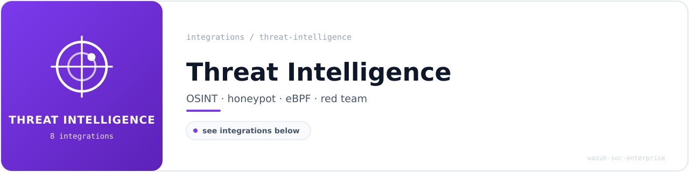

<!-- soc-banner -->

# Threat Intelligence & Detection

Indicator correlation, adversary emulation, honeypot telemetry and host-level behavioural
detection. The largest category in the lab and the core of its detection content.

**8 documented integrations** in this category.
Each guide includes configuration, validated `wazuh-logtest` output, OpenSearch DevTools
queries and dashboard screenshots captured during validation.

---

## Integrations

| Integration | What it detects | Rules | ID range | MITRE ATT&CK |
| --- | --- | :---: | --- | --- |
| **[OSINT CDB](osint-cdb-integration.md)** | Native Wazuh CDB list of public IPv4 indicators; bidirectional srcip/dstip correlation | 4 | `113100-113103` | T1071, T1595 |
| **[MISP](misp-integration.md)** | Threat-intel platform integration; IoC lookup and enrichment on alerts | 2 | `100700-100701` | T1071 |
| **[SpiderFoot](spiderfoot-integration.md)** | OSINT reconnaissance events ingested as JSONL; no custom decoder required | 6 | `113200-113205` | T1589, T1590, T1595 |
| **[MITRE CALDERA](caldera-integration.md)** | Adversary emulation via live Caldera v2 API; validates detection coverage against executed TTPs | 6 | `110500-110505` | T1082, T1033, T1057, T1087.001 |
| **[Cowrie honeypot](cowrie-integration.md)** | SSH/Telnet attack chain: brute force, successful auth, command execution, payload retrieval | 9 | `100500-100508` | T1110.001, T1059, T1105 |
| **[Falco (eBPF)](falco-integration.md)** | Kernel-level runtime detection of syscall and process anomalies | 8 | `100600-100607` | T1055, T1059, T1046 |
| **[Auditd](auditd-integration.md)** | Host audit trail with a dedicated MITRE-mapped rule pack | 22 | `110700-110721` | T1021, T1055, T1059, T1070 |
| **[YARA](yara-integration.md)** | Signature-based file scanning wired to Active Response | 3 | `100300-100302` | T1204 |

`--` indicates the integration relies on native Wazuh decoders or operates outside the custom
rule ID space. Rule counts reflect what each guide documents; the authoritative corpus totals
live in [`METRICS.md`](../../METRICS.md) and are verified by
[`verify-metrics.sh`](../../scripts/verify-metrics.sh).

---

## Navigation

[**Portfolio home**](../../README.md) ·
[All integrations](../README.md) ·
[Detection coverage](../../detection-coverage/attack-coverage.md) ·
[SOC playbooks](../../playbooks/README.md) ·
[Incident reports](../../incident-reports/README.md)
