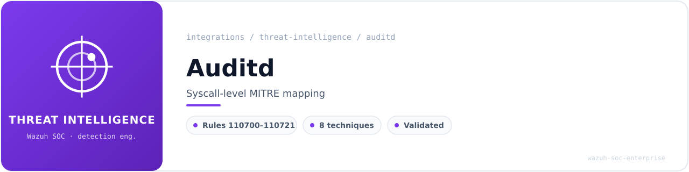
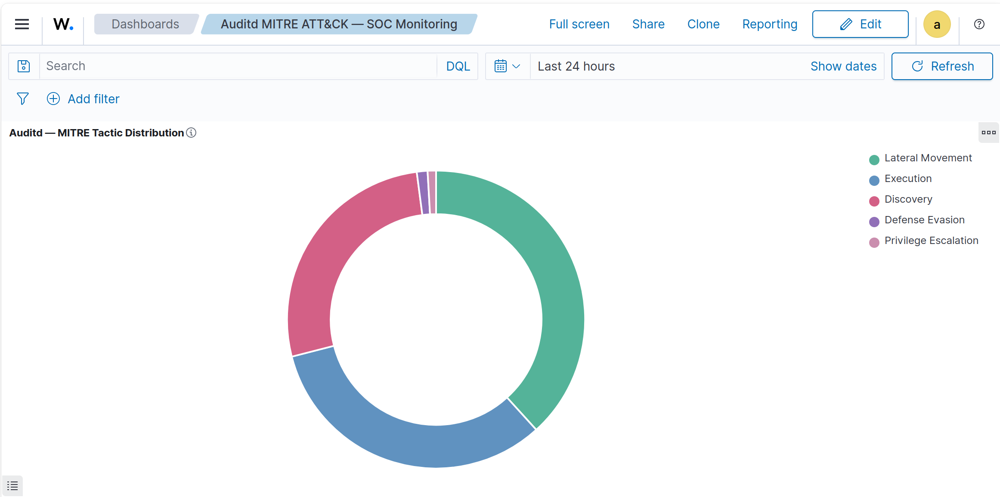
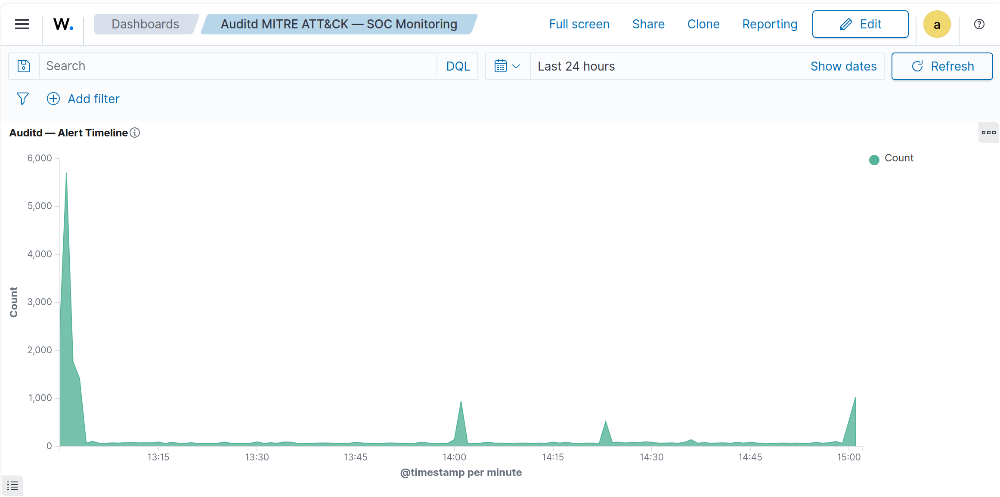
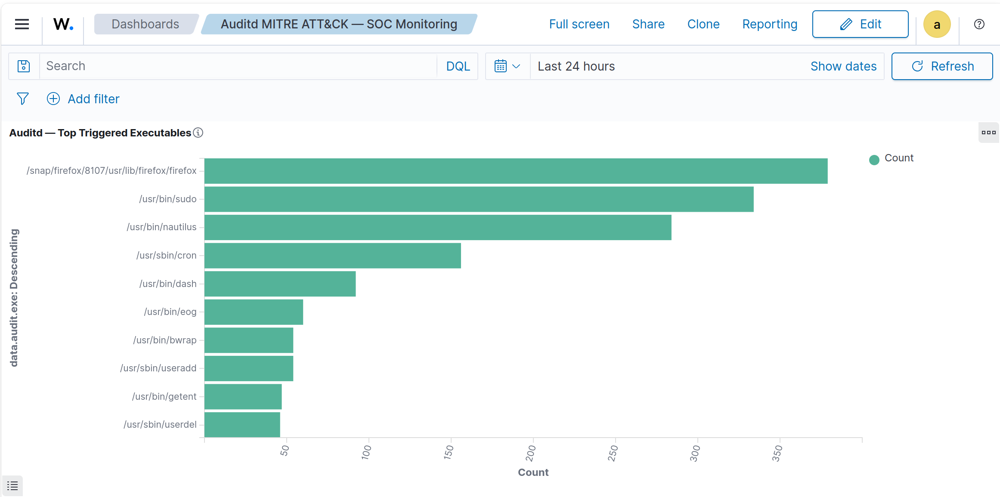
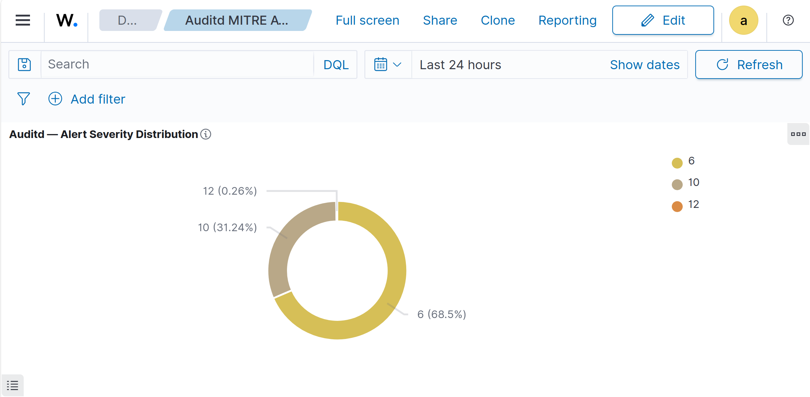
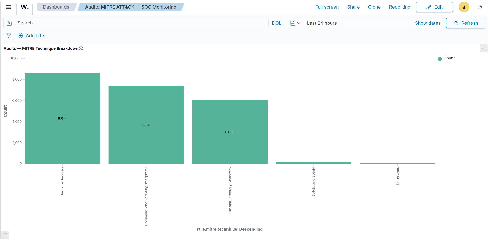
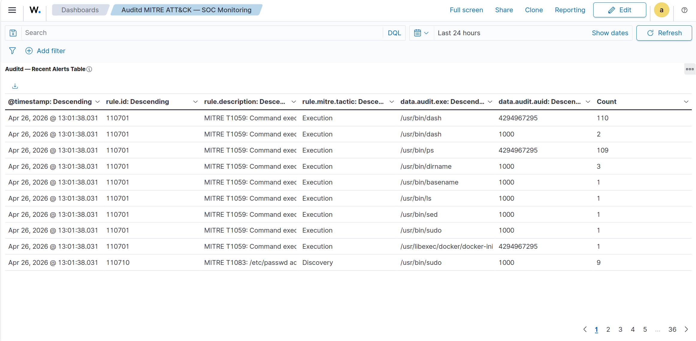
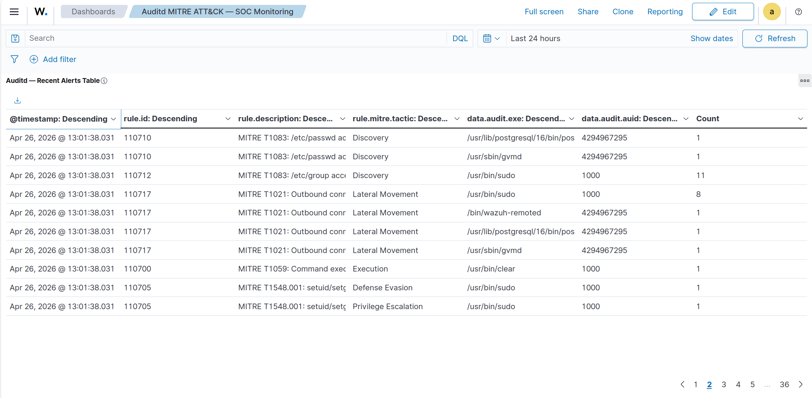
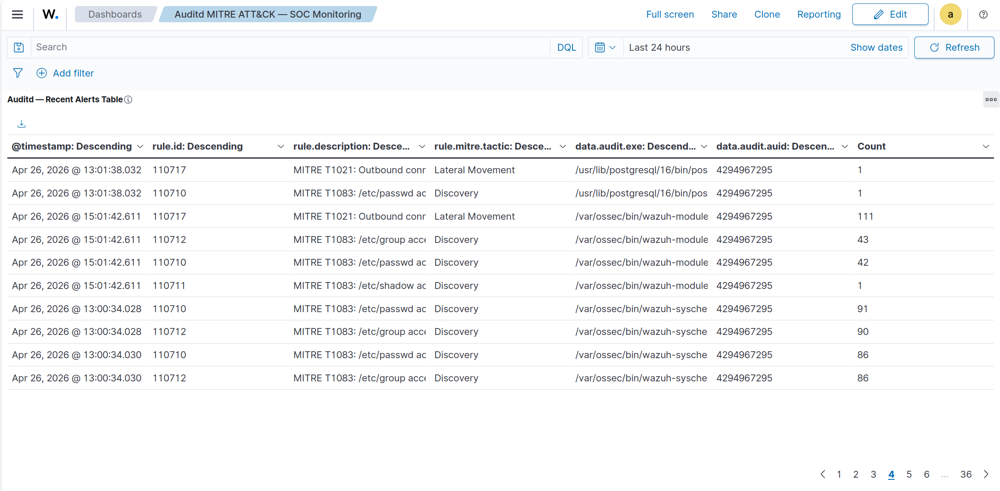
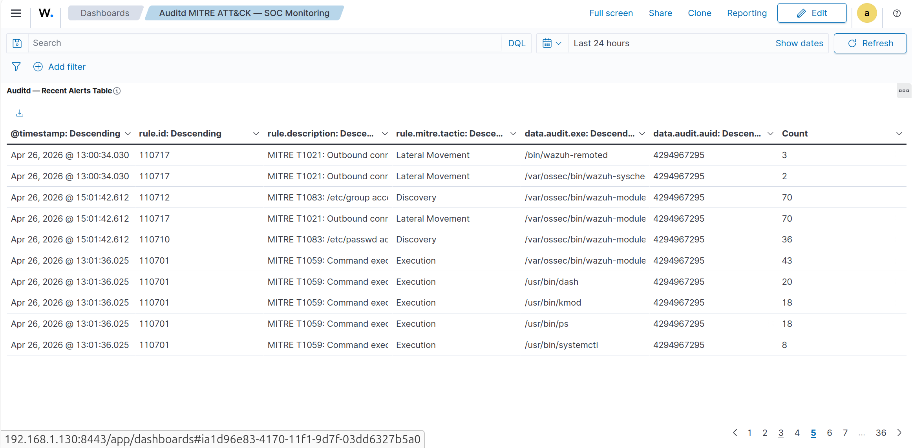

<!-- soc-banner -->
<p align="center"></p>

<p align="center">
   
</p>

# Auditd MITRE ATT&CK + Wazuh — Endpoint Audit Integration


End-to-end validated integration between **auditd 3.1.2** and **Wazuh 4.14.5**.  
Auditd captures syscall-level events on the host; Wazuh parses, correlates, and maps them to MITRE ATT&CK in real time via the native auditd decoder and custom rules using MITRE-tagged audit keys.

---

## Table of Contents

- [Architecture](#architecture)
- [Environment](#environment)
- [Prerequisites](#prerequisites)
- [Auditd Installation](#auditd-installation)
- [MITRE ATT&CK Audit Rules](#mitre-attck-audit-rules)
- [Wazuh — Backup First](#wazuh--backup-first)
- [audit-keys CDB List](#audit-keys-cdb-list)
- [ossec.conf — localfile Entry](#ossecconf--localfile-entry)
- [Custom Wazuh Rules](#custom-wazuh-rules)
- [Apply and Restart](#apply-and-restart)
- [Validation — wazuh-logtest](#validation--wazuh-logtest)
- [Validation — OpenSearch DevTools](#validation--opensearch-devtools)
- [Dashboard](#dashboard)
- [Results](#results)
- [Troubleshooting](#troubleshooting)
- [Rollback](#rollback)
- [Files Created](#files-created)

---

## Architecture

```
[Linux Kernel — syscall interface]
    |
    +-- auditd 3.1.2 intercepts syscalls via netlink
         |  Rules: /etc/audit/rules.d/99-mitre-soc.rules
         |  Keys:  T1059_exec_root, T1083_shadow_access, T1055_ptrace_attach ...
         v
    /var/log/audit/audit.log
         |
         v
[Wazuh Manager 4.14.5]
    +-- Decoder: auditd (native, 0040-auditd_decoders.xml)
    |     +-- Extracts: audit.type, audit.key, audit.exe, audit.auid,
    |                   audit.uid, audit.syscall, audit.success ...
    +-- CDB List: etc/lists/audit-keys  (key:value classification)
    +-- Native rules: 80700-80792 (base grouping + watch rules)
    +-- Custom rules: 110700-110721 (MITRE ATT&CK mapping)
         |
         v
[Wazuh Indexer — index: wazuh-alerts-*]
    Fields: rule.mitre.tactic, rule.mitre.technique,
            data.audit.exe, data.audit.auid, data.audit.key
         |
         v
[Wazuh Dashboard — Auditd MITRE ATT&CK — SOC Monitoring]
    +-- MITRE Tactic Distribution (donut)
    +-- Alert Severity Distribution (donut)
    +-- Alert Timeline (area)
    +-- Top Triggered Executables (horizontal bar)
    +-- MITRE Technique Breakdown (vertical bar)
    +-- Recent Alerts Table (data table)
```

**MITRE ATT&CK Techniques Covered:**

| Technique    | Name                              | Rule IDs        | Level |
|--------------|-----------------------------------|-----------------|-------|
| T1059        | Command and Scripting Interpreter | 110700–110702   | 6–10  |
| T1055        | Process Injection (ptrace)        | 110703–110704   | 14    |
| T1548.001    | Setuid and Setgid                 | 110705–110706   | 10–12 |
| T1078        | Valid Accounts (su/sudo/sudoers)  | 110707–110709   | 6–8   |
| T1083        | File and Directory Discovery      | 110710–110713   | 6–10  |
| T1070.006    | Timestomp / Log Deletion          | 110714–110716   | 10–14 |
| T1021        | Remote Services                   | 110717          | 6     |
| T1136        | Create Account                    | 110718–110720   | 8–10  |
| T1543        | Systemd Service Persistence       | 110721          | 10    |

---

## Environment

| Component  | Value                        |
|------------|------------------------------|
| OS         | Ubuntu 24.04 LTS (Noble)     |
| Wazuh      | 4.14.5 (all-in-one)          |
| auditd     | 3.1.2-2.1build1.1            |
| audispd-plugins | 3.1.2-2.1build1.1       |
| Deployment | Single host (all-in-one)     |
| Hostname   | flausino                     |
| Host IP    | 192.168.1.136                |

---

## Prerequisites

```bash
sudo apt update
sudo apt install -y auditd audispd-plugins

sudo systemctl enable auditd
sudo systemctl start auditd
sudo systemctl status auditd --no-pager | head -5
```

Expected: `Active: active (running)`

Verify version:

```bash
auditctl -v
```

Expected: `auditctl version 3.1.2`

---

## MITRE ATT&CK Audit Rules

**File:** `/etc/audit/rules.d/99-mitre-soc.rules`

```bash
sudo bash -c 'cat > /etc/audit/rules.d/99-mitre-soc.rules << '"'"'EOF'"'"'
## ============================================================
## Auditd MITRE ATT&CK Rules — wazuh-soc-enterprise
## Host: flausino | Ubuntu 24.04 LTS | auditd 3.1.2
## Maintainer: Bruno Flausino
## ============================================================

## Buffer size
-b 8192

## Failure mode (1=log, 2=panic)
-f 1

## ── T1059 — Command and Scripting Interpreter ───────────────
-a always,exit -F arch=b64 -S execve -F euid!=0 -k T1059_exec_user
-a always,exit -F arch=b64 -S execve -F euid=0  -k T1059_exec_root
-a always,exit -F arch=b32 -S execve -k T1059_exec_32bit

## ── T1055 — Process Injection (ptrace) ──────────────────────
-a always,exit -F arch=b64 -S ptrace -F a0=0x10 -k T1055_ptrace_attach
-a always,exit -F arch=b64 -S ptrace -F a0=0x4  -k T1055_ptrace_pokedata

## ── T1548.001 — SUID/SGID Abuse ─────────────────────────────
-a always,exit -F arch=b64 -S setuid -S setgid -S setreuid -S setregid -k T1548_setuid
-a always,exit -F arch=b64 -S chmod -S fchmod -S fchmodat -F auid>=1000 -k T1548_chmod_suid

## ── T1078 — Valid Accounts ──────────────────────────────────
-w /bin/su -p x -k T1078_su_exec
-w /usr/bin/sudo -p x -k T1078_sudo_exec
-w /var/log/faillog -p wa -k T1078_faillog
-w /var/log/lastlog -p wa -k T1078_lastlog
-w /etc/sudoers -p wa -k T1078_sudoers_mod
-w /etc/sudoers.d -p wa -k T1078_sudoers_mod

## ── T1083 — File & Directory Discovery ──────────────────────
-w /etc/passwd -p rwxa -k T1083_passwd_access
-w /etc/shadow -p rwxa -k T1083_shadow_access
-w /etc/group -p rwxa -k T1083_group_access
-w /root/.ssh -p rwxa -k T1083_root_ssh

## ── T1070.006 — Timestomping / Log Deletion ─────────────────
-a always,exit -F arch=b64 -S unlinkat -S renameat -F auid>=1000 -k T1070_file_deletion
-w /var/log/audit/ -p wxa -k T1070_audit_log_tamper
-w /var/log/wazuh/ -p wxa -k T1070_wazuh_log_tamper

## ── T1021 — Remote Services ─────────────────────────────────
-a always,exit -F arch=b64 -S connect -F auid>=1000 -k T1021_remote_connect

## ── T1136 — Create Account ──────────────────────────────────
-w /usr/sbin/useradd -p x -k T1136_useradd
-w /usr/sbin/usermod -p x -k T1136_usermod
-w /usr/sbin/userdel -p x -k T1136_userdel

## ── T1543 — Systemd Service Persistence ─────────────────────
-w /etc/systemd/system -p wa -k T1543_systemd_persist
-w /usr/lib/systemd/system -p wa -k T1543_systemd_persist

## Make rules immutable (reboot required to change)
## -e 2
EOF'
```

Load and verify:

```bash
sudo augenrules --load
sudo auditctl -l | wc -l
sudo auditctl -l | tail -5
```

Expected: 26 rules loaded.

---

## Wazuh — Backup First

Always back up before modifying rules or configuration:

```bash
sudo bash -c 'cp /var/ossec/etc/ossec.conf \
  /var/ossec/etc/ossec.conf.bak.$(date +%Y-%m-%d_%H-%M-%S)'

sudo bash -c 'cp /var/ossec/etc/lists/audit-keys \
  /var/ossec/etc/lists/audit-keys.bak.$(date +%Y-%m-%d_%H-%M-%S)'
```

---

## audit-keys CDB List

The native Wazuh auditd rules (80780–80792) classify events by looking up `audit.key` against the CDB list `etc/lists/audit-keys`. The value mapped determines which native parent rule fires, which our custom rules then extend via `<if_sid>`.

**Append MITRE keys to:** `/var/ossec/etc/lists/audit-keys`

```bash
sudo bash -c 'cat >> /var/ossec/etc/lists/audit-keys << "EOF"
T1059_exec_user:command
T1059_exec_root:command
T1059_exec_32bit:command
T1055_ptrace_attach:command
T1055_ptrace_pokedata:command
T1548_setuid:command
T1548_chmod_suid:command
T1078_su_exec:execute
T1078_sudo_exec:execute
T1078_faillog:write
T1078_lastlog:write
T1078_sudoers_mod:write
T1083_passwd_access:read
T1083_shadow_access:read
T1083_group_access:read
T1083_root_ssh:read
T1070_file_deletion:command
T1070_audit_log_tamper:write
T1070_wazuh_log_tamper:write
T1021_remote_connect:command
T1136_useradd:execute
T1136_usermod:execute
T1136_userdel:execute
T1543_systemd_persist:write
EOF'
```

**CDB lookup chain:**

| audit.key value maps to | Native parent rule fires | Custom child rule extends |
|-------------------------|--------------------------|---------------------------|
| `command`               | 80792                    | 110700–110706, 110714, 110717 |
| `execute`               | 80789                    | 110707–110708, 110718–110720  |
| `write`                 | 80780                    | 110709, 110715–110716, 110721 |
| `read`                  | 80783                    | 110710–110713                 |

---

## ossec.conf — localfile Entry

Add the auditd localfile block to `/var/ossec/etc/ossec.conf` using `log_format: audit` — this activates the native auditd decoder automatically.

```bash
sudo python3 << 'EOF'
with open('/var/ossec/etc/ossec.conf', 'r') as f:
    content = f.read()

auditd_block = """
  <!-- ======================== LOGS DO AUDITD ======================== -->
  <localfile>
    <log_format>audit</log_format>
    <location>/var/log/audit/audit.log</location>
  </localfile>

"""

content = content.replace('</ossec_config>', auditd_block + '</ossec_config>')

with open('/var/ossec/etc/ossec.conf', 'w') as f:
    f.write(content)

print("OK - localfile auditd added")
EOF
```

> **Note:** `log_format` must be `audit`, not `syslog` or `json`. This is the only format
> that activates the native auditd decoder chain (`auditd` → `auditd-syscall`).

---

## Custom Wazuh Rules

**File:** `/var/ossec/etc/rules/110700-auditd-mitre.xml`

```bash
sudo bash -c 'cat > /var/ossec/etc/rules/110700-auditd-mitre.xml << '"'"'EOF'"'"'
<!-- ============================================================
     Auditd MITRE ATT&CK Custom Rules — wazuh-soc-enterprise
     Rule IDs: 110700-110721
     Host: flausino | Ubuntu 24.04 LTS
     Maintainer: Bruno Flausino
     ============================================================ -->

<group name="audit,auditd_mitre,">

  <!-- ── T1059 — Command and Scripting Interpreter ─────────── -->
  <rule id="110700" level="6">
    <if_sid>80792</if_sid>
    <field name="audit.key">T1059_exec_user</field>
    <description>MITRE T1059: Command execution by non-root user: $(audit.exe)</description>
    <mitre><id>T1059</id></mitre>
    <group>T1059,audit_command,</group>
  </rule>

  <rule id="110701" level="10">
    <if_sid>80792</if_sid>
    <field name="audit.key">T1059_exec_root</field>
    <description>MITRE T1059: Command execution as root: $(audit.exe)</description>
    <mitre><id>T1059</id></mitre>
    <group>T1059,audit_command,</group>
  </rule>

  <rule id="110702" level="6">
    <if_sid>80792</if_sid>
    <field name="audit.key">T1059_exec_32bit</field>
    <description>MITRE T1059: 32-bit command execution (possible evasion): $(audit.exe)</description>
    <mitre><id>T1059</id></mitre>
    <group>T1059,audit_command,</group>
  </rule>

  <!-- ── T1055 — Process Injection ────────────────────────── -->
  <rule id="110703" level="14">
    <if_sid>80792</if_sid>
    <field name="audit.key">T1055_ptrace_attach</field>
    <description>MITRE T1055: ptrace ATTACH detected — possible process injection by $(audit.exe)</description>
    <mitre><id>T1055</id></mitre>
    <group>T1055,audit_command,</group>
  </rule>

  <rule id="110704" level="14">
    <if_sid>80792</if_sid>
    <field name="audit.key">T1055_ptrace_pokedata</field>
    <description>MITRE T1055: ptrace POKEDATA detected — memory write by $(audit.exe)</description>
    <mitre><id>T1055</id></mitre>
    <group>T1055,audit_command,</group>
  </rule>

  <!-- ── T1548 — SUID/SGID Abuse ──────────────────────────── -->
  <rule id="110705" level="12">
    <if_sid>80792</if_sid>
    <field name="audit.key">T1548_setuid</field>
    <description>MITRE T1548.001: setuid/setgid syscall by $(audit.exe) — possible privilege escalation</description>
    <mitre><id>T1548.001</id></mitre>
    <group>T1548,audit_command,</group>
  </rule>

  <rule id="110706" level="10">
    <if_sid>80792</if_sid>
    <field name="audit.key">T1548_chmod_suid</field>
    <description>MITRE T1548.001: chmod SUID/SGID by user $(audit.auid) on $(audit.exe)</description>
    <mitre><id>T1548.001</id></mitre>
    <group>T1548,audit_command,</group>
  </rule>

  <!-- ── T1078 — Valid Accounts ───────────────────────────── -->
  <rule id="110707" level="6">
    <if_sid>80789</if_sid>
    <field name="audit.key">T1078_su_exec</field>
    <description>MITRE T1078: su executed by $(audit.auid)</description>
    <mitre><id>T1078</id></mitre>
    <group>T1078,audit_watch_execute,</group>
  </rule>

  <rule id="110708" level="6">
    <if_sid>80789</if_sid>
    <field name="audit.key">T1078_sudo_exec</field>
    <description>MITRE T1078: sudo executed by $(audit.auid)</description>
    <mitre><id>T1078</id></mitre>
    <group>T1078,audit_watch_execute,</group>
  </rule>

  <rule id="110709" level="8">
    <if_sid>80780</if_sid>
    <field name="audit.key">T1078_sudoers_mod</field>
    <description>MITRE T1078: sudoers file modified by $(audit.auid)</description>
    <mitre><id>T1078</id></mitre>
    <group>T1078,audit_watch_write,</group>
  </rule>

  <!-- ── T1083 — File and Directory Discovery ─────────────── -->
  <rule id="110710" level="6">
    <if_sid>80783</if_sid>
    <field name="audit.key">T1083_passwd_access</field>
    <description>MITRE T1083: /etc/passwd accessed by $(audit.auid) via $(audit.exe)</description>
    <mitre><id>T1083</id></mitre>
    <group>T1083,audit_watch_read,</group>
  </rule>

  <rule id="110711" level="10">
    <if_sid>80783</if_sid>
    <field name="audit.key">T1083_shadow_access</field>
    <description>MITRE T1083: /etc/shadow accessed by $(audit.auid) via $(audit.exe)</description>
    <mitre><id>T1083</id></mitre>
    <group>T1083,audit_watch_read,</group>
  </rule>

  <rule id="110712" level="6">
    <if_sid>80783</if_sid>
    <field name="audit.key">T1083_group_access</field>
    <description>MITRE T1083: /etc/group accessed by $(audit.auid) via $(audit.exe)</description>
    <mitre><id>T1083</id></mitre>
    <group>T1083,audit_watch_read,</group>
  </rule>

  <rule id="110713" level="10">
    <if_sid>80783</if_sid>
    <field name="audit.key">T1083_root_ssh</field>
    <description>MITRE T1083: /root/.ssh accessed by $(audit.auid) via $(audit.exe)</description>
    <mitre><id>T1083</id></mitre>
    <group>T1083,audit_watch_read,</group>
  </rule>

  <!-- ── T1070 — Log/File Deletion / Timestomping ─────────── -->
  <rule id="110714" level="10">
    <if_sid>80792</if_sid>
    <field name="audit.key">T1070_file_deletion</field>
    <description>MITRE T1070.006: File deletion/rename by user $(audit.auid) via $(audit.exe)</description>
    <mitre><id>T1070.006</id></mitre>
    <group>T1070,audit_command,</group>
  </rule>

  <rule id="110715" level="14">
    <if_sid>80780</if_sid>
    <field name="audit.key">T1070_audit_log_tamper</field>
    <description>MITRE T1070: Audit log directory tampered by $(audit.auid) via $(audit.exe)</description>
    <mitre><id>T1070</id></mitre>
    <group>T1070,audit_watch_write,</group>
  </rule>

  <rule id="110716" level="14">
    <if_sid>80780</if_sid>
    <field name="audit.key">T1070_wazuh_log_tamper</field>
    <description>MITRE T1070: Wazuh log directory tampered by $(audit.auid) via $(audit.exe)</description>
    <mitre><id>T1070</id></mitre>
    <group>T1070,audit_watch_write,</group>
  </rule>

  <!-- ── T1021 — Remote Services ──────────────────────────── -->
  <rule id="110717" level="6">
    <if_sid>80792</if_sid>
    <field name="audit.key">T1021_remote_connect</field>
    <description>MITRE T1021: Outbound connect syscall by user $(audit.auid) via $(audit.exe)</description>
    <mitre><id>T1021</id></mitre>
    <group>T1021,audit_command,</group>
  </rule>

  <!-- ── T1136 — Create Account ───────────────────────────── -->
  <rule id="110718" level="10">
    <if_sid>80789</if_sid>
    <field name="audit.key">T1136_useradd</field>
    <description>MITRE T1136: useradd executed by $(audit.auid)</description>
    <mitre><id>T1136</id></mitre>
    <group>T1136,audit_watch_execute,</group>
  </rule>

  <rule id="110719" level="8">
    <if_sid>80789</if_sid>
    <field name="audit.key">T1136_usermod</field>
    <description>MITRE T1136: usermod executed by $(audit.auid)</description>
    <mitre><id>T1136</id></mitre>
    <group>T1136,audit_watch_execute,</group>
  </rule>

  <rule id="110720" level="10">
    <if_sid>80789</if_sid>
    <field name="audit.key">T1136_userdel</field>
    <description>MITRE T1136: userdel executed by $(audit.auid)</description>
    <mitre><id>T1136</id></mitre>
    <group>T1136,audit_watch_execute,</group>
  </rule>

  <!-- ── T1543 — Systemd Service Persistence ─────────────── -->
  <rule id="110721" level="10">
    <if_sid>80780</if_sid>
    <field name="audit.key">T1543_systemd_persist</field>
    <description>MITRE T1543: systemd unit file modified by $(audit.auid) via $(audit.exe)</description>
    <mitre><id>T1543</id></mitre>
    <group>T1543,audit_watch_write,</group>
  </rule>

</group>
EOF'
```

Fix permissions:

```bash
sudo chown root:wazuh /var/ossec/etc/rules/110700-auditd-mitre.xml
sudo chmod 550 /var/ossec/etc/rules/110700-auditd-mitre.xml
```

---

## Apply and Restart

```bash
sudo /var/ossec/bin/wazuh-analysisd -t 2>&1 | tail -3
sudo systemctl restart wazuh-manager
sudo systemctl status wazuh-manager --no-pager | head -5
```

Expected: `Active: active (running)` with no errors or warnings about the new rule file.

---

## Validation — wazuh-logtest

Run `sudo /var/ossec/bin/wazuh-logtest` and paste each test line.

**T1083 — /etc/passwd access (must trigger rule 110710, level 6):**

```
type=SYSCALL msg=audit(1777200560.230:850): arch=c000003e syscall=257 success=yes exit=13 a0=ffffff9c a1=7392381cf320 a2=80000 a3=0 items=1 ppid=32119 pid=37581 auid=1000 uid=1000 gid=0 euid=0 suid=0 fsuid=0 egid=0 sgid=0 fsgid=0 tty=pts1 ses=5 comm="sudo" exe="/usr/bin/sudo" subj=unconfined key="T1083_passwd_access"ARCH=x86_64 SYSCALL=openat AUID="brunoflausino" UID="brunoflausino" GID="root" EUID="root" SUID="root" FSUID="root" EGID="root" SGID="root" FSGID="root"
```

Expected Phase 3 output:

```
**Phase 3: Completed filtering (rules).
    id: '110710'
    level: '6'
    description: 'MITRE T1083: /etc/passwd accessed by 1000 via /usr/bin/sudo'
    mitre.id: '['T1083']'
    mitre.tactic: '['Discovery']'
    mitre.technique: '['File and Directory Discovery']'
**Alert to be generated.
```

**T1059 — root execution (must trigger rule 110701, level 10):**

```
type=SYSCALL msg=audit(1777200560.231:854): arch=c000003e syscall=59 success=yes exit=0 a0=5c4d396f2b88 a1=5c4d397039f0 a2=5c4d39716930 a3=64 items=2 ppid=37583 pid=37584 auid=1000 uid=0 gid=0 euid=0 suid=0 fsuid=0 egid=0 sgid=0 fsgid=0 tty=pts2 ses=5 comm="tail" exe="/usr/bin/tail" subj=unconfined key="T1059_exec_root"ARCH=x86_64 SYSCALL=execve AUID="brunoflausino" UID="root" GID="root" EUID="root" SUID="root" FSUID="root" EGID="root" SGID="root" FSGID="root"
```

Expected: `id: '110701'`, `level: '10'`, `mitre.tactic: '['Execution']'`

---

## Validation — OpenSearch DevTools

Open Wazuh Dashboard → Dev Tools. Index pattern: `wazuh-alerts-*`.

**Confirm alerts indexed by group:**

```json
GET wazuh-alerts-*/_search
{
  "query": {"match": {"rule.groups": "auditd_mitre"}},
  "size": 3,
  "sort": [{"@timestamp": {"order": "desc"}}],
  "_source": ["@timestamp", "rule.id", "rule.level",
              "rule.description", "rule.mitre",
              "data.audit.exe", "data.audit.auid", "data.audit.key"]
}
```

**Alert count by rule ID:**

```json
GET wazuh-alerts-*/_search
{
  "query": {"match": {"rule.groups": "auditd_mitre"}},
  "size": 0,
  "aggs": {
    "by_rule": {
      "terms": {"field": "rule.id", "size": 25}
    }
  }
}
```

**Distribution by MITRE tactic:**

```json
GET wazuh-alerts-*/_search
{
  "query": {"match": {"rule.groups": "auditd_mitre"}},
  "size": 0,
  "aggs": {
    "by_tactic": {
      "terms": {"field": "rule.mitre.tactic", "size": 10}
    }
  }
}
```

**Distribution by MITRE technique:**

```json
GET wazuh-alerts-*/_search
{
  "query": {"match": {"rule.groups": "auditd_mitre"}},
  "size": 0,
  "aggs": {
    "by_technique": {
      "terms": {"field": "rule.mitre.technique", "size": 15}
    }
  }
}
```

**Top executables (excluding kernel daemons):**

```json
GET wazuh-alerts-*/_search
{
  "query": {
    "bool": {
      "must": {"match": {"rule.groups": "auditd_mitre"}},
      "must_not": {"term": {"data.audit.auid": "4294967295"}}
    }
  },
  "size": 0,
  "aggs": {
    "by_exe": {
      "terms": {"field": "data.audit.exe", "size": 10}
    }
  }
}
```

> **Note on auid `4294967295`:** This is the unsigned representation of `-1`,
> used by kernel daemons and processes without a login session.
> Filter it out to focus on human-initiated activity.

---

## Dashboard

All visualizations use index pattern `wazuh-alerts-*` with filter `rule.groups: auditd_mitre` applied per visualization.

### Visualization 1 — MITRE Tactic Distribution (Pie/Donut)

```
Type:         Pie → Options: Donut enabled
Metric:       Count
Buckets:      Split slices | Terms | Field: rule.mitre.tactic | Size: 10
Filter:       rule.groups: auditd_mitre
Title:        Auditd — MITRE Tactic Distribution
Description:  Distribution of MITRE ATT&CK tactics detected by auditd rules
              (110700–110721). Covers Execution, Discovery, Lateral Movement,
              Privilege Escalation, and Defense Evasion.
```

### Visualization 2 — Alert Severity Distribution (Donut)

```
Type:         Pie → Options: Donut enabled
Metric:       Count
Buckets:      Split slices | Terms | Field: rule.level | Size: 5
Filter:       rule.groups: auditd_mitre
Title:        Auditd — Alert Severity Distribution
Description:  Distribution of Wazuh rule severity levels.
              Level 6=Medium, Level 10=High, Level 12=Critical, Level 14=Critical+
```

### Visualization 3 — Alert Timeline (Area)

```
Type:         Area
Metrics:      Y-axis: Count
Buckets:      X-axis | Date Histogram | Field: @timestamp | Interval: Auto
Filter:       rule.groups: auditd_mitre
Title:        Auditd — Alert Timeline
Description:  Time-series of auditd MITRE ATT&CK alerts. Useful for burst detection
              and correlation with scheduled tasks or attack simulations.
```

### Visualization 4 — Top Triggered Executables (Horizontal Bar)

```
Type:         Horizontal Bar
Metrics:      Y-axis: Count
Buckets:      Y-axis Split series | Terms | Field: data.audit.exe | Size: 10
Filters:      rule.groups: auditd_mitre
              NOT data.audit.auid: 4294967295
Title:        Auditd — Top Triggered Executables
Description:  Top executables generating auditd MITRE alerts, filtered to exclude
              kernel/daemon processes (auid=4294967295). Field: data.audit.exe.
```

### Visualization 5 — MITRE Technique Breakdown (Vertical Bar)

```
Type:         Vertical Bar
Metrics:      Y-axis: Count
Buckets:      X-axis | Terms | Field: rule.mitre.technique | Size: 10 | Order: Descending
Filter:       rule.groups: auditd_mitre
Title:        Auditd — MITRE Technique Breakdown
Description:  Count per MITRE ATT&CK technique. Field: rule.mitre.technique.
              Techniques: Command and Scripting Interpreter, File and Directory
              Discovery, Remote Services, Setuid and Setgid, Timestomp.
```

### Visualization 6 — Recent Alerts Table (Data Table)

```
Type:         Data Table
Metric:       Count
Buckets (Split rows in order):
  1. Terms | @timestamp        | Size: 50 | Order: Descending
  2. Terms | rule.id           | Size: 25
  3. Terms | rule.description  | Size: 25
  4. Terms | rule.mitre.tactic | Size: 10
  5. Terms | data.audit.exe    | Size: 25
  6. Terms | data.audit.auid   | Size: 10
Filter:       rule.groups: auditd_mitre
Title:        Auditd — Recent Alerts Table
Description:  Tabular view of recent alerts. Columns: timestamp, rule ID (110700–110721),
              description, tactic, executable, auid. Filter auid=4294967295 to isolate
              daemon activity.
```

### Final Dashboard Layout

```
[ Auditd — MITRE Tactic Distribution ]  [ Auditd — Alert Timeline              ]
[ Auditd — Top Triggered Executables  ]  [ Auditd — Alert Severity Distribution ]
[ Auditd — MITRE Technique Breakdown  ]  [ Auditd — Recent Alerts Table         ]
```

**Dashboard title:** `Auditd MITRE ATT&CK — SOC Monitoring`

**Dashboard description:**
```
Real-time endpoint audit monitoring dashboard powered by auditd 3.1.2 and Wazuh SIEM.
Covers MITRE ATT&CK techniques via syscall-level detection: T1059 (Command Execution),
T1083 (File Discovery), T1021 (Remote Services), T1548 (SUID Abuse), T1055 (Process
Injection), T1070 (Log Tampering), T1136 (Account Creation), T1543 (Persistence).
Rules 110700–110721. Host: flausino | Ubuntu 24.04 LTS.
```

---

## Results

Dashboard screenshots from a validated run (Last 24 hours, 22,000+ alerts indexed across 9 active rules):

### MITRE Tactic Distribution

Tactics confirmed: Lateral Movement, Execution, Discovery, Defense Evasion, Privilege Escalation.



### Alert Severity Distribution

Three severity levels active: Level 6 (68.5%), Level 10 (31.24%), Level 12 (0.26%).



### Alert Timeline

Initial burst at service start (backlog ingestion) followed by steady-state activity. Periodic spikes correspond to cron jobs and scheduled Wazuh scans.



### Top Triggered Executables

Human-initiated activity (auid=1000): Firefox, sudo, Nautilus, cron, dash, useradd, userdel.  
Filter `NOT data.audit.auid: 4294967295` excludes kernel daemon noise.



### MITRE Technique Breakdown

Top techniques by volume: Remote Services (8,614), Command and Scripting Interpreter (7,367), File and Directory Discovery (6,065), Setuid and Setgid (149), Timestomp (23).



### Recent Alerts Table — Page 1

Rule 110701 (T1059 root execution) and 110717 (T1021 remote connect) dominating. Executables: `/usr/bin/dash`, `/usr/bin/ps`, `/usr/bin/systemctl`.



### Recent Alerts Table — Page 2

T1083 Discovery events from `/var/ossec/bin/wazuh-modulesd` reading `/etc/passwd` and `/etc/group` — expected Wazuh internal behaviour, demonstrating detection coverage of legitimate system access.



### Recent Alerts Table — Page 3

Rule 110711 (T1083 shadow access) triggered by `/usr/bin/sudo` with auid=1000 — confirmed human-initiated access to `/etc/shadow`.


### Recent Alerts Table — Page 4

Rules 110705 (T1548.001 setuid) and 110700 (T1059 user execution) visible. Defense Evasion and Privilege Escalation tactics confirmed with auid=1000.



### Recent Alerts Table — Page 5

Mixed activity: T1083 passwd/group access, T1021 lateral movement, T1059 execution — all with correct tactic and rule mapping.



**Rules confirmed active in production:**

| Rule ID | Technique    | Description                              | Level | Alerts (24h) |
|---------|--------------|------------------------------------------|-------|--------------|
| 110700  | T1059        | Command execution by non-root user       | 6     | 15           |
| 110701  | T1059        | Command execution as root                | 10    | 5,880        |
| 110705  | T1548.001    | setuid/setgid syscall                    | 12    | 13           |
| 110706  | T1548.001    | chmod SUID/SGID                          | 10    | 49           |
| 110710  | T1083        | /etc/passwd accessed                     | 6     | 1,757        |
| 110711  | T1083        | /etc/shadow accessed                     | 10    | 30           |
| 110712  | T1083        | /etc/group accessed                      | 6     | 1,742        |
| 110714  | T1070.006    | File deletion/rename                     | 10    | 23           |
| 110717  | T1021        | Outbound connect syscall                 | 6     | 1,784        |

---

## Troubleshooting

| Symptom | Cause | Fix |
|---------|-------|-----|
| `No rules` after `auditctl -l` | Rules file not loaded | Run `sudo augenrules --load` |
| `mapper_parsing_exception` in OpenSearch | Field name contains dots | Not applicable to auditd — Wazuh native decoder uses underscores internally |
| Rule 80700 fires but not 110700-110721 | MITRE keys missing from audit-keys CDB list | Append keys to `/var/ossec/etc/lists/audit-keys` and restart manager |
| `Permission denied` loading rule file | Wrong ownership | `sudo chown root:wazuh` + `sudo chmod 550` on the rule file |
| `Could not open file` warning in analysisd | File created as root without group wazuh | Same as above |
| auid=4294967295 dominates alerts | Kernel/daemon processes have no login session | Filter `NOT data.audit.auid: 4294967295` in visualizations |
| T1059_exec_root generating excessive volume | All root execve() calls captured | Expected on an all-in-one SOC host — add exceptions for known paths if needed |
| Manager fails to start after rule change | XML syntax error | Run `sudo /var/ossec/bin/wazuh-analysisd -t` to validate before restart |

---

## Rollback

```bash
# 1. Stop manager
sudo systemctl stop wazuh-manager

# 2. Remove audit rules
sudo rm /etc/audit/rules.d/99-mitre-soc.rules
sudo augenrules --load

# 3. Remove localfile entry from ossec.conf (restore backup)
sudo cp /var/ossec/etc/ossec.conf.bak.<TIMESTAMP> /var/ossec/etc/ossec.conf

# 4. Restore audit-keys list
sudo cp /var/ossec/etc/lists/audit-keys.bak.<TIMESTAMP> \
        /var/ossec/etc/lists/audit-keys

# 5. Remove custom rules
sudo rm /var/ossec/etc/rules/110700-auditd-mitre.xml

# 6. Restart and verify
sudo systemctl start wazuh-manager
sudo systemctl status wazuh-manager --no-pager
```

---

## Files Created

| File | Purpose |
|------|---------|
| `/etc/audit/rules.d/99-mitre-soc.rules` | Auditd MITRE ATT&CK syscall rules (26 rules) |
| `/var/ossec/etc/rules/110700-auditd-mitre.xml` | Custom Wazuh rules 110700–110721 |
| `/var/ossec/etc/lists/audit-keys` | CDB list extended with 24 MITRE keys |
| `/var/ossec/etc/ossec.conf` | Modified — added `<localfile>` for `/var/log/audit/audit.log` |

No custom decoders were created. The native Wazuh auditd decoder chain
(`0040-auditd_decoders.xml`, decoder `auditd` → `auditd-syscall`) handles all parsing.
Custom rules extend native rules 80780, 80783, 80789, and 80792 via `<if_sid>`.

---

## References

- [Linux Audit Documentation](https://github.com/linux-audit/audit-documentation)
- [auditd man page](https://man7.org/linux/man-pages/man8/auditd.8.html)
- [Wazuh — Monitoring system calls](https://documentation.wazuh.com/current/user-manual/capabilities/system-calls-monitoring/index.html)
- [Wazuh custom decoders and rules](https://documentation.wazuh.com/current/user-manual/ruleset/custom.html)
- [MITRE ATT&CK — Linux techniques](https://attack.mitre.org/matrices/enterprise/linux/)
- [Neo23x0 — auditd best practice rules](https://github.com/Neo23x0/auditd)
