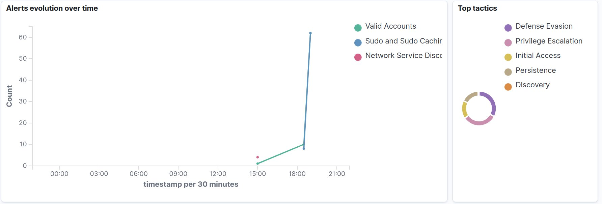
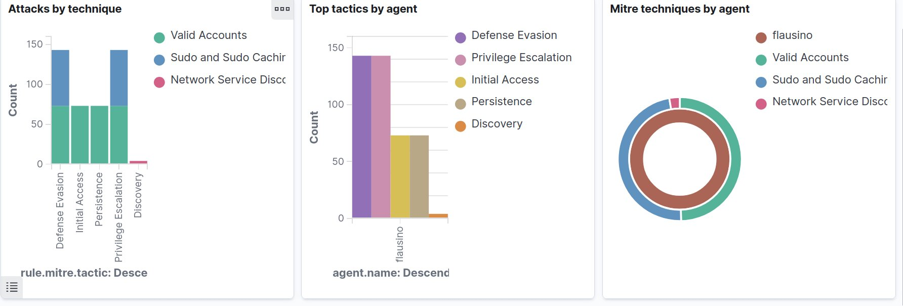

<!-- soc-banner -->
<p align="center"></p>

<p align="center">
   
</p>

# MITRE Caldera + Wazuh — Red Team Integration


End-to-end validated integration between **MITRE Caldera v5.3.0** and **Wazuh 4.14.2**.  
Caldera executes adversary TTPs on a target host; Wazuh parses, correlates, and maps them to MITRE ATT&CK in real time via a custom decoder and custom rules.

---

## Table of Contents

- [Architecture](#architecture)
- [Environment](#environment)
- [Prerequisites](#prerequisites)
- [Caldera Installation](#caldera-installation)
- [Nginx Reverse Proxy](#nginx-reverse-proxy)
- [Wazuh — Backup First](#wazuh--backup-first)
- [Custom Decoder](#custom-decoder)
- [Custom Rules](#custom-rules)
- [Apply and Restart](#apply-and-restart)
- [Validation — wazuh-logtest](#validation--wazuh-logtest)
- [Validation — Real Syslog](#validation--real-syslog)
- [Alert Storm Script](#alert-storm-script)
- [DevTools Queries](#devtools-queries)
- [Dashboard](#dashboard)
- [Results](#results)
- [Troubleshooting](#troubleshooting)
- [Rollback](#rollback)
- [Files Created](#files-created)

---

## Architecture

```
[MITRE Caldera v5.3.0]
    |
    +-- Sandcat agent executes TTPs on target host
         |
         v
    logger -t caldera "CALDERA_TTP ..."
         |
         v
[Wazuh Manager 4.14.2]
    +-- Decoder: caldera-ttp-marker
    |     +-- Extracts: technique_id, operation, ability, agent, status
    +-- Rules: 110500 (group) / 110501 (generic) / 110502 (T1082-specific)
         |
         v
[Wazuh Indexer -- index: wazuh-alerts-*]
         |
         v
[Wazuh Dashboard -- MITRE ATT&CK tab]
    +-- Alerts evolution over time
    +-- Top tactics
    +-- Attacks by technique
    +-- MITRE techniques by agent
```

**Ports used:**

| Port | Protocol | Purpose                        |
|------|----------|--------------------------------|
| 80   | TCP      | Nginx reverse proxy to Caldera |
| 8888 | TCP      | Caldera (localhost only)       |
| 5601 | TCP      | Wazuh Dashboard                |
| 1514 | UDP      | Wazuh agent events             |
| 1515 | TCP      | Wazuh agent registration       |

---

## Environment

| Component  | Value                    |
|------------|--------------------------|
| OS         | Ubuntu 24.04 LTS (Noble) |
| Wazuh      | 4.14.2 (all-in-one)      |
| Caldera    | 5.3.0                    |
| Python     | 3.12 (system) + venv     |
| Nginx      | Reverse proxy for port 80|
| Deployment | Single host (all-in-one) |

---

## Prerequisites

```bash
sudo apt update && sudo apt upgrade -y
sudo apt install -y \
  curl git \
  python3 python3-venv python3-pip python3-dev \
  build-essential golang-go \
  nginx ufw \
  cargo rustc
```

---

## Caldera Installation

```bash
cd /opt
sudo rm -rf caldera
sudo git clone --recursive --branch 5.3.0 \
  https://github.com/mitre/caldera.git caldera

# Replace <your-user> with your OS username
sudo chown -R <your-user>:<your-user> caldera
cd caldera

python3 -m venv .calderavenv
source .calderavenv/bin/activate
pip install --upgrade pip
pip install -r requirements.txt

# First run -- builds the UI (5-15 min, expected)
python server.py --build
# Press Ctrl+C after the build completes
```

### Systemd Service

```bash
sudo tee /etc/systemd/system/caldera.service > /dev/null <<EOF
[Unit]
Description=MITRE Caldera v5.3.0
After=network.target

[Service]
Type=simple
User=<your-user>
Group=<your-user>
WorkingDirectory=/opt/caldera
ExecStart=/opt/caldera/.calderavenv/bin/python server.py
Restart=always
RestartSec=5
Environment=PYTHONUNBUFFERED=1
LimitNOFILE=65535

[Install]
WantedBy=multi-user.target
EOF

sudo systemctl daemon-reload
sudo systemctl enable --now caldera
sudo systemctl status caldera --no-pager
```

### Deploy Sandcat Agent

```bash
server="http://127.0.0.1:8888"
curl -s -X POST \
  -H "file:sandcat.go" \
  -H "platform:linux" \
  "$server/file/download" > sandcat-agent \
  && chmod +x sandcat-agent \
  && nohup ./sandcat-agent -server "$server" -group red > /dev/null 2>&1 &
```

---

## Nginx Reverse Proxy

```bash
sudo tee /etc/nginx/sites-available/caldera > /dev/null <<'EOF'
server {
    listen 80;
    server_name _;

    access_log /var/log/nginx/caldera.access.log;
    error_log  /var/log/nginx/caldera.error.log;

    location / {
        proxy_pass         http://127.0.0.1:8888;
        proxy_set_header   Host              $host;
        proxy_set_header   X-Real-IP         $remote_addr;
        proxy_set_header   X-Forwarded-For   $proxy_add_x_forwarded_for;
        proxy_set_header   X-Forwarded-Proto $scheme;
        proxy_http_version 1.1;
        proxy_set_header   Upgrade    $http_upgrade;
        proxy_set_header   Connection "upgrade";
    }
}
EOF

sudo ln -s /etc/nginx/sites-available/caldera /etc/nginx/sites-enabled/
sudo rm -f /etc/nginx/sites-enabled/default
sudo nginx -t && sudo systemctl reload nginx
```

---

## Wazuh — Backup First

Always back up before modifying decoders or rules:

```bash
ts=$(date +%Y%m%d_%H%M%S)
sudo mkdir -p /var/ossec/backups
sudo tar -czf /var/ossec/backups/pre_caldera_${ts}.tgz \
  /var/ossec/etc/decoders \
  /var/ossec/etc/rules
echo "Backup saved: /var/ossec/backups/pre_caldera_${ts}.tgz"
```

### Pre-check — confirm clean state

```bash
sudo grep -R "CALDERA_TTP" \
  /var/ossec/etc/decoders \
  /var/ossec/ruleset/decoders 2>/dev/null

sudo grep -R "caldera-ttp-marker" \
  /var/ossec/etc/rules \
  /var/ossec/ruleset/rules 2>/dev/null
```

Expected: no output.

---

## Custom Decoder

**File:** `/var/ossec/etc/decoders/050-caldera-ttp-marker.xml`

```bash
sudo tee /var/ossec/etc/decoders/050-caldera-ttp-marker.xml > /dev/null <<'EOF'
<decoder name="caldera-ttp-marker">
  <program_name>caldera</program_name>
  <prematch>CALDERA_TTP</prematch>
  <regex>CALDERA_TTP technique_id=(\S+) operation=(\S+) ability=(\S+) agent=(\S+) status=(\S+)</regex>
  <order>caldera.technique_id, caldera.operation, caldera.ability, caldera.agent, caldera.status</order>
</decoder>
EOF
```

> **Note on `<parent>`:** Using `<parent>caldera-syslog</parent>` caused a startup error
> (`ERROR: (2101): Parent decoder name invalid`) due to decoder load order.
> Removing it and using explicit `<program_name>` resolves this — validated.

---

## Custom Rules

**File:** `/var/ossec/etc/rules/050-caldera-ttp-marker.xml`

```bash
sudo tee /var/ossec/etc/rules/050-caldera-ttp-marker.xml > /dev/null <<'EOF'
<group name="caldera,adversary_emulation,">

  <!-- Base grouping rule -- no alert generated -->
  <rule id="110500" level="0" noalert="1">
    <decoded_as>caldera-ttp-marker</decoded_as>
    <description>CALDERA TTP marker -- base grouping</description>
  </rule>

  <!-- Generic alert for any CALDERA_TTP event -->
  <rule id="110501" level="8">
    <if_sid>110500</if_sid>
    <description>CALDERA TTP marker: technique=$(caldera.technique_id) op=$(caldera.operation) ability=$(caldera.ability) agent=$(caldera.agent) status=$(caldera.status)</description>
    <group>caldera,mitre_attack,adversary_emulation,</group>
  </rule>

  <!-- Specific rule for T1082 - System Information Discovery -->
  <rule id="110502" level="10">
    <if_sid>110500</if_sid>
    <field name="caldera.technique_id">^T1082$</field>
    <description>CALDERA T1082 detected: op=$(caldera.operation) ability=$(caldera.ability) agent=$(caldera.agent) status=$(caldera.status)</description>
    <mitre>
      <id>T1082</id>
    </mitre>
    <group>caldera,mitre_attack,discovery,</group>
  </rule>

</group>
EOF
```

---

## Apply and Restart

```bash
sudo systemctl restart wazuh-manager
sudo systemctl status wazuh-manager --no-pager
```

Expected: `Active: active (running)`

---

## Validation — wazuh-logtest

No syslog or live Caldera needed — validates parsing and rule matching directly.

**T1082 — must trigger rule 110502 (level 10):**

```bash
echo '2026-01-01T12:00:00.000000+00:00 hostname caldera: CALDERA_TTP technique_id=T1082 operation=smoke_test ability=logger_marker agent=local status=ok' \
  | sudo /var/ossec/bin/wazuh-logtest
```

Expected output (excerpt):

```
**Phase 2: Completed decoding.
        decoder: 'caldera-ttp-marker'
        caldera.technique_id: 'T1082'
        caldera.operation: 'smoke_test'
        caldera.ability: 'logger_marker'
        caldera.agent: 'local'
        caldera.status: 'ok'

**Phase 3: Completed filtering (rules).
        id: '110502'
        level: '10'
        description: 'CALDERA T1082 detected: ...'
```

**Generic TTP — must trigger rule 110501 (level 8):**

```bash
echo '2026-01-01T12:00:00.000000+00:00 hostname caldera: CALDERA_TTP technique_id=T1046 operation=smoke_test ability=logger_marker agent=local status=ok' \
  | sudo /var/ossec/bin/wazuh-logtest
```

Expected: `id: '110501'`, `level: '8'`

---

## Validation — Real Syslog

```bash
# Inject one real event into syslog
logger -t caldera "CALDERA_TTP technique_id=T1082 operation=smoke_test ability=logger_marker agent=local status=ok"

# Confirm rule 110502 fired
sudo grep '"id":"110502"' /var/ossec/logs/alerts/alerts.json | tail -n 3

# Confirm decoder name
sudo tail -n 2000 /var/ossec/logs/alerts/alerts.json \
  | grep '"decoder":{"name":"caldera-ttp-marker"}' | tail -n 3
```

---

## Alert Storm Script

Injects 30 events per technique across 5 ATT&CK techniques.  
Required to generate enough volume for dashboard charts.

```bash
sudo systemctl is-active wazuh-manager

for i in $(seq 1 30); do
  logger -t caldera "CALDERA_TTP technique_id=T1082 operation=storm_A ability=logger_marker agent=local status=ok"
done

for i in $(seq 1 30); do
  logger -t caldera "CALDERA_TTP technique_id=T1046 operation=storm_B ability=logger_marker agent=local status=ok"
done

for i in $(seq 1 30); do
  logger -t caldera "CALDERA_TTP technique_id=T1059.003 operation=storm_C ability=logger_marker agent=local status=fail"
done

for i in $(seq 1 30); do
  logger -t caldera "CALDERA_TTP technique_id=T1110.001 operation=storm_D ability=logger_marker agent=local status=started"
done

for i in $(seq 1 30); do
  logger -t caldera "CALDERA_TTP technique_id=T1071.001 operation=storm_E ability=logger_marker agent=local status=ok"
done
```

**Verify distribution locally:**

```bash
sudo tail -n 5000 /var/ossec/logs/alerts/alerts.json \
  | grep -oE '"technique_id":"T[^"]+"' | sort | uniq -c | sort -nr
```

---

## DevTools Queries

Open Wazuh Dashboard → Dev Tools. Index pattern: `wazuh-alerts-*`.

**Latest CALDERA events:**

```json
GET wazuh-alerts-*/_search
{
  "size": 10,
  "query": { "match": { "decoder.name": "caldera-ttp-marker" } },
  "sort": [ { "@timestamp": "desc" } ]
}
```

**Filter by rule 110502:**

```json
GET wazuh-alerts-*/_search
{
  "size": 10,
  "query": { "term": { "rule.id": "110502" } },
  "sort": [ { "@timestamp": "desc" } ]
}
```

**Technique distribution (requires `.keyword`):**

```json
GET wazuh-alerts-*/_search
{
  "size": 0,
  "query": { "match": { "decoder.name": "caldera-ttp-marker" } },
  "aggs": {
    "techniques": {
      "terms": {
        "field": "data.caldera.technique_id.keyword",
        "size": 10
      }
    }
  }
}
```

**Rule ID distribution:**

```json
GET wazuh-alerts-*/_search
{
  "size": 0,
  "query": { "match": { "decoder.name": "caldera-ttp-marker" } },
  "aggs": {
    "rules": {
      "terms": {
        "field": "rule.id.keyword",
        "size": 10
      }
    }
  }
}
```

> Using a plain text field in aggregations returns: `"Text fields are not optimised for aggregations"`.  
> Always use the `.keyword` variant.

---

## Dashboard

All charts use index pattern `wazuh-alerts-*`.  
Add a global filter in every chart: `decoder.name: caldera-ttp-marker`  
Time range: Last 24 hours (adjust as needed).

### Chart 1 — Technique Activity Over Time (Line)

```
Type:        Line
Y-axis:      Aggregation: Count | Label: "Event Count"
X-axis:      Date Histogram | Field: @timestamp | Interval: 1m | Label: "Time"
Split series: Terms | Field: data.caldera.technique_id.keyword | Size: 5
```

Save as: `CALDERA - Technique Activity Over Time`

### Chart 2 — Events by MITRE Technique (Donut)

```
Type:         Pie (enable Donut in Options)
Metric:       Count
Buckets:      Split slices | Terms | Field: data.caldera.technique_id.keyword | Size: 10
```

Save as: `CALDERA - Events by MITRE Technique`

### Chart 3 — Execution Status Breakdown (Donut)

```
Type:         Pie (enable Donut in Options)
Metric:       Count
Buckets:      Split slices | Terms | Field: data.caldera.status.keyword | Size: 10
```

> If syslog collapses repeated messages, values like `ok]` or `fail]` may appear.  
> Optional filter: `NOT data.caldera.status.keyword: "*]"`

Save as: `CALDERA - Execution Status Breakdown`

### Chart 4 — Top Techniques by Event Count (Bar)

```
Type:   Vertical Bar
Y-axis: Count | Label: "Event Count"
X-axis: Terms | Field: data.caldera.technique_id.keyword | Order: Descending | Size: 10 | Label: "Technique ID"
```

Save as: `CALDERA - Top Techniques by Event Count`

### Final Dashboard Layout

```
[ CALDERA - Technique Activity Over Time   (line -- full width) ]
[ Events by MITRE Technique (donut) ]  [ Execution Status (donut) ]
[ Top Techniques by Event Count            (bar -- full width)  ]
```

Save as: `CALDERA - Wazuh Integration Overview`

---

## Results

Dashboard screenshots from a validated run (5 techniques x 30 events each):

### Alerts evolution over time + Top tactics



### Attacks by technique + Top tactics by agent + MITRE techniques by agent



### Full MITRE ATT&CK dashboard view


**Techniques confirmed in Wazuh alerts:**

| Technique  | Name                       | Rule triggered     |
|------------|----------------------------|--------------------|
| T1082      | System Information Discovery | 110502 (level 10) |
| T1046      | Network Service Discovery  | 110501 (level 8)   |
| T1059.003  | Windows Command Shell      | 110501 (level 8)   |
| T1110.001  | Password Guessing          | 110501 (level 8)   |
| T1071.001  | Web Protocols              | 110501 (level 8)   |

---

## Troubleshooting

| Symptom | Cause | Fix |
|---------|-------|-----|
| `Remote branch v5.3.0 not found` | Wrong tag format | Use `--branch 5.3.0` (no leading `v`) |
| Caldera UI very slow on first start | Normal — UI build | Expected 5–15 min on first `python server.py --build` |
| `Parent decoder name invalid: 'caldera-syslog'` | Decoder load order | Remove `<parent>`, use explicit `<program_name>caldera</program_name>` |
| Field missing in Visualize dropdown | No events yet | Inject at least one event, then refresh index pattern fields |
| `Text fields are not optimised for aggregations` | Wrong field type | Use `.keyword` suffix on all aggregation fields |
| Manager fails to start after change | XML syntax error | Run: `sudo journalctl -xeu wazuh-manager.service \| tail -80` |

---

## Rollback

```bash
# 1. Stop manager
sudo systemctl stop wazuh-manager

# 2. Restore backup (replace <TIMESTAMP> with your actual value)
sudo tar -xzf /var/ossec/backups/pre_caldera_<TIMESTAMP>.tgz -C /

# 3. Restart and verify
sudo systemctl start wazuh-manager
sudo systemctl status wazuh-manager --no-pager
```

---

## Files Created

| File | Purpose |
|------|---------|
| `/var/ossec/etc/decoders/050-caldera-ttp-marker.xml` | Custom decoder — extracts CALDERA_TTP fields |
| `/var/ossec/etc/rules/050-caldera-ttp-marker.xml` | Custom rules 110500, 110501, 110502 |
| `/var/ossec/backups/pre_caldera_<TIMESTAMP>.tgz` | Backup of decoders + rules before changes |
| `/etc/systemd/system/caldera.service` | Caldera systemd service unit |
| `/etc/nginx/sites-available/caldera` | Nginx reverse proxy configuration |

No modifications were made to `/var/ossec/etc/ossec.conf` or any existing Wazuh ruleset file.

---

## References

- [MITRE Caldera documentation](https://caldera.readthedocs.io)
- [MITRE Caldera GitHub — v5.3.0](https://github.com/mitre/caldera/releases/tag/5.3.0)
- [Wazuh MITRE ATT&CK integration](https://documentation.wazuh.com/current/user-manual/ruleset/mitre.html)
- [Wazuh custom decoders and rules](https://documentation.wazuh.com/current/user-manual/ruleset/custom.html)
