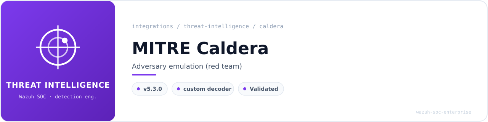
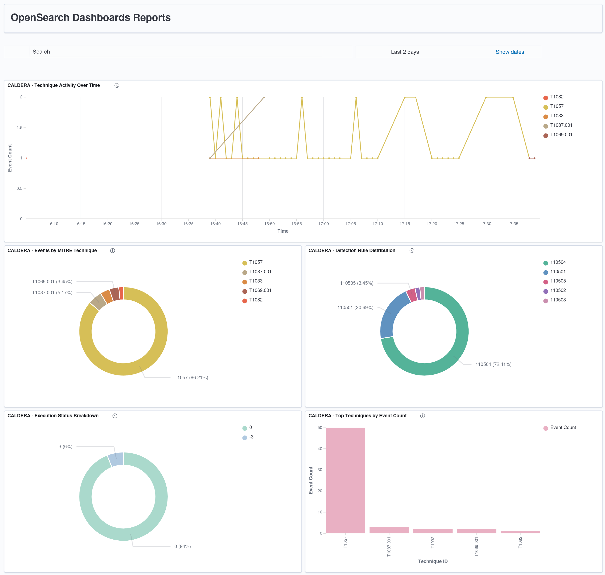

<!-- soc-banner -->
<p align="center"></p>

<p align="center">
   
</p>

# MITRE Caldera + Wazuh — Red Team Integration


End-to-end validated integration between **MITRE Caldera v5.3.0** and **Wazuh 4.14.6**.  
Caldera executes adversary TTPs on a target host; Wazuh parses, correlates, and maps them to MITRE ATT&CK in real time via a custom decoder and custom rules.

Events are ingested **from real operations** via the Caldera v2 REST API — an event-log shipper pulls each executed ability and feeds it to Wazuh, rather than injecting synthetic markers by hand.

---

## Table of Contents

- [Architecture](#architecture)
- [Environment](#environment)
- [Prerequisites](#prerequisites)
- [Caldera Installation](#caldera-installation)
- [Wazuh — Backup First](#wazuh--backup-first)
- [Custom Decoder](#custom-decoder)
- [Custom Rules](#custom-rules)
- [Apply and Restart](#apply-and-restart)
- [Validation — wazuh-logtest](#validation--wazuh-logtest)
- [Validation — wazuh-analysisd](#validation--wazuh-analysisd)
- [Event Ingestion — API Shipper](#event-ingestion--api-shipper)
- [Validation — Real Operation](#validation--real-operation)
- [DevTools Queries](#devtools-queries)
- [Dashboard](#dashboard)
- [Results](#results)
- [Troubleshooting](#troubleshooting)
- [Rollback](#rollback)
- [Files Created](#files-created)
- [References](#references)

---

## Architecture

```
[MITRE Caldera v5.3.0]
    |
    +-- Sandcat agent executes TTPs on target host (real operation)
         |
         v
    caldera_shipper.py  --  polls v2 API:
      GET  /api/v2/operations
      POST /api/v2/operations/{id}/event-logs   (v5 uses POST, not GET)
         |
         v
    logger -t caldera "CALDERA_TTP technique_id=... operation=... ability=... agent=... status=..."
         |
         v
[Wazuh Manager 4.14.6]
    +-- Decoder: caldera-ttp-marker
    |     +-- Extracts: technique_id, operation, ability, agent, status
    +-- Rules: 110500 (group) / 110501 (generic)
    |          110502 (T1082) / 110503 (T1033) / 110504 (T1057) / 110505 (T1087.001)
         |
         v
[Wazuh Indexer -- index: wazuh-alerts-*]
         |
         v
[Wazuh Dashboard -- CALDERA - Wazuh Integration Overview]
    +-- Technique activity over time
    +-- Events by MITRE technique
    +-- Detection rule distribution (coverage metric)
    +-- Execution status breakdown
    +-- Top techniques by event count
```

**Ports used:**

| Port  | Protocol | Purpose                       |
|-------|----------|-------------------------------|
| 8888  | TCP      | Caldera (loopback / lab LAN)  |
| 9200  | TCP      | Wazuh Indexer                 |
| 443   | TCP      | Wazuh Dashboard               |
| 1514  | TCP      | Wazuh agent events            |
| 1515  | TCP      | Wazuh agent registration      |
| 55000 | TCP      | Wazuh API                     |

> This build accesses Caldera directly on 8888 (no Nginx reverse proxy).
> Keep 8888 bound to loopback or an isolated lab VLAN — Caldera is a real C2.

---

## Environment

| Component  | Value                          |
|------------|--------------------------------|
| OS         | Ubuntu 24.04 LTS (Noble)       |
| Wazuh      | 4.14.6 (manager/indexer/dash)  |
| Caldera    | 5.3.0                          |
| Python     | 3.12 (system) + venv           |
| Event src  | Caldera v2 API via shipper     |
| Deployment | Single host (bare metal)       |

---

## Prerequisites

```bash
sudo apt update && sudo apt upgrade -y
sudo apt install -y \
  curl git \
  python3 python3-venv python3-pip python3-dev \
  build-essential golang-go nodejs npm \
  ufw
```

> `nodejs`/`npm` are required — Caldera v5 builds its VueJS front-end (Magma)
> on first run. Without them the build step fails with
> `FileNotFoundError: 'npm'`.

---

## Caldera Installation

```bash
cd /opt
sudo git clone --recursive --branch 5.3.0 \
  https://github.com/mitre/caldera.git caldera

# Replace <your-user> with your OS username
sudo chown -R <your-user>:<your-user> caldera
cd caldera

python3 -m venv .calderavenv
source .calderavenv/bin/activate
pip install --upgrade pip
pip install -r requirements.txt

# First run -- builds the UI (5-15 min, expected)
python server.py --build
# Wait for "All systems ready", then press Ctrl+C
```

### Secure conf/local.yml

Caldera reads `conf/local.yml` if present; otherwise it falls back to the
insecure defaults in `conf/default.yml`. Copy the full default and override
only the secrets — a partial `local.yml` breaks startup because it replaces
the whole file (missing keys such as `encryption_key` raise
`TypeError: encoding without a string argument`).

```bash
cd /opt/caldera
cp conf/default.yml conf/local.yml

# generate fresh secrets
RED=$(python3 -c "import secrets;print(secrets.token_urlsafe(20))")
BLUE=$(python3 -c "import secrets;print(secrets.token_urlsafe(20))")
KEYR=$(python3 -c "import secrets;print(secrets.token_hex(16))")
KEYB=$(python3 -c "import secrets;print(secrets.token_hex(16))")
SALT=$(python3 -c "import secrets;print(secrets.token_hex(16))")
ENCK=$(python3 -c "import secrets;print(secrets.token_hex(16))")

sudo sed -i "s/^api_key_red: .*/api_key_red: \"$KEYR\"/;
             s/^api_key_blue: .*/api_key_blue: \"$KEYB\"/;
             s/^crypt_salt: .*/crypt_salt: \"$SALT\"/;
             s/^encryption_key: .*/encryption_key: \"$ENCK\"/;
             s/^    red: admin\$/    red: $RED/;
             s/^    admin: admin\$/    admin: $RED/;
             s/^    blue: admin\$/    blue: $BLUE/" conf/local.yml
```

> **Quote hex secrets.** YAML may mis-type an unquoted hex string; wrap
> `api_key_*`, `crypt_salt`, and `encryption_key` values in double quotes.

### Systemd Service

```bash
sudo tee /etc/systemd/system/caldera.service > /dev/null <<'EOF'
[Unit]
Description=MITRE Caldera v5.3.0 - Adversary Emulation
After=network.target

[Service]
Type=simple
User=<your-user>
Group=<your-user>
WorkingDirectory=/opt/caldera
ExecStart=/opt/caldera/.calderavenv/bin/python server.py
Restart=always
RestartSec=5
Environment=PYTHONUNBUFFERED=1
LimitNOFILE=65535

[Install]
WantedBy=multi-user.target
EOF

sudo systemctl daemon-reload
sudo systemctl enable --now caldera
sudo systemctl status caldera --no-pager
```

> If the service fails with *"Failed to decrypt saved Caldera state due to
> incorrect encryption key"*, the stored state was encrypted under the old
> `--insecure` key. Reset it once: run the server with `--fresh`, wait for
> "All systems ready", stop it, then start via systemd.

### Deploy Sandcat Agent

```bash
server="http://127.0.0.1:8888"
curl -s -X POST \
  -H "file:sandcat.go" \
  -H "platform:linux" \
  "$server/file/download" > sandcat-agent \
  && chmod +x sandcat-agent \
  && nohup ./sandcat-agent -server "$server" -group red > /dev/null 2>&1 &
```

Confirm in the UI (**agents**): one trusted `red` agent, platform `linux`.

---

## Wazuh — Backup First

Always back up before modifying decoders or rules:

```bash
ts=$(date +%Y%m%d_%H%M%S)
sudo mkdir -p /var/ossec/backups
sudo tar -czf /var/ossec/backups/pre_caldera_${ts}.tgz \
  /var/ossec/etc/decoders \
  /var/ossec/etc/rules
echo "Backup saved: /var/ossec/backups/pre_caldera_${ts}.tgz"
```

### Pre-check — confirm clean state

```bash
sudo grep -R "CALDERA_TTP" \
  /var/ossec/etc/decoders \
  /var/ossec/ruleset/decoders 2>/dev/null

sudo grep -R "caldera-ttp-marker" \
  /var/ossec/etc/rules \
  /var/ossec/ruleset/rules 2>/dev/null
```

Expected: no output.

---

## Custom Decoder

**File:** `/var/ossec/etc/decoders/050-caldera-ttp-marker.xml`

```bash
sudo tee /var/ossec/etc/decoders/050-caldera-ttp-marker.xml > /dev/null <<'EOF'
<decoder name="caldera-ttp-marker">
  <program_name>caldera</program_name>
  <prematch>CALDERA_TTP</prematch>
  <regex>CALDERA_TTP technique_id=(\S+) operation=(\S+) ability=(\S+) agent=(\S+) status=(\S+)</regex>
  <order>caldera.technique_id, caldera.operation, caldera.ability, caldera.agent, caldera.status</order>
</decoder>
EOF
```

> **Note on `<parent>`:** Using `<parent>caldera-syslog</parent>` caused a startup error
> (`ERROR: (2101): Parent decoder name invalid`) due to decoder load order.
> Removing it and using explicit `<program_name>` resolves this — validated.

---

## Custom Rules

**File:** `/var/ossec/etc/rules/050-caldera-ttp-marker.xml`

Six rules: a base grouping rule, a generic catch-all, and **four
technique-specific rules** each carrying a `<mitre>` tag.

```bash
sudo tee /var/ossec/etc/rules/050-caldera-ttp-marker.xml > /dev/null <<'EOF'
<group name="caldera,adversary_emulation,">

  <!-- Base grouping rule -- no alert generated -->
  <rule id="110500" level="0" noalert="1">
    <decoded_as>caldera-ttp-marker</decoded_as>
    <description>CALDERA marker grouping</description>
  </rule>

  <!-- Generic catch-all: any CALDERA_TTP event with no specific rule yet -->
  <rule id="110501" level="8">
    <if_sid>110500</if_sid>
    <description>CALDERA TTP marker: technique=$(caldera.technique_id) op=$(caldera.operation) ability=$(caldera.ability) agent=$(caldera.agent) status=$(caldera.status)</description>
    <group>caldera,mitre_attack,adversary_emulation,</group>
  </rule>

  <!-- T1082 - System Information Discovery -->
  <rule id="110502" level="10">
    <if_sid>110500</if_sid>
    <field name="caldera.technique_id">^T1082$</field>
    <description>CALDERA T1082 System Information Discovery: op=$(caldera.operation) ability=$(caldera.ability) agent=$(caldera.agent) status=$(caldera.status)</description>
    <mitre>
      <id>T1082</id>
    </mitre>
    <group>caldera,mitre_attack,discovery,</group>
  </rule>

  <!-- T1033 - System Owner/User Discovery -->
  <rule id="110503" level="10">
    <if_sid>110500</if_sid>
    <field name="caldera.technique_id">^T1033$</field>
    <description>CALDERA T1033 System Owner/User Discovery: op=$(caldera.operation) ability=$(caldera.ability) agent=$(caldera.agent) status=$(caldera.status)</description>
    <mitre>
      <id>T1033</id>
    </mitre>
    <group>caldera,mitre_attack,discovery,</group>
  </rule>

  <!-- T1057 - Process Discovery -->
  <rule id="110504" level="10">
    <if_sid>110500</if_sid>
    <field name="caldera.technique_id">^T1057$</field>
    <description>CALDERA T1057 Process Discovery: op=$(caldera.operation) ability=$(caldera.ability) agent=$(caldera.agent) status=$(caldera.status)</description>
    <mitre>
      <id>T1057</id>
    </mitre>
    <group>caldera,mitre_attack,discovery,</group>
  </rule>

  <!-- T1087.001 - Account Discovery: Local Account -->
  <rule id="110505" level="10">
    <if_sid>110500</if_sid>
    <field name="caldera.technique_id">^T1087\.001$</field>
    <description>CALDERA T1087.001 Account Discovery Local Account: op=$(caldera.operation) ability=$(caldera.ability) agent=$(caldera.agent) status=$(caldera.status)</description>
    <mitre>
      <id>T1087.001</id>
    </mitre>
    <group>caldera,mitre_attack,discovery,</group>
  </rule>

</group>
EOF
```

> **Adding coverage.** When an operation surfaces a technique that still falls
> through to 110501 (for example T1069.001, Permission Groups Discovery), add
> the next rule (110506, ...) using the same pattern. Escape the dot in
> sub-technique IDs: `^T1087\.001$`.

---

## Apply and Restart

```bash
sudo systemctl restart wazuh-manager
sudo systemctl status wazuh-manager --no-pager
```

Expected: `Active: active (running)`

---

## Validation — wazuh-logtest

No syslog or live Caldera needed — validates parsing and rule matching directly.
Each technique must map to its specific rule.

**T1057 — must trigger rule 110504 (level 10):**

```bash
printf 'Jul 24 17:30:00 flausino caldera[1]: CALDERA_TTP technique_id=T1057 operation=proof ability=test agent=nizcdm status=0\n' \
  | sudo /var/ossec/bin/wazuh-logtest
```

Expected output (excerpt):

```
**Phase 2: Completed decoding.
        name: 'caldera-ttp-marker'
        caldera.ability: 'test'
        caldera.agent: 'nizcdm'
        caldera.operation: 'proof'
        caldera.status: '0'
        caldera.technique_id: 'T1057'

**Phase 3: Completed filtering (rules).
        id: '110504'
        level: '10'
        description: 'CALDERA T1057 Process Discovery: ...'
        mitre.id: '['T1057']'
        mitre.tactic: '['Discovery']'
        mitre.technique: '['Process Discovery']'
```

**Coverage matrix confirmed via wazuh-logtest:**

| Input technique_id | Rule fired | Level | mitre.technique          |
|--------------------|------------|-------|--------------------------|
| T1082              | 110502     | 10    | System Information Discovery |
| T1033              | 110503     | 10    | System Owner/User Discovery  |
| T1057              | 110504     | 10    | Process Discovery        |
| T1087.001          | 110505     | 10    | Local Account            |
| (any other, e.g. T1069.001) | 110501 | 8 | — (generic marker) |

---

## Validation — wazuh-analysisd

Confirm the ruleset compiles cleanly before relying on it. `wazuh-analysisd -t`
loads all decoders and rules in test mode and exits non-zero on any syntax error.

```bash
sudo /var/ossec/bin/wazuh-analysisd -t
```

Expected: completes with no `ERROR` lines. (Warnings about an unrelated absent
CDB list such as `osint_ipv4_reputation` are pre-existing and harmless.)
`wazuh-analysisd` will not start if any rule/decoder XML is malformed, so a
clean run here is proof the ruleset is valid.

---

## Event Ingestion — API Shipper

Events come from **real operations** via the Caldera v2 REST API, reformatted
into the syslog line the decoder expects. Wazuh's logcollector already reads
`/var/log/syslog`, so no `ossec.conf` change is required.

**Files:** `scripts/caldera_shipper.py`, `systemd/caldera-shipper.service`.

Key behaviour:

- Polls `GET /api/v2/operations`, then `POST /api/v2/operations/{id}/event-logs`
  with an empty body. In v5 the event-logs endpoint is **POST** — a GET returns
  `405 Method Not Allowed`.
- Emits each ability as
  `CALDERA_TTP technique_id=... operation=... ability=... agent=... status=...`
  via `logger -t caldera`.
- Deduplicates on `finished_timestamp|paw|ability_id` in a state file.

**Install**

```bash
sudo mkdir -p /opt/caldera-wazuh
sudo cp scripts/caldera_shipper.py /opt/caldera-wazuh/
sudo cp systemd/caldera-shipper.service /etc/systemd/system/
# edit the service: set User= and CALDERA_API_KEY= (api_key_red from conf/local.yml)
sudo systemctl daemon-reload
sudo systemctl enable --now caldera-shipper
sudo systemctl status caldera-shipper --no-pager
```

> **Quick smoke test** (no operation needed) to confirm the decoder/rule path:
> ```bash
> logger -t caldera "CALDERA_TTP technique_id=T1082 operation=smoke ability=test agent=local status=0"
> ```

---

## Validation — Real Operation

Deploy a Sandcat agent (above), then in the UI:
**operations → Create Operation → adversary: Discovery → group: red → Start.**

As abilities execute, the shipper converts them within one poll interval (30 s).

```bash
# Techniques the shipper emitted (red-team ground truth)
sudo grep -oP 'CALDERA_TTP technique_id=\K\S+' /var/log/syslog | sort | uniq -c

# Rules that fired in Wazuh (blue-team detection)
sudo grep 'CALDERA' /var/ossec/logs/alerts/alerts.log \
  | grep -oP 'Rule: \K\d+' | sort | uniq -c
```

Example from a validated Discovery run:

```
# techniques executed
      2 T1033
     13 T1057
      1 T1082
      2 T1087.001

# rules fired
      1 110501     <- generic (uncovered technique)
      1 110502
      1 110503
     12 110504
      2 110505
```

---

## DevTools Queries

Open Wazuh Dashboard → Dev Tools. Index pattern: `wazuh-alerts-*`.

**Latest CALDERA events:**

```json
GET wazuh-alerts-*/_search
{
  "size": 10,
  "query": { "match": { "decoder.name": "caldera-ttp-marker" } },
  "sort": [ { "@timestamp": "desc" } ]
}
```

**Confirm MITRE tagging on the specific rules:**

```json
GET wazuh-alerts-*/_search
{
  "size": 3,
  "query": { "terms": { "rule.id": ["110503","110504","110505"] } },
  "_source": ["rule.id","rule.mitre.id","rule.mitre.technique","data.caldera.technique_id"]
}
```

**Technique distribution:**

```json
GET wazuh-alerts-*/_search
{
  "size": 0,
  "query": { "match": { "decoder.name": "caldera-ttp-marker" } },
  "aggs": {
    "techniques": { "terms": { "field": "data.caldera.technique_id", "size": 20 } }
  }
}
```

**Rule distribution (the coverage metric):**

```json
GET wazuh-alerts-*/_search
{
  "size": 0,
  "query": { "match": { "decoder.name": "caldera-ttp-marker" } },
  "aggs": {
    "rules": { "terms": { "field": "rule.id", "size": 20 } }
  }
}
```

> On this index the `data.caldera.*` and `rule.id` fields are already
> aggregatable — use the plain names. If a Terms aggregation returns
> *"Text fields are not optimised for aggregations"*, append `.keyword` to that
> field as a fallback.

---

## Dashboard

All charts use index pattern `wazuh-alerts-*`.  
Global DQL filter on every chart: `decoder.name: "caldera-ttp-marker"`  
Time range: Last 1 day (adjust as needed).

### Chart 1 — Technique Activity Over Time (Line)

```
Type:         Line
Y-axis:       Aggregation: Count | Label: "Event Count"
X-axis:       Date Histogram | Field: @timestamp | Interval: Minute | Label: "Time"
Split series: Terms | Field: data.caldera.technique_id | Size: 10 | Label: "MITRE Technique"
```

Save as: `CALDERA - Technique Activity Over Time`

### Chart 2 — Events by MITRE Technique (Donut)

```
Type:    Pie (enable Donut in Options)
Metric:  Count | Label: "Event Count"
Buckets: Split slices | Terms | Field: data.caldera.technique_id | Size: 10 | Label: "MITRE Technique"
```

Save as: `CALDERA - Events by MITRE Technique`

### Chart 3 — Detection Rule Distribution (Donut)

```
Type:    Pie (enable Donut in Options)
Metric:  Count | Label: "Alerts"
Buckets: Split slices | Terms | Field: rule.id | Size: 10 | Label: "Wazuh Rule ID"
```

The generic-vs-specific split shown here is the core coverage metric.

Save as: `CALDERA - Detection Rule Distribution`

### Chart 4 — Top Techniques by Event Count (Bar)

```
Type:   Vertical Bar
Y-axis: Count | Label: "Event Count"
X-axis: Terms | Field: data.caldera.technique_id | Order: Descending | Size: 10 | Label: "Technique ID"
```

Save as: `CALDERA - Top Techniques by Event Count`

### Chart 5 — Execution Status Breakdown (Donut)

```
Type:    Pie (enable Donut in Options)
Metric:  Count | Label: "Event Count"
Buckets: Split slices | Terms | Field: data.caldera.status | Size: 10 | Label: "Execution Status"
```

> If syslog collapses repeated messages, a value like `0]` may appear. Add to
> the chart's DQL: `decoder.name: "caldera-ttp-marker" and not data.caldera.status: "*]"`

Save as: `CALDERA - Execution Status Breakdown`

### Final Dashboard Layout

```
[ CALDERA - Technique Activity Over Time        (line -- full width) ]
[ Events by MITRE Technique (donut) ]  [ Detection Rule Distribution (donut) ]
[ Execution Status Breakdown (donut) ] [ Top Techniques by Event Count (bar)  ]
```

Save as: `CALDERA - Wazuh Integration Overview`

---

## Results

Dashboard exported from a validated run against the **Discovery** adversary
(real Sandcat operation, not synthetic injection).

### Full dashboard view



**Events by MITRE technique:**

| Technique | Name                             | Share   |
|-----------|----------------------------------|---------|
| T1057     | Process Discovery                | 86.21%  |
| T1087.001 | Account Discovery: Local Account | 5.17%   |
| T1033     | System Owner/User Discovery      | 3.45%   |
| T1069.001 | Permission Groups Discovery: Local | 3.45% |
| T1082     | System Information Discovery     | ~1.7%   |

**Detection rule distribution (coverage):**

| Rule   | Meaning                    | Share   |
|--------|----------------------------|---------|
| 110504 | T1057 specific             | 72.41%  |
| 110501 | generic marker (uncovered) | 20.69%  |
| 110505 | T1087.001 specific         | 3.45%   |
| 110502 | T1082 specific             | ~1.7%   |
| 110503 | T1033 specific             | ~1.7%   |

**Execution status:** success (`0`) 94% · failed (`-3`) 6%.

The residual **110501** slice (~21%) is the remaining coverage gap — chiefly
**T1069.001**, which has no specific rule yet. Naming that gap is the point of
the exercise: it identifies the next rule to author (110506). This is the
purple-team loop — emulate, measure, find gap, write rule, re-measure.

---

## Troubleshooting

| Symptom | Cause | Fix |
|---------|-------|-----|
| `Remote branch v5.3.0 not found` | Wrong tag format | Use `--branch 5.3.0` (no leading `v`) |
| `FileNotFoundError: 'npm'` on `--build` | Node.js absent | `sudo apt install -y nodejs npm` |
| `TypeError: encoding without a string argument` | `local.yml` missing `encryption_key` | Copy full `default.yml` to `local.yml`, override only secrets |
| `Failed to decrypt saved Caldera state` | State encrypted under old `--insecure` key | Run once with `--fresh`, then start via systemd |
| `405 Method Not Allowed` on event-logs | v5 endpoint is POST | Use `POST /api/v2/operations/{id}/event-logs` with `{}` body |
| `Parent decoder name invalid: 'caldera-syslog'` | Decoder load order | Remove `<parent>`, use explicit `<program_name>caldera</program_name>` |
| Manager fails to start after change | XML syntax error | `sudo journalctl -xeu wazuh-manager.service \| tail -80` |
| `Text fields are not optimised for aggregations` | Wrong field type | Append `.keyword` to that aggregation field |
| Status slice shows `0]` | syslog collapsed repeats | Chart DQL: `... and not data.caldera.status: "*]"` |

---

## Rollback

```bash
# 1. Stop manager
sudo systemctl stop wazuh-manager

# 2. Restore backup (replace <TIMESTAMP> with your actual value)
sudo tar -xzf /var/ossec/backups/pre_caldera_<TIMESTAMP>.tgz -C /

# 3. Restart and verify
sudo systemctl start wazuh-manager
sudo systemctl status wazuh-manager --no-pager
```

To remove the emulation stack entirely:

```bash
sudo systemctl disable --now caldera caldera-shipper
sudo rm -f /etc/systemd/system/caldera.service /etc/systemd/system/caldera-shipper.service
sudo rm -rf /opt/caldera /opt/caldera-wazuh
sudo systemctl daemon-reload
```

---

## Files Created

| File | Purpose |
|------|---------|
| `/var/ossec/etc/decoders/050-caldera-ttp-marker.xml` | Custom decoder — extracts CALDERA_TTP fields |
| `/var/ossec/etc/rules/050-caldera-ttp-marker.xml` | Custom rules 110500–110505 (4 technique-specific) |
| `/var/ossec/backups/pre_caldera_<TIMESTAMP>.tgz` | Backup of decoders + rules before changes |
| `/opt/caldera/conf/local.yml` | Caldera config with rotated secrets |
| `/etc/systemd/system/caldera.service` | Caldera systemd service unit |
| `/opt/caldera-wazuh/caldera_shipper.py` | v2 API event-log shipper |
| `/etc/systemd/system/caldera-shipper.service` | Shipper systemd service unit |

No modifications were made to `/var/ossec/etc/ossec.conf` or any existing Wazuh ruleset file.

---

## References

- [MITRE Caldera documentation](https://caldera.readthedocs.io)
- [MITRE Caldera GitHub — v5.3.0](https://github.com/mitre/caldera/releases/tag/5.3.0)
- [Wazuh MITRE ATT&CK integration](https://documentation.wazuh.com/current/user-manual/ruleset/mitre.html)
- [Wazuh custom decoders and rules](https://documentation.wazuh.com/current/user-manual/ruleset/custom.html)

---

<sub>
<b>Navigation</b> &nbsp;
<a href="../../README.md">Portfolio home</a> &nbsp;&middot;&nbsp;
<a href="README.md">Threat Intelligence & Detection</a> &nbsp;&middot;&nbsp;
<a href="../README.md">All 22 integrations</a> &nbsp;&middot;&nbsp;
<a href="../../detection-coverage/attack-coverage.md">Detection coverage</a> &nbsp;&middot;&nbsp;
<a href="../../playbooks/README.md">SOC playbooks</a> &nbsp;&middot;&nbsp;
<a href="../../METRICS.md">Metrics</a>
<br><br>
Validated in a single-workstation lab. Each guide records the versions it was validated
against; see <a href="../../README.md#lab-status">lab status</a>.
</sub>
