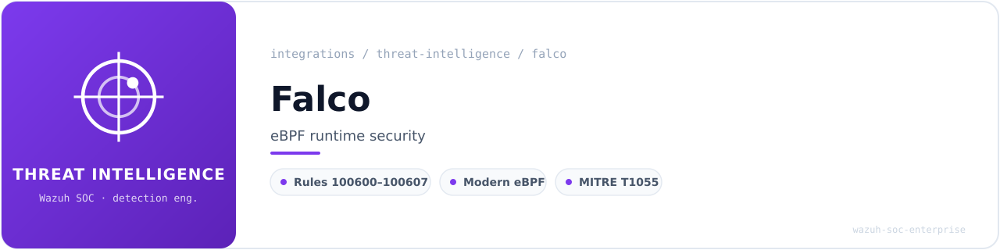
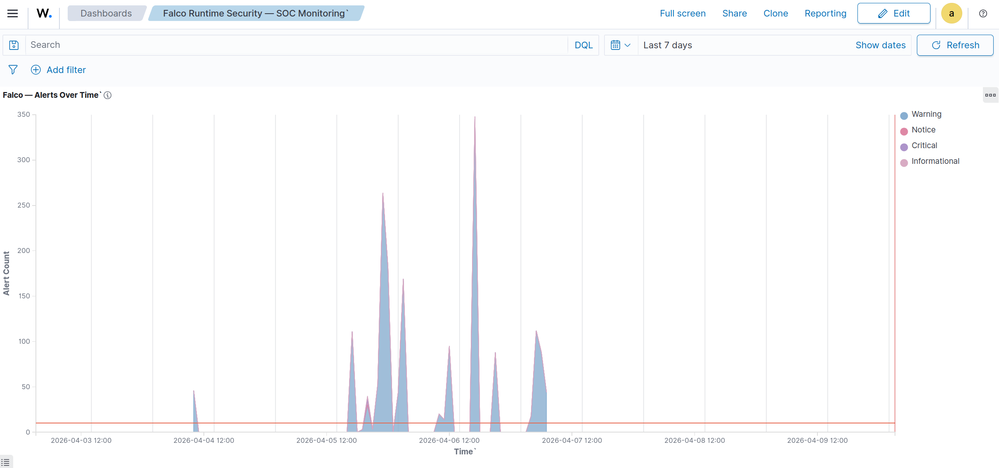
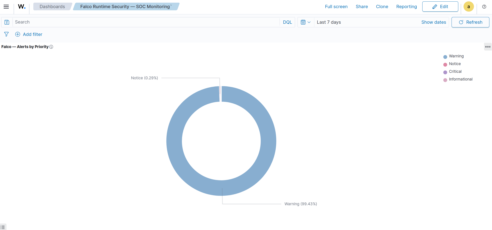
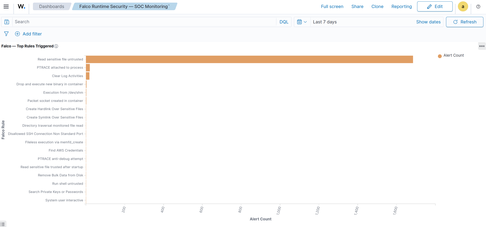
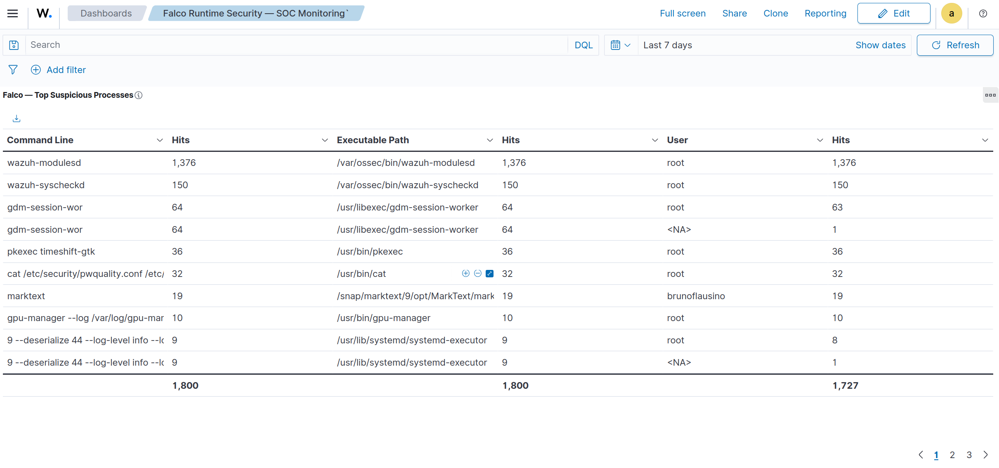
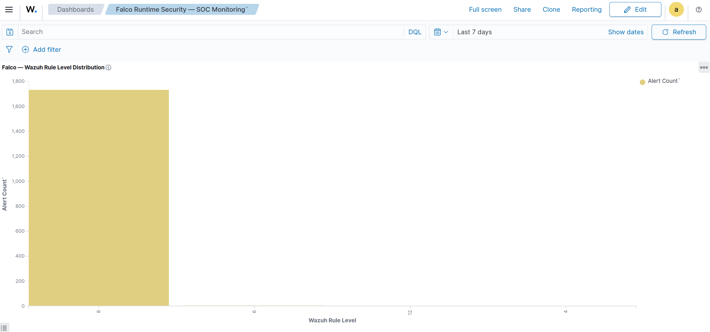
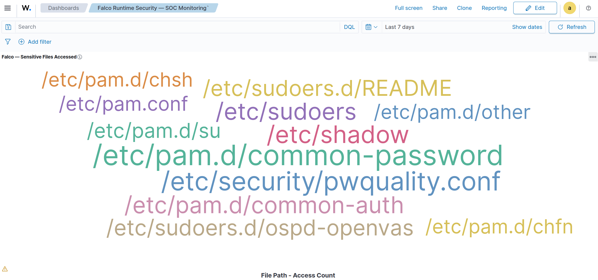
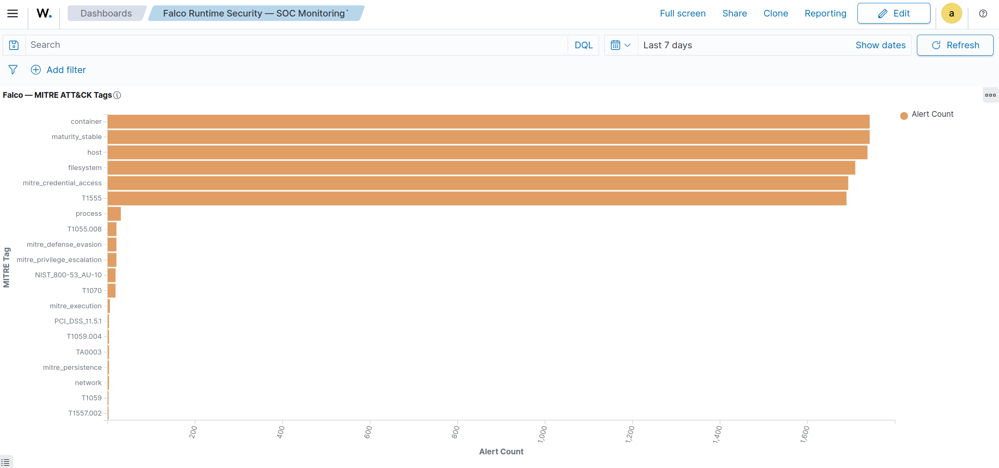
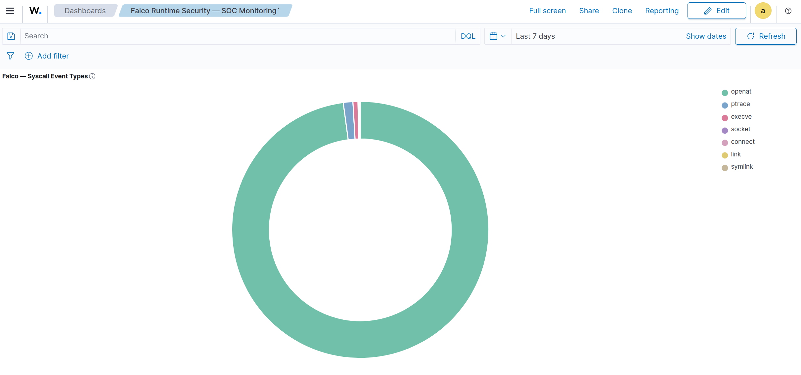

<!-- soc-banner -->
<p align="center"></p>

<p align="center">
   
</p>

# Falco Runtime Security — Wazuh Integration

## Table of Contents

1. [Overview](#1-overview)
2. [Environment](#2-environment)
3. [Installation](#3-installation)
4. [Configuration](#4-configuration)
5. [Wazuh Integration](#5-wazuh-integration)
6. [Validation](#6-validation)
7. [Dashboards and Visualizations](#7-dashboards-and-visualizations)
8. [Use Cases and Alerts](#8-use-cases-and-alerts)
9. [Troubleshooting](#9-troubleshooting)

---

## 1. Overview

[Falco](https://falco.org/) is a cloud-native runtime security tool that instruments the Linux kernel via eBPF probes to intercept and analyze system calls in real time. It applies a rich rule engine to flag suspicious activity including privilege escalation, container escapes, sensitive file access, network anomalies, and fileless malware execution.

This integration forwards Falco alerts as structured JSON to the Wazuh SIEM, enabling centralized detection, MITRE ATT&CK correlation, and SOC dashboard visualization.

**Integration type:** Log-based (JSON file to Wazuh localfile reader)

**Alert pipeline:** Falco (eBPF) -> `/var/log/falco_events.json` -> Wazuh logcollector -> analysisd (JSON decoder) -> OpenSearch -> Dashboard

---

## 2. Environment

| Component        | Detail                                               |
|------------------|------------------------------------------------------|
| OS               | Ubuntu 24.04.4 LTS                                   |
| Kernel           | 6.17.0-20-generic (x86_64)                           |
| Wazuh            | 4.14.4 — All-in-one bare metal (Manager + Indexer + Dashboard) |
| Falco            | 0.43.0 — Driver: Modern eBPF                         |
| Falco Libs       | 0.23.1 / Plugin API 3.12.0 / Engine 0.58.0           |
| Host             | flausino — 192.168.1.136                             |
| Rule ID range    | 100600-100607                                        |
| Log output file  | `/var/log/falco_events.json`                         |

---

## 3. Installation

### 3.1 APT Repository and GPG Key

```bash
curl -fsSL https://falco.org/repo/falcosecurity-packages.asc | \
  sudo gpg --dearmor -o /usr/share/keyrings/falco-archive-keyring.gpg

echo "deb [signed-by=/usr/share/keyrings/falco-archive-keyring.gpg] \
  https://download.falco.org/packages/deb stable main" | \
  sudo tee /etc/apt/sources.list.d/falcosecurity.list

sudo apt-get update
```

### 3.2 Non-Interactive Installation

```bash
FALCO_FRONTEND=noninteractive sudo apt-get install -y falco
```

### 3.3 Enable Modern eBPF Driver

```bash
sudo systemctl enable falco-modern-bpf.service
sudo systemctl start falco-modern-bpf.service
sudo systemctl status falco-modern-bpf.service --no-pager
```

The Modern eBPF driver is bundled directly into the Falco binary — no kernel module compilation or DKMS required.

---

## 4. Configuration

### 4.1 Falco Custom Configuration

File: `/etc/falco/config.d/falco_custom.yaml`

```yaml
json_output: true
append_output:
  extra_fields:
    wazuh_integration: "falco"
file_output:
  enabled: true
  filename: /var/log/falco_events.json
```

- `json_output: true` — structured JSON enables Wazuh's built-in JSON decoder to auto-extract all fields into `data.*` dynamic fields.
- `wazuh_integration: "falco"` — injected into every event as the gateway discriminator for rule 100600. Pattern consistent with Cowrie, OpenVAS, and Velociraptor integrations in this project.
- `file_output` — file-based output chosen over syslog/gRPC for reliability with Wazuh logcollector.

### 4.2 Log File Permissions

```bash
sudo chown root:wazuh /var/log/falco_events.json
sudo chmod 640 /var/log/falco_events.json
```

Owner: `root` (Falco writes as root). Group: `wazuh` (logcollector reads as wazuh group).

### 4.3 Restart Falco

```bash
sudo systemctl restart falco-modern-bpf
sudo journalctl -u falco-modern-bpf -n 20 --no-pager
```

---

## 5. Wazuh Integration

### 5.1 ossec.conf — localfile block

```xml
<localfile>
  <log_format>json</log_format>
  <location>/var/log/falco_events.json</location>
  <label key="integration">falco</label>
  <only-future-events>yes</only-future-events>
</localfile>
```

- `<log_format>json</log_format>` — triggers the built-in JSON decoder, extracting all fields into `data.*` automatically.
- `<label key="integration">falco</label>` — adds `data.integration: falco` metadata to every event.
- `<only-future-events>yes</only-future-events>` — prevents reprocessing historical events on manager restart.

### 5.2 Decoder Strategy

No custom decoders. The built-in JSON decoder handles all field extraction. Custom child decoders with `<parent>json</parent>` are explicitly avoided due to confirmed Wazuh bug #33798, which silently destroys all JSON dynamic fields system-wide.

### 5.3 Rules — `/var/ossec/etc/rules/falco_rules.xml`

```xml
<group name="falco,">

  <!-- Gateway rule: identifies all Falco events via wazuh_integration discriminator.
       Level 0 = no alert generated; child rules inherit this match. -->
  <rule id="100600" level="0">
    <decoded_as>json</decoded_as>
    <field name="output_fields.wazuh_integration">falco</field>
    <description>Falco: runtime security event.</description>
    <options>no_full_log</options>
  </rule>

  <rule id="100601" level="4">
    <if_sid>100600</if_sid>
    <field name="priority">Info</field>
    <description>Falco Alert [Info] - $(output)</description>
    <options>no_full_log</options>
  </rule>

  <rule id="100602" level="6">
    <if_sid>100600</if_sid>
    <field name="priority">Notice</field>
    <description>Falco Alert [Notice] - $(output)</description>
    <options>no_full_log</options>
  </rule>

  <rule id="100603" level="8">
    <if_sid>100600</if_sid>
    <field name="priority">Warning</field>
    <description>Falco Alert [Warning] - $(output)</description>
    <options>no_full_log</options>
  </rule>

  <rule id="100604" level="10">
    <if_sid>100600</if_sid>
    <field name="priority">Error</field>
    <description>Falco Alert [Error] - $(output)</description>
    <options>no_full_log</options>
  </rule>

  <rule id="100605" level="12">
    <if_sid>100600</if_sid>
    <field name="priority">Critical</field>
    <description>Falco Alert [Critical] - $(output)</description>
    <options>no_full_log</options>
  </rule>

  <rule id="100606" level="14">
    <if_sid>100600</if_sid>
    <field name="priority">Alert</field>
    <description>Falco Alert [Alert] - $(output)</description>
    <options>no_full_log</options>
  </rule>

  <rule id="100607" level="16">
    <if_sid>100600</if_sid>
    <field name="priority">Emergency</field>
    <description>Falco Alert [Emergency] - $(output)</description>
    <options>no_full_log</options>
  </rule>

</group>
```

Notes:
- `<field name="priority">Info</field>` performs regex substring match — `Info` matches Falco value `Informational`. Validated in wazuh-logtest.
- `<options>no_full_log</options>` — prevents raw log storage; all relevant data preserved in `data.*` fields.
- `$(output)` — interpolates Falco's human-readable alert message into the Wazuh alert description.
- Rules 100605-100607 generate email notifications (mail: True).

### 5.4 File Permissions and Manager Restart

```bash
sudo chown wazuh:wazuh /var/ossec/etc/rules/falco_rules.xml
sudo chmod 640 /var/ossec/etc/rules/falco_rules.xml
sudo systemctl restart wazuh-manager
sudo systemctl status wazuh-manager --no-pager
```

## 6. Validation

This section validates the Falco + Wazuh integration end-to-end, from event generation through rule matching, indexing, and dashboard visibility. Falco supports JSON output for every alert, and Wazuh supports reading JSON log files via localfile collection, which makes this file-based integration path reliable and operationally simple. The validation approach used here follows the appropriate workflow for security content engineering: generate known events, confirm raw log output, validate rule matches with wazuh-logtest, and verify indexed fields in OpenSearch DevTools.

### 6.1 Event Generation

The official Falco event-generator was used to generate syscall-based test events on the host:

    sudo docker run --rm -it --pid=host \
      falcosecurity/event-generator run syscall --all

Results:

- ~30 actions executed successfully on the host.
- ~15 actions were skipped because they only apply to containers.
- 304 total events were written to /var/log/falco_events.json.

Manual organic triggers were also executed to validate common runtime detections:

    # Warning — Read sensitive file untrusted
    cat /etc/shadow

    # Warning — Search Private Keys or Passwords
    grep -r "password" /etc/ 2>/dev/null || true

    # Notice — System user interactive
    sudo -u nobody bash -c 'whoami'

### 6.2 Falco Log Validation

After event generation, the Falco JSON log was analyzed to confirm successful event capture and priority distribution.

Total events: 304

Priority breakdown:

| Falco Priority | Events |
|---|---:|
| Warning | 294 |
| Notice | 5 |
| Critical | 4 |
| Informational | 1 |
| Error | 0 |
| Alert | 0 |
| Emergency | 0 |

Coverage notes:

- Warning was the dominant priority, primarily driven by sensitive file reads and credential-search activity.
- Notice events included container-related networking activity such as packet socket creation.
- Critical events were produced by container-focused runtime execution detections.
- Error, Alert, and Emergency were not generated organically by the tested stock Falco ruleset.

The absence of higher-severity priorities in organic testing does not invalidate the integration. Those paths were verified synthetically in wazuh-logtest and remain ready for production use if future Falco rules generate them.


### 6.3 Wazuh-Logtest Validation

The Wazuh logtest tool is designed specifically to test decoders and rules against sample events, which makes it the correct validation mechanism for confirming rule matching before relying on production indexing or dashboard output.

Four real Falco events and three synthetic priority tests were validated.

Logtest summary:

| Priority | Rule ID | Level | Phase 3 | Mail | Status |
|---|---:|---:|---|---|---|
| Warning | 100603 | 8 | PASS | False | Validated with real event |
| Critical | 100605 | 12 | PASS | True | Validated with real event |
| Notice | 100602 | 6 | PASS | False | Validated with real event |
| Informational | 100601 | 4 | PASS | False | Validated with real event |
| Error | 100604 | 10 | PASS | False | Validated with synthetic event |
| Alert | 100606 | 14 | PASS | True | Validated with synthetic event |
| Emergency | 100607 | 16 | PASS | True | Validated with synthetic event |

Representative validated events:

- Rule 100603 Warning level 8 — real event: cat /etc/shadow
- Rule 100605 Critical level 12 — real container-binary execution event
- Rule 100602 Notice level 6 — real packet socket event in container
- Rule 100601 Informational level 4 — real system user interactive event
- Rule 100604 Error level 10 — synthetic event
- Rule 100606 Alert level 14 — synthetic event
- Rule 100607 Emergency level 16 — synthetic event

Key validation conclusions:

- All 8 Falco-related Wazuh rules passed validation.
- JSON fields were decoded correctly during Phase 2.
- Priority-to-level mapping worked as designed.
- The <field name="priority">Info</field> rule correctly matched the Falco value Informational via regex substring behavior.

### 6.4 OpenSearch DevTools Validation

After confirming correct rule matching in wazuh-logtest, the wazuh-alerts index was queried in DevTools to validate end-to-end indexing.

Alert count query:

    GET wazuh-alerts-*/_count
    { "query": { "bool": { "must": [{ "match": { "rule.groups": "falco" } }] } } }

Result: 192 indexed alerts.

Priority aggregation:

| Falco Priority | Indexed Alerts |
|---|---:|
| Warning | 182 |
| Notice | 5 |
| Critical | 4 |
| Informational | 1 |
| Total | 192 |

Rule ID distribution query:

    GET wazuh-alerts-*/_search
    { "size": 0, "query": { "bool": { "must": [{ "match": { "rule.groups": "falco" } }] } },
      "aggs": { "by_rule_id": { "terms": { "field": "rule.id", "size": 10 } } } }

Rule ID distribution results:

| Wazuh Rule ID | Count | Falco Priority |
|---|---:|---|
| 100603 | 182 | Warning |
| 100602 | 5 | Notice |
| 100605 | 4 | Critical |
| 100601 | 1 | Informational |


Top Falco detection rules query:

    GET wazuh-alerts-*/_search
    { "size": 0, "query": { "bool": { "must": [{ "match": { "rule.groups": "falco" } }] } },
      "aggs": { "top_falco_rules": { "terms": { "field": "data.rule", "size": 20 } } } }

Top Falco detection rules:

| Falco Rule | Alerts | Priority |
|---|---:|---|
| Read sensitive file untrusted | 162 | Warning |
| PTRACE attached to process | 7 | Warning |
| Clear Log Activities | 4 | Warning |
| Drop and execute new binary in container | 3 | Critical |
| Execution from /dev/shm | 2 | Warning |
| Packet socket created in container | 2 | Notice |
| Create Hardlink Over Sensitive Files | 1 | Warning |
| Create Symlink Over Sensitive Files | 1 | Warning |
| Directory traversal monitored file read | 1 | Warning |
| Disallowed SSH Connection Non Standard Port | 1 | Warning |
| Fileless execution via memfd_create | 1 | Warning |
| Find AWS Credentials | 1 | Warning |
| PTRACE anti-debug attempt | 1 | Warning |
| Read sensitive file trusted after startup | 1 | Warning |
| Remove Bulk Data from Disk | 1 | Warning |
| Run shell untrusted | 1 | Warning |
| Search Private Keys or Passwords | 1 | Warning |
| System user interactive | 1 | Informational |

Field mapping verification query:

    GET wazuh-alerts-*/_search
    { "size": 1, "query": { "bool": { "must": [{ "match": { "rule.groups": "falco" } }] } },
      "_source": ["data.*", "rule.id", "rule.level", "rule.groups", "timestamp"] }

Confirmed mappings and aggregations:

- data.priority → Warning
- data.rule → Read sensitive file untrusted
- data.output_fields.proc.cmdline → wazuh-modulesd
- data.output_fields.proc.exepath → /var/ossec/bin/wazuh-modulesd
- data.output_fields.fd.name → /etc/sudoers.d/README
- data.output_fields.evt.type → openat
- data.output_fields.wazuh_integration → falco
- rule.id → 100603
- rule.level → 8
- rule.groups → [falco]

Additional confirmed aggregation values:

- Syscall event types: openat (168), execve (11), ptrace (8), socket (2), connect (1), link (1), symlink (1)
- Sensitive files accessed: /etc/pam.d/common-password (26), /etc/shadow (22), /etc/security/pwquality.conf (17), /etc/pam.d/common-auth (14), /etc/sudoers (12), and 15+ additional paths
- Users: root (183), brunoflausino (6), daemon (1)
- Process executable paths: 16 distinct paths including wazuh-modulesd, wazuh-syscheckd, gdm-session-worker, event-generator, nmap, and memfd:program

Note on indexed volume:

Of the 304 events present in the Falco log, 192 were indexed in Wazuh/OpenSearch. The difference corresponds to older events excluded by the localfile setting only-future-events=yes, which is a documented Wazuh behavior for forward-only collection after service start.

## 7. Dashboards

Falco can emit one JSON object per alert, and Wazuh can ingest JSON logs and expose the resulting fields for dashboards and rule validation, which is exactly what this section documents for the SOC monitoring view.

### 7.1 Dashboard Specifications

Dashboard title: Falco Runtime Security — SOC Monitoring

Global filter: rule.groups is falco (pinned)

Time range: custom range covering the alert generation period (2026-04-04 to 2026-04-06), or Last 7 days for ongoing monitoring.

Before creating the visualizations, the index pattern field list was refreshed so all data.output_fields.* fields were available in the Wazuh Dashboard field picker.

### 7.2 Visualization Details

| # | Title | Type | Key Field | Description |
|---|---|---|---|---|
| 1 | Falco — Alerts Over Time | Area | timestamp split by data.priority | Timeline of alerts with stacked areas per severity |
| 2 | Falco — Alerts by Priority | Pie | data.priority | Proportional distribution of alerts by priority |
| 3 | Falco — Top Rules Triggered | Horizontal Bar | data.rule | Top 20 most frequently triggered Falco rules |
| 4 | Falco — Top Suspicious Processes | Data Table | data.output_fields.proc.cmdline | Process command lines, executable paths, and user context |
| 5 | Falco — Wazuh Rule Level Distribution | Vertical Bar | rule.level | Distribution of Wazuh alert severity levels |
| 6 | Falco — Sensitive Files Accessed | Tag Cloud | data.output_fields.fd.name | File paths targeted in file-access alerts |
| 7 | Falco — MITRE ATT&CK Tags | Horizontal Bar | data.tags | MITRE technique IDs and tactic categories |
| 8 | Falco — Syscall Event Types | Pie (donut) | data.output_fields.evt.type | Distribution of Linux syscall event types |


Dashboard layout (12-column grid):

    ┌─────────────────────────────────────────────────────┐
    │            Falco — Alerts Over Time (12 cols)      │  Row 1
    └─────────────────────────────────────────────────────┘
    ┌───────────────┬───────────────┬───────────────┐
    │ Alerts by     │ Rule Level    │ Syscall Event │      Row 2
    │ Priority      │ Distribution  │ Types         │
    │ (4 cols)      │ (4 cols)      │ (4 cols)      │
    └───────────────┴───────────────┴───────────────┘
    ┌─────────────────────┬─────────────────────┐
    │ Top Rules Triggered │ MITRE ATT&CK Tags   │          Row 3
    │ (6 cols)            │ (6 cols)            │
    └─────────────────────┴─────────────────────┘
    ┌───────────────────────────┬───────────────────┐
    │ Top Suspicious Processes  │ Sensitive Files   │      Row 4
    │ (7 cols)                  │ Accessed (5 cols) │
    └───────────────────────────┴───────────────────┘

### 7.3 Dashboard Screenshots


Falco alerts over time, displayed as a stacked area chart by data.priority.


Priority distribution showing Warning as dominant, with Notice, Critical, and Informational also present.


Horizontal bar chart with the most frequently triggered Falco detection rules.


Data table showing suspicious process command lines, executable paths, and user context.


Vertical bar chart showing Wazuh rule severity levels generated from Falco priorities.


Tag cloud showing targeted sensitive paths such as /etc/shadow, PAM files, and sudo-related files.


Horizontal bar chart showing MITRE ATT&CK techniques and other Falco rule tags.


Donut chart showing the distribution of Linux syscall event types, with openat as dominant.

## 8. Use Cases and Alerts

The integration provides high-value runtime detection coverage for local SOC monitoring, especially in areas where application-layer logging alone is insufficient. The triggered Falco rules and mapped MITRE tags demonstrate practical detection value across credential access, defense evasion, execution, privilege escalation, and suspicious host/container activity.

| Use Case | Representative Falco Rule | Wazuh Rule ID | Level | MITRE Coverage | Notes |
|---|---|---:|---:|---|---|
| Sensitive credential access | Read sensitive file untrusted | 100603 | 8 | T1555, T1552 | Captures reads of files such as /etc/shadow and related secrets |
| Anti-forensics / log tampering | Clear Log Activities | 100603 | 8 | T1070 | Useful for identifying defense evasion and cleanup behavior |
| Fileless or memory-backed execution | Fileless execution via memfd_create | 100603 | 8 | T1620 | High-value runtime signal for modern malware tradecraft |
| Unauthorized container binary execution | Drop and execute new binary in container | 100605 | 12 | T1611, T1059 | High-severity container runtime detection with mail=True |
| Process injection / tracing abuse | PTRACE attached to process / PTRACE anti-debug attempt | 100603 | 8 | T1055.008 | Highlights debugging, tampering, or process manipulation behavior |
| Suspicious network discovery | Packet socket created in container | 100602 | 6 | T1046 | Useful for identifying container reconnaissance activity |
| Suspicious shell / user activity | System user interactive / Run shell untrusted | 100601 / 100603 | 4 / 8 | T1059, T1059.004 | Detects risky interactive or shell-driven execution patterns |


## 9. Troubleshooting

### 9.1 No alerts appear in Wazuh

Check that Falco is actively writing JSON events to /var/log/falco_events.json and that Wazuh is reading the file through a localfile block with log_format set to json. Wazuh documents this as the correct pattern for ingesting JSON logs from a local file.

Verify:

- falco-modern-bpf.service is active
- /var/log/falco_events.json is receiving new lines
- /var/ossec/etc/ossec.conf contains the Falco localfile block
- Wazuh Manager was restarted after configuration changes

### 9.2 JSON fields are missing or not mapped correctly

Use wazuh-logtest with a real event sample from /var/log/falco_events.json to confirm Phase 2 decoding and Phase 3 rule matching. Wazuh documents wazuh-logtest as the appropriate sandbox tool for validating decoders and rules.

This integration intentionally uses the built-in JSON decoder only. Do not introduce child decoders for this integration pattern.

### 9.3 Some Falco priorities do not appear in organic testing

This is expected for the stock ruleset and tested actions.

Known behavior observed during validation:

- Error priority did not appear organically
- Alert and Emergency were not produced by default Falco stable/incubating rules in this test set
- Rules 100604, 100606, and 100607 were validated synthetically and are ready for future custom Falco rules

### 9.4 High noise from Wazuh processes reading sensitive files

The dominant rule volume came from Read sensitive file untrusted, and part of that noise was generated by Wazuh's own binaries during normal monitoring activity.

Recommended Falco tuning:

    - rule: Read sensitive file untrusted
      append:
        condition: and not proc.exepath startswith /var/ossec/bin/

### 9.5 Pre-existing unrelated warnings

Known unrelated rule warnings were present during logtest in other Wazuh rule groups:

- Rules 80250–80255
- Rules 80780–80792
- Rules 99901–99920

These were unrelated to the Falco integration and did not affect Falco event decoding or alert classification.

## Appendix

### Key File Paths

| Purpose | Path |
|---|---|
| Falco config override | /etc/falco/config.d/falco_custom.yaml |
| Falco default rules | /etc/falco/falco_rules.yaml |
| Falco JSON log | /var/log/falco_events.json (root:wazuh 640) |
| Wazuh custom rules | /var/ossec/etc/rules/falco_rules.xml (wazuh:wazuh 640) |
| Wazuh config | /var/ossec/etc/ossec.conf |
| Falco service | falco-modern-bpf.service (enabled, active) |
| Falco APT repo | /etc/apt/sources.list.d/falcosecurity.list |
| Falco GPG key | /etc/apt/trusted.gpg.d/falcosecurity.gpg |
| Backup directory | ~/wazuh-backup-complete/falco_integration_20260404_101156/ |
| Rule ID range | 100600–100607 (reserved for Falco) |

Report generated for the wazuh-soc-enterprise GitHub portfolio project.

---

<sub>
<b>Navigation</b> &nbsp;
<a href="../../README.md">Portfolio home</a> &nbsp;&middot;&nbsp;
<a href="README.md">Threat Intelligence & Detection</a> &nbsp;&middot;&nbsp;
<a href="../README.md">All 22 integrations</a> &nbsp;&middot;&nbsp;
<a href="../../detection-coverage/attack-coverage.md">Detection coverage</a> &nbsp;&middot;&nbsp;
<a href="../../playbooks/README.md">SOC playbooks</a> &nbsp;&middot;&nbsp;
<a href="../../METRICS.md">Metrics</a>
<br><br>
Validated in a single-workstation lab. Each guide records the versions it was validated
against; see <a href="../../README.md#lab-status">lab status</a>.
</sub>

