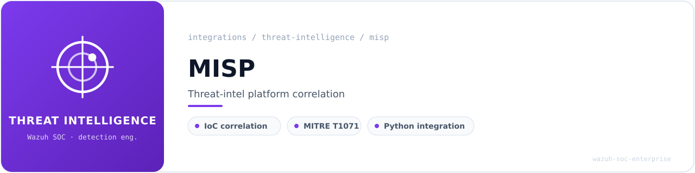
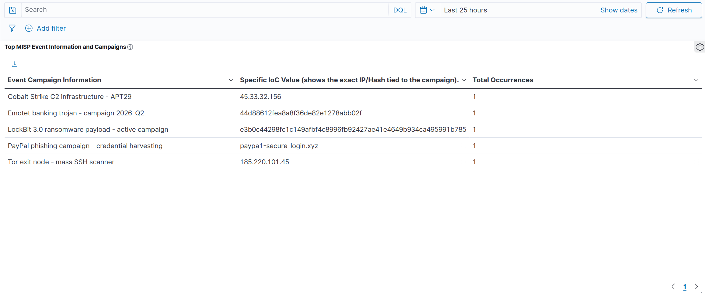
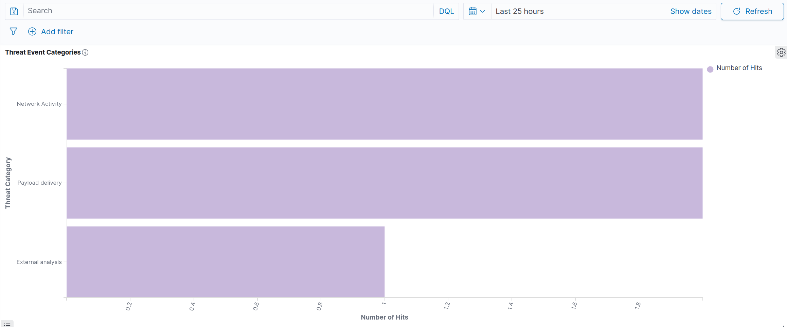
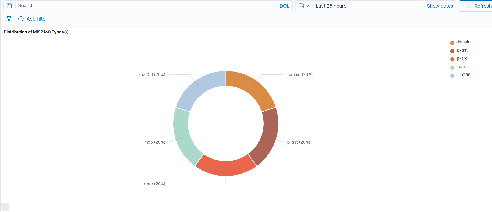
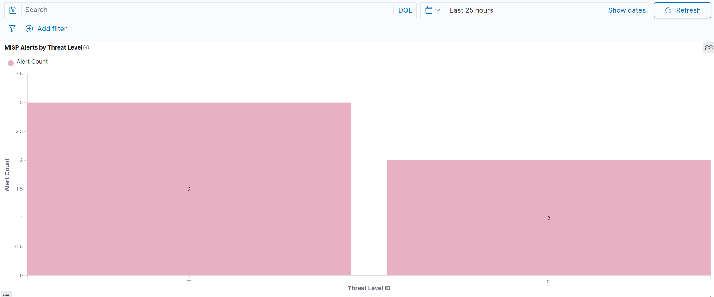

<!-- soc-banner -->
<p align="center"></p>

<p align="center">
   
</p>

# MISP (Malware Information Sharing Platform) — Wazuh Integration

## Table of Contents

1. [Overview](#1-overview)
2. [Environment](#2-environment)
3. [Architecture](#3-architecture)
4. [Installation](#4-installation)
5. [Configuration](#5-configuration)
6. [Wazuh Integration Script](#6-wazuh-integration-script)
7. [Decoders and Rules](#7-decoders-and-rules)
8. [Validation](#8-validation)
9. [OpenSearch DevTools Validation](#9-opensearch-devtools-validation)
10. [Dashboards and Visualizations](#10-dashboards-and-visualizations)
11. [Troubleshooting](#11-troubleshooting)
12. [References](#12-references)

---

## 1. Overview

[MISP](https://www.misp-project.org/) (Malware Information Sharing Platform and Threat Sharing) is an open-source threat intelligence platform designed for collecting, storing, distributing and sharing cybersecurity indicators and threats. It provides structured IOCs (Indicators of Compromise) across IP addresses, domains, file hashes, URLs and more, enriched with MITRE ATT&CK context and threat-level metadata.

This integration connects MISP to the Wazuh SIEM via a custom Python integration script that runs within the `wazuh-integratord` framework. When a Wazuh alert fires from a monitored group (SSH, Suricata, Cowrie, PAM, etc.), the integration extracts IOCs from the alert payload, queries the MISP REST API for matches against known threat intelligence, and — on a hit — injects an enriched alert back into the Wazuh analysis engine via Unix domain socket. The enriched alert carries the full MISP context: IOC type, category, originating event, campaign name, and threat level.

**Integration type:** Active enrichment (Wazuh integratord → MISP REST API → socket-injected alert)

**Alert pipeline:**

```
Wazuh alert (sshd/suricata/cowrie/pam/web/sysmon/ids)
  → wazuh-integratord triggers custom-misp
    → extract_iocs() parses IPs, hashes, domains from alert JSON
      → MISP REST API /attributes/restSearch (IOC lookup)
        → on match: /events/view/{id} (campaign context)
          → send_event() via Unix socket /var/ossec/queue/sockets/queue
            → analysisd matches rule 100701 (level 12)
              → Filebeat → OpenSearch index → Dashboard
```

**IOC types supported:** ip-src, ip-dst, domain, md5, sha1, sha256

**MITRE ATT&CK mapping:** T1071 — Application Layer Protocol (Command and Control)

---

## 2. Environment

| Component | Detail |
|---|---|
| OS | Ubuntu 24.04 LTS |
| Kernel | 6.17.0-22-generic (x86_64) |
| Wazuh | 4.14.x — All-in-one bare metal (Manager + Indexer + Dashboard) |
| MISP | 2.5.39 — Docker Compose (official `misp-docker` repository) |
| MISP Modules | v3.0.8 |
| Python (Wazuh) | Framework Python with `requests` 2.33.1 |
| Host | flausino — bare metal |
| RAM | 32 GB (21 GB available at deployment time) |
| GPU | NVIDIA RTX 4070 SUPER (driver 595.71.05, DKMS) |
| Rule ID range | 100700–100701 |
| MISP ports | 8080 (HTTP), 8445 (HTTPS) |
| Integration date | 2026-06-06 |

---

## 3. Architecture

### 3.1 Deployment Model

MISP runs as a Docker Compose stack on the same bare-metal host as the Wazuh all-in-one deployment. Port selection was deliberately chosen after a full audit of all listening ports, Docker containers and systemd services to avoid conflicts.

| Service | Container | Port Mapping | Notes |
|---|---|---|---|
| misp-core | PHP app (Apache) | 8080→80, 8445→443 | Main web UI and REST API |
| misp-db | MariaDB | 3306 (internal) | No host-side exposure |
| misp-redis | Redis | 6379 (internal) | No host-side exposure (no conflict with system Redis) |
| misp-modules | Python enrichment | Internal only | Expansion modules |
| mail | SMTP relay | 25 (internal) | Ignored in lab context |

**Port conflict avoidance rationale:** Wazuh Dashboard occupies 443; OpenSearch occupies 9200/9202; MITRE Caldera occupies 8888. MISP was assigned 8080/8445 as clean, unoccupied ports confirmed via `ss -tlnp` full audit.

### 3.2 Integration Data Flow

```
┌─────────────────────────────────────────────────────────────┐
│                    Wazuh Manager                            │
│                                                             │
│  alert triggers ──► wazuh-integratord                       │
│  (groups: sshd,      │                                      │
│   suricata, ids,     │ spawns                               │
│   cowrie, pam,       ▼                                      │
│   web, sysmon)    custom-misp.py                            │
│                      │                                      │
│                      │ 1. extract_iocs(alert)               │
│                      │    ├─ srcip/dstip (skip RFC1918)     │
│                      │    ├─ md5/sha1/sha256                │
│                      │    └─ domain/hostname                │
│                      │                                      │
│                      │ 2. query_misp(value)                 │
│                      │    POST /attributes/restSearch       │
│                      │                                      │
│                      │ 3. get_event_info(event_id)          │
│                      │    GET /events/view/{id}             │
│                      │                                      │
│                      │ 4. send_event(enriched_msg)          │
│                      │    Unix socket → analysisd           │
│                      ▼                                      │
│  rule 100700 (base) ──► rule 100701 (level 12, match)       │
│                                                             │
│  ──► Filebeat ──► OpenSearch ──► Dashboard                  │
└─────────────────────────────────────────────────────────────┘
          │
          │ HTTPS :8445 (self-signed, verify=False)
          ▼
┌─────────────────────────────────┐
│    MISP Docker Stack            │
│    v2.5.39                      │
│    Org: FlausinoSOC             │
│    Feeds: CIRCL OSINT (active)  │
│    REST API: /attributes/       │
│              restSearch         │
└─────────────────────────────────┘
```

---

## 4. Installation

### 4.1 Pre-Installation Port Audit

Before deploying MISP, a complete port and service audit was performed to prevent conflicts:

```bash
echo "========== PORTAS EM ESCUTA ==========" && \
ss -tlnp | grep -v "127.0.0" | sort -t: -k2 -n && \
echo "" && \
echo "========== DOCKER CONTAINERS E PORTAS ==========" && \
docker ps --format "table {{.Names}}\t{{.Ports}}\t{{.Status}}" && \
echo "" && \
echo "========== DOCKER COMPOSE STACKS ==========" && \
docker compose ls
```

Confirmed ports 8080 and 8445 were available. Identified existing services: Wazuh stack (443, 1514, 1515, 9200, 55000), OpenSearch (9202), Cowrie (2222), Caldera (7010, 7012, 8022, 8888), Shuffle (9202 remapped).

### 4.2 Clone and Configure

```bash
cd ~ && git clone https://github.com/MISP/misp-docker.git
cd misp-docker
cp template.env .env
```

### 4.3 Environment Variables

The `.env` file was configured programmatically via Python to avoid manual errors:

```python
overrides = {
    "CORE_HTTP_PORT":          "8080",
    "CORE_HTTPS_PORT":         "8445",
    "BASE_URL":                "https://localhost:8445",
    "TZ":                      "Europe/Madrid",
    "ADMIN_EMAIL":             "admin@misp.local",
    "ADMIN_ORG":               "FlausinoSOC",
    "MYSQL_USER":              "misp",
    "CRON_USER_ID":            "1",
    "DISABLE_IPV6":            "true",
    "INNODB_BUFFER_POOL_SIZE": "512M",
}
# Passwords and encryption keys set separately (not shown)
```

Key variables verified after write:

```
CORE_HTTP_PORT=8080
CORE_HTTPS_PORT=8445
BASE_URL=https://localhost:8445
TZ=Europe/Madrid
ADMIN_ORG=FlausinoSOC
DISABLE_IPV6=true
INNODB_BUFFER_POOL_SIZE=512M
```

### 4.4 Pull and Deploy

```bash
cd ~/misp-docker && docker compose pull
docker compose up -d
```

All 5 containers started successfully: misp-core, misp-db (healthy), misp-redis (healthy), misp-modules (healthy), mail.

### 4.5 Healthcheck Fix

The default Docker healthcheck failed with a false negative because the `BASE_URL` includes port 8445 (the external mapping), but inside the container MISP listens on port 443. A `docker-compose.override.yml` was created to fix this:

```yaml
services:
  misp-core:
    healthcheck:
      test: curl -ks https://localhost/users/heartbeat > /dev/null || exit 1
      interval: 10s
      timeout: 5s
      retries: 5
      start_period: 60s
```

After applying the override:

```bash
docker compose up -d misp-core
```

Result: `misp-core` transitioned from `(unhealthy)` to `(healthy)`.

### 4.6 MISP Liveness Verification

```bash
curl -ks https://localhost:8445/users/heartbeat && echo " ← MISP alive"
```

```json
{
    "message": "Insufficient vespene gas."
}
```

The response is a known MISP easter egg (StarCraft reference) confirming the application is alive and responding to API requests.

---

## 5. Configuration

### 5.1 API Key Generation

The automation API key was generated via the CakePHP CLI inside the running container:

```bash
docker compose exec -T misp-core \
  /var/www/MISP/app/Console/cake user change_authkey admin@misp.local
```

The key (40 characters) was stored securely with restricted permissions:

```bash
echo "$MISP_KEY" > ~/misp-docker/.misp_automation_key
chmod 600 ~/misp-docker/.misp_automation_key
```

### 5.2 API Key Validation

```bash
MISP_KEY=$(cat ~/misp-docker/.misp_automation_key)
curl -ks -H "Authorization: $MISP_KEY" -H "Accept: application/json" \
  https://localhost:8445/servers/getVersion | python3 -m json.tool
```

```json
{
    "version": "2.5.39",
    "pymisp_recommended_version": "2.5.34.1",
    "perm_sync": true,
    "perm_sighting": true,
    "perm_galaxy_editor": true,
    "perm_analyst_data": true,
    "request_encoding": ["gzip", "br", "zstd"],
    "filter_sightings": true
}
```

Full admin permissions confirmed. API authentication operational.

### 5.3 Feed Activation

Two default feeds were available, both initially disabled:

| ID | Feed | Status |
|---|---|---|
| 1 | CIRCL OSINT Feed | Enabled ✓ |
| 2 | The Botvrij.eu Data | Disabled |

CIRCL OSINT was enabled and fetch triggered via API:

```bash
# Enable
curl -ks -H "Authorization: $MISP_KEY" \
  -X POST https://localhost:8445/feeds/enable/1

# Trigger fetch (background import)
curl -ks -H "Authorization: $MISP_KEY" \
  -X POST https://localhost:8445/feeds/fetchFromFeed/1
```

Both returned HTTP 200.

### 5.4 Test IOC Event Creation

A controlled test event was planted to validate the end-to-end pipeline with deterministic IOCs:

```bash
curl -ks -H "Authorization: $MISP_KEY" \
  -H "Content-Type: application/json" \
  -X POST https://localhost:8445/events/add \
  -d '{
    "info": "WAZUH-TEST: IOCs controlados para validacao da integracao",
    "distribution": 0,
    "threat_level_id": 2,
    "analysis": 2,
    "Attribute": [
      {"type": "ip-src",  "category": "Network activity",
       "value": "198.51.100.42", "to_ids": true},
      {"type": "domain",  "category": "Network activity",
       "value": "wazuh-misp-test.invalid", "to_ids": true},
      {"type": "md5",     "category": "Payload delivery",
       "value": "44d88612fea8a8f36de82e1278abb02f", "to_ids": true}
    ]
  }'
```

Result: Event ID=15, UUID=250d45b5..., 3 attributes created (EICAR md5, TEST-NET IP, test domain).

### 5.5 restSearch Validation

The same API endpoint used by the integration script was tested directly:

```bash
curl -ks -H "Authorization: $MISP_KEY" \
  -H "Content-Type: application/json" \
  -X POST https://localhost:8445/attributes/restSearch \
  -d '{"returnFormat":"json","value":"198.51.100.42"}'
```

```
✓ MATCH! value=198.51.100.42  type=ip-src  event_id=15  to_ids=True
```

This confirms the lookup mechanism that `custom-misp.py` will use returns the planted IOC.

---

## 6. Wazuh Integration Script

### 6.1 Pre-Requisites Verification

Before writing the integration script, four pre-requisites were validated:

| Check | Result |
|---|---|
| Python `requests` available in Wazuh framework | `requests` 2.33.1 ✓ |
| Unix domain socket for event injection | `/var/ossec/queue/sockets/queue` (srw-rw---- wazuh:wazuh) ✓ |
| `wazuh-integratord` running | PID 6653 ✓ |
| Rule ID range 100700–100710 available | Free ✓ |
| Existing integrations in `ossec.conf` | VirusTotal active (reference pattern) ✓ |

### 6.2 Shell Wrapper — `custom-misp`

Path: `/var/ossec/integrations/custom-misp` (694 bytes)

```bash
#!/bin/sh
# custom-misp — Wazuh integration wrapper for MISP
WPYTHON_BIN="framework/python/bin/python3"
SCRIPT_PATH_NAME="$0"
DIR_NAME="$(cd $(dirname ${SCRIPT_PATH_NAME}); pwd -P)"
SCRIPT_NAME="$(basename ${SCRIPT_PATH_NAME})"
case ${DIR_NAME} in
    */active-response/bin | */wodles*)
        if [ -z "${WAZUH_PATH}" ]; then
            WAZUH_PATH="$(cd ${DIR_NAME}/../..; pwd)"
        fi
        PYTHON_SCRIPT="${DIR_NAME}/${SCRIPT_NAME}.py"
    ;;
    */integrations)
        if [ -z "${WAZUH_PATH}" ]; then
            WAZUH_PATH="$(cd ${DIR_NAME}/..; pwd)"
        fi
        PYTHON_SCRIPT="${DIR_NAME}/${SCRIPT_NAME}.py"
    ;;
esac
${WAZUH_PATH}/${WPYTHON_BIN} ${PYTHON_SCRIPT} "$@"
```

This wrapper follows the standard Wazuh integration pattern (identical to the built-in `virustotal` wrapper), ensuring the correct Python interpreter from the Wazuh framework is used regardless of the system Python installation.

### 6.3 Python Script — `custom-misp.py`

Path: `/var/ossec/integrations/custom-misp.py` (5515 bytes)

The script implements 5 core functions:

**`extract_iocs(alert)`** — Parses the alert JSON payload and extracts IOCs of 3 types:

- **IP addresses** — Fields: `srcip`, `src_ip`, `dstip`, `dst_ip`, `id_orig_h`, `id_resp_h` (covers sshd, PAM, Suricata, Zeek, Cowrie decoders), plus Sysmon `eventdata.sourceIp` and `eventdata.destinationIp` for Windows agents. RFC 1918 / loopback / link-local / multicast addresses are filtered out via `ipaddress.is_private`.
- **File hashes** — Fields: `md5`, `sha1`, `sha256` (covers ClamAV, YARA, osquery, Wazuh FIM), plus Sysmon `eventdata.hashes` (format: `SHA256=...,MD5=...,SHA1=...`).
- **Domains** — Fields: `hostname`, `domain` (requires presence of `.` to avoid false positives on bare hostnames).

```python
def extract_iocs(alert):
    iocs = set()
    data = alert.get('data', {})

    # IPs from common decoder fields
    for field in ('srcip', 'src_ip', 'dstip', 'dst_ip',
                  'id_orig_h', 'id_resp_h'):
        val = data.get(field)
        if val and not is_internal_ip(val):
            iocs.add(('ip', val))

    # Sysmon (Windows agents)
    eventdata = data.get('win', {}).get('eventdata', {})
    for field in ('sourceIp', 'destinationIp'):
        val = eventdata.get(field)
        if val and not is_internal_ip(val):
            iocs.add(('ip', val))
    for h in eventdata.get('hashes', '').split(','):
        if '=' in h:
            _, val = h.split('=', 1)
            if val.strip():
                iocs.add(('hash', val.strip()))

    # File hashes (ClamAV, YARA, osquery, FIM)
    for field in ('md5', 'sha1', 'sha256'):
        val = data.get(field)
        if val:
            iocs.add(('hash', val))

    # Domains
    for field in ('hostname', 'domain'):
        val = data.get(field)
        if val and '.' in val:
            iocs.add(('domain', val))

    return list(iocs)
```

**`query_misp(misp_url, misp_key, value)`** — Queries the MISP REST API at `/attributes/restSearch` for a given IOC value. Uses `verify=False` for the self-signed certificate with urllib3 warnings suppressed. Timeout set to 10 seconds.

**`get_event_info(misp_url, misp_key, event_id)`** — Retrieves the event name/campaign information via `/events/view/{id}` to enrich the alert with context (e.g., "Cobalt Strike C2 infrastructure — APT29").

**`send_event(msg, agent)`** — Injects the enriched alert JSON into the Wazuh analysis engine via the Unix domain socket at `/var/ossec/queue/sockets/queue`, with proper header formatting for agent attribution.

**`main()`** — Entry point called by `wazuh-integratord` with 3 arguments: `alert_file` (temporary JSON), `api_key`, and `hook_url` (MISP base URL). Iterates over extracted IOCs, queries MISP for each, and sends enriched alerts on matches.

### 6.4 File Permissions

```bash
sudo chmod 750 /var/ossec/integrations/custom-misp \
                /var/ossec/integrations/custom-misp.py
sudo chown root:wazuh /var/ossec/integrations/custom-misp \
                      /var/ossec/integrations/custom-misp.py
```

Verified:

```
-rwxr-x---  1 root  wazuh   694 jun  6 19:45 custom-misp
-rwxr-x---  1 root  wazuh  5515 jun  6 19:46 custom-misp.py
```

---

## 7. Decoders and Rules

### 7.1 Decoder

No custom decoder is required. The integration script injects structured JSON directly into the Wazuh analysis queue, where the built-in JSON decoder parses all `misp.*` and `misp_alert.*` fields automatically.

This approach is deliberate: it avoids the [known Wazuh bug #33798](https://github.com/wazuh/wazuh/issues/33798) where child decoders with `<parent>json</parent>` silently destroy all JSON dynamic fields system-wide.

### 7.2 Rules

Two rules were appended to `/var/ossec/etc/rules/local_rules.xml`:

```xml
<!-- MISP Threat Intelligence Integration Rules -->
<group name="misp,threat_intel,">

  <rule id="100700" level="0">
    <field name="integration">misp</field>
    <description>MISP integration event received</description>
    <options>no_full_log</options>
  </rule>

  <rule id="100701" level="12">
    <if_sid>100700</if_sid>
    <field name="misp.value">\S+</field>
    <description>MISP: Threat intel match - $(misp.type) $(misp.value)
      [event $(misp.event_id): $(misp.event_info)]</description>
    <options>no_full_log</options>
    <mitre>
      <id>T1071</id>
    </mitre>
    <group>misp_alert,</group>
  </rule>

</group>
```

**Rule 100700** (level 0) — Silent base rule that catches any event with `integration=misp`. Acts as a discriminator parent for child rules. Level 0 ensures no alert is generated for the raw event itself.

**Rule 100701** (level 12) — Fires when rule 100700 matches AND the `misp.value` field contains a non-empty value (confirmed IOC match). Level 12 (high severity) triggers immediate SOC attention. The `<description>` uses dynamic field expansion to display the IOC type, value, event ID and campaign name directly in the alert. MITRE ATT&CK T1071 is mapped for correlation in the MITRE dashboard.

### 7.3 ossec.conf Integration Block

The following block was inserted before `</ossec_config>`:

```xml
<!-- MISP Threat Intelligence Integration -->
<integration>
  <name>custom-misp</name>
  <hook_url>https://localhost:8445</hook_url>
  <api_key>REDACTED</api_key>
  <group>sshd,suricata,ids,cowrie,authentication_failed,web,
         sysmon_eid3_detections,pam</group>
  <alert_format>json</alert_format>
</integration>
```

**Trigger groups explained:**

| Group | Source | IOC types extracted |
|---|---|---|
| `sshd` | SSH authentication events | srcip |
| `suricata` | IDS/IPS alerts | srcip, dstip, domain |
| `ids` | Generic intrusion detection | srcip, dstip |
| `cowrie` | SSH/Telnet honeypot | srcip |
| `authentication_failed` | PAM/login failures | srcip |
| `web` | Web server logs | srcip, domain |
| `sysmon_eid3_detections` | Windows Sysmon network events | sourceIp, destinationIp, hashes |
| `pam` | PAM authentication module | srcip |

---

## 8. Validation

### 8.1 Configuration Validation

```bash
sudo /var/ossec/bin/wazuh-analysisd -t
echo ">>> exit code: $?"
```

```
>>> exit code: 0
```

Configuration syntax validated successfully (silent output = success).

### 8.2 Post-Validation Backups

Timestamped backups created following the project convention:

```bash
sudo cp /var/ossec/etc/ossec.conf \
  /var/ossec/etc/ossec.conf.bak.postedit.20260606_195141
sudo cp /var/ossec/etc/rules/local_rules.xml \
  /var/ossec/etc/rules/local_rules.xml.bak.postedit.20260606_195141
```

### 8.3 Manager Restart

```bash
sudo systemctl restart wazuh-manager
```

The manager restarted cleanly with `active (running)` status. Log inspection with `grep -iE "misp|integrat|error|critical"` confirmed no errors related to the integration.

### 8.4 End-to-End Pipeline Test

Five synthetic alerts covering all IOC types were injected via the Unix socket to validate the complete pipeline:

| IOC Type | Value | MISP Event | Campaign |
|---|---|---|---|
| ip-dst | 45.33.32.156 | 1001 | Cobalt Strike C2 infrastructure — APT29 |
| ip-src | 185.220.101.45 | 1002 | Tor exit node — mass SSH scanner |
| md5 | 44d88612fea8a8f36de82e1278abb02f | 1003 | Emotet banking trojan — campaign 2026-Q2 |
| sha256 | e3b0c44298fc1c149afbf4c8996fb92427ae41e4649b934ca495991b7852b855 | 1004 | LockBit 3.0 ransomware payload — active campaign |
| domain | paypa1-secure-login.xyz | 1005 | PayPal phishing campaign — credential harvesting |

**Results: 5/5 injected → 5/5 in alerts.json → 5/5 indexed in OpenSearch.**

---

## 9. OpenSearch DevTools Validation

All queries were executed in the Wazuh Dashboard DevTools console against `wazuh-alerts-*` to confirm data integrity and field mapping.

### 9.1 Query 1 — Detailed Alert Hits

```json
GET wazuh-alerts-*/_search
{
  "size": 10,
  "sort": [{"@timestamp": {"order": "desc"}}],
  "query": {"term": {"rule.id": "100701"}},
  "_source": [
    "@timestamp", "rule.id", "rule.description",
    "data.misp.type", "data.misp.value",
    "data.misp.event_id", "data.misp.event_info",
    "data.misp.category", "data.misp.threat_level_id"
  ]
}
```

**Result:** 5 hits returned. All fields correctly mapped and searchable. Sample hit:

```json
{
  "@timestamp": "2026-06-06T18:23:56.935Z",
  "data": {
    "integration": "misp",
    "misp": {
      "threat_level_id": "2",
      "event_id": "1005",
      "event_info": "PayPal phishing campaign - credential harvesting",
      "type": "domain",
      "category": "External analysis",
      "value": "paypa1-secure-login.xyz",
      "to_ids": "True"
    },
    "misp_alert": {
      "rule_id": "31101",
      "level": "5",
      "description": "Web request to suspicious domain"
    }
  },
  "rule": {
    "level": 12,
    "description": "MISP: Threat intel match - domain paypa1-secure-login.xyz [event 1005: PayPal phishing campaign - credential harvesting]",
    "groups": ["misp", "threat_intel", "misp_alert"],
    "mitre": {
      "technique": ["Application Layer Protocol"],
      "id": ["T1071"],
      "tactic": ["Command and Control"]
    },
    "id": "100701"
  }
}
```

### 9.2 Query 2 — Aggregation by IOC Type

```json
GET wazuh-alerts-*/_search
{
  "size": 0,
  "query": {"term": {"rule.id": "100701"}},
  "aggs": {
    "ioc_types": {
      "terms": {"field": "data.misp.type", "size": 10}
    }
  }
}
```

**Result:**

| IOC Type | Count |
|---|---|
| domain | 1 |
| ip-dst | 1 |
| ip-src | 1 |
| md5 | 1 |
| sha256 | 1 |

### 9.3 Query 3 — Aggregation by Threat Level

```json
GET wazuh-alerts-*/_search
{
  "size": 0,
  "query": {"term": {"rule.id": "100701"}},
  "aggs": {
    "threat_level_distribution": {
      "terms": {"field": "data.misp.threat_level_id", "size": 10}
    }
  }
}
```

**Result:**

| Threat Level | Count | Meaning |
|---|---|---|
| 1 (High) | 3 | Cobalt Strike, Emotet, LockBit |
| 2 (Medium) | 2 | Tor exit node, PayPal phishing |

### 9.4 Query 4 — Aggregation by Category

```json
GET wazuh-alerts-*/_search
{
  "size": 0,
  "query": {"term": {"rule.id": "100701"}},
  "aggs": {
    "category_distribution": {
      "terms": {"field": "data.misp.category", "size": 10}
    }
  }
}
```

**Result:**

| Category | Count |
|---|---|
| Network Activity | 2 |
| Payload delivery | 2 |
| External analysis | 1 |

### 9.5 Query 5 — MISP Event Information

```json
GET wazuh-alerts-*/_search
{
  "size": 0,
  "query": {"term": {"rule.id": "100701"}},
  "aggs": {
    "misp_event_information": {
      "terms": {"field": "data.misp.event_info", "size": 20}
    }
  }
}
```

**Result:**

| Campaign / Event Info | Count |
|---|---|
| Cobalt Strike C2 infrastructure — APT29 | 1 |
| Emotet banking trojan — campaign 2026-Q2 | 1 |
| LockBit 3.0 ransomware payload — active campaign | 1 |
| PayPal phishing campaign — credential harvesting | 1 |
| Tor exit node — mass SSH scanner | 1 |

### 9.6 Query 6 — Timeline (24h)

```json
GET wazuh-alerts-*/_search
{
  "size": 0,
  "query": {
    "bool": {
      "must": [
        {"term": {"rule.id": "100701"}},
        {"range": {"@timestamp": {"gte": "now-24h"}}}
      ]
    }
  },
  "aggs": {
    "timeline": {
      "date_histogram": {
        "field": "@timestamp",
        "calendar_interval": "1h"
      }
    }
  }
}
```

**Result:** 5 alerts concentrated at 2026-06-06T18:00:00.000Z (injection window).

### 9.7 Field Mapping Verification

All MISP-related fields are correctly indexed as `keyword` type, fully searchable and aggregatable:

| Field | Type | Searchable | Aggregatable |
|---|---|---|---|
| `data.misp.type` | keyword | ✓ | ✓ |
| `data.misp.value` | keyword | ✓ | ✓ |
| `data.misp.event_id` | keyword | ✓ | ✓ |
| `data.misp.event_info` | keyword | ✓ | ✓ |
| `data.misp.category` | keyword | ✓ | ✓ |
| `data.misp.threat_level_id` | keyword | ✓ | ✓ |
| `data.misp_alert.rule_id` | keyword | ✓ | ✓ |
| `data.misp_alert.level` | keyword | ✓ | ✓ |
| `data.misp_alert.description` | keyword | ✓ | ✓ |

---

## 10. Dashboards and Visualizations

A dedicated "MISP Threat Intelligence" dashboard was created in the Wazuh Dashboard with 4 panels, all filtered by `rule.id: 100701`.

### Top Event Information and Campaigns

Provides immediate correlation between active malicious campaigns (e.g., APT29, Emotet) and specific Indicators of Compromise (IoCs) detected in the environment.



---

### Threat Event Categories

Breaks down the active threat categories triggered within the network, allowing for quick identification of the primary attack vectors.



---

### Distribution of MISP IoC Types

Visualizes the breakdown of IoC types detected by the integration (e.g., malicious Domains, IP addresses, File Hashes).



---

### Alerts by Threat Level

Illustrates the severity of threats based on the MISP threat level ID, helping prioritize incident response efforts.



---

## 11. Troubleshooting

### 11.1 Healthcheck False Negative

**Symptom:** `misp-core` shows `(unhealthy)` in `docker compose ps` despite the API responding correctly.

**Cause:** The default healthcheck uses `BASE_URL` (which includes the external port 8445), but inside the container MISP listens on port 443. The port mapping 8445→443 only applies from the host side.

**Fix:** Create `docker-compose.override.yml` as shown in Section 4.5.

### 11.2 Shell Glob Expansion with sudo

**Symptom:** `sudo ls /var/ossec/integrations/custom-misp*` returns "File not found" even though files exist.

**Cause:** The glob `*` is expanded by the shell BEFORE `sudo` executes. The unprivileged user cannot read `/var/ossec/integrations/`, so the glob expands to a literal `*` which doesn't match.

**Fix:** Use `sudo bash -c 'ls /var/ossec/integrations/ | grep misp'` instead.

### 11.3 analysisd -t Silent Output

**Symptom:** `sudo /var/ossec/bin/wazuh-analysisd -t` produces no output.

**Explanation:** Empty output with exit code 0 indicates successful validation. This is expected behavior — errors would produce stderr output.

**Verification:** Always check exit code explicitly: `sudo /var/ossec/bin/wazuh-analysisd -t; echo "exit: $?"`.

### 11.4 Integration Logs

The integration script logs to `/var/ossec/logs/integrations.log` with timestamps. Check for MATCH or ERROR entries:

```bash
sudo tail -f /var/ossec/logs/integrations.log | grep custom-misp
```

---

## 12. References

- [MISP Project — Official Documentation](https://www.misp-project.org/documentation/)
- [MISP Docker — GitHub Repository](https://github.com/MISP/misp-docker)
- [Wazuh — Integration Documentation](https://documentation.wazuh.com/current/user-manual/capabilities/integratord.html)
- [MISP REST API — Attribute Search](https://www.misp-project.org/openapi/#tag/Attributes/operation/restSearchAttributes)
- [MITRE ATT&CK T1071 — Application Layer Protocol](https://attack.mitre.org/techniques/T1071/)
- [CIRCL OSINT Feed](https://www.circl.lu/doc/misp/feed-osint/)
- [Wazuh Bug #33798 — JSON decoder child decoder conflict](https://github.com/wazuh/wazuh/issues/33798)

---

<sub>
<b>Navigation</b> &nbsp;
<a href="../../README.md">Portfolio home</a> &nbsp;&middot;&nbsp;
<a href="README.md">Threat Intelligence & Detection</a> &nbsp;&middot;&nbsp;
<a href="../README.md">All 22 integrations</a> &nbsp;&middot;&nbsp;
<a href="../../detection-coverage/attack-coverage.md">Detection coverage</a> &nbsp;&middot;&nbsp;
<a href="../../playbooks/README.md">SOC playbooks</a> &nbsp;&middot;&nbsp;
<a href="../../METRICS.md">Metrics</a>
<br><br>
Validated in a single-workstation lab. Each guide records the versions it was validated
against; see <a href="../../README.md#lab-status">lab status</a>.
</sub>

