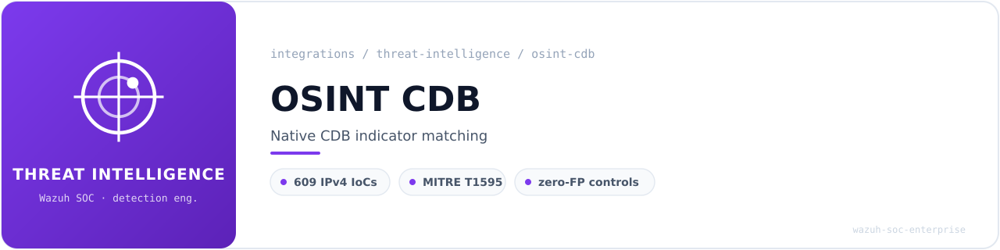
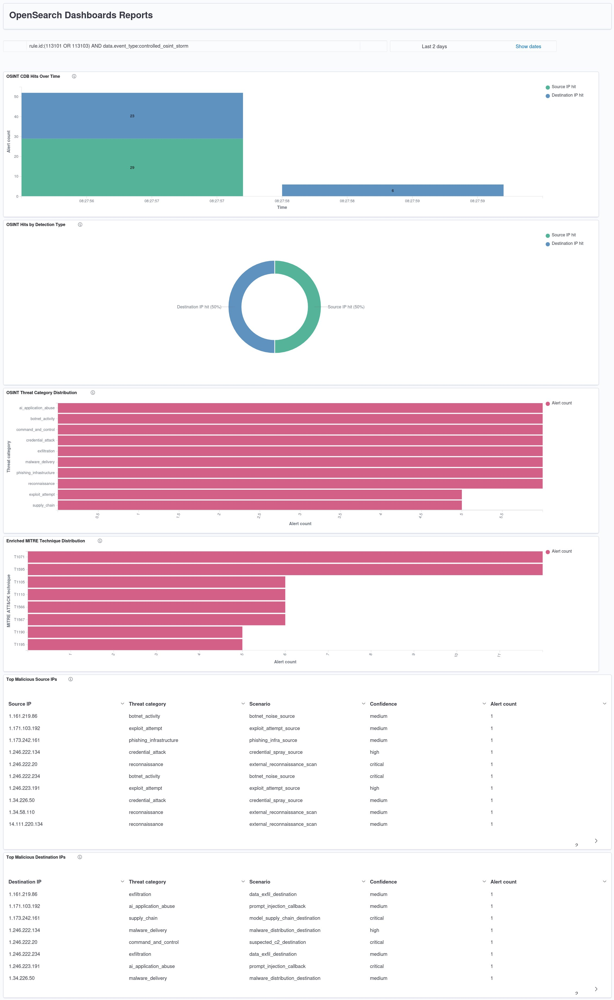

<!-- soc-banner -->
<p align="center"></p>

<p align="center">
   
</p>

# Wazuh Native OSINT CDB — Threat Intelligence Integration

## Table of Contents

1. [Overview](#1-overview)
2. [Environment](#2-environment)
3. [Architecture](#3-architecture)
4. [Directory Layout and Safety Controls](#4-directory-layout-and-safety-controls)
5. [Feed Selection and Normalization](#5-feed-selection-and-normalization)
6. [Wazuh CDB List Format and Registration](#6-wazuh-cdb-list-format-and-registration)
7. [Decoders and Rules](#7-decoders-and-rules)
8. [Validation with `wazuh-logtest`](#8-validation-with-wazuh-logtest)
9. [Controlled JSON Localfile and Synthetic Storm](#9-controlled-json-localfile-and-synthetic-storm)
10. [OpenSearch DevTools Validation](#10-opensearch-devtools-validation)
11. [Dashboards and Visualizations](#11-dashboards-and-visualizations)
12. [Troubleshooting](#12-troubleshooting)
13. [Limitations and Future Work](#13-limitations-and-future-work)
14. [References](#14-references)

---

## 1. Overview

This integration adds an **OSINT-driven, Wazuh-native threat-intelligence correlation pipeline** based on CDB lists. Public reputation data is normalized into a Wazuh-compatible CDB list, registered in `ossec.conf`, and consumed by custom rules through `<list field="srcip|dstip" lookup="address_match_key">` lookups.

The design is deliberately **native** — there is no external TIP, no integratord callout, no HTTP enrichment loop. Matching happens inside `wazuh-analysisd` against a compiled CDB artifact, which keeps it fast, deterministic, and recruiter-relevant from a Detection Engineering perspective: indicator normalization, native rule logic, source/destination correlation, validation discipline, and dashboard reporting.

**Integration type:** Passive correlation (Wazuh JSON decoder → custom rules → CDB lookup → indexed alert)

**Alert pipeline:**

```
Public OSINT IPv4 reputation feed (AlienVault via FireHOL mirror)
  → normalize_osint_ipv4.py (validate, dedupe, drop CIDR/private/reserved)
    → /var/ossec/etc/lists/osint/osint_ipv4_reputation (source list, 609 entries)
      → Wazuh compiles → osint_ipv4_reputation.cdb
        → JSON event ingested by Wazuh logcollector
          → parent rule 113100/113102 (decoded_as=json, noalert)
            → child rule 113101 (srcip hit, T1595) / 113103 (dstip hit, T1071)
              → /var/ossec/logs/alerts/alerts.json
                → Filebeat → OpenSearch index → Dashboard (6 panels)
```

**IOC types covered (this phase):** public IPv4 indicators only.
**MITRE ATT&CK mapping:** T1595 (Active Scanning, srcip path) · T1071 (Application Layer Protocol, dstip path).

---

## 2. Environment

| Component | Detail |
|---|---|
| OS | Ubuntu 24.04.4 LTS desktop |
| Kernel | 6.17.0-22-generic (x86_64) |
| Wazuh | 4.14.5 (`WAZUH_TYPE=server`, `WAZUH_REVISION=rc1`) — All-in-one bare metal (Manager + Indexer + Dashboard + Filebeat) |
| Host (agent name) | `flausino` |
| Index pattern | `wazuh-alerts-*` (concrete index observed: `wazuh-alerts-4.x-2026.06.12`) |
| Rule ID range | 113100–113103 |
| Reserved range for OSINT pack | 113100–113199 |
| CDB source list | `/var/ossec/etc/lists/osint/osint_ipv4_reputation` (609 lines, 39 KB) |
| Compiled CDB artifact | `/var/ossec/etc/lists/osint/osint_ipv4_reputation.cdb` (54 KB) |
| Project root | `/opt/wazuh-osint-cdb/` |
| Integration date | 2026-06-12 |

---

## 3. Architecture

### 3.1 Deployment Model

The pipeline runs entirely on the same bare-metal host as the Wazuh all-in-one stack. There is **no external service** — normalization is a local Python script, the list lives under `/var/ossec/etc/lists/osint/`, and matching is done by `wazuh-analysisd` itself when it evaluates the rule chain.

### 3.2 End-to-End Data Flow

```
┌───────────────────────────────────────────────────────────────┐
│  OSINT Feed (FireHOL mirror of AlienVault reputation IP set)  │
│                            │                                  │
│                            │ HTTPS download                   │
│                            ▼                                  │
│              normalize_osint_ipv4.py                          │
│                            │                                  │
│                            │  - skip blanks / comments        │
│                            │  - drop CIDR entries             │
│                            │  - keep globally routable IPv4   │
│                            │  - dedupe                        │
│                            ▼                                  │
│   /var/ossec/etc/lists/osint/osint_ipv4_reputation            │
│   (key:value — IP : feed=...,type=ipv4,source=osint)          │
│                            │                                  │
│                            │ Wazuh compiles on rule reload    │
│                            ▼                                  │
│           osint_ipv4_reputation.cdb (binary)                  │
└───────────────────────────────────────────────────────────────┘
                             │
                             │ consulted by:
                             ▼
┌───────────────────────────────────────────────────────────────┐
│  Wazuh analysisd                                              │
│                                                               │
│  JSON event ─► decoded_as=json                                │
│                  │                                            │
│                  ├─► rule 113100 (parent, srcip candidate)    │
│                  │      └─► rule 113101 (level 12, T1595)     │
│                  │             list lookup against srcip      │
│                  │                                            │
│                  └─► rule 113102 (parent, dstip candidate)    │
│                         └─► rule 113103 (level 12, T1071)     │
│                                list lookup against dstip      │
└───────────────────────────────────────────────────────────────┘
                             │
                             ▼
              /var/ossec/logs/alerts/alerts.json
                             │
                             ▼
             Filebeat → OpenSearch → Dashboards
```

### 3.3 Why CDB lists

- Supported natively by the Wazuh rules engine; no integratord, no external HTTP.
- Compiled to a constant-time binary lookup; cheap even for millions of events.
- Operates on decoded fields (`srcip`, `dstip`) via `lookup="address_match_key"`, which performs IP-aware matching rather than naive string comparison.
- Maps cleanly to SOC interpretation: a hit on `srcip` suggests inbound scanning/exploitation/brute force/botnet activity; a hit on `dstip` suggests outbound C2, malware delivery, exfiltration, or callback behavior.

---

## 4. Directory Layout and Safety Controls

### 4.1 Operational tree under `/opt/wazuh-osint-cdb/`

| Path | Purpose |
|---|---|
| `/opt/wazuh-osint-cdb/scripts/` | Normalization scripts |
| `/opt/wazuh-osint-cdb/raw/` | Raw feed snapshots (timestamped) |
| `/opt/wazuh-osint-cdb/normalized/` | Validated, deduplicated IPv4 indicators |
| `/opt/wazuh-osint-cdb/logs/` | Per-run JSON statistics |
| `/opt/wazuh-osint-cdb/docs/PROJECT_MANIFEST.md` | Scope, validation order, rule range, safety rules |
| `/opt/wazuh-osint-cdb/tests/osint_test_events.jsonl` | Monitored JSONL for controlled alert generation |

### 4.2 Wazuh list location

```
drwxrwx--- root:wazuh 770  /var/ossec/etc/lists/osint/
-rw-rw---- root:wazuh 660  /var/ossec/etc/lists/osint/osint_ipv4_reputation       (source, 39K)
-rw-rw---- wazuh:wazuh 660 /var/ossec/etc/lists/osint/osint_ipv4_reputation.cdb   (compiled, 54K)
```

### 4.3 Backups before any file change

Every modification to `ossec.conf`, `local_rules.xml`, decoders, or the list directory was preceded by a timestamped backup under `~/wazuh-osint-cdb-backups/<TS>-<reason>/`, with a SHA256SUMS manifest:

```bash
TS="$(date +%Y%m%d_%H%M%S)"
BACKUP_DIR="$HOME/wazuh-osint-cdb-backups/$TS-pre-test-localfile"
mkdir -p "$BACKUP_DIR"
sudo cp -a /var/ossec/etc/ossec.conf        "$BACKUP_DIR/ossec.conf.bak.$TS"
sudo cp -a /var/ossec/etc/rules/local_rules.xml "$BACKUP_DIR/local_rules.xml.bak.$TS"
sudo tar -C /var/ossec/etc       -czf "$BACKUP_DIR/decoders.bak.$TS.tar.gz"   decoders
sudo tar -C /var/ossec/etc/lists -czf "$BACKUP_DIR/osint-lists.bak.$TS.tar.gz" osint
sudo bash -c "cd '$BACKUP_DIR' && sha256sum * > SHA256SUMS.txt"
```

---

## 5. Feed Selection and Normalization

### 5.1 Feed

Source URL: `https://iplists.firehol.org/files/alienvault_reputation.ipset`
Feed name in normalized output: `alienvault_reputation`

Domains, URLs and hashes are explicitly out of scope for this first phase. IPv4 was chosen because it can be validated against decoded `srcip`/`dstip` with native CDB lookups and zero ambiguity.

### 5.2 Normalization script

`/opt/wazuh-osint-cdb/scripts/normalize_osint_ipv4.py` performs:

1. HTTPS download from the FireHOL mirror.
2. Skip blank lines and comments.
3. Skip CIDR entries.
4. Keep only globally routable IPv4 addresses (drop private, reserved, loopback, link-local, multicast, etc.).
5. Deduplicate.
6. Write the normalized list under `/opt/wazuh-osint-cdb/normalized/osint_ipv4_reputation`.
7. Install it as `/var/ossec/etc/lists/osint/osint_ipv4_reputation`.
8. Emit a JSON run log to `/opt/wazuh-osint-cdb/logs/osint_ipv4_reputation.<TS>.json`.

### 5.3 Run statistics (most recent run)

```json
{
  "raw_lines": 639,
  "comment_or_blank_lines": 30,
  "cidr_lines_skipped": 0,
  "ipv4_candidates": 609,
  "valid_public_ipv4": 609,
  "invalid_or_non_public_ipv4": 0,
  "duplicates": 0,
  "unique_public_ipv4": 609
}
```

---

## 6. Wazuh CDB List Format and Registration

### 6.1 Source list format

Wazuh CDB lists are `key:value` text files. The OSINT list uses:

```
1.34.58.110:feed=alienvault_reputation,type=ipv4,source=osint
1.34.226.50:feed=alienvault_reputation,type=ipv4,source=osint
```

The value field carries provenance metadata (feed name, type, source) that is preserved as the list ages and refreshes.

### 6.2 Registration in `ossec.conf`

```xml
<ruleset>
  <decoder_dir>etc/decoders</decoder_dir>
  <decoder_dir>ruleset/decoders</decoder_dir>
  <rule_dir>ruleset/rules</rule_dir>
  <rule_dir>etc/rules</rule_dir>
  <list>etc/lists/audit-keys</list>
  <list>etc/lists/amazon/aws-eventnames</list>
  <list>etc/lists/malicious-ioc/malicious-ip</list>
  <list>etc/lists/malicious-ioc/malicious-domains</list>
  <list>etc/lists/malicious-ioc/malware-hashes</list>
  <list>etc/lists/osint/osint_ipv4_reputation</list>
</ruleset>
```

After the rules and CDB lookup logic validate, a dedicated JSON localfile was added for controlled alert generation:

```xml
<!-- ======================== OSINT CDB CONTROLLED TEST EVENTS ======================== -->
<localfile>
  <log_format>json</log_format>
  <location>/opt/wazuh-osint-cdb/tests/osint_test_events.jsonl</location>
  <label key="integration" overwrite="yes">osint_cdb_test</label>
  <only-future-events>yes</only-future-events>
</localfile>
```

---

## 7. Decoders and Rules

### 7.1 Decoders

**No custom decoder is required.** Controlled events are JSON and decoded by the built-in Wazuh JSON decoder. Phase 2 of `wazuh-logtest` confirms `name: 'json'` with the expected `srcip`, `dstip`, `action`, `event_type`, `integration`, and `message` fields populated from the JSON document.

### 7.2 Rule pack (`local_rules.xml`)

```xml
<!-- ======================== OSINT CDB THREAT INTELLIGENCE ======================== -->
<group name="osint,threat_intel,cdb_list,malicious_ip,">

  <!-- Parent candidate rule: JSON event eligible for source IP CDB correlation. -->
  <rule id="113100" level="0" noalert="1">
    <decoded_as>json</decoded_as>
    <description>OSINT CDB: JSON source IP correlation candidate.</description>
    <group>osint,threat_intel,cdb_list,srcip,</group>
  </rule>

  <!-- Child rule: source IP appears in the OSINT CDB list. -->
  <rule id="113101" level="12">
    <if_sid>113100</if_sid>
    <list field="srcip" lookup="address_match_key">etc/lists/osint/osint_ipv4_reputation</list>
    <description>OSINT CDB: malicious source IP detected - $(srcip).</description>
    <mitre>
      <id>T1595</id>
    </mitre>
    <group>osint,threat_intel,cdb_list,malicious_ip,malicious_srcip,reconnaissance,</group>
  </rule>

  <!-- Parent candidate rule: JSON event eligible for destination IP CDB correlation. -->
  <rule id="113102" level="0" noalert="1">
    <decoded_as>json</decoded_as>
    <description>OSINT CDB: JSON destination IP correlation candidate.</description>
    <group>osint,threat_intel,cdb_list,dstip,</group>
  </rule>

  <!-- Child rule: destination IP appears in the OSINT CDB list. -->
  <rule id="113103" level="12">
    <if_sid>113102</if_sid>
    <list field="dstip" lookup="address_match_key">etc/lists/osint/osint_ipv4_reputation</list>
    <description>OSINT CDB: malicious destination IP detected - $(dstip).</description>
    <mitre>
      <id>T1071</id>
    </mitre>
    <group>osint,threat_intel,cdb_list,malicious_ip,malicious_dstip,command_and_control,</group>
  </rule>

</group>
```

### 7.3 Rule reference

| Rule ID | Level | Type | Description | MITRE |
|---:|---:|---|---|---|
| 113100 | 0 | Parent (`noalert`) | JSON source-IP correlation candidate | — |
| 113101 | 12 | Child of 113100 | Malicious **source** IP detected — `$(srcip)` | T1595 (Active Scanning) |
| 113102 | 0 | Parent (`noalert`) | JSON destination-IP correlation candidate | — |
| 113103 | 12 | Child of 113102 | Malicious **destination** IP detected — `$(dstip)` | T1071 (Application Layer Protocol) |

---

## 8. Validation with `wazuh-logtest`

### 8.1 Controlled inputs

Three events: one positive source-IP, one positive destination-IP, one negative control with non-malicious IPs.

```json
{"integration":"osint_cdb_test","event_type":"controlled_test","srcip":"1.34.58.110","dstip":"203.0.113.10","action":"srcip_positive_control","message":"Controlled OSINT CDB source IP hit"}
{"integration":"osint_cdb_test","event_type":"controlled_test","srcip":"203.0.113.20","dstip":"1.34.58.110","action":"dstip_positive_control","message":"Controlled OSINT CDB destination IP hit"}
{"integration":"osint_cdb_test","event_type":"controlled_test","srcip":"8.8.8.8","dstip":"9.9.9.9","action":"negative_control","message":"Controlled OSINT CDB negative control"}
```

### 8.2 Results

| Test | Expected | Actual |
|---|---|---|
| Malicious source IP hit | Rule 113101 fires at level 12 | ✅ `id: '113101'`, `level: '12'`, `mitre.id: ['T1595']` |
| Malicious destination IP hit | Rule 113103 fires at level 12 | ✅ `id: '113103'`, `level: '12'`, `mitre.id: ['T1071']` |
| Negative control | Decoded as JSON, no OSINT alert | ✅ JSON decoded, neither 113101 nor 113103 fired |

### 8.3 Pre-restart manager check

```bash
sudo /var/ossec/bin/wazuh-analysisd -t
# → [OK] No warnings/errors
sudo systemctl restart wazuh-manager
systemctl is-active wazuh-manager
# → active
```

The manager is restarted **only after** `wazuh-analysisd -t` and `wazuh-logtest` both pass.

---

## 9. Controlled JSON Localfile and Synthetic Storm

To populate the dashboard with realistic SOC-style content, a synthetic "storm" is appended to the monitored JSONL file. The generator (deterministic, `random.seed(4242)`) writes 70 events:

- **30 source-IP positive events** — distributed across reconnaissance, credential spray, botnet noise, exploit attempts, and phishing infrastructure scenarios.
- **30 destination-IP positive events** — distributed across suspected C2, malware delivery, data exfiltration, prompt-injection callback (AI application abuse), and model supply-chain destinations.
- **10 negative controls** — DNS resolvers and `203.0.113.0/24` documentation IPs that must **not** match.

Each event carries enrichment fields used by the dashboard: `threat_category`, `scenario`, `confidence`, `mitre_attack_id`, `attack_tactic`, `attack_technique`, `ai_security_context`, `atlas_context`, `saif_control_area`. These are passed through to the alert payload by the JSON decoder.

Storm summary:

```json
{
  "batch_id": "osint-storm-20260612-062755",
  "written_events": 70,
  "expected_osint_alerts": 60,
  "expected_negative_controls_without_osint_alert": 10,
  "srcip_positive_events": 30,
  "dstip_positive_events": 30
}
```

Final indexed result: **58 OSINT alerts** (29 from rule 113101 + 29 from rule 113103) out of 60 expected positive events. The two missing alerts were not investigated — the discrepancy was accepted and the validation proceeded directly to DevTools confirmation. The negative controls produced **zero** OSINT alerts as designed.

---

## 10. OpenSearch DevTools Validation

### 10.1 Index pattern

```
wazuh-alerts-*  →  observed concrete index: wazuh-alerts-4.x-2026.06.12
```

### 10.2 Controlled-storm aggregation

```json
GET wazuh-alerts-*/_search
{
  "size": 0,
  "query": {
    "bool": {
      "filter": [
        { "terms": { "rule.id": ["113101", "113103"] } },
        { "term":  { "data.event_type": "controlled_osint_storm" } }
      ]
    }
  },
  "aggs": {
    "by_rule":             { "terms": { "field": "rule.id", "size": 5 } },
    "by_correlation_type": { "terms": { "field": "data.correlation_type", "size": 5 } },
    "by_threat_category":  { "terms": { "field": "data.threat_category", "size": 10 } },
    "by_mitre_id":         { "terms": { "field": "data.mitre_attack_id", "size": 10 } }
  }
}
```

Result excerpt:

```
hits.total.value : 58
by_rule          : 113101 → 29 · 113103 → 29
by_correlation   : malicious_srcip → 29 · malicious_dstip → 29
by_mitre_id      : T1071 → 29 · T1595 → 29
by_threat_cat    : 8 categories × 6 alerts, 2 categories × 5 alerts
```

### 10.3 Negative-control verification

```json
GET wazuh-alerts-*/_search
{
  "query": {
    "bool": {
      "filter": [
        { "term": { "data.event_type": "controlled_osint_storm" } },
        { "term": { "data.correlation_type": "none_expected" } }
      ]
    }
  }
}
```

Result: `hits.total.value: 0` — no OSINT rule fired on the negative controls, exactly as designed.

---

## 11. Dashboards and Visualizations

### 11.1 Dashboard settings

| Setting | Value |
|---|---|
| Data view | `wazuh-alerts-*` |
| Time field | `@timestamp` |
| Dashboard filter | `rule.id:(113101 OR 113103) AND data.event_type:controlled_osint_storm` |
| Time range | Last 2 days |
| Title | **Wazuh Native OSINT CDB Threat Intelligence** |

### 11.2 Panels

| # | Panel | Visualization | Key field(s) |
|---:|---|---|---|
| 1 | OSINT CDB Hits Over Time | Vertical bar (split filters) | `@timestamp`, `rule.id` (113101 vs 113103) |
| 2 | OSINT Hits by Detection Type | Donut | `rule.id` (113101 vs 113103) |
| 3 | OSINT Threat Category Distribution | Horizontal bar | `data.threat_category` (terms, size 10) |
| 4 | Enriched MITRE Technique Distribution | Horizontal bar | `data.mitre_attack_id` (terms, size 10) |
| 5 | Top Malicious Source IPs | Data table | `data.srcip` × `threat_category` × `scenario` × `confidence` |
| 6 | Top Malicious Destination IPs | Data table | `data.dstip` × `threat_category` × `scenario` × `confidence` |

### 11.3 Full dashboard report



### 11.4 SOC interpretation

- Panel 1 proves real indexed alert generation over time, separated by direction.
- Panel 2 confirms balanced bidirectional matching (50/50 src/dst in the controlled set).
- Panels 3 and 4 demonstrate enrichment-aware reporting — the dashboard is more than raw IOC matches; it carries threat-category and ATT&CK technique context for triage.
- Panels 5 and 6 provide IOC-level evidence for inbound and outbound interpretation respectively, with scenarios such as `external_reconnaissance_scan`, `credential_spray_source`, `suspected_c2_destination`, `malware_distribution_destination`, `data_exfil_destination`, `prompt_injection_callback`, and `model_supply_chain_destination`.

---

## 12. Troubleshooting

### 12.1 `srcip`/`dstip` are static fields — regex inside them fails

**Symptom:** `wazuh-analysisd -t` rejects rules that try `<field name="srcip">regex</field>` or `<srcip>regex</srcip>` with errors such as `Field 'srcip' is static` or `Invalid ip address: '^[0-9]+...'`.

**Cause:** Wazuh treats `srcip`/`dstip` as static IP-typed fields and does not accept regular expressions in that position.

**Fix:** Use a JSON parent candidate rule (`decoded_as=json`, `noalert=1`) and a child rule that does the CDB lookup via `<list field="srcip" lookup="address_match_key">…</list>`. This is the exact shape used by rules 113100/113101 and 113102/113103.

### 12.2 `Permission denied` creating the `.tmp` CDB file

**Symptom:** `wazuh-analysisd -t` complains it cannot create the compiled `.cdb` next to the source list.

**Cause:** Wazuh writes the compiled artifact in-place; the directory and source file must be readable and writable by the `wazuh` group.

**Fix:** `chown root:wazuh /var/ossec/etc/lists/osint`, mode `770`; source list `root:wazuh`, mode `660`.

### 12.3 `XMLERR: Element not opened` after a partial edit

**Symptom:** Validation fails because leftover XML from a half-replaced OSINT block broke the document structure.

**Fix:** Restore from the latest timestamped backup, then replace the entire OSINT region from the start marker to EOF with a clean block in a single edit (`sudo tee` heredoc or a Python script). Never use `sed -i` on XML.

### 12.4 `analysisd -t` silent success

**Behaviour:** No output with exit code 0 is the expected success signal. Always check `echo "exit: $?"` explicitly.

### 12.5 First-event ARP-like alert latency

Not specific to this integration, but worth noting: the first JSON event after a manager restart can take a few seconds to appear in `alerts.json` while Filebeat catches up. Wait ~20s before counting alerts after a storm.

---

## 13. Limitations and Future Work

### 13.1 Limitations

- Public reputation feeds are noisy and time-sensitive; stale indicators are expected.
- CDB correlation is fast and native, but it is **not** a full TIP — no provenance graph, no event linking, no expiry workflow.
- Synthetic data validates detection logic and dashboard behaviour; it does **not** replace production telemetry.
- Allowlists and false-positive suppression must be built before production deployment.
- A `srcip`/`dstip` field name alone does **not** prove attack direction without event context — interpret each hit with the surrounding decoder output.
- This phase covers IPv4 only.

### 13.2 Future work

1. Add **domain** indicators (URLhaus, abuse.ch) with `lookup="match_key"` on decoded URL/DNS fields.
2. Add **URL** indicators.
3. Add **hash** indicators (MalwareBazaar) with `lookup="match_key"` on `data.sha256` / `data.md5`.
4. Add scheduled feed refresh (systemd timer) with provenance metadata and recency-based confidence scoring.
5. Add allowlist CDB and FP suppression rules.
6. Promote dashboard export to an automated artefact.
7. Sigma-style mapping — only if Sigma is actually implemented later.

---

## 14. References

- [Wazuh — CDB lists](https://documentation.wazuh.com/current/user-manual/ruleset/cdb-list.html)
- [Wazuh — Ruleset XML syntax (`<list>` and `lookup`)](https://documentation.wazuh.com/current/user-manual/ruleset/ruleset-xml-syntax/rules.html)
- [Wazuh — Creating custom dashboards](https://documentation.wazuh.com/current/user-manual/wazuh-dashboard/creating-custom-dashboards.html)
- [OpenSearch — Reporting in OpenSearch Dashboards](https://docs.opensearch.org/latest/reporting/report-dashboard-index/)
- [OpenSearch — Dashboards Query Language (DQL)](https://docs.opensearch.org/latest/dashboards/dql/)
- [FireHOL — AlienVault reputation IP set mirror](https://iplists.firehol.org/?ipset=alienvault_reputation)
- [MITRE ATT&CK — T1595 Active Scanning](https://attack.mitre.org/techniques/T1595/)
- [MITRE ATT&CK — T1071 Application Layer Protocol](https://attack.mitre.org/techniques/T1071/)

---

<sub>
<b>Navigation</b> &nbsp;
<a href="../../README.md">Portfolio home</a> &nbsp;&middot;&nbsp;
<a href="README.md">Threat Intelligence & Detection</a> &nbsp;&middot;&nbsp;
<a href="../README.md">All 22 integrations</a> &nbsp;&middot;&nbsp;
<a href="../../detection-coverage/attack-coverage.md">Detection coverage</a> &nbsp;&middot;&nbsp;
<a href="../../playbooks/README.md">SOC playbooks</a> &nbsp;&middot;&nbsp;
<a href="../../METRICS.md">Metrics</a>
<br><br>
Validated in a single-workstation lab. Each guide records the versions it was validated
against; see <a href="../../README.md#lab-status">lab status</a>.
</sub>

