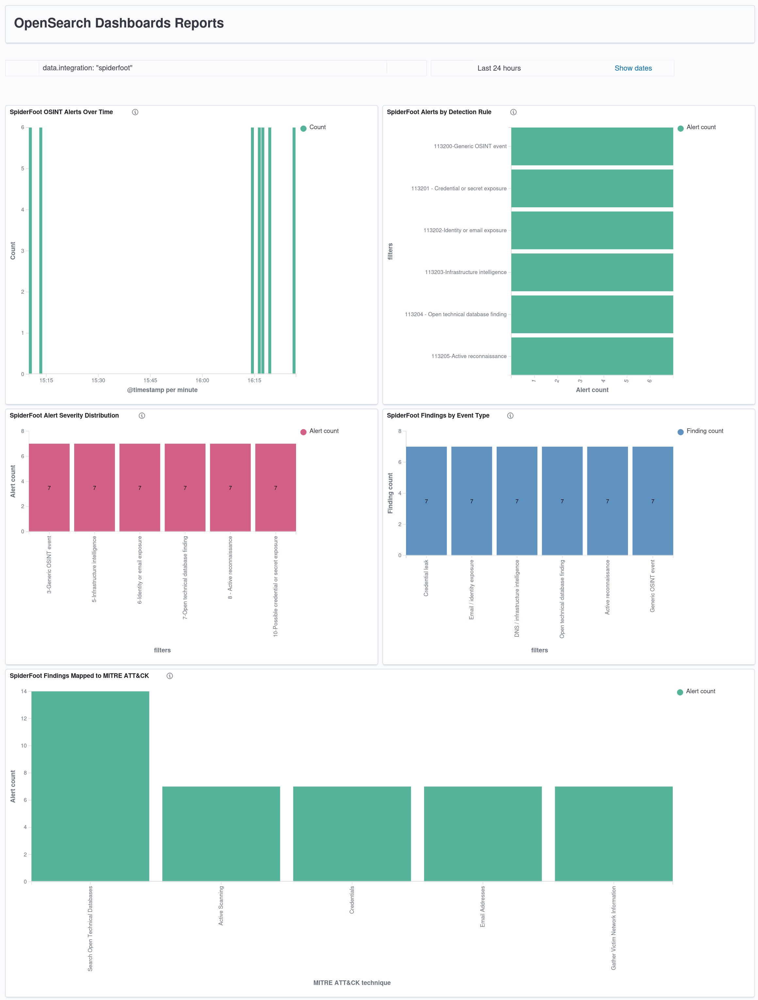

# SpiderFoot OSINT → Wazuh SIEM/XDR Integration

**Status:** Complete · Validated · Dashboard published  
**Rule range:** `113200–113205` (`spiderfoot_rules.xml`)  
**Decoder strategy:** No custom decoder; Wazuh built-in JSON decoder via `log_format=json`  
**MITRE ATT&CK:** TA0043 Reconnaissance — `T1589.001`, `T1589.002`, `T1590`, `T1595`, `T1596`  
**Validation dataset:** 42 controlled alerts (`7 events × 6 rules`) targeting `example.com`  
**Dashboard:** SpiderFoot OSINT Validation Dashboard, 5 OpenSearch panels

---

## Overview

This integration converts SpiderFoot OSINT findings into a structured Wazuh detection surface. SpiderFoot runs locally as a hardened service, writes normalized JSONL events to `/var/log/spiderfoot/events.jsonl`, and Wazuh ingests those events through a native `localfile` block using `log_format=json`. The built-in JSON decoder extracts the normalized fields, and custom Wazuh rules `113200–113205` classify the findings by category, severity, and MITRE ATT&CK reconnaissance technique.

The result is a reproducible OSINT-to-SIEM pipeline suitable for SOC analyst portfolio evidence: installation, rule logic, decoder rationale, `wazuh-logtest`, real-file ingestion, `alerts.json`, OpenSearch DevTools aggregations, and dashboard screenshots are all documented.

---

## Architecture

```text
  [SpiderFoot OSINT modules]
              |
              | normalized JSONL events
              v
  [/var/log/spiderfoot/events.jsonl]
     owner/group: spiderfoot:wazuh
     mode: 640
              |
              | Wazuh localfile, log_format=json
              v
  [Wazuh Manager Logcollector]
              |
              | built-in JSON decoder
              v
  [Custom Wazuh rules 113200-113205]
              |
              v
  [/var/ossec/logs/alerts/alerts.json]
              |
              v
  [Wazuh Indexer / OpenSearch]
              |
              v
  [SpiderFoot OSINT Validation Dashboard]
```

---

## Methodological principles

This integration followed the same operational discipline used across the repository:

1. Create timestamped backups before changing important files.
2. Avoid one-shot destructive scripts.
3. Validate syntax and rule behavior with Wazuh-native tooling before relying on dashboards.
4. Confirm indexed evidence through OpenSearch DevTools before publishing screenshots.
5. Keep public documentation free of passwords, API keys, real personal OSINT findings, and sensitive URLs.

---

## Environment baseline

| Component | Value |
| --- | --- |
| Host OS | Ubuntu 24.04.4 LTS bare metal |
| Hostname | `flausino` |
| Wazuh version | `4.14.5` |
| Wazuh topology | All-in-one: Manager, Indexer, Dashboard, Filebeat |
| SpiderFoot binding | `127.0.0.1:5002` |
| SpiderFoot event file | `/var/log/spiderfoot/events.jsonl` |
| Final Wazuh rule file | `/var/ossec/etc/rules/spiderfoot_rules.xml` |
| Public repository asset copy | `integrations/threat-intelligence/assets/spiderfoot/spiderfoot_rules.xml` |

---

## Files and artifacts

| File / directory | Purpose | Public repo status |
| --- | --- | --- |
| `/opt/spiderfoot` | Native SpiderFoot installation cloned from upstream and isolated with a Python virtual environment | Not committed |
| `/opt/spiderfoot/.venv` | SpiderFoot Python virtual environment | Not committed |
| `/opt/spiderfoot/.spiderfoot/passwd` | HTTP Digest credential file | **Never committed** |
| `/etc/systemd/system/spiderfoot.service` | systemd service for local SpiderFoot Web UI | Documented only |
| `/var/log/spiderfoot/` | Wazuh-readable SpiderFoot JSONL log directory | Not committed |
| `/var/log/spiderfoot/events.jsonl` | Line-delimited JSON event file consumed by Wazuh | Not committed |
| `/var/ossec/etc/ossec.conf` | Wazuh Manager configuration containing the SpiderFoot `localfile` block | Snippet only |
| `/var/ossec/etc/rules/spiderfoot_rules.xml` | Final active Wazuh rule file | Public copy committed under assets |
| `integrations/threat-intelligence/spiderfoot-integration.md` | This documentation file | Committed |
| `integrations/threat-intelligence/assets/spiderfoot/dashboard-spiderfoot-validation.png` | Final dashboard screenshot | Committed |
| `integrations/threat-intelligence/assets/spiderfoot/dashboard-spiderfoot-validation.pdf` | OpenSearch generated dashboard report | Committed |
| `integrations/threat-intelligence/assets/spiderfoot/methodology.pdf` | Full technical methodology report | Committed |

---

## SpiderFoot service deployment

SpiderFoot was installed under `/opt/spiderfoot`, isolated from the system Python with a virtual environment, and executed as a dedicated non-root user named `spiderfoot`.

### systemd service

```ini
[Unit]
Description=SpiderFoot OSINT Web UI
After=network-online.target
Wants=network-online.target

[Service]
Type=simple
User=spiderfoot
Group=spiderfoot
WorkingDirectory=/opt/spiderfoot
ExecStart=/opt/spiderfoot/.venv/bin/python /opt/spiderfoot/sf.py -l 127.0.0.1:5002
Restart=on-failure
RestartSec=5
NoNewPrivileges=true
PrivateTmp=true

[Install]
WantedBy=multi-user.target
```

Security rationale:

- `User=spiderfoot` prevents root execution.
- `127.0.0.1:5002` prevents direct LAN/Internet exposure.
- HTTP Digest authentication is enabled through `/opt/spiderfoot/.spiderfoot/passwd`.
- `NoNewPrivileges=true` and `PrivateTmp=true` provide basic service hardening.

### Service validation

```bash
systemctl --no-pager --full status spiderfoot
curl --digest -u 'sfadmin:<REDACTED>' -s -o /dev/null -w '%{http_code}\n' http://127.0.0.1:5002/
```

Observed result:

```text
spiderfoot.service active/running
HTTP Digest test returned: 200
```

---

## Wazuh ingestion configuration

The final pipeline uses native Wazuh Manager `localfile` ingestion, not a Filebeat-specific ingestion path.

### `/var/ossec/etc/ossec.conf` localfile block

```xml
<localfile>
  <log_format>json</log_format>
  <location>/var/log/spiderfoot/events.jsonl</location>
  <label key="@source">spiderfoot</label>
  <only-future-events>yes</only-future-events>
</localfile>
```

Operational notes:

- `<log_format>json</log_format>` invokes the built-in JSON decoder.
- `/var/log/spiderfoot/events.jsonl` is the monitored event source.
- `<only-future-events>yes</only-future-events>` avoids replaying historical events after Wazuh restarts.
- Rules match the decoded JSON field `integration=spiderfoot`; after indexing, Wazuh/OpenSearch exposes it as `data.integration: "spiderfoot"` for Discover, DevTools, and dashboard filters.
- The `@source` label remains useful as collection metadata but is not the primary detection discriminator.

### JSONL permissions

```bash
sudo mkdir -p /var/log/spiderfoot
sudo touch /var/log/spiderfoot/events.jsonl
sudo chown -R spiderfoot:wazuh /var/log/spiderfoot
sudo chmod 750 /var/log/spiderfoot
sudo chmod 640 /var/log/spiderfoot/events.jsonl
```

---

## Decoder strategy

No custom decoder was created for the final SpiderFoot integration.

Reviewed but intentionally not used:

```text
/var/ossec/etc/decoders/local_decoder.xml
/var/ossec/etc/decoders/local_decoder.xml.backup.*
```

Reasoning:

- Wazuh already decodes JSON events when `log_format=json` is used.
- The rules can match decoded fields directly with `<decoded_as>json</decoded_as>` and `<field name="integration">spiderfoot</field>`.
- Older SpiderFoot rules based on `program_name=spiderfoot` were not compatible with the final JSONL design.
- A custom child decoder inheriting from the built-in `json` decoder was deliberately avoided because it can break JSON dynamic fields and remove the `data.*` fields required by OpenSearch dashboards.

Final decision:

```text
Use Wazuh built-in JSON decoding.
Use rules only.
Do not deploy a SpiderFoot custom decoder.
```

---

## Rule file

**Active Wazuh path:** `/var/ossec/etc/rules/spiderfoot_rules.xml`  
**Repository copy:** `integrations/threat-intelligence/assets/spiderfoot/spiderfoot_rules.xml`  
**Owner/group:** `root:wazuh`  
**Mode:** `640`

```xml
<group name="spiderfoot,osint,reconnaissance,">
  <rule id="113200" level="3">
    <decoded_as>json</decoded_as>
    <field name="integration">spiderfoot</field>
    <description>SpiderFoot: normalized OSINT event ingested</description>
    <group>spiderfoot,osint,reconnaissance,</group>
  </rule>

  <rule id="113201" level="10">
    <if_sid>113200</if_sid>
    <field name="event_type" type="pcre2">(?i)(credential|credentials|secret|token|password|leak|breach|exposed)</field>
    <description>SpiderFoot: possible exposed credential or secret found</description>
    <mitre>
      <id>T1589.001</id>
    </mitre>
    <group>spiderfoot,osint,reconnaissance,credential_exposure,threat_intel,</group>
  </rule>

  <rule id="113202" level="6">
    <if_sid>113200</if_sid>
    <field name="event_type" type="pcre2">(?i)(email|identity|person|employee|username|account)</field>
    <description>SpiderFoot: victim identity or email-related OSINT finding</description>
    <mitre>
      <id>T1589.002</id>
    </mitre>
    <group>spiderfoot,osint,reconnaissance,identity_exposure,</group>
  </rule>

  <rule id="113203" level="5">
    <if_sid>113200</if_sid>
    <field name="event_type" type="pcre2">(?i)(domain|dns|ip|netblock|asn|whois|certificate|cert|subdomain|infrastructure)</field>
    <description>SpiderFoot: victim infrastructure OSINT finding</description>
    <mitre>
      <id>T1590</id>
      <id>T1596</id>
    </mitre>
    <group>spiderfoot,osint,reconnaissance,infrastructure_intel,</group>
  </rule>

  <rule id="113204" level="7">
    <if_sid>113200</if_sid>
    <field name="event_type" type="pcre2">(?i)(open_technical_database|passive_dns|whois|certificate_transparency|scan_database|shodan|censys|crtsh)</field>
    <description>SpiderFoot: open technical database reconnaissance finding</description>
    <mitre>
      <id>T1596</id>
    </mitre>
    <group>spiderfoot,osint,reconnaissance,open_technical_databases,</group>
  </rule>

  <rule id="113205" level="8">
    <if_sid>113200</if_sid>
    <field name="event_type" type="pcre2">(?i)(active_scan|port_scan|vulnerability_scan|direct_probe|active_recon)</field>
    <description>SpiderFoot: active reconnaissance or probing module activity</description>
    <mitre>
      <id>T1595</id>
    </mitre>
    <group>spiderfoot,osint,reconnaissance,active_scanning,</group>
  </rule>
</group>
```

---

## Rule reference

| Rule ID | Level | Detection purpose | Match logic | MITRE ATT&CK |
| --- | ---: | --- | --- | --- |
| `113200` | 3 | Base normalized SpiderFoot OSINT event | `decoded_as=json` and `integration=spiderfoot` | - |
| `113201` | 10 | Credential or secret exposure | `event_type` contains credential/secret/token/password/leak/breach/exposed | `T1589.001` Credentials |
| `113202` | 6 | Identity or email exposure | `event_type` contains email/identity/person/employee/username/account | `T1589.002` Email Addresses |
| `113203` | 5 | Infrastructure intelligence | `event_type` contains domain/dns/ip/netblock/asn/whois/certificate/subdomain/infrastructure | `T1590`, `T1596` |
| `113204` | 7 | Open technical database reconnaissance | `event_type` contains passive_dns/whois/certificate_transparency/shodan/censys/crtsh | `T1596` |
| `113205` | 8 | Active reconnaissance or probing | `event_type` contains active_scan/port_scan/vulnerability_scan/direct_probe/active_recon | `T1595` |

---

## Wazuh configuration validation

Before restarting Wazuh Manager, rule syntax was validated with:

```bash
sudo /var/ossec/bin/wazuh-analysisd -t
```

Expected result:

```text
No fatal syntax errors.
Rules loaded successfully.
Configuration safe for Wazuh Manager restart.
```

Then the manager was restarted:

```bash
sudo systemctl restart wazuh-manager
sudo systemctl status wazuh-manager --no-pager
```

---

## wazuh-logtest validation

Each custom rule was validated with `sudo /var/ossec/bin/wazuh-logtest` using one representative JSON event per category.

### Summary

| Rule ID | Test event type | Expected level | Expected result |
| --- | --- | ---: | --- |
| `113200` | `generic` | 3 | Base SpiderFoot event matched |
| `113201` | `credential_leak` | 10 | Credential/secret exposure matched |
| `113202` | `email_identity` | 6 | Email/identity exposure matched |
| `113203` | `dns_infrastructure` | 5 | Infrastructure intelligence matched |
| `113204` | `open_technical_database` | 7 | Open technical database reconnaissance matched |
| `113205` | `active_scan` | 8 | Active reconnaissance/probing matched |

### Rule 113200 — generic normalized event

Input:

```json
{"integration":"spiderfoot","event_type":"generic","module":"sfp_test","data_type":"DOMAIN_NAME","message":"SpiderFoot Wazuh real-file ingestion test","target":"example.com"}
```

Expected Phase 3 result:

```text
Rule id: 113200
Level: 3
Description: SpiderFoot: normalized OSINT event ingested
Decoded as: json
Status: PASS
```

### Rule 113201 — credential or secret exposure

Input:

```json
{"integration":"spiderfoot","event_type":"credential_leak","module":"sfp_hibp","data_type":"PASSWORD_COMPROMISED","message":"Possible exposed password found in breach data","target":"example.com"}
```

Expected Phase 3 result:

```text
Rule id: 113201
Level: 10
Description: SpiderFoot: possible exposed credential or secret found
MITRE id: T1589.001
MITRE technique: Credentials
Status: PASS
```

### Rule 113202 — identity or email exposure

Input:

```json
{"integration":"spiderfoot","event_type":"email_identity","module":"sfp_email","data_type":"EMAILADDR","message":"Public email address discovered","target":"example.com"}
```

Expected Phase 3 result:

```text
Rule id: 113202
Level: 6
Description: SpiderFoot: victim identity or email-related OSINT finding
MITRE id: T1589.002
MITRE technique: Email Addresses
Status: PASS
```

### Rule 113203 — infrastructure intelligence

Input:

```json
{"integration":"spiderfoot","event_type":"dns_infrastructure","module":"sfp_dns","data_type":"SUBDOMAIN","message":"Subdomain discovered","target":"example.com"}
```

Expected Phase 3 result:

```text
Rule id: 113203
Level: 5
Description: SpiderFoot: victim infrastructure OSINT finding
MITRE ids: T1590, T1596
MITRE techniques: Gather Victim Network Information, Search Open Technical Databases
Status: PASS
```

### Rule 113204 — open technical database reconnaissance

Input:

```json
{"integration":"spiderfoot","event_type":"open_technical_database","module":"sfp_crtsh","data_type":"SSL_CERTIFICATE","message":"Certificate transparency result found","target":"example.com"}
```

Expected Phase 3 result:

```text
Rule id: 113204
Level: 7
Description: SpiderFoot: open technical database reconnaissance finding
MITRE id: T1596
MITRE technique: Search Open Technical Databases
Status: PASS
```

### Rule 113205 — active reconnaissance

Input:

```json
{"integration":"spiderfoot","event_type":"active_scan","module":"sfp_portscan","data_type":"TCP_PORT_OPEN","message":"Active probe found exposed TCP port","target":"example.com"}
```

Expected Phase 3 result:

```text
Rule id: 113205
Level: 8
Description: SpiderFoot: active reconnaissance or probing module activity
MITRE id: T1595
MITRE technique: Active Scanning
Status: PASS
```

---

## Synthetic validation dataset

After `wazuh-logtest`, controlled synthetic events were appended to the real Wazuh-monitored JSONL file. This validated the complete path from file ingestion to indexed alerts.

### Validation script logic

```bash
#!/usr/bin/env bash
set -euo pipefail

OUT="/var/log/spiderfoot/events.jsonl"
TARGET="example.com"

emit() {
  local event_type="$1"
  local module="$2"
  local data_type="$3"
  local message="$4"

  printf '{"@timestamp":"%s","integration":"spiderfoot","event_type":"%s","module":"%s","data_type":"%s","message":"%s","target":"%s"}\n' \
    "$(date -u +%Y-%m-%dT%H:%M:%SZ)" \
    "$event_type" "$module" "$data_type" "$message" "$TARGET" | \
    sudo tee -a "$OUT" >/dev/null
}

for i in $(seq 1 7); do
  emit "generic" "sfp_test" "DOMAIN_NAME" "SpiderFoot Wazuh real-file ingestion test $i"
  emit "credential_leak" "sfp_hibp" "PASSWORD_COMPROMISED" "Possible exposed password found in breach data $i"
  emit "email_identity" "sfp_email" "EMAILADDR" "Public email address discovered $i"
  emit "dns_infrastructure" "sfp_dns" "SUBDOMAIN" "Subdomain discovered $i"
  emit "open_technical_database" "sfp_crtsh" "SSL_CERTIFICATE" "Certificate transparency result found $i"
  emit "active_scan" "sfp_portscan" "TCP_PORT_OPEN" "Active probe found exposed TCP port $i"
done
```

Expected controlled dataset size:

```text
6 event categories × 7 events = 42 SpiderFoot alerts
```

---

## Local alerts.json verification

After ingestion, local Wazuh alerts were checked directly before relying on dashboards.

```bash
sudo jq -c 'select(.data.integration=="spiderfoot") | {ts:.timestamp, rule:.rule.id, lvl:.rule.level, desc:.rule.description, et:.data.event_type, mitre:.rule.mitre.id}' \
  /var/ossec/logs/alerts/alerts.json | tail -20
```

Expected result:

```text
Rules 113200, 113201, 113202, 113203, 113204, and 113205 appear in alerts.json.
Each event contains data.integration="spiderfoot".
Child rules include the expected rule.mitre.id values.
```

---

## OpenSearch DevTools validation

DevTools was used as the authoritative indexing validation layer. All queries use `data.integration: "spiderfoot"` as the primary filter.

### Total SpiderFoot alert count

```json
GET wazuh-alerts-*/_count
{
  "query": {
    "term": {
      "data.integration": "spiderfoot"
    }
  }
}
```

Observed result:

```text
42
```

### Alerts by Wazuh rule ID

```json
GET wazuh-alerts-*/_search
{
  "size": 0,
  "query": {
    "bool": {
      "filter": [
        { "term": { "data.integration": "spiderfoot" } }
      ]
    }
  },
  "aggs": {
    "spiderfoot_rules": {
      "terms": {
        "field": "rule.id",
        "size": 20,
        "order": { "_key": "asc" }
      }
    }
  }
}
```

Observed result:

| Rule ID | Count |
| --- | ---: |
| `113200` | 7 |
| `113201` | 7 |
| `113202` | 7 |
| `113203` | 7 |
| `113204` | 7 |
| `113205` | 7 |

SOC interpretation: all six custom SpiderFoot rules fired uniformly during controlled validation.

### Alerts by event type

```json
GET wazuh-alerts-*/_search
{
  "size": 0,
  "query": {
    "bool": {
      "filter": [
        { "term": { "data.integration": "spiderfoot" } }
      ]
    }
  },
  "aggs": {
    "event_types": {
      "terms": {
        "field": "data.event_type",
        "size": 20
      }
    }
  }
}
```

Observed result:

| Event type | Count |
| --- | ---: |
| `active_scan` | 7 |
| `credential_leak` | 7 |
| `dns_infrastructure` | 7 |
| `email_identity` | 7 |
| `generic` | 7 |
| `open_technical_database` | 7 |

SOC interpretation: every normalized OSINT event class was ingested, decoded, matched, alerted, and indexed.

### Alerts by MITRE ATT&CK mapping

```json
GET wazuh-alerts-*/_search
{
  "size": 0,
  "query": {
    "bool": {
      "filter": [
        { "term": { "data.integration": "spiderfoot" } },
        { "exists": { "field": "rule.mitre.id" } }
      ]
    }
  },
  "aggs": {
    "mitre_ids": {
      "terms": {
        "field": "rule.mitre.id",
        "size": 20
      }
    },
    "mitre_techniques": {
      "terms": {
        "field": "rule.mitre.technique",
        "size": 20
      }
    }
  }
}
```

Observed MITRE ID result:

| MITRE ID | Count |
| --- | ---: |
| `T1596` | 14 |
| `T1589.001` | 7 |
| `T1589.002` | 7 |
| `T1590` | 7 |
| `T1595` | 7 |

Observed MITRE technique result:

| MITRE technique | Count |
| --- | ---: |
| Search Open Technical Databases | 14 |
| Active Scanning | 7 |
| Credentials | 7 |
| Email Addresses | 7 |
| Gather Victim Network Information | 7 |

SOC interpretation: `T1596` appears with 14 events by design because it is mapped in two rules: infrastructure intelligence (`113203`) and open technical database reconnaissance (`113204`).

### Alerts by Wazuh severity level

```json
GET wazuh-alerts-*/_search
{
  "size": 0,
  "query": {
    "bool": {
      "filter": [
        { "term": { "data.integration": "spiderfoot" } }
      ]
    }
  },
  "aggs": {
    "severity_levels": {
      "terms": {
        "field": "rule.level",
        "size": 20,
        "order": { "_key": "asc" }
      }
    }
  }
}
```

Observed result:

| Rule level | Count |
| ---: | ---: |
| 3 | 7 |
| 5 | 7 |
| 6 | 7 |
| 7 | 7 |
| 8 | 7 |
| 10 | 7 |

SOC interpretation: the custom severity model behaved exactly as designed.

---

## Dashboard design

**Dashboard name:** SpiderFoot OSINT Validation Dashboard  
**Recommended dashboard-level DQL filter:** `data.integration: "spiderfoot"`  
**Stricter reproducibility filter:** `data.integration: "spiderfoot" AND rule.id:(113200 OR 113201 OR 113202 OR 113203 OR 113204 OR 113205)`

| # | Panel | Type | Configuration | Operational purpose |
| ---: | --- | --- | --- | --- |
| 1 | SpiderFoot OSINT Alerts Over Time | Vertical bar | X-axis: date histogram on `@timestamp`; Y-axis: count | Confirms ingestion timeline and event volume |
| 2 | SpiderFoot Alerts by Detection Rule | Horizontal bar | Filters or terms on `rule.id` | Confirms each custom rule fired |
| 3 | SpiderFoot Alert Severity Distribution | Vertical bar | Filters or terms on `rule.level` | Shows severity model coverage |
| 4 | SpiderFoot Findings by Event Type | Vertical bar | Terms on `data.event_type` | Shows normalized OSINT categories |
| 5 | SpiderFoot Findings Mapped to MITRE ATT&CK | Vertical bar | Terms on `rule.mitre.technique` | Shows ATT&CK reconnaissance mapping |

Dashboard QA checklist:

- Confirm the saved query is `data.integration: "spiderfoot"`.
- Confirm the time-series panel does not show unfiltered `All docs` behavior.
- Confirm the MITRE panel only shows SpiderFoot-related techniques.
- Regenerate the PDF report after saving the dashboard filter.

### Dashboard screenshot



Generated dashboard report: [`assets/spiderfoot/dashboard-spiderfoot-validation.pdf`](assets/spiderfoot/dashboard-spiderfoot-validation.pdf)

---

## Validation evidence summary

| Layer | Evidence | Result |
| --- | --- | --- |
| SpiderFoot service | `systemctl status spiderfoot` | active/running |
| HTTP Digest auth | `curl --digest` to `127.0.0.1:5002` | HTTP 200 |
| JSONL permissions | `spiderfoot:wazuh`, `640` file mode | Wazuh-readable without public exposure |
| Wazuh config | `/var/ossec/etc/ossec.conf` localfile block | JSON localfile ingestion enabled |
| Decoder strategy | Built-in JSON decoder | No custom decoder required |
| Rules | `/var/ossec/etc/rules/spiderfoot_rules.xml` | Rules 113200-113205 active |
| Syntax validation | `wazuh-analysisd -t` | Configuration safe to restart |
| Rule validation | `wazuh-logtest` | All six rules individually confirmed |
| Real-file ingestion | 42 synthetic JSONL events | Events entered Wazuh through monitored file |
| Local alert verification | `/var/ossec/logs/alerts/alerts.json` | Alerts generated for every rule |
| OpenSearch verification | DevTools aggregations | 42 indexed alerts; 7 per rule |
| Dashboard | 5-panel OpenSearch dashboard | Final visual evidence published |

---

## Security and privacy notes

The following must never be committed:

- `/opt/spiderfoot/.spiderfoot/passwd`
- Any full raw `/var/ossec/etc/ossec.conf` containing local secrets or environment-specific values
- Real SpiderFoot OSINT findings from personal audits
- Real email addresses or personal identifiers discovered during OSINT testing
- Sensitive URLs or adult-site account evidence
- Third-party API keys such as Shodan, Censys, HIBP, VirusTotal, or similar services

Public validation data uses `example.com` and synthetic events only.

---

## Repository files

| Path | Purpose |
| --- | --- |
| `integrations/threat-intelligence/spiderfoot-integration.md` | Main public integration guide |
| `integrations/threat-intelligence/README.md` | Threat Intelligence & Detection index updated with SpiderFoot |
| `integrations/threat-intelligence/assets/spiderfoot/dashboard-spiderfoot-validation.png` | Final dashboard screenshot |
| `integrations/threat-intelligence/assets/spiderfoot/dashboard-spiderfoot-validation.pdf` | Dashboard report PDF |
| `integrations/threat-intelligence/assets/spiderfoot/methodology.pdf` | Full 55-page methodology report |
| `integrations/threat-intelligence/assets/spiderfoot/spiderfoot_rules.xml` | Public copy of final Wazuh rules |

---

## Operational assessment

This SpiderFoot-to-Wazuh integration is operationally validated and suitable for portfolio publication. The strongest technical contribution is not merely installing SpiderFoot, but transforming OSINT findings into a typed, severity-aware, MITRE-mapped Wazuh detection pipeline that can be validated at every layer: service, file ingestion, JSON decoding, rule matching, indexed alerts, DevTools aggregation, and dashboard visualization.

---

## References

- Parent project: [`wazuh-soc-enterprise`](../../README.md)
- Threat Intelligence index: [`integrations/threat-intelligence/README.md`](README.md)
- Wazuh JSON decoder bug context: [wazuh/wazuh#33798](https://github.com/wazuh/wazuh/issues/33798)
- SpiderFoot upstream: [smicallef/spiderfoot](https://github.com/smicallef/spiderfoot)
- MITRE ATT&CK Reconnaissance tactic: [TA0043](https://attack.mitre.org/tactics/TA0043/)
