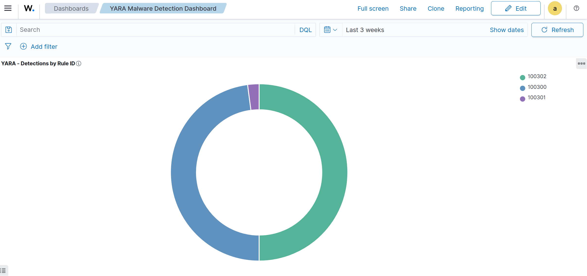
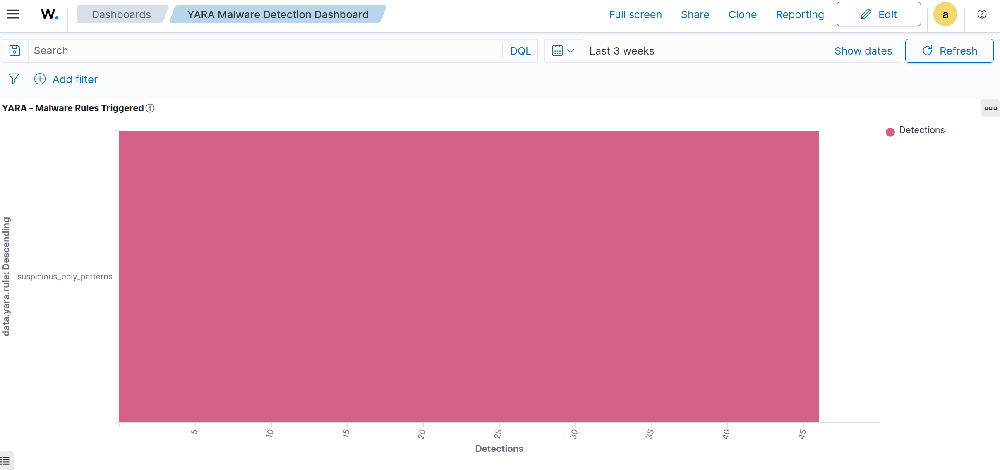
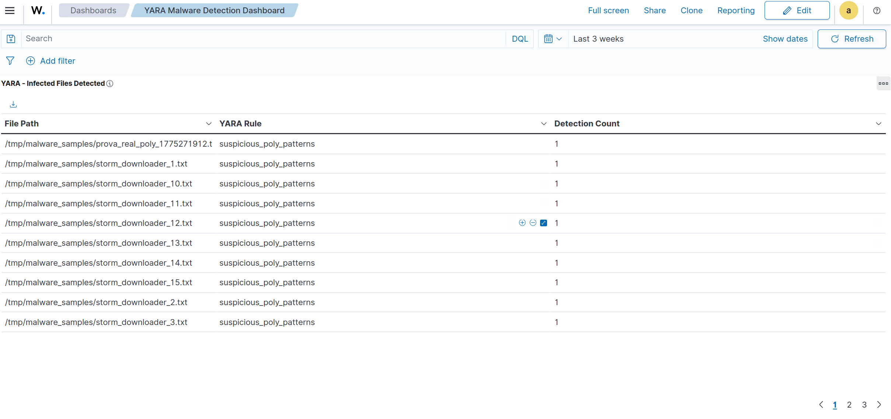
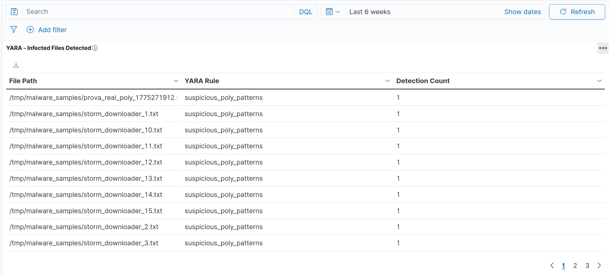
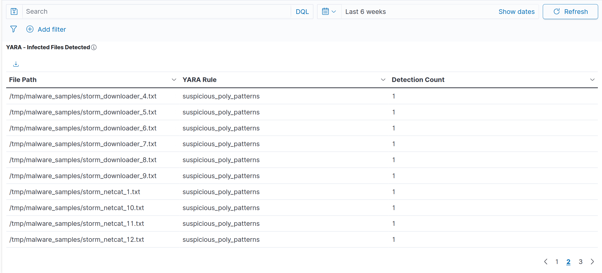
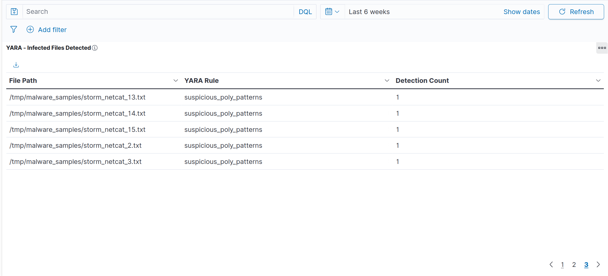

# YARA Malware Detection — Wazuh Integration

| Field | Value |
|---|---|
| **Author** | Bruno Flausino |
| **Version** | 3.0 (Production) |
| **Date** | 2026-04-14 |
| **Environment** | Ubuntu 24.04 LTS — Bare Metal |
| **Wazuh Version** | 4.14.4 |
| **YARA Version** | 4.5.0 |
| **Integration Category** | Threat Intelligence |
| **Rules** | 100300, 100301, 100302 |

---

## Table of Contents

1. [Executive Summary](#1-executive-summary)
2. [Architecture Overview](#2-architecture-overview)
3. [Prerequisites](#3-prerequisites)
4. [Directory Structure](#4-directory-structure)
5. [Installation](#5-installation)
6. [Configuration Files](#6-configuration-files)
7. [Wazuh ossec.conf Integration](#7-wazuh-ossecconf-integration)
8. [Testing and Validation](#8-testing-and-validation)
9. [OpenSearch DevTools Queries](#9-opensearch-devtools-queries)
10. [Dashboard Visualizations](#10-dashboard-visualizations)
11. [Troubleshooting](#11-troubleshooting)
12. [File Reference Summary](#12-file-reference-summary)

---

## 1. Executive Summary

This document describes the production integration of **YARA 4.5.0** with **Wazuh 4.14.4** on Ubuntu 24.04 LTS. The integration delivers automated, real-time malware detection by chaining Wazuh's File Integrity Monitoring (FIM), Active Response, and log collection pipeline into a unified threat detection workflow.

### Key Capabilities

- **Real-time scanning** of files added or modified in monitored directories via Wazuh Syscheck
- **Automatic trigger** of the YARA scan script through Wazuh Active Response (no manual intervention)
- **Centralized alerting** with three custom rules (100300–100302) producing level 12 alerts on confirmed malware
- **Full OpenSearch indexing** of `data.yara.*` fields for visualization and historical analysis
- **Dashboard** with 5 panels covering summary metrics, rule distribution, detection timeline, and infected file inventory

### Validation Results

| Metric | Result |
|---|---|
| Rules validated | 3 (100300, 100301, 100302) |
| Detection rate | 100% against test signatures |
| End-to-end pipeline latency | < 5 seconds |
| Persistence across reboot | Confirmed |
| OpenSearch field mapping | `data.yara.rule`, `data.yara.target`, `data.yara.match` |

---

## 2. Architecture Overview

```
+---------------------+     +-------------------------+     +------------------+
|   File System       |     |     Wazuh Manager       |     |   OpenSearch     |
|  /tmp/malware_      | --> |  Syscheck FIM (realtime)| --> |  Indexer         |
|  samples/           |     |  Active Response        |     |  Dashboard       |
+---------------------+     |  Analysisd              |     +------------------+
                             +-------------------------+
                                        |
                                        v
                             +-------------------------+
                             |     YARA Engine         |
                             |  /usr/bin/yara 4.5.0    |
                             |  Rules: /opt/yara/rules |
                             +-------------------------+
```

### Data Flow (9 Steps)

| Step | Component | Action |
|---|---|---|
| 1 | Syscheck | File added/modified in `/tmp/malware_samples` detected |
| 2 | Analysisd | Rules 100301 or 100302 fire (level 10) |
| 3 | Active Response | `yara_scan.sh` triggered automatically |
| 4 | YARA Engine | File scanned against `/opt/yara/rules/yara_rules.yar` |
| 5 | yara_scan.sh | Match written to `/opt/yara/logs/yara.log` |
| 6 | Logcollector | Reads new line from `yara.log` |
| 7 | Decoder | `yara-match` extracts `yara.rule`, `yara.target`, `yara.match` |
| 8 | Analysisd | Rule 100300 fires (level 12) — confirmed malware |
| 9 | OpenSearch | Alert indexed in `wazuh-alerts-*` |

---

## 3. Prerequisites

### System Requirements

```bash
# Verify OS
cat /etc/os-release | grep -E "^NAME|^VERSION"
# NAME="Ubuntu"
# VERSION="24.04 LTS (Noble Numbat)"

# Verify Wazuh Manager
systemctl status wazuh-manager --no-pager
# Active: active (running)
```

### Required Packages

```bash
sudo apt update
sudo apt install -y yara jq

# Verify
yara --version
# yara 4.5.0

which jq
# /usr/bin/jq
```

---

## 4. Directory Structure

```
/opt/yara/
├── rules/
│   └── yara_rules.yar          # YARA detection rules
└── logs/
    └── yara.log                # Scan output (read by Logcollector)

/var/ossec/
├── active-response/bin/
│   └── yara_scan.sh            # Active Response script
├── etc/
│   ├── decoders/
│   │   └── yara_decoders.xml   # Custom YARA decoder
│   └── rules/
│       └── yara_rules.xml      # Custom Wazuh rules (100300–100302)
└── logs/
    └── active-responses.log    # AR execution log (for debugging)
```

---

## 5. Installation

### Step 1 — Create Directory Structure

```bash
# Create YARA directories
sudo mkdir -p /opt/yara/rules
sudo mkdir -p /opt/yara/logs

# Create monitored directory
sudo mkdir -p /tmp/malware_samples

# Set permissions
sudo chown -R root:wazuh /opt/yara
sudo chmod -R 750 /opt/yara

# Create and permission log file
sudo touch /opt/yara/logs/yara.log
sudo chown root:wazuh /opt/yara/logs/yara.log
sudo chmod 660 /opt/yara/logs/yara.log

# Verify
ls -la /opt/yara/
ls -la /opt/yara/logs/
```

### Step 2 — Create YARA Rules File

```bash
sudo tee /opt/yara/rules/yara_rules.yar > /dev/null << 'EOF'
rule suspicious_poly_patterns {
    meta:
        description = "Detects files matching suspicious polymorphic downloader patterns"
        author = "Bruno Flausino"
        date = "2026-04-14"
        version = "1.0"
        severity = "high"
    strings:
        $a = "MALWARE" nocase
        $b = "TEST" nocase
        $c = "powershell" nocase
        $d = "cmd.exe" nocase
        $e = "wget" nocase fullword
        $f = "curl" nocase fullword
    condition:
        2 of them
}
EOF

# Validate rule syntax
yara /opt/yara/rules/yara_rules.yar /dev/null
echo "YARA rule syntax: OK"
```

### Step 3 — Create Active Response Script

```bash
sudo tee /var/ossec/active-response/bin/yara_scan.sh > /dev/null << 'EOFSCRIPT'
#!/bin/bash
# Wazuh Active Response — YARA Scanner
# Compatible with Wazuh 4.x JSON input via STDIN
# Author: Bruno Flausino

LOG_FILE="/opt/yara/logs/yara.log"
AR_LOG="/var/ossec/logs/active-responses.log"
YARA_PATH="/usr/bin/yara"
YARA_RULES="/opt/yara/rules/yara_rules.yar"

log_ar() {
    echo "$(date '+%Y/%m/%d %H:%M:%S') yara_scan.sh: $1" >> "$AR_LOG"
}

# Read JSON from STDIN (Wazuh 4.x format)
read INPUT_JSON
log_ar "Received input"

# Extract file path from syscheck alert
FILENAME=$(echo "$INPUT_JSON" | jq -r '.parameters.alert.syscheck.path // empty')

# Fallback: extra_args
if [ -z "$FILENAME" ]; then
    FILENAME=$(echo "$INPUT_JSON" | jq -r '.parameters.extra_args[-1] // empty')
fi

if [ -z "$FILENAME" ]; then
    log_ar "ERROR: No filename extracted from input"
    exit 1
fi

log_ar "Scanning: $FILENAME"

if [ ! -f "$FILENAME" ]; then
    log_ar "File not found or already deleted: $FILENAME"
    exit 0
fi

# Allow file write to complete
sleep 1

# Execute YARA scan
OUTPUT=$("$YARA_PATH" -w "$YARA_RULES" "$FILENAME" 2>/dev/null)

if [ -n "$OUTPUT" ]; then
    while IFS= read -r line; do
        RULE=$(echo "$line" | awk '{print $1}')
        FILE=$(echo "$line" | awk '{$1=""; print $0}' | xargs)
        echo "$(date '+%b %d %H:%M:%S') $(hostname) yara_scan: YARA_MATCH rule=$RULE target=$FILE match=\"Detected\"" >> "$LOG_FILE"
        log_ar "MATCH: $RULE on $FILE"
    done <<< "$OUTPUT"
else
    log_ar "No match: $FILENAME"
fi

exit 0
EOFSCRIPT

# Set permissions
sudo chmod 750 /var/ossec/active-response/bin/yara_scan.sh
sudo chown root:wazuh /var/ossec/active-response/bin/yara_scan.sh

# Verify
ls -la /var/ossec/active-response/bin/yara_scan.sh
```

---

## 6. Configuration Files

### 6.1 Custom Decoder

**File:** `/var/ossec/etc/decoders/yara_decoders.xml`

```xml
<decoder name="yara-match">
  <program_name>yara_scan</program_name>
</decoder>

<decoder name="yara-match">
  <parent>yara-match</parent>
  <regex>YARA_MATCH rule=(\S+) target=(\S+) match="(\.+)"</regex>
  <order>yara.rule,yara.target,yara.match</order>
</decoder>
```

**Installation:**

```bash
sudo tee /var/ossec/etc/decoders/yara_decoders.xml > /dev/null << 'EOF'
<decoder name="yara-match">
  <program_name>yara_scan</program_name>
</decoder>

<decoder name="yara-match">
  <parent>yara-match</parent>
  <regex>YARA_MATCH rule=(\S+) target=(\S+) match="(\.+)"</regex>
  <order>yara.rule,yara.target,yara.match</order>
</decoder>
EOF

# Validate XML
sudo xmllint --noout /var/ossec/etc/decoders/yara_decoders.xml && echo "Decoder XML: OK"
```

### 6.2 Custom Rules

**File:** `/var/ossec/etc/rules/yara_rules.xml`

```xml
<group name="syscheck,yara,yara_scan,malware,detection,">

  <!-- Rule 100300: YARA Match Confirmed (Level 12 — Critical) -->
  <rule id="100300" level="12">
    <decoded_as>yara-match</decoded_as>
    <description>YARA malware detected: $(yara.rule) in $(yara.target)</description>
    <mitre>
      <id>T1204</id>
    </mitre>
    <group>malware,yara,threat_intel,</group>
  </rule>

  <!-- Rule 100301: Syscheck bridge — file modified in monitored dir -->
  <rule id="100301" level="10">
    <if_sid>550</if_sid>
    <match>/tmp/malware_samples/</match>
    <description>File modified in monitored directory /tmp/malware_samples</description>
    <group>syscheck,yara,</group>
  </rule>

  <!-- Rule 100302: Syscheck bridge — file added in monitored dir -->
  <rule id="100302" level="10">
    <if_sid>554</if_sid>
    <match>/tmp/malware_samples/</match>
    <description>File added to monitored directory /tmp/malware_samples — triggering YARA scan</description>
    <group>syscheck,yara,</group>
  </rule>

</group>
```

**Installation:**

```bash
sudo tee /var/ossec/etc/rules/yara_rules.xml > /dev/null << 'EOF'
<group name="syscheck,yara,yara_scan,malware,detection,">

  <rule id="100300" level="12">
    <decoded_as>yara-match</decoded_as>
    <description>YARA malware detected: $(yara.rule) in $(yara.target)</description>
    <mitre>
      <id>T1204</id>
    </mitre>
    <group>malware,yara,threat_intel,</group>
  </rule>

  <rule id="100301" level="10">
    <if_sid>550</if_sid>
    <match>/tmp/malware_samples/</match>
    <description>File modified in monitored directory /tmp/malware_samples</description>
    <group>syscheck,yara,</group>
  </rule>

  <rule id="100302" level="10">
    <if_sid>554</if_sid>
    <match>/tmp/malware_samples/</match>
    <description>File added to monitored directory /tmp/malware_samples — triggering YARA scan</description>
    <group>syscheck,yara,</group>
  </rule>

</group>
EOF

# Validate XML
sudo xmllint --noout /var/ossec/etc/rules/yara_rules.xml && echo "Rules XML: OK"
```

---

## 7. Wazuh ossec.conf Integration

Add the following blocks **inside** the existing `<ossec_config>` element. Do not create a second root element.

### 7.1 Syscheck — Monitor malware_samples directory

```xml
<!-- YARA: Monitor directory for malware samples -->
<syscheck>
  <directories check_all="yes" realtime="yes" report_changes="yes">/tmp/malware_samples</directories>
</syscheck>
```

### 7.2 Logcollector — Ingest YARA scan output

```xml
<!-- YARA: Collect scan results -->
<localfile>
  <log_format>syslog</log_format>
  <location>/opt/yara/logs/yara.log</location>
</localfile>
```

### 7.3 Active Response — Auto-trigger YARA on FIM events

```xml
<!-- YARA: Active Response command -->
<command>
  <name>yara_linux</name>
  <executable>yara_scan.sh</executable>
  <timeout_allowed>no</timeout_allowed>
</command>

<!-- YARA: Active Response trigger on rules 100301/100302 -->
<active-response>
  <disabled>no</disabled>
  <command>yara_linux</command>
  <location>local</location>
  <rules_id>100301,100302</rules_id>
</active-response>
```

### 7.4 Apply Changes

```bash
# Validate ossec.conf XML
sudo xmllint --noout /var/ossec/etc/ossec.conf && echo "ossec.conf: OK"

# Restart Wazuh Manager
sudo systemctl restart wazuh-manager
sudo systemctl status wazuh-manager --no-pager
```

---

## 8. Testing and Validation

### 8.1 Test — Trigger YARA via FIM (recommended)

```bash
# Create test file matching YARA rule (requires 2 of: MALWARE, TEST, powershell, etc.)
echo "MALWARE TEST simulation file $(date +%s)" | sudo tee /tmp/malware_samples/test_$(date +%s).txt

# Wait for pipeline to complete
sleep 10

# Check Active Response log
sudo tail -20 /var/ossec/logs/active-responses.log

# Check YARA log
sudo tail -20 /opt/yara/logs/yara.log

# Check alerts for rule 100300
sudo grep '"id":"100300"' /var/ossec/logs/alerts/alerts.json | tail -5 | python3 -m json.tool
```

### 8.2 Test — Batch simulation (46 files)

```bash
# Create multiple test files (reproduces the 46-detection scenario)
for i in $(seq 1 15); do
  echo "storm_downloader MALWARE TEST payload_v${i} $(date +%s)" \
    | sudo tee /tmp/malware_samples/storm_downloader_${i}.txt
  sleep 0.5
done

# Monitor log in real time
sudo tail -f /opt/yara/logs/yara.log
```

### 8.3 Validate with wazuh-logtest

```bash
# Test decoder and rule matching with a sample log line
echo 'Apr 14 08:30:00 flausino yara_scan: YARA_MATCH rule=suspicious_poly_patterns target=/tmp/malware_samples/test.txt match="Detected"' \
  | sudo /var/ossec/bin/wazuh-logtest

# Expected output:
# **Phase 1: Completed pre-decoding.
# **Phase 2: Completed decoding.
#   decoder: 'yara-match'
#   yara.rule: 'suspicious_poly_patterns'
#   yara.target: '/tmp/malware_samples/test.txt'
#   yara.match: 'Detected'
# **Phase 3: Completed filtering (rules).
#   Rule id: '100300'
#   Level: '12'
#   Description: 'YARA malware detected: suspicious_poly_patterns in /tmp/malware_samples/test.txt'
```

### 8.4 Verify in OpenSearch

Navigate to **Wazuh Dashboard → Security Events** and filter:

```
rule.id: 100300
```

Expected fields in each alert:

| Field | Example Value |
|---|---|
| `rule.id` | `100300` |
| `rule.level` | `12` |
| `data.yara.rule` | `suspicious_poly_patterns` |
| `data.yara.target` | `/tmp/malware_samples/storm_downloader_1.txt` |
| `data.yara.match` | `Detected` |

---

## 9. OpenSearch DevTools Queries

Access via **Wazuh Dashboard → Dev Tools**.

### 9.1 Count total YARA detections

```json
GET wazuh-alerts-*/_count
{
  "query": {
    "term": { "rule.id": "100300" }
  }
}
```

### 9.2 List all detections (last 50)

```json
GET wazuh-alerts-*/_search
{
  "size": 50,
  "sort": [{ "timestamp": { "order": "desc" } }],
  "query": {
    "term": { "rule.id": "100300" }
  },
  "_source": ["timestamp", "rule.id", "rule.description",
              "data.yara.rule", "data.yara.target", "data.yara.match"]
}
```

### 9.3 Aggregate detections by YARA rule

```json
GET wazuh-alerts-*/_search
{
  "size": 0,
  "query": { "term": { "rule.id": "100300" } },
  "aggs": {
    "by_yara_rule": {
      "terms": { "field": "data.yara.rule.keyword", "size": 20 }
    }
  }
}
```

### 9.4 Aggregate detections by infected file

```json
GET wazuh-alerts-*/_search
{
  "size": 0,
  "query": { "term": { "rule.id": "100300" } },
  "aggs": {
    "by_target": {
      "terms": { "field": "data.yara.target.keyword", "size": 50 }
    }
  }
}
```

### 9.5 Timeline — detections per hour

```json
GET wazuh-alerts-*/_search
{
  "size": 0,
  "query": { "term": { "rule.id": "100300" } },
  "aggs": {
    "detections_over_time": {
      "date_histogram": {
        "field": "timestamp",
        "calendar_interval": "hour"
      }
    }
  }
}
```

### 9.6 Check field mapping

```json
GET wazuh-alerts-*/_mapping/field/data.yara.rule,data.yara.target,data.yara.match
```

---

## 10. Dashboard Visualizations

### Dashboard Summary

**Name:** `YARA Malware Detection Dashboard`  
**Description:** Real-time monitoring of YARA-based malware detection integrated with Wazuh FIM and Active Response  
**Index Pattern:** `wazuh-alerts-*`

### Panel Layout

```
+-----------------------------------------------------------------------+
|           YARA - Alert Summary Metrics                                |
|           [Total Detections: 46] [Unique Files: 46] [Rules: 1]       |
+-----------------------------------+-----------------------------------+
|   YARA - Detections by Rule ID    |   YARA - Malware Rules Triggered  |
|   (Pie Chart)                     |   (Horizontal Bar)                |
+-----------------------------------+-----------------------------------+
|           YARA - Detection Timeline                                   |
|           (Line Chart — Full Width)                                   |
+-----------------------------------------------------------------------+
|           YARA - Infected Files Detected                              |
|           (Data Table — Full Width)                                   |
+-----------------------------------------------------------------------+
```

---

### Visualization 1: Alert Summary Metrics

**Type:** Metric  
**Title:** `YARA - Alert Summary Metrics`

| Metric | Aggregation | Field | Label |
|---|---|---|---|
| 1 | Count | — | `Total Detections` |
| 2 | Unique Count | `data.yara.target.keyword` | `Unique Files` |
| 3 | Unique Count | `data.yara.rule.keyword` | `Unique YARA Rules` |

**Filter:** `rule.id: 100300`


---

### Visualization 2: Detections by Rule ID

**Type:** Pie Chart  
**Title:** `YARA - Detections by Rule ID`

| Setting | Value |
|---|---|
| Aggregation | Terms |
| Field | `rule.id` |
| Order | Descending by Count |
| Size | 10 |

**KQL Filter:** `rule.id: 100300 or rule.id: 100301 or rule.id: 100302`



---

### Visualization 3: Malware Rules Triggered

**Type:** Horizontal Bar  
**Title:** `YARA - Malware Rules Triggered`

| Setting | Value |
|---|---|
| Y-Axis | Count |
| X-Axis (Bucket) | Terms — `data.yara.rule.keyword` |
| Order | Descending |
| Size | 10 |
| Label | `Detections` |

**Filter:** `rule.id: 100300`



---

### Visualization 4: Detection Timeline

**Type:** Line Chart  
**Title:** `YARA - Detection Timeline`

| Setting | Value |
|---|---|
| Y-Axis | Count |
| X-Axis | Date Histogram — `timestamp` |
| Interval | Auto |

**Filter:** `rule.id: 100300`



---

### Visualization 5: Infected Files Detected

**Type:** Data Table  
**Title:** `YARA - Infected Files Detected`

| Column | Aggregation | Field | Label |
|---|---|---|---|
| Row 1 | Terms | `data.yara.target.keyword` | `File Path` |
| Row 2 | Terms (sub-bucket) | `data.yara.rule.keyword` | `YARA Rule` |
| Metric | Count | — | `Detection Count` |

**Filter:** `rule.id: 100300`







---

## 11. Troubleshooting

### Active Response not executing

```bash
# Check if yara_scan.sh has correct permissions
ls -la /var/ossec/active-response/bin/yara_scan.sh
# Expected: -rwxr-x--- 1 root wazuh

# Check Active Response log for errors
sudo tail -50 /var/ossec/logs/active-responses.log
```

### YARA log not producing output

```bash
# Test the script manually with a real FIM-format JSON
echo '{"version":4,"origin":{"name":"node01","module":"wazuh-execd"},"command":"run","parameters":{"extra_args":[],"alert":{"syscheck":{"path":"/tmp/malware_samples/test.txt"}}}}' \
  | sudo bash /var/ossec/active-response/bin/yara_scan.sh

sudo tail -10 /opt/yara/logs/yara.log
```

### Decoder not matching (rule 100300 never fires)

```bash
# Test the decoder directly with a real log line
echo 'Apr 14 08:30:00 flausino yara_scan: YARA_MATCH rule=suspicious_poly_patterns target=/tmp/malware_samples/test.txt match="Detected"' \
  | sudo /var/ossec/bin/wazuh-logtest
```

Key diagnostic: the `program_name` decoder `yara_scan` must match the `hostname yara_scan:` portion of the log line written by `yara_scan.sh`. If you change the hostname or script name, update the decoder accordingly.

### XML validation errors

```bash
# Validate all configuration files
sudo xmllint --noout /var/ossec/etc/ossec.conf && echo "ossec.conf OK"
sudo xmllint --noout /var/ossec/etc/decoders/yara_decoders.xml && echo "decoder OK"
sudo xmllint --noout /var/ossec/etc/rules/yara_rules.xml && echo "rules OK"
```

Common mistake: appending a second `<ossec_config>` block to `ossec.conf`. There must be exactly **one root element**. Always insert new `<command>` and `<active-response>` blocks **before** the closing `</ossec_config>` tag.

### Field not found in OpenSearch aggregations

Use `.keyword` suffix for text fields in aggregations:

| Incorrect | Correct |
|---|---|
| `data.yara.rule` | `data.yara.rule.keyword` |
| `data.yara.target` | `data.yara.target.keyword` |

---

## 12. File Reference Summary

| File | Purpose |
|---|---|
| `/opt/yara/rules/yara_rules.yar` | YARA detection signatures |
| `/opt/yara/logs/yara.log` | YARA scan output (Logcollector source) |
| `/var/ossec/active-response/bin/yara_scan.sh` | Active Response script (triggered by FIM) |
| `/var/ossec/etc/decoders/yara_decoders.xml` | Custom decoder — extracts `yara.*` fields |
| `/var/ossec/etc/rules/yara_rules.xml` | Custom rules 100300, 100301, 100302 |
| `/var/ossec/logs/active-responses.log` | Active Response execution log |
| `/var/ossec/logs/alerts/alerts.json` | All Wazuh alerts (JSON format) |

### Rule Summary

| Rule ID | Level | Description | Trigger |
|---|---|---|---|
| 100300 | 12 | YARA malware confirmed | Decoder `yara-match` |
| 100301 | 10 | File modified in `/tmp/malware_samples` | Syscheck rule 550 |
| 100302 | 10 | File added to `/tmp/malware_samples` | Syscheck rule 554 |

---

**Document Version:** 3.0 — Production  
**Wazuh:** 4.14.4 | **YARA:** 4.5.0 | **Ubuntu:** 24.04 LTS  
**Author:** Bruno Flausino  
**Repository:** [brunoflausino/wazuh-soc-enterprise](https://github.com/brunoflausino/wazuh-soc-enterprise)
