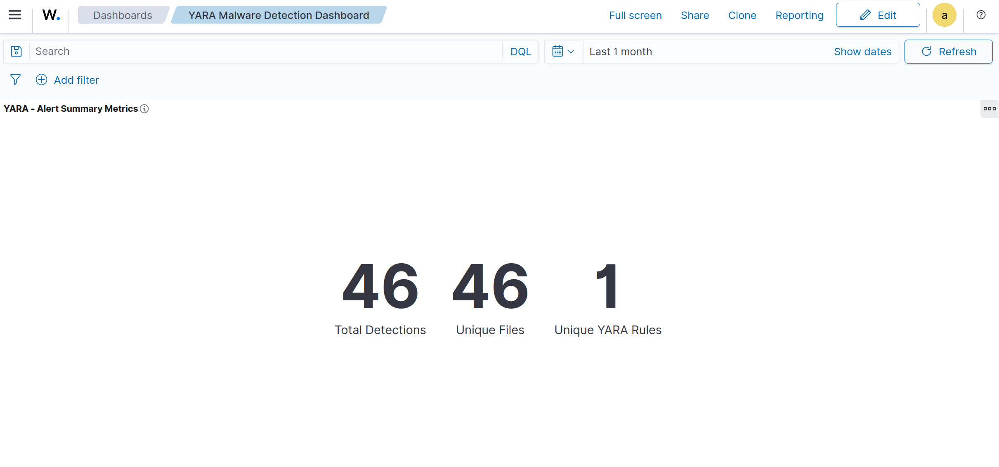
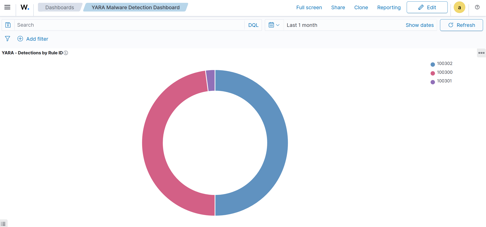
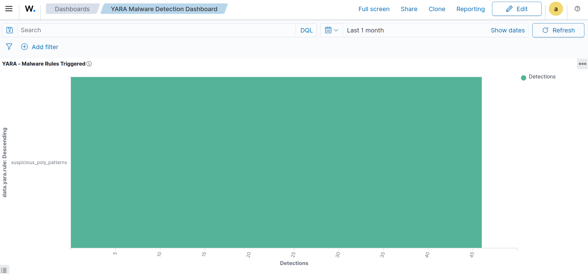
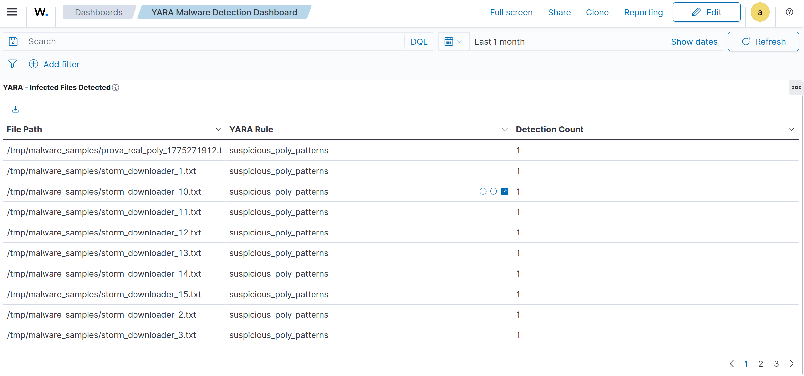
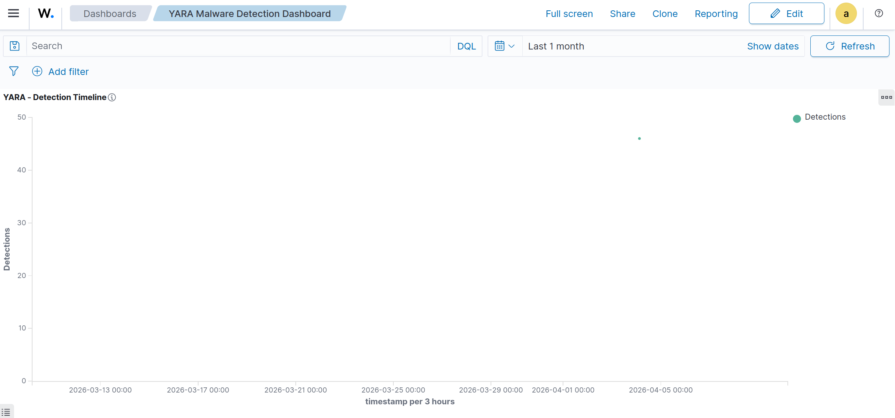

# YARA Malware Detection Integration

## Overview

This document describes the validated YARA malware detection integration implemented in Wazuh.

The integration provides:

- real-time file scanning using YARA
- automated triggering via File Integrity Monitoring (FIM)
- active response execution
- structured alert generation
- OpenSearch indexing
- dashboard visualization

---

## Environment

| Component | Value |
|----------|------|
| OS | Ubuntu 24.04 LTS |
| Wazuh | 4.14.2 |
| YARA | 4.5.0 |
| Monitored Path | /tmp/malware_samples |
| Rules Path | /opt/yara/rules/yara_rules.yar |
| Log Path | /opt/yara/logs/yara.log |
| Rule IDs | 100300-100302 |

---

## Detection Architecture

FIM → Active Response → YARA → Log → Decoder → Rule → OpenSearch → Dashboard

---

## Installation

### Packages

sudo apt update  
sudo apt install -y yara jq  

### Directories

sudo mkdir -p /opt/yara/rules  
sudo mkdir -p /opt/yara/logs  
sudo mkdir -p /tmp/malware_samples  

### Permissions

sudo chown -R root:wazuh /opt/yara  
sudo chmod -R 750 /opt/yara  

---

## Ruleset

Validation rule:

rule test_malware {
    strings:
        $a = "MALWARE" nocase
    condition:
        $a
}

---

## Wazuh Configuration

### Syscheck

<directories realtime="yes">/tmp/malware_samples</directories>

### Active Response

command: yara_linux  
rules_id: 100301,100302  

---

## Decoder

yara.rule  
yara.target  
yara.match  

---

## Custom Rules

100300 → detection  
100301 → modified  
100302 → added  

---

## Validation

### wazuh-logtest

YARA_MATCH rule=test_malware target=/tmp/malware_samples/test.bin match="Detected"

Expected:
- rule 100300
- level 12

---

## OpenSearch

Query example:

GET wazuh-alerts-*/_search

---

## Dashboard

### Alert Summary Metrics

### Detections by Rule ID

### Malware Rules Triggered

### Infected Files

### Detection Timeline

---

## Conclusion

YARA integration is fully operational and validated with real detection events.

