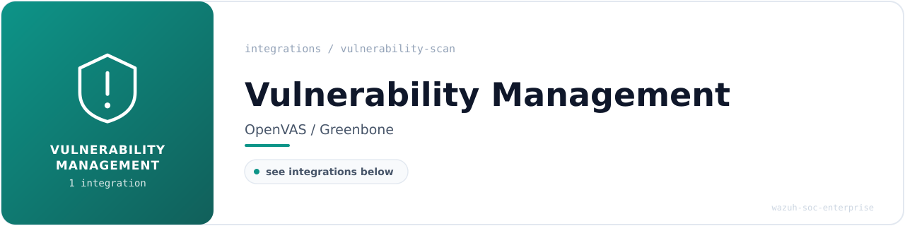

<!-- soc-banner -->

# Vulnerability Management

Authenticated and unauthenticated scanning, with findings routed into the SIEM for triage
alongside detection alerts.

**1 documented integration** in this category.
Each guide includes configuration, validated `wazuh-logtest` output, OpenSearch DevTools
queries and dashboard screenshots captured during validation.

---

## Integrations

| Integration | What it detects | Rules | ID range | MITRE ATT&CK |
| --- | --- | :---: | --- | --- |
| **[OpenVAS / GVM](openvas-integration.md)** | CVE findings by host and severity, feeding a critical-triage queue | 5 | `100205-100209` | -- |

`--` indicates the integration relies on native Wazuh decoders or operates outside the custom
rule ID space. Rule counts reflect what each guide documents; the authoritative corpus totals
live in [`METRICS.md`](../../METRICS.md) and are verified by
[`verify-metrics.sh`](../../scripts/verify-metrics.sh).

---

## Navigation

[**Portfolio home**](../../README.md) ·
[All integrations](../README.md) ·
[Detection coverage](../../detection-coverage/attack-coverage.md) ·
[SOC playbooks](../../playbooks/README.md) ·
[Incident reports](../../incident-reports/README.md)
