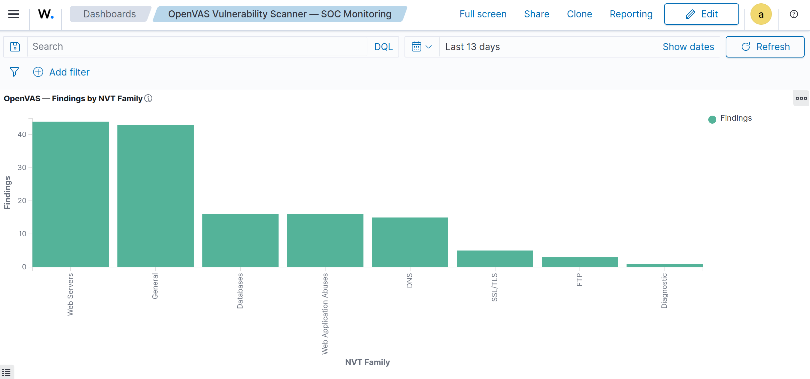
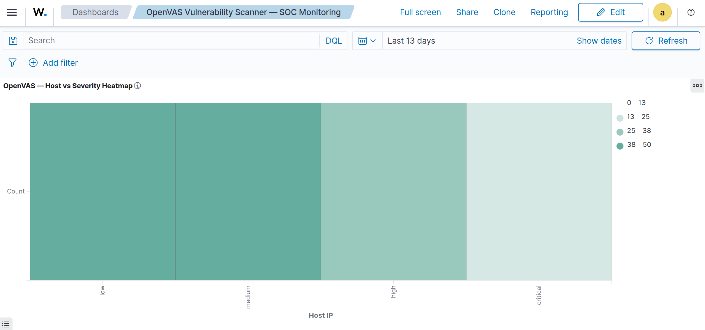
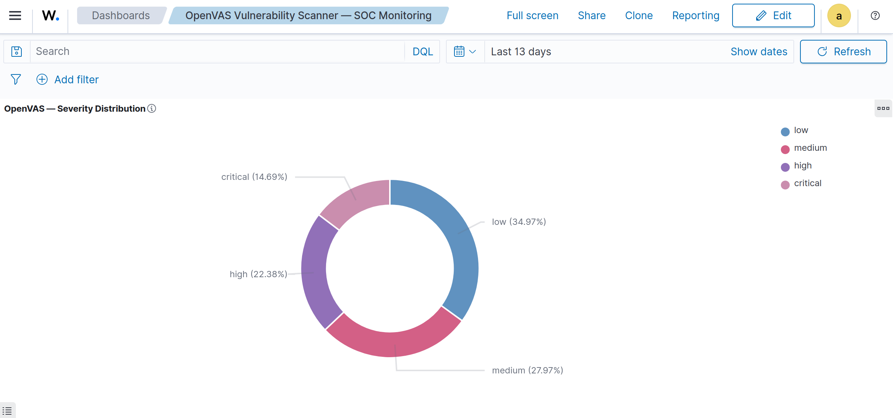
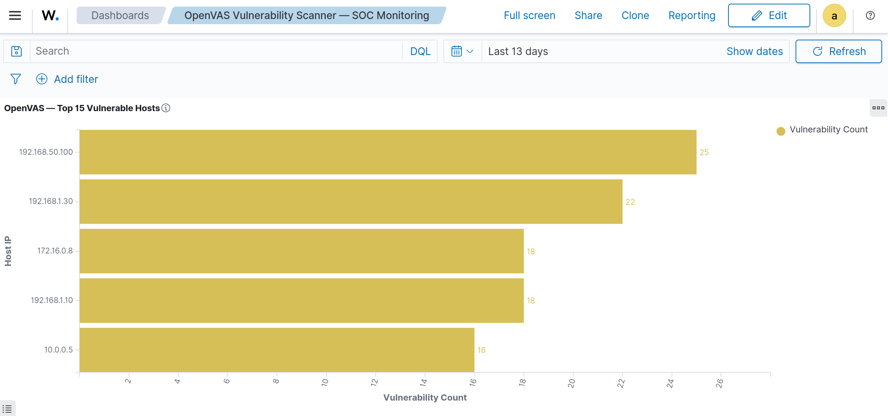
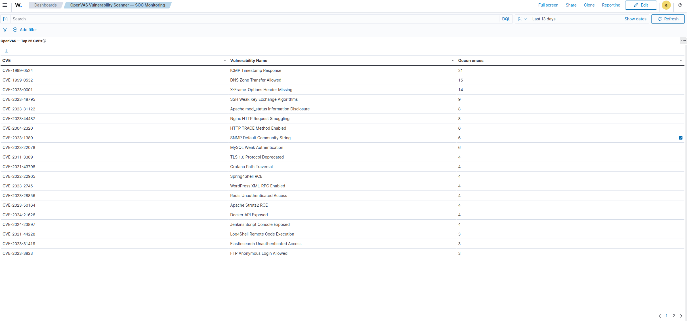
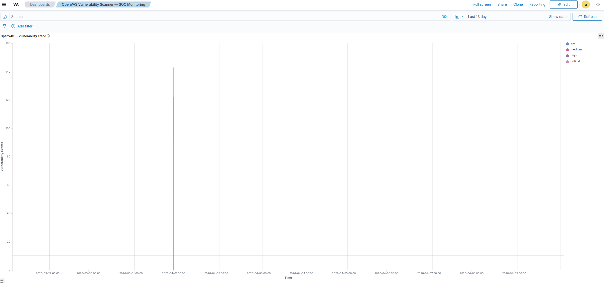
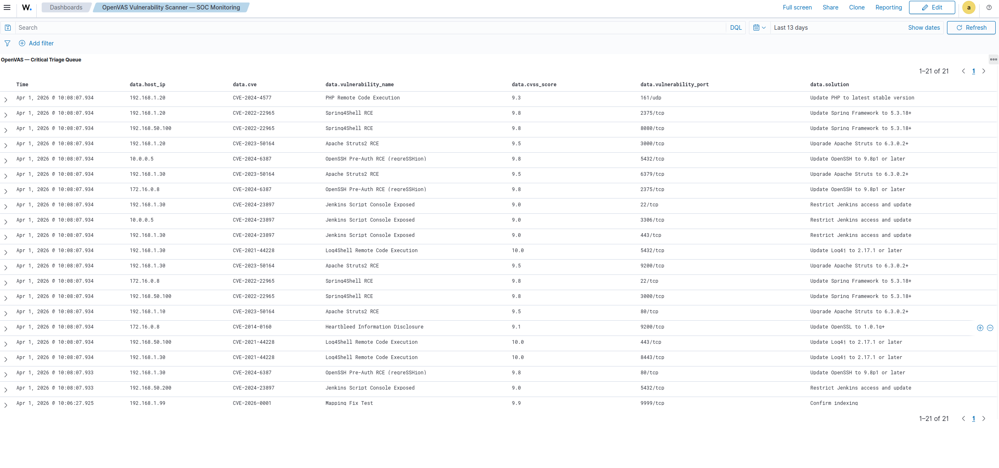

# OpenVAS / Greenbone Vulnerability Scanner Integration

## Overview

This integration documents how OpenVAS / Greenbone Vulnerability Manager was connected to Wazuh for centralized vulnerability monitoring, alerting, and dashboard visualization.

The integration pipeline is based on structured JSON ingestion because Wazuh does not provide a native OpenVAS module for importing Greenbone scan results directly.

Pipeline:

    GVM (XML via gvm-cli) → Python Parser → JSON Lines → Wazuh Logcollector → OpenSearch

Operational flow:

1. `gvm-cli` exports vulnerability report XML from `gvmd` through the GMP Unix socket.
2. A Python parser reads each XML `<result>` element and converts it into one JSON line.
3. The parser writes the normalized events to `/var/log/openvas/openvas_events.json`.
4. Wazuh `logcollector` tails the JSON file through a `<localfile>` block.
5. The built-in Wazuh JSON decoder extracts the fields into `data.*`.
6. Custom rules classify findings by severity and send alerts to OpenSearch.
7. Wazuh Dashboard visualizes the results through an OpenSearch-backed dashboard.

This implementation was validated end to end with live indexed data, OpenSearch aggregations, Wazuh rule testing, and a dedicated dashboard containing 11 panels.

## Environment

| Component | Detail |
|---|---|
| OS | Ubuntu 24.04.4 LTS |
| Kernel | 6.17.0-20-generic (x86_64) |
| Wazuh | 4.14.4 — all-in-one bare metal (Manager + Indexer + Dashboard) |
| Greenbone Vulnerability Manager (`gvmd`) | 23.1.0 |
| OpenVAS Scanner (`ospd-openvas`) | 22.7.1 |
| `gvm-cli` | 23.11.0 (GMP v22.4) |
| PostgreSQL | 16 (`16/main`, locale `pt_BR.UTF-8`) |
| Python | 3.12.3 |
| Host | `flausino` — `192.168.1.136` |
| Rule ID range | `100205-100209` |
| Log file | `/var/log/openvas/openvas_events.json` |

## GVM Stack Services

| Service | Status | Notes |
|---|---|---|
| `postgresql` | active | Cluster `16/main` |
| `gvmd` | active | v23.1.0, socket `/run/gvmd/gvmd.sock` |
| `ospd-openvas` | active | Scanner wrapper, `ospd.sock` |
| `notus-scanner` | active | Stabilized after NVT feed sync |
| `redis-server@openvas` | active | Scanner KB data store |

## Installation Notes

The Greenbone stack required additional remediation after package installation. The following issues were resolved during deployment:

1. Broken `dpkg` state was fixed with `dpkg --configure -a`, which recovered 6 packages:
   - `postgresql-common`
   - `postgresql-16`
   - `postgresql-16-pg-gvm`
   - `gvmd`
   - `python3-gvm`
   - `gvm-tools`

2. PostgreSQL roles were created manually:
   - `gvm`
   - `_gvm` (SUPERUSER, required because `gvmd` runs as system user `_gvm`)
   - `dba` (required for SCAP schema support)

3. The runtime directory `/run/gvmd/` was created with `_gvm:_gvm` ownership and persisted across reboots through:

       /etc/tmpfiles.d/gvmd.conf

4. Feed synchronization completed successfully for:
   - NVT
   - SCAP
   - CERT

## Configuration

### Wazuh localfile block

The original OpenVAS block in `ossec.conf` was malformed because it contained two `<log_format>` entries and an invalid `<out_format>` entry. Wazuh only honors the last `<log_format>`, which caused the file to be processed as syslog instead of JSON.

The corrected configuration is shown below:

    <!-- ======================== LOGS DO OPENVAS ======================== -->
    <localfile>
      <log_format>json</log_format>
      <location>/var/log/openvas/openvas_events.json</location>
      <label key="@source">openvas</label>
      <only-future-events>no</only-future-events>
    </localfile>

Backup reference:

    /var/ossec/etc/ossec.conf.bak.2026-04-01_09-31-52

### Parser script

Parser path:

    /var/ossec/integrations/openvas/openvas_to_wazuh.py

Function:

- exports XML results from `gvmd` using `gvm-cli`
- parses each XML `<result>` element with `ElementTree`
- writes one JSON event per vulnerability finding

Expected JSON fields per event:

| Field | Purpose |
|---|---|
| `integration` | static integration identifier |
| `host_ip` | scanned host IP |
| `vulnerability_port` | affected network port |
| `vulnerability_name` | vulnerability title |
| `severity` | numeric severity |
| `severity_label` | severity bucket (`low`, `medium`, `high`, `critical`) |
| `cvss_score` | CVSS score |
| `threat_level` | severity label in title form |
| `cve` | CVE identifier |
| `nvt_oid` | OpenVAS plugin OID |
| `nvt_family` | NVT family |
| `description` | vulnerability description |
| `solution` | remediation guidance |

### Critical field mapping note

The target port field must be stored as:

    data.vulnerability_port

and not:

    data.port

The original use of `data.port` triggered `mapper_parsing_exception` because `data.port` is reserved as an object type in the Wazuh index template.

This is a key implementation constraint for future custom integrations: never use `data.port` for a string value.

## Decoder Strategy

No custom decoders were required for this integration.

The built-in Wazuh JSON decoder extracts all event fields correctly into `data.*`, which keeps the integration simpler and avoids unnecessary decoder complexity.

Important implementation note:

- do not use child decoders with `<parent>json</parent>`
- Wazuh issue reference: bug `#33798`

## Wazuh Rules

Rules file:

    /var/ossec/etc/rules/openvas_rules.xml

Rule set:

    <group name="openvas,vulnerability_scanner,">
      <rule id="100205" level="0">
        <decoded_as>json</decoded_as>
        <match>"integration":"openvas"</match>
        <description>OpenVAS: Vulnerability scan result received</description>
        <group>openvas,vulnerability_scanner,</group>
      </rule>

      <rule id="100206" level="5">
        <if_sid>100205</if_sid>
        <match>"severity_label":"low"</match>
        <description>OpenVAS: Low severity vulnerability detected on $(data.host_ip)</description>
        <group>openvas,vulnerability_scanner,low_severity,</group>
      </rule>

      <rule id="100207" level="7">
        <if_sid>100205</if_sid>
        <match>"severity_label":"medium"</match>
        <description>OpenVAS: Medium severity vulnerability detected on $(data.host_ip)</description>
        <group>openvas,vulnerability_scanner,medium_severity,</group>
      </rule>

      <rule id="100208" level="10">
        <if_sid>100205</if_sid>
        <match>"severity_label":"high"</match>
        <description>OpenVAS: High severity vulnerability detected on $(data.host_ip)</description>
        <group>openvas,vulnerability_scanner,high_severity,</group>
      </rule>

      <rule id="100209" level="13">
        <if_sid>100205</if_sid>
        <match>"severity_label":"critical"</match>
        <description>OpenVAS: Critical severity vulnerability detected on $(data.host_ip)</description>
        <group>openvas,vulnerability_scanner,critical_severity,</group>
      </rule>
    </group>

The rule architecture follows the same proven pattern used in other JSON integrations: a base gateway rule for the integration and four severity-specific rules that match raw JSON substrings.

## Validation

### Wazuh logtest

All four severity rules passed validation with synthetic test events.

| Rule ID | Severity | Level | Status |
|---:|---|---:|---|
| 100206 | Low | 5 | PASS |
| 100207 | Medium | 7 | PASS |
| 100208 | High | 10 | PASS |
| 100209 | Critical | 13 | PASS |

Representative high-severity test event:

    {"integration":"openvas","host_ip":"192.168.1.10","vulnerability_name":"Test High","severity":"8.5","severity_label":"high","cvss_score":"8.5","cve":"CVE-2024-0003","vulnerability_port":"22/tcp"}

Validation confirmed:

- Phase 2: JSON decoder extracted all fields as `data.*`
- Phase 3: rule `100208` fired correctly at level `10`

### OpenSearch indexing

OpenSearch ingestion was confirmed working with live data.

Count query used:

    GET /wazuh-alerts-*/_count
    { "query": { "term": { "rule.groups": "openvas" } } }

Result:

- total indexed alerts: `143`

Severity aggregation query:

    POST /wazuh-alerts-*/_search
    { "size": 0,
      "query": { "term": { "rule.groups": "openvas" } },
      "aggs": {
        "by_severity": {
          "terms": { "field": "data.severity_label", "size": 5 }
        }
      }
    }

Severity distribution:

| Severity Label | Indexed Alerts |
|---|---:|
| low | 50 |
| medium | 40 |
| high | 32 |
| critical | 21 |
| **Total** | **143** |

Top hosts query:

    POST /wazuh-alerts-*/_search
    { "size": 0,
      "query": { "term": { "rule.groups": "openvas" } },
      "aggs": {
        "top_hosts": {
          "terms": { "field": "data.host_ip", "size": 20 }
        }
      }
    }

Top CVEs query:

    POST /wazuh-alerts-*/_search
    { "size": 0,
      "query": { "term": { "rule.groups": "openvas" } },
      "aggs": {
        "top_cves": {
          "terms": { "field": "data.cve", "size": 25 }
        }
      }
    }

NVT family query:

    POST /wazuh-alerts-*/_search
    { "size": 0,
      "query": { "term": { "rule.groups": "openvas" } },
      "aggs": {
        "by_family": {
          "terms": { "field": "data.nvt_family", "size": 10 }
        }
      }
    }

### Indexed data summary

| Metric | Value |
|---|---|
| Total alerts | 143 |
| Unique hosts | 9 |
| Unique CVEs | 25 |
| Top host | `192.168.50.100` with 25 findings |
| Top CVE | `CVE-1999-0524` / ICMP Timestamp Response with 21 occurrences |

Top vulnerable hosts:

| Host IP | Vulnerability Count |
|---|---:|
| 192.168.50.100 | 25 |
| 192.168.1.30 | 22 |
| 172.16.0.8 | 18 |
| 192.168.1.10 | 18 |
| 10.0.0.5 | 16 |

Top CVEs observed in the dashboard:

| CVE | Vulnerability Name | Occurrences |
|---|---|---:|
| CVE-1999-0524 | ICMP Timestamp Response | 21 |
| CVE-1999-0532 | DNS Zone Transfer Allowed | 15 |
| CVE-2023-0001 | X-Frame-Options Header Missing | 14 |
| CVE-2023-48795 | SSH Weak Key Exchange Algorithms | 9 |
| CVE-2023-31122 | Apache mod_status Information Disclosure | 8 |
| CVE-2023-44487 | Nginx HTTP Request Smuggling | 8 |

NVT family distribution observed in the dashboard:

- Web Servers: approximately 43
- General: approximately 43
- Databases: approximately 16
- Web Application Abuses: approximately 16
- DNS: approximately 15
- SSL/TLS: approximately 5
- FTP: approximately 3
- Diagnostic: approximately 1

### Confirmed field mappings

| OpenSearch Field | Type | Example |
|---|---|---|
| `data.integration` | keyword | `openvas` |
| `data.host_ip` | keyword | `192.168.1.10` |
| `data.vulnerability_name` | keyword | `Log4Shell Remote Code Execution` |
| `data.severity` | keyword | `9.8` |
| `data.severity_label` | keyword | `critical` |
| `data.cvss_score` | keyword | `9.8` |
| `data.threat_level` | keyword | `Critical` |
| `data.cve` | keyword | `CVE-2021-44228` |
| `data.vulnerability_port` | keyword | `443/tcp` |
| `data.nvt_oid` | keyword | `1.3.6.1.4.1.25623.1.0.142122` |
| `data.nvt_family` | keyword | `Web Servers` |
| `data.description` | text | `Log4Shell RCE detected on target` |
| `data.solution` | text | `Update Log4j to 2.17.1 or later` |
| `rule.id` | keyword | `100209` |
| `rule.level` | integer | `13` |
| `rule.groups` | keyword | `[openvas, vulnerability_scanner]` |

## Dashboard

Dashboard title:

    OpenVAS Vulnerability Scanner — SOC Monitoring

Kibana saved object ID:

    dashboard:fd4ff7d0-2dab-11f1-8778-b9cd54134416

All 11 dashboard panels rendered successfully with live data and were captured as PNG assets.

### Dashboard panels

| # | Title | Type | Key Field |
|---|---|---|---|
| 1 | OpenVAS — Total Vulnerabilities | Metric | Count |
| 2 | OpenVAS — Critical Count | Metric | Count filtered by `data.severity_label=critical` |
| 3 | OpenVAS — Unique Hosts | Metric | Unique count on `data.host_ip` |
| 4 | OpenVAS — Unique CVEs | Metric | Unique count on `data.cve` |
| 5 | OpenVAS — Severity Distribution | Donut | `data.severity_label` |
| 6 | OpenVAS — Top 15 Vulnerable Hosts | Horizontal bar | `data.host_ip` |
| 7 | OpenVAS — Top 25 CVEs | Data table | `data.cve`, `data.severity_label`, `data.vulnerability_name` |
| 8 | OpenVAS — Vulnerability Trend | Stacked area | `@timestamp` split by `data.severity_label` |
| 9 | OpenVAS — Findings by NVT Family | Vertical bar | `data.nvt_family` |
| 10 | OpenVAS — Host vs Severity Heatmap | Heatmap | `data.severity_label` × `data.host_ip` |
| 11 | OpenVAS — Critical Triage Queue | Saved search | critical-only operational queue |

### Dashboard layout

    ┌──────────┬──────────┬──────────┬──────────┐
    │  Total   │ Critical │  Unique  │  Unique  │
    │  Vulns   │  Count   │  Hosts   │  CVEs    │
    │  143     │  21      │  9       │  25      │
    └──────────┴──────────┴──────────┴──────────┘
    ┌──────────────────┬─────────────────────────┐
    │ Severity Dist.   │ Top 15 Vulnerable Hosts │
    │ (Donut)          │ (Horizontal Bar)        │
    └──────────────────┴─────────────────────────┘
    ┌─────────────────────────────────────────────┐
    │ Vulnerability Trend (Area Chart)            │
    └─────────────────────────────────────────────┘
    ┌──────────────────────┬──────────────────────┐
    │ Findings by NVT      │ Host vs Severity     │
    │ Family (Vert. Bar)   │ Heatmap              │
    └──────────────────────┴──────────────────────┘
    ┌─────────────────────────────────────────────┐
    │ Top 25 CVEs (Data Table)                    │
    └─────────────────────────────────────────────┘
    ┌─────────────────────────────────────────────┐
    │ Critical Triage Queue (Saved Search)        │
    └─────────────────────────────────────────────┘

### Dashboard assets

OpenVAS total indexed findings metric showing 143 vulnerabilities.

Critical-severity findings metric showing 21 alerts.

Unique hosts metric showing 9 affected hosts.

Unique CVE metric showing 25 distinct CVE identifiers.

Donut visualization of vulnerability counts by severity label.

Horizontal bar chart listing the hosts with the highest finding counts.

Data table summarizing the most frequent CVEs and their associated vulnerability names.

Stacked area chart showing finding volume over time by severity.

Vertical bar chart grouping findings by NVT family.

Heatmap correlating affected hosts against severity buckets.

Saved search focused on critical findings for analyst triage.

## Use Cases and Alerts

| Rule ID | Severity Label | Severity Range | Wazuh Level | Use Case |
|---:|---|---|---:|---|
| 100206 | low | 0.1 - 3.9 | 5 | hygiene findings and baseline exposure tracking |
| 100207 | medium | 4.0 - 6.9 | 7 | remediation prioritization for moderate weaknesses |
| 100208 | high | 7.0 - 8.9 | 10 | urgent analyst review and service hardening |
| 100209 | critical | 9.0 - 10.0 | 13 | immediate triage and accelerated remediation |

Typical operational use cases include:

- vulnerability exposure tracking across multiple hosts
- prioritization of critical and high findings
- identification of recurring CVEs across the environment
- dashboard-driven triage for SOC analysts
- long-term visibility into scan result trends and vulnerable service categories

## Troubleshooting

### 1. Malformed `ossec.conf` block

The original OpenVAS block contained two `<log_format>` entries and an invalid `<out_format>` entry. Because Wazuh honored only the final `<log_format>`, the input was interpreted as syslog instead of JSON. Replacing the block with a single JSON `<localfile>` stanza fixed the issue.

### 2. `data.port` mapping conflict

The original parser emitted the target port as `data.port`. This caused `mapper_parsing_exception` because `data.port` is reserved as an object type in the Wazuh index template. Renaming the field to `data.vulnerability_port` resolved the indexing failure.

### 3. OpenSearch indexing mismatch during initial validation

At one point, alerts were visible in local `alerts.json` but OpenSearch queries returned zero hits. The exact root cause was not conclusively identified during the earlier session. The issue later self-resolved, and validation on 2026-04-10 confirmed 143 indexed OpenVAS events.

### 4. Broken Greenbone package installation

The initial Greenbone installation failed because of a broken `postgresql-common` package state triggered during the dependency chain. Recovery required `dpkg --configure -a`, manual PostgreSQL role creation, runtime directory setup, and a full feed synchronization.

## Appendix

### Key file paths

| Path | Purpose |
|---|---|
| `/var/ossec/integrations/openvas/openvas_to_wazuh.py` | parser script |
| `/var/log/openvas/openvas_events.json` | JSON lines event output |
| `/var/ossec/etc/ossec.conf` | Wazuh localfile ingestion |
| `/var/ossec/etc/rules/openvas_rules.xml` | custom OpenVAS rules |
| `/run/gvmd/gvmd.sock` | `gvmd` Unix socket |
| `/etc/tmpfiles.d/gvmd.conf` | persistent runtime directory definition |

### Repository paths

| Path | Purpose |
|---|---|
| `integrations/vulnerability-scan/openvas-integration.md` | documentation page |
| `integrations/vulnerability-scan/assets/openvas/` | dashboard screenshot assets |

## Conclusion

This integration demonstrates a reliable method for importing OpenVAS / Greenbone scan results into Wazuh using a JSON-based pipeline with native Wazuh decoding, custom severity rules, verified OpenSearch indexing, and a dedicated SOC dashboard.

The final validated state included 143 indexed findings, 25 unique CVEs, 9 unique hosts, and a complete 11-panel dashboard prepared for repository publication.
